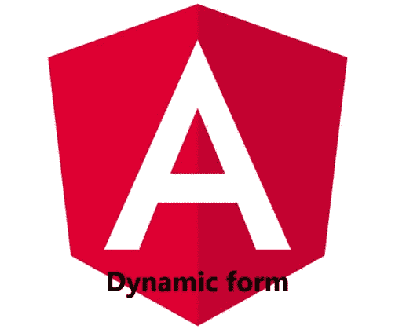

# 如何在 Angular 中创建可重用的动态表单组件

> 原文：<https://levelup.gitconnected.com/how-to-create-a-reusable-dynamic-form-component-in-angular-6d4463d254da>

因为我们想保持我们的代码[干燥](https://angular.io/guide/styleguide#t-dry-try-to-be-dry)(不要重复自己)，所以为常见用例实现可重用的组件是有用的。在本文中，我们将学习如何创建一个可以在整个应用程序中配置和重用的动态表单组件。为此，我们将使用角度[反应形式](https://angular.io/guide/reactive-forms)。

对于我们的动态表单，我们需要两个组件和几个数据模型。让我们从基本模型开始:

该值具有泛型类型，因此可用于各种输入类型。设置我们的反应式表单控件需要所有其他参数。现在，对于我们实际的表单输入，我们可以简单地添加更多的类来覆盖`controlType`，例如一个文本输入:

接下来，我们需要创建组件。为此，我们可以利用 [Angular CLI](https://angular.io/cli) 并键入以下命令:

`ng generate component dynamic-form`

`ng generate component dynamic-form-input`

第一个组件将创建我们的`FormGroup`，并通过第二个组件实例化表单控件。

通过使用`formFields`输入在`ngOnInit`中产生`FormGroup`。在模板中，我们遍历表单并呈现我们的另一个组件，它将最终的表单放在一起。

使用`ngSwitch`语句，模板决定显示哪种类型的表单输入。这里我们有三种类型的输入，但你可以想象更多。

为了使用表单，我们创建了一个表单输入数组，并将其传递给动态表单组件`<dynamic-form>`。

# 下一步是什么？

这是一个如何创建可重用组件的小例子。下面是一些改进我们表单组件的想法:

验证用户输入并显示正确的错误消息

添加一些 i18n(国际化)来支持其他语言

添加样式或集成角度组件库(如[角度材料](https://material.angular.io/)

关注我在[中](https://saackef.com)阅读更多关于 Angular！