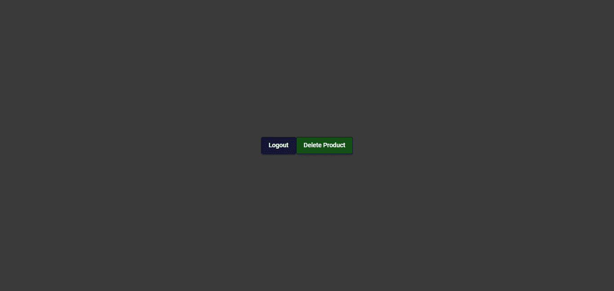
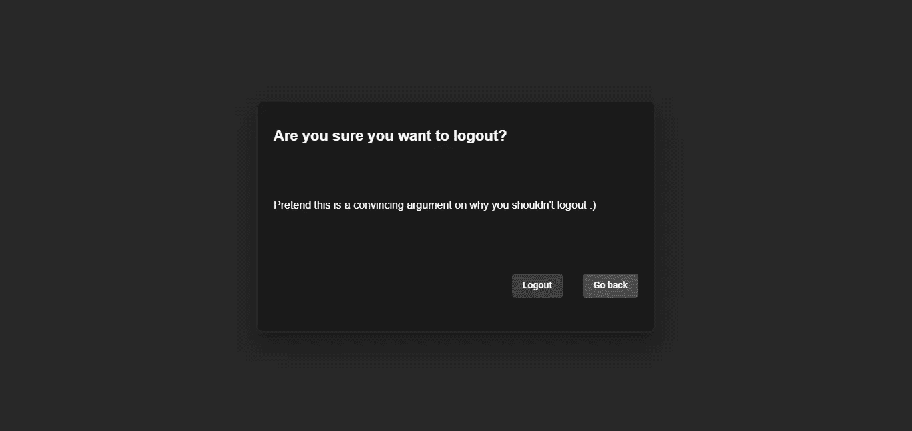
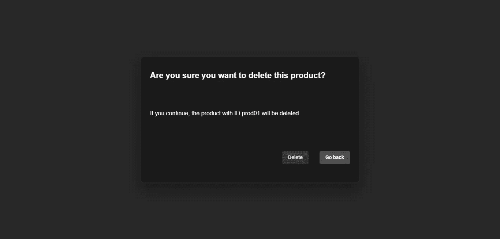
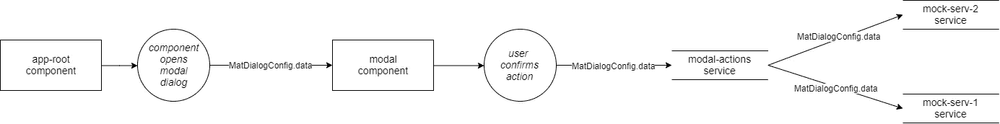
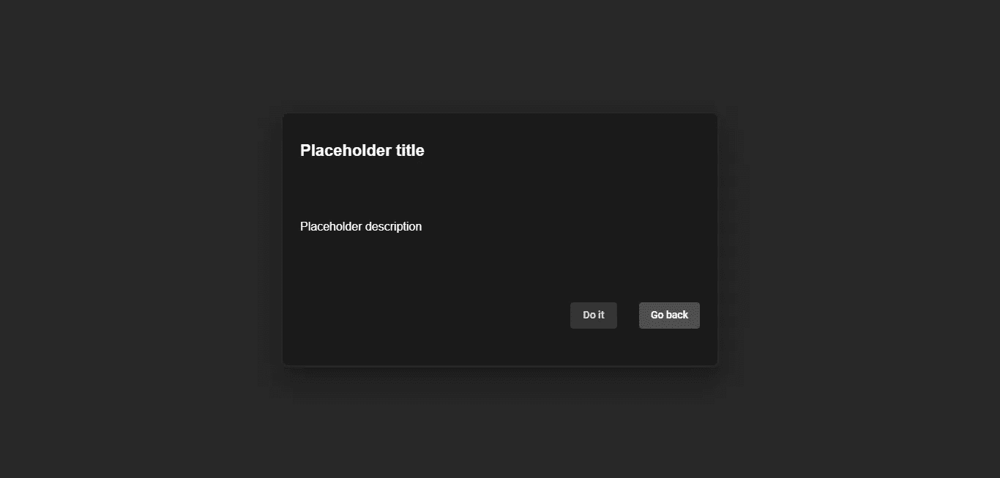
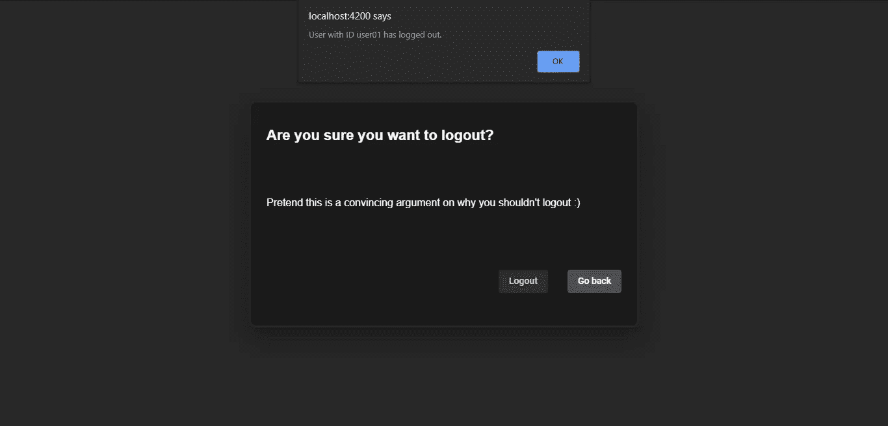
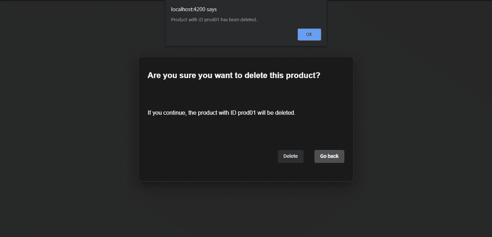

# 如何在 Angular 8 中创建一个可重用的模态对话框组件

> 原文：<https://levelup.gitconnected.com/how-to-create-a-reusable-modal-dialog-component-in-angular-8-241cc738d260>

上个月我写了一篇关于如何在 Angular 8 中创建模态对话框组件的文章。通过一个简单的演示，我解释了如何创建一个对话框来“锁定”用户在试图注销时选择两个选项之一:确认操作或取消并返回到应用程序的正常使用。

今天，在同样的前提下，我们将使对话框组件可重用:单击一个按钮打开带有确认和取消选项的模式对话框。这意味着，将来当应用程序出于其他目的需要类似的确认对话框时，我们只需更改模型接收到的数据和信息，就万事大吉了，不需要创建新的组件。

让我们进入这个演示的细节！

# 关于这个演示

在`app-root`组件中没有单一的注销按钮，我们将有两个按钮:一个用于注销，另一个用于删除虚拟产品。每个按钮打开完全相同的`modal`对话框组件，但是显示不同的信息。这个组件可以从任何父组件中打开，但是为了简单起见，我们将在`app-root`中同时拥有注销和产品删除模式。



带有新按钮的 app-root 组件



注销确认的模式组件



产品删除确认的模式组件

当在模式中点击确认按钮时，调用外部服务`modal-actions`。然后，这个服务负责调用第二个服务来完成用户确认的动作。如果第一个解释令人困惑，请查看下图，了解数据在此过程中是如何流动的:



模式对话框 MatDialogConfig.data 对象的流程

正如您所看到的，调用模态的组件(在我们的例子中是`app-root`)通过对话框配置的`data`对象属性传递信息(`MatDialogConfig`)。当点击确认按钮时，modal 将同一个`data`对象传递给`modal-actions`服务，这样它就可以读取 modal 的名称，一个包含在对象中的属性。读取名称的目的是为了让`modal-actions`知道哪个服务将负责最终执行用户期望的动作。

然后，`modal-actions`将`data`对象传递给这个最终服务，这样它就可以访问它需要的所有信息(用户 id、产品 id、名称、对象中包含的任何内容)。在这个演示中，`mock-serv-1`或`mock-serv-2`将负责完成用户确认的动作。

如果这看起来仍然令人困惑，试着把`modal-actions`服务想象成一个隐藏了`modal`组件之外的一切来执行用户期望的动作的前台(是的，我是在暗指[外观设计模式](https://en.wikipedia.org/wiki/Facade_pattern#Python))。当每次使用模型只需要其中一个服务时，我们可以让`modal-actions`处理所有事情，而不是让`modal`组件直接与多个服务通信。换句话说，`modal`组件只需要与这一个服务通信。

一方面，你需要多次传递`data`对象。但是，另一方面，如果更多的用例出现在这个模态对话框中，你只需要为这个新动作创建一个新的服务，然后将它传递给 facade，即`modal-actions`服务。`modal`组件中的代码独立于服务的这些变化。并且，关于`data`对象，对于组件来说，对象只包含模态的名称、标题、描述和按钮的文本。其他属性是对服务的担忧。

既然我们已经讨论了理论，让我们开始构建应用程序吧！

# 步骤 0:项目设置

这部分是我们创建应用程序和安装 Angular 材质的地方。

让我们从显而易见的开始，创建一个新的角度应用:

```
ng new reusable-modal
cd reusable-modal
code .
```

第一个命令创建一个名为`reusable-modal`的新应用程序，第二个命令将我们移动到它的目录中。当提示路由时，选择您喜欢的格式，对于样式表格式，我们将使用 CSS。

第三个命令只是在 Visual Studio 代码中打开当前工作目录的快捷方式。如果您将它用作代码编辑器，这将非常方便。

要安装角形材料，请返回终端并输入:

```
ng add @angular/material
```

这将提示你三个问题:主题，锤子的设置和材质动画的设置。你可以选择任何你喜欢的主题，因为它不会影响这个演示的功能，但我们不需要 HammerJS。另一方面，选择设置材质动画，否则会破坏应用程序。

对于设置来说，我们只缺少一件事，那就是导入角度材质`MatButtonModule`和`MatDialogModule`模块。为此，如果我们已经创建了我们的模态组件，将会很方便，所以返回到终端并输入:

```
ng generate component components\modal
```

这在一个`components`文件夹中创建了我们的模态对话框组件`modal`。因为文件夹不存在，所以这个命令也会创建文件夹。请不要关闭您的终端，因为我们稍后会继续讨论它。

为了完成设置，我们将在`app.module.ts`文件中添加一些代码:

应用程序模块

我们已经导入了已经提到的角形材料模块(9 号线和 10 号线)，并将它们添加到`@NgModule`的导入中。另外，请注意，如果您没有设置路由，那么您需要删除第 4 行和第 18 行。最后一次修改是在第 26 行，`entryComponents: [ModalComponent]`。

正如文档中所描述的，`entryComponents`是“定义这个 NgModule 时要编译的组件集，这样它们就可以动态地加载到视图中”。实际上，如果不声明`entryComponents`，这个对话框就不会工作。

这样，我们就成功地完成了项目的设置！

# 步骤 1:创建一次性模式

现在我们将关注于`app-root`组件，并创建一个一次性版本的`modal`对话框组件。

到这一步结束时，我们将准备好使组件可重用，也就是本文的目标。因此，在这一部分我不会像以前那样详细，因为在我以前的文章中已经解释过了。如果你对创建模态对话框组件有任何疑问，这里没有澄清，请参考[继续看`app-root`，我们需要改变它的 HTML、CSS 和 TypeScript 文件。](https://medium.com/swlh/how-to-create-a-modal-dialog-component-in-angular-8-88028d909be0#modal-component</code>。</p><p id=)

[app.component.html(第一版)](https://medium.com/swlh/how-to-create-a-modal-dialog-component-in-angular-8-88028d909be0#modal-component</code>。</p><p id=)

[该页面有两个按钮，一个用于注销，另一个用于删除产品。现在，单击任一按钮都会调用相同的函数。换句话说，这两个按钮将打开同一个模态对话框。](https://medium.com/swlh/how-to-create-a-modal-dialog-component-in-angular-8-88028d909be0#modal-component</code>。</p><p id=)

[应用程序.组件. css](https://medium.com/swlh/how-to-create-a-modal-dialog-component-in-angular-8-88028d909be0#modal-component</code>。</p><p id=)

[对于 CSS，我们只需要改变按钮的颜色。](https://medium.com/swlh/how-to-create-a-modal-dialog-component-in-angular-8-88028d909be0#modal-component</code>。</p><p id=)

[app.component.ts(第一版)](https://medium.com/swlh/how-to-create-a-modal-dialog-component-in-angular-8-88028d909be0#modal-component</code>。</p><p id=)

[如您所见，`openModal()`方法使用我们创建的`modal`组件打开对话框。我们还利用`MatDialogConfig`来配置对话框。注意`dialogConfig.id = “modal-component"`，因为这是我们获取 id 以在全局`styles.css`文件中使用的地方。](https://medium.com/swlh/how-to-create-a-modal-dialog-component-in-angular-8-88028d909be0#modal-component</code>。</p><p id=)

[现在，所有的信息都将被硬编码到模态的 HTML 中，因此我们没有在配置中包含`data`对象。但是，如果我们向它传递任何用户 id、产品 id 或实际执行注销或产品删除操作所需的任何东西，我们将需要`data`。当我们使组件可重用时，我们将实现它。](https://medium.com/swlh/how-to-create-a-modal-dialog-component-in-angular-8-88028d909be0#modal-component</code>。</p><p id=)

[`app-root`第一阶段已经完成，让我们进入`modal`部分。](https://medium.com/swlh/how-to-create-a-modal-dialog-component-in-angular-8-88028d909be0#modal-component</code>。</p><p id=)

[modal.component.html(第一版)](https://medium.com/swlh/how-to-create-a-modal-dialog-component-in-angular-8-88028d909be0#modal-component</code>。</p><p id=)

[正如你所看到的，现在模态将有硬编码的文本。当它接收到来自`data`的信息时，我们将使用该信息。](https://medium.com/swlh/how-to-create-a-modal-dialog-component-in-angular-8-88028d909be0#modal-component</code>。</p><p id=)

[modal.component.css](https://medium.com/swlh/how-to-create-a-modal-dialog-component-in-angular-8-88028d909be0#modal-component</code>。</p><p id=)

[CSS 也很简单，我们把模态的内容变成一个网格，自动设置三行，一行是标题，一行是描述，另一行是按钮。](https://medium.com/swlh/how-to-create-a-modal-dialog-component-in-angular-8-88028d909be0#modal-component</code>。</p><p id=)

[modal.component.ts(第一版)](https://medium.com/swlh/how-to-create-a-modal-dialog-component-in-angular-8-88028d909be0#modal-component</code>。</p><p id=)

[最后，我们有打字稿。通过构造器将`MatDialogRef`注入组件，以便`modal`可以访问打开组件的角度材料对话框的方法。记住，对话框本身是一个有角材料的组件，`modal`是我们创建的用于对话框的组件，因此为什么我们的组件看起来像是模态对话框本身。](https://medium.com/swlh/how-to-create-a-modal-dialog-component-in-angular-8-88028d909be0#modal-component</code>。</p><p id=)

[然后，我们创建两个方法来处理来自`modal`按钮的点击事件:一个执行确认的操作，另一个简单地将用户返回到应用程序的正常流程。对于本演示，确认将导致一个不起眼的警告对话框，以确认操作已执行。](https://medium.com/swlh/how-to-create-a-modal-dialog-component-in-angular-8-88028d909be0#modal-component</code>。</p><p id=)

[仅此而已。现在我们有了一个工作模式对话框，我们可以继续让它可重用。不过，在此之前，让我们回顾一下目前为止我们所掌握的内容:](https://medium.com/swlh/how-to-create-a-modal-dialog-component-in-angular-8-88028d909be0#modal-component</code>。</p><p id=)

[](https://medium.com/swlh/how-to-create-a-modal-dialog-component-in-angular-8-88028d909be0#modal-component</code>。</p><p id=)

[应用程序根组件](https://medium.com/swlh/how-to-create-a-modal-dialog-component-in-angular-8-88028d909be0#modal-component</code>。</p><p id=)

[最终确定的`app-root`布局，带有一个正在进行中的打字稿文件。](https://medium.com/swlh/how-to-create-a-modal-dialog-component-in-angular-8-88028d909be0#modal-component</code>。</p><p id=)

[](https://medium.com/swlh/how-to-create-a-modal-dialog-component-in-angular-8-88028d909be0#modal-component</code>。</p><p id=)

[模式对话框(第一版)](https://medium.com/swlh/how-to-create-a-modal-dialog-component-in-angular-8-88028d909be0#modal-component</code>。</p><p id=)

[以及我们模型的当前状态。目前，这是当您单击主页中的任一按钮时打开的模式。](https://medium.com/swlh/how-to-create-a-modal-dialog-component-in-angular-8-88028d909be0#modal-component</code>。</p><p id=)

[如果您想自己在本地运行演示，请返回到终端并输入](https://medium.com/swlh/how-to-create-a-modal-dialog-component-in-angular-8-88028d909be0#modal-component</code>。</p><p id=)

```
ng serve --open
```

[在浏览器中自动编译并打开应用程序。](https://medium.com/swlh/how-to-create-a-modal-dialog-component-in-angular-8-88028d909be0#modal-component</code>。</p><p id=)

[接下来，我们将编辑`app-root`和`modal`以在对话框配置中包含`data`对象。这将允许我们使模态显示不同的信息，取决于哪个按钮打开了模态。](https://medium.com/swlh/how-to-create-a-modal-dialog-component-in-angular-8-88028d909be0#modal-component</code>。</p><p id=)

# [步骤 2:创建 MatDialogConfig.data 对象](https://medium.com/swlh/how-to-create-a-modal-dialog-component-in-angular-8-88028d909be0#modal-component</code>。</p><p id=)

[在这一步中，我们将创建`MatDialogConfig.data`对象并修改`modal`组件，以便它能够接收`data`并将其传递给外观服务。到这一步结束时，`app-root`将完成，而`modal`将只缺少对外观服务`modal-actions`的调用。但是首先，让我们实现那个`data`对象。](https://medium.com/swlh/how-to-create-a-modal-dialog-component-in-angular-8-88028d909be0#modal-component</code>。</p><p id=)

[首先，让我们编辑`app-root`的`openModal()`方法。它将在对话框配置中包含`data`对象，该对象包含模态的名称/类型和要显示的文本(标题、描述和动作按钮的文本)。](https://medium.com/swlh/how-to-create-a-modal-dialog-component-in-angular-8-88028d909be0#modal-component</code>。</p><p id=)

[app.component.ts(第二版)](https://medium.com/swlh/how-to-create-a-modal-dialog-component-in-angular-8-88028d909be0#modal-component</code>。</p><p id=)

[正如您所看到的，从第 20 行开始，现在对话框配置包含了我们刚刚讨论过的信息。此外，请注意，我们还没有创建一个新的方法，两个按钮目前都向模态对话框传递完全相同的信息。让我们创建一个新的功能，这个功能与我们现有的功能非常相似，所以每个按钮都有一个功能，每个操作都需要所有的信息，分别包括用户 id 和产品 id。](https://medium.com/swlh/how-to-create-a-modal-dialog-component-in-angular-8-88028d909be0#modal-component</code>。</p><p id=)

[app.component.html(最终版本)](https://medium.com/swlh/how-to-create-a-modal-dialog-component-in-angular-8-88028d909be0#modal-component</code>。</p><p id=)

[现在，每个按钮在被点击时都会调用不同的函数。](https://medium.com/swlh/how-to-create-a-modal-dialog-component-in-angular-8-88028d909be0#modal-component</code>。</p><p id=)

[app.component.ts(最终版本)](https://medium.com/swlh/how-to-create-a-modal-dialog-component-in-angular-8-88028d909be0#modal-component</code>。</p><p id=)

[每个函数都有自己独特的信息存储在`data`对象中。我们包括了一个`userId`和一个`productId`，这样在用户注销或删除产品的过程结束时，服务就分别拥有了必要的信息。请记住，您可以根据需要包含许多属性，这些都是本演示所需的属性。](https://medium.com/swlh/how-to-create-a-modal-dialog-component-in-angular-8-88028d909be0#modal-component</code>。</p><p id=)

[但是`modal`组件当前没有收到任何信息。是的，`data`对象包含在对话框配置中，但是`modal`组件不能读取它。我们需要在组件的构造函数中注入`MAT_DIALOG_DATA`以便能够像类中的任何其他变量一样访问传递给组件的`data`。](https://medium.com/swlh/how-to-create-a-modal-dialog-component-in-angular-8-88028d909be0#modal-component</code>。</p><p id=)

[modal.component.ts(第二版)](https://medium.com/swlh/how-to-create-a-modal-dialog-component-in-angular-8-88028d909be0#modal-component</code>。</p><p id=)

[我们在第 2 行添加`MAT_DIALOG_DATA`的导入，然后在第 13 行添加新的依赖注入。更具体地说，我们注入私有属性`modalData`，而私有属性又注入了`MAT_DIALOG_DATA`，也就是说，当对话框在父组件(`app-root`)中打开时，传递给对话框的任何东西都会被注入到`modal`的`modalData`属性中。](https://medium.com/swlh/how-to-create-a-modal-dialog-component-in-angular-8-88028d909be0#modal-component</code>。</p><p id=)

[为了证明`modal`组件现在可以访问完整的`data`对象，我们在构造器主体中加入了一个`console.log()`。如果你想自己尝试一下，在浏览器的开发工具中打开控制台，然后点击`app-root`中的一个按钮。您应该会看到控制台中记录了完整的`data`对象。不错。](https://medium.com/swlh/how-to-create-a-modal-dialog-component-in-angular-8-88028d909be0#modal-component</code>。</p><p id=)

[为了完成文章的这一步，我们只需要编辑`modal`的 HTML，这样它显示的文本就是来自`data`的内容。因为我们现在可以将`data`视为组件的另一个变量，名为`modalData`，所以 HTML 的变化微不足道。](https://medium.com/swlh/how-to-create-a-modal-dialog-component-in-angular-8-88028d909be0#modal-component</code>。</p><p id=)

[modal.component.html(最终版本)](https://medium.com/swlh/how-to-create-a-modal-dialog-component-in-angular-8-88028d909be0#modal-component</code>。</p><p id=)

[我们将硬编码文本替换为保存在`modalData`中的属性，瞧，同一个模态对话框组件现在显示不同的信息，这取决于在`app-root`中哪个按钮调用了它。](https://medium.com/swlh/how-to-create-a-modal-dialog-component-in-angular-8-88028d909be0#modal-component</code>。</p><p id=)

[](https://medium.com/swlh/how-to-create-a-modal-dialog-component-in-angular-8-88028d909be0#modal-component</code>。</p><p id=)

[注销确认的模式组件](https://medium.com/swlh/how-to-create-a-modal-dialog-component-in-angular-8-88028d909be0#modal-component</code>。</p><p id=)

[](https://medium.com/swlh/how-to-create-a-modal-dialog-component-in-angular-8-88028d909be0#modal-component</code>。</p><p id=)

[产品删除确认的模式组件](https://medium.com/swlh/how-to-create-a-modal-dialog-component-in-angular-8-88028d909be0#modal-component</code>。</p><p id=)

[从视觉上看，模型现在是可重用的。技术上来说，不是。我们仍然需要使动作按钮在模态中工作。为此，我们需要编写服务。](https://medium.com/swlh/how-to-create-a-modal-dialog-component-in-angular-8-88028d909be0#modal-component</code>。</p><p id=)

[让我们转到将连接`modal`组件和实现操作的服务`modal-actions`的服务。](https://medium.com/swlh/how-to-create-a-modal-dialog-component-in-angular-8-88028d909be0#modal-component</code>。</p><p id=)

# [步骤 3:编写外观服务(模态动作服务)](https://medium.com/swlh/how-to-create-a-modal-dialog-component-in-angular-8-88028d909be0#modal-component</code>。</p><p id=)

[现在，我们将最终完成`modal`组件，并开始编写`modal-actions`服务。在这一步中，它将不起作用，因为我们需要其他服务来完成这项工作。相反，在这一步结束时，服务将使用`console.log()`将模态的名称记录到控制台。](https://medium.com/swlh/how-to-create-a-modal-dialog-component-in-angular-8-88028d909be0#modal-component</code>。</p><p id=)

[首先，如果我们想写`modal-actions`，我们必须创建它。返回终端并输入:](https://medium.com/swlh/how-to-create-a-modal-dialog-component-in-angular-8-88028d909be0#modal-component</code>。</p><p id=)

```
ng generate service services\modal-actions
```

[`modal-actions`服务现在存在于`services`文件夹中(它是与服务一起创建的)。](https://medium.com/swlh/how-to-create-a-modal-dialog-component-in-angular-8-88028d909be0#modal-component</code>。</p><p id=)

[modal-actions.service.ts(第一版)](https://medium.com/swlh/how-to-create-a-modal-dialog-component-in-angular-8-88028d909be0#modal-component</code>。</p><p id=)

[您所看到的非常接近于`modal-actions`的最终版本，它只缺少对其他服务的调用。](https://medium.com/swlh/how-to-create-a-modal-dialog-component-in-angular-8-88028d909be0#modal-component</code>。</p><p id=)

[因此，它有三种方法:`modalAction()`、`logout()`和`deleteProduct()`。第一个方法是应用程序中其他类唯一可用的方法(没有访问修饰符默认为公共访问，即任何类都可以访问它)。`logout()`和`deleteProduct()`只能由定义它们的类使用，以帮助将数据从`modal-actions`发送到完成用户所需操作的服务。顾名思义，前者用于用户注销，后者用于产品删除。将它们的访问修饰符设置为`private`会使代码更干净，并确保服务只公开需要公开的内容，仅此而已。](https://medium.com/swlh/how-to-create-a-modal-dialog-component-in-angular-8-88028d909be0#modal-component</code>。</p><p id=)

[`modalAction()`是将`modal`发送的信息重定向到执行用户操作的正确服务的关键。这是使用一个 switch 语句完成的，该语句根据模态的名称选择要调用的服务(在`data`中传递的`name`属性)。](https://medium.com/swlh/how-to-create-a-modal-dialog-component-in-angular-8-88028d909be0#modal-component</code>。</p><p id=)

[虽然我们可以直接在交换机中调用服务，但是如果需要修改传递给服务的内容，私有方法(`logout()`和`deleteProduct()`)可能会很有帮助。例如，代替发送完整的`data`对象，您可以在这些方法中创建一个仅包含所需信息的新对象，并将该对象发送给服务。](https://medium.com/swlh/how-to-create-a-modal-dialog-component-in-angular-8-88028d909be0#modal-component</code>。</p><p id=)

[在进入下一步之前，我们需要在`modal`组件中注入`modal-actions`服务并调用它。](https://medium.com/swlh/how-to-create-a-modal-dialog-component-in-angular-8-88028d909be0#modal-component</code>。</p><p id=)

[modal.component.ts(最终版本)](https://medium.com/swlh/how-to-create-a-modal-dialog-component-in-angular-8-88028d909be0#modal-component</code>。</p><p id=)

[至此，我们完成了`modal`组件。当在模型内部单击 action 按钮时，也就是说，用户确认了他们的意图，组件将调用 facade 服务，`modal-actions`，该服务将操作分派给相应的服务。现在，当点击该按钮时，它只会向控制台记录一条消息。](https://medium.com/swlh/how-to-create-a-modal-dialog-component-in-angular-8-88028d909be0#modal-component</code>。</p><p id=)

[接下来我们将了解这些服务，以完成演示！](https://medium.com/swlh/how-to-create-a-modal-dialog-component-in-angular-8-88028d909be0#modal-component</code>。</p><p id=)

# [步骤 4:编写模拟服务(模拟服务 1 和模拟服务 2)](https://medium.com/swlh/how-to-create-a-modal-dialog-component-in-angular-8-88028d909be0#modal-component</code>。</p><p id=)

[最后，我们需要创建那些模拟服务，它们代表负责执行用户操作的服务，然后在外观服务中调用它们。在我们的例子中，这些模拟服务分别表示注销用户的身份验证服务和与后端通信以删除数据库中产品的身份验证服务。](https://medium.com/swlh/how-to-create-a-modal-dialog-component-in-angular-8-88028d909be0#modal-component</code>。</p><p id=)

[再次返回终端，输入:](https://medium.com/swlh/how-to-create-a-modal-dialog-component-in-angular-8-88028d909be0#modal-component</code>。</p><p id=)

```
ng generate service services\mock-serv-1
ng generate service services\mock-serv-2
```

[对于这个演示来说，每个服务都有一个方法:它接收`data`对象作为参数，并用注销用户/删除产品的 id 创建一个警告对话框。](https://medium.com/swlh/how-to-create-a-modal-dialog-component-in-angular-8-88028d909be0#modal-component</code>。</p><p id=)

[mock-serv-1.service.ts](https://medium.com/swlh/how-to-create-a-modal-dialog-component-in-angular-8-88028d909be0#modal-component</code>。</p><p id=)

[mock-serv-2.service.ts](https://medium.com/swlh/how-to-create-a-modal-dialog-component-in-angular-8-88028d909be0#modal-component</code>。</p><p id=)

[关于选择`any`作为传递给方法的参数类型的一个注意事项。在现实世界的应用程序中，因为`data`对象可以有不同的属性，你可能最终会为该对象的每个用例创建一个接口，这样你就可以确保注销模式接收的信息不会少于它所需要的，或者产品删除`data`对象的属性不会输入错误。关于 TypeScript 接口的更多信息，请参考关于此事的](https://medium.com/swlh/how-to-create-a-modal-dialog-component-in-angular-8-88028d909be0#modal-component</code>。</p><p id=)[官方文档](https://www.typescriptlang.org/docs/handbook/interfaces.html)。

好了，对代码再做一次修改，我们今天就到此为止了:在`modal-actions`中添加对模拟服务的调用。

modal-actions.service.ts(最终版本)

现在，如果您一直在本地编写代码，请打开终端，键入

```
ng serve --open
```

应用程序将在您的浏览器中编译并打开。

当注销或产品删除操作在模态对话框中被确认时，这是它们各自的结果:



注销模式确认



产品删除模式确认

# 结论

这就是这篇关于如何在 Angular 中创建一个可重用的模态对话框组件的文章。我们首先创建组件的一次性版本，然后在此基础上构建，以允许在不同的场景中重用它。

谢谢你的阅读！我试图遵循最佳实践，并留下了一些关于如何在实际应用程序中实现这个组件的技巧。请让我知道你对这篇文章的想法、建议、批评或任何你想说的。

完整的代码可以在 GitHub [这里](https://github.com/Ze1598/medium-articles/tree/master/Create%20a%20reusable%20Modal%20Dialog%20component%20in%20Angular%208/reusable-modal)获得，你也可以在 Stackblitz [这里](https://stackblitz.com/edit/ng-reusable-modal)使用代码的现场版本。

希望这段代码对您的项目有所帮助:)

[](https://skilled.dev) [## 编写面试问题

### 一个完整的平台，在这里我会教你找到下一份工作所需的一切，以及…

技术开发](https://skilled.dev)