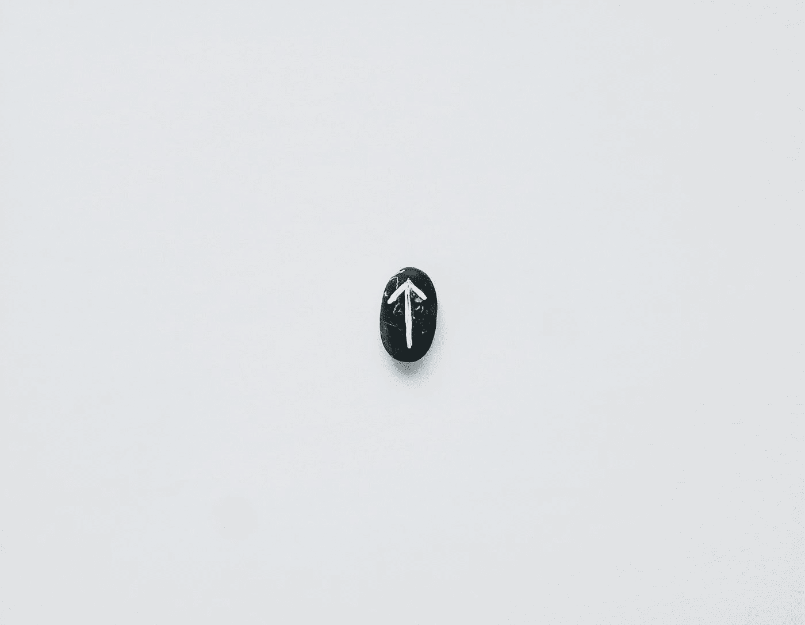
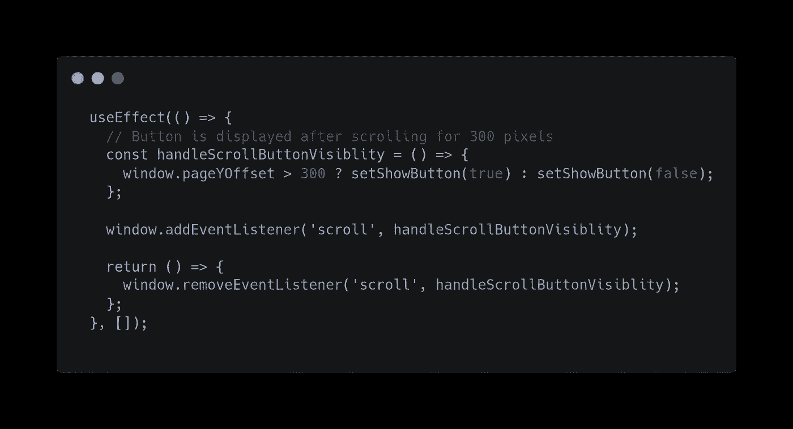
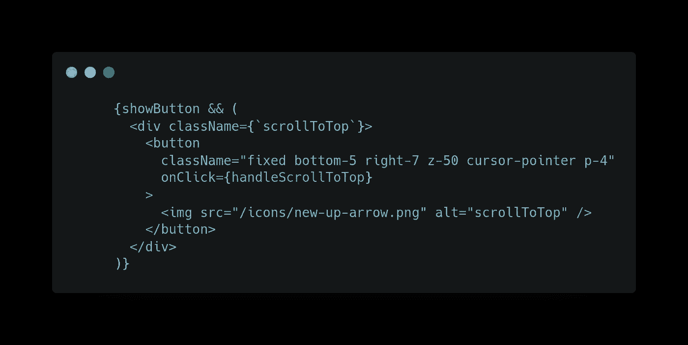
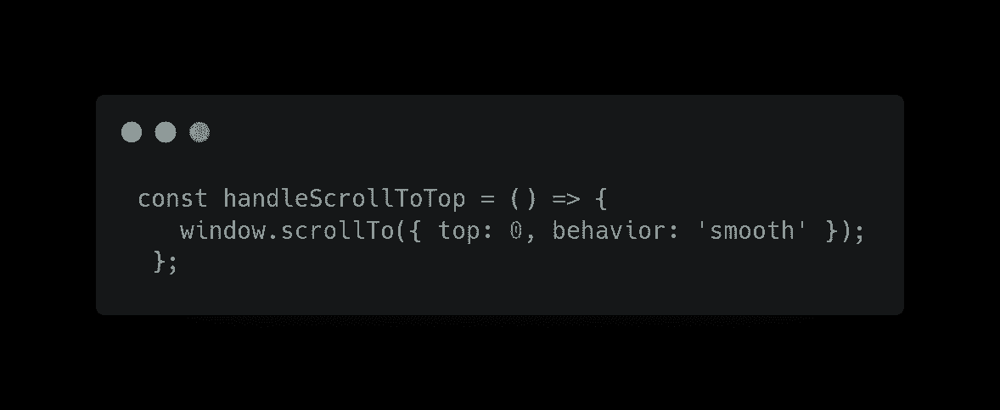

# 如何在 ReactJS 中创建滚动到顶部按钮

> 原文：<https://levelup.gitconnected.com/how-to-create-a-scroll-to-top-button-in-reactjs-7b2f2563d6b0>

## 一个按钮带你到平滑滚动的页面顶部。

[Ilya Chunin](https://unsplash.com/@ilyachunin?utm_source=medium&utm_medium=referral) 在 [Unsplash](https://unsplash.com?utm_source=medium&utm_medium=referral) 上拍摄的照片

最近，我在 react 项目中实现了一个任务，滚动到页面顶部，箭头/按钮应该只有在一定高度后才可见。

我的第一个想法是，我们必须隐藏组件/div，直到用户滚动到一个定义的高度，然后当用户点击按钮时，我们必须把他带到页面的顶部。

那么，我们该怎么做呢？我们在哪里写我们的逻辑？
让我们来看看:-

以下是我们组件的测试用例:

*   按钮应该总是在页面的右下方
*   该按钮应该是隐藏的，只有当我们滚动到一定高度时才会出现
*   点击它，我们应该顺利地被带到页面的顶部

在上图中，我们所做的就是添加一个监听器来决定是否显示一个元素。**handleScrollButtonVisibility**函数用于在用户滚动近 300px 时将我们的按钮状态切换为 true。在此之前，它被设置为 false。

如上图所示，如果`**showButton**` 设置为 true，那么只有我们的箭头/按钮可见。

当用户点击将要执行的`handleScrollToTop`函数时，我们在按钮上附加了一个事件处理程序。函数内部的逻辑如下所示:-

我们可以使用`window`接口自带的  `[scrollTo](https://developer.mozilla.org/en-US/docs/Web/API/Window/scrollTo)`函数，为`top`和`behavior`传递参数。我们的`top`值是 0，因为我们想要这个箭头做的就是将窗口滚动回页面顶部。非常简单。对于`behavior`，我个人更喜欢`smooth`，因为它给了滚动效果一个不那么刺耳的过渡。

不要忘记添加`behavior`属性，因为如果没有它，当用户点击按钮时，它会立即显示在顶部，用户体验不会很好。

我们快完成了！现在是我们查询的最后一个答案，我们应该把这个逻辑写在哪里？
**这要看你的要求了。**

*   如果你的客户要求你的箭头按钮应该出现在所有页面上，那么你必须在你的`app`文件或`layout`文件中写下你的`header`或`footer`所在的位置，因为这些组件出现在你的所有组件上。
*   如果您只想让这个按钮显示在特定的页面上，那么只在那个文件中编写您的逻辑。

瞧，它应该工作了！

以下是我的几篇热门文章，请查阅

*   [在 React 中加载更多功能](/load-more-functionality-in-reactjs-82446862bc06)
*   [在手机上查看本地主机](https://blog.bitsrc.io/how-to-view-localhost-web-apps-on-mobile-browsers-2b7433df4abd)

> *请在评论区分享您的观点，欢迎反馈。
> 希望你会喜欢并分享这篇文章，以便更好地阅读
> 查看我的其他文章于—*[***https://medium.com/@aayushtibra1997***](https://medium.com/@aayushtibra1997) ***感谢阅读:)***