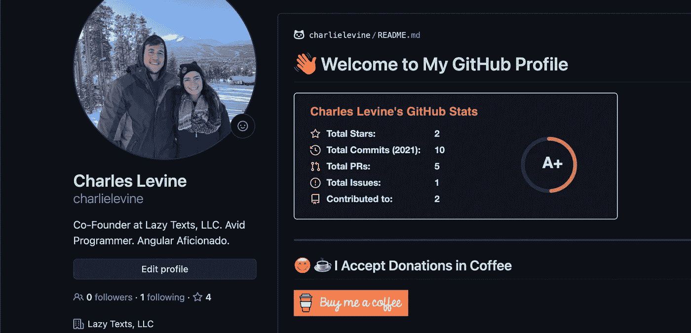
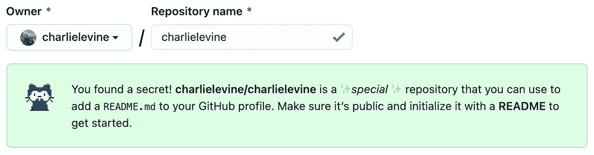
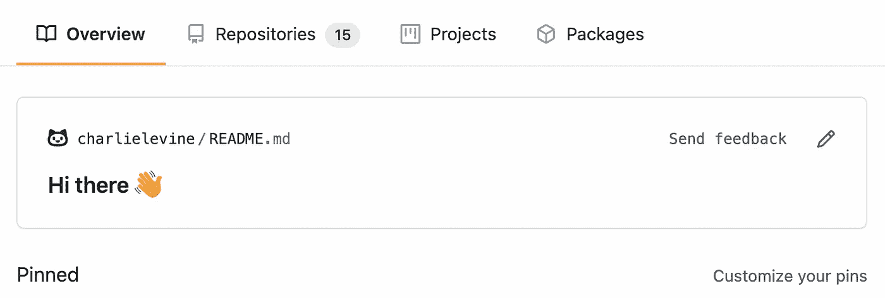

# 🔓如何创建一个秘密的 GitHub 配置文件

> 原文：<https://levelup.gitconnected.com/how-to-create-a-secret-github-profile-85c60655f714>

## 控制降价文件

作者截图

今天我觉得我在电子游戏中发现了一个隐藏的复活节彩蛋，我渴望充分利用它。我创建了一个与我的用户名同名的存储库，并选中复选框用一个 **README.md** 文件初始化它。

作者截图

当我查看我的个人资料时，我在我的固定存储库上看到了一个全新的降价文件，上面写着:“你好👋."

作者截图

这是一个令人兴奋的功能，因为我喜欢展示我的 GitHub 页面。拥有一个完全定制的 markdown 文件的前面和中间是一个新的访问者很好的介绍。第一印象很重要！

首先，我想分享一个我发现的漂亮的开源项目，它可以动态显示嵌入在你的 **README.md** 文件中的 SVG 格式的 GitHub 统计数据。

看看吧！

 [## anuraghazra/github-readme-stats

### 获取动态生成的 GitHub 统计数据！查看演示报告错误请求功能喜欢这个项目…

github.com](https://github.com/anuraghazra/github-readme-stats) 

我也有一个“关于我”的部分来展示我自己。在创建这个库时，GitHub 提供了一些例子，帮助我开始。

在这里。

作者截图

请随时查看我 GitHub 上的 **README.md** 文件。

 [## charlielevine -概述

### Lazy Texts 有限责任公司的联合创始人。狂热的程序员。棱角分明的爱好者。-查理莱文

github.com](https://github.com/charlielevine) 

Markdown 文件允许在其中使用 HTML 和 SVG 图形，更不用说无数的文本格式选项，因此利用这一点进行创作的可能性是无穷无尽的。

如果你像我在这里一样创建了一个秘密的 GitHub 个人资料，请在评论中告诉我。我很想去看看。此外，让我知道如果你已经知道这个功能！

感谢您的阅读。