# 如何在 Unity 中创建一个自我再生的耐力条

> 原文：<https://levelup.gitconnected.com/how-to-create-a-self-regenerating-stamina-bar-in-unity-44ab156dbad9>

耐力条已经成为游戏中非常受欢迎的功能，这已经不是什么秘密了。耐力机制通过附加必要的动作来保持游戏的活力、吸引力和挑战性。当耐力被用来覆盖这些元素时，耗尽耐力会增加游戏的挑战性和战略性。

**目标**:在这篇文章中，你将学习如何制作一个按下一个键就会耗尽的耐力棒，并且当它不再被使用时会重新充满。

# **使用滑块**

[滑块动画](https://in.pinterest.com/pin/35254809569571045/)

[滑块](https://docs.unity3d.com/2018.3/Documentation/ScriptReference/UI.Slider.html)是一个可选的 UI 元素，通常用于需要一组最大和最小值的用户数据，如音量和屏幕亮度。然而，当通过代码进行调整时，它们可以更加通用。

在本教程中，我们的耐力栏将由一个滑块来表示

1.  通过右键单击→ UI →Slider 创建一个滑块，然后适当地命名它。

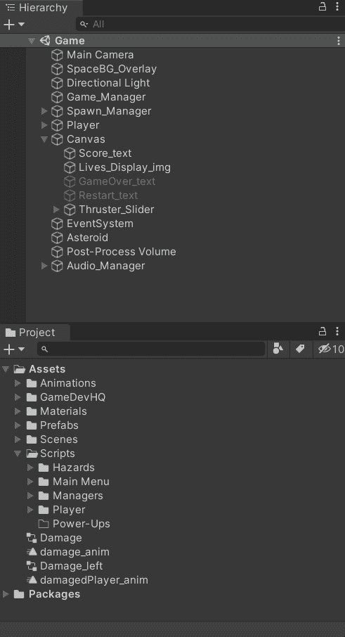

2.将滑块放在您喜欢的任何位置，并确保将其固定到相应的位置。

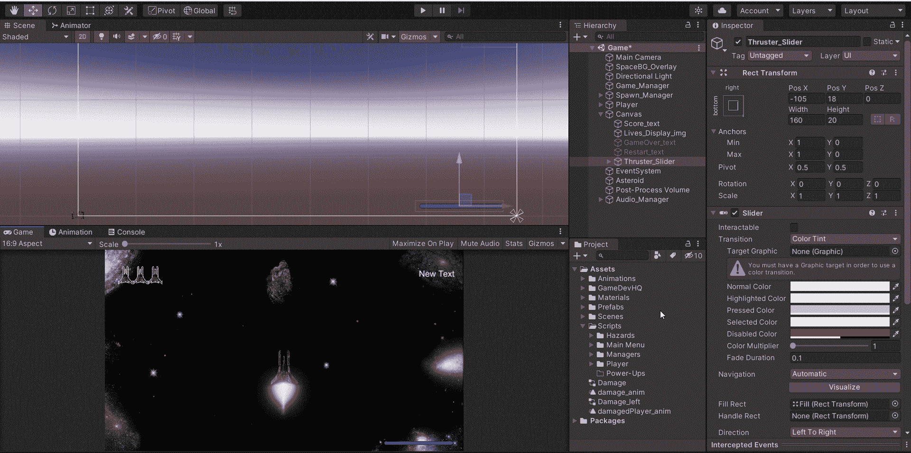

3.我们不会使用句柄，所以您可以在检查器中删除或停用它。

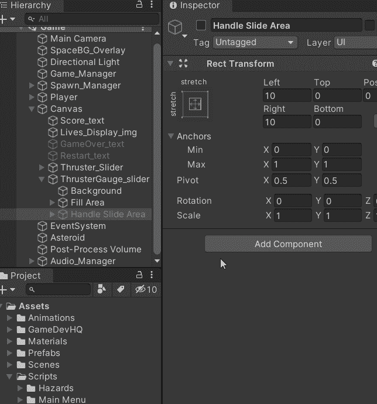

4.确保选中“使用整数”并设置最小值和最大值。

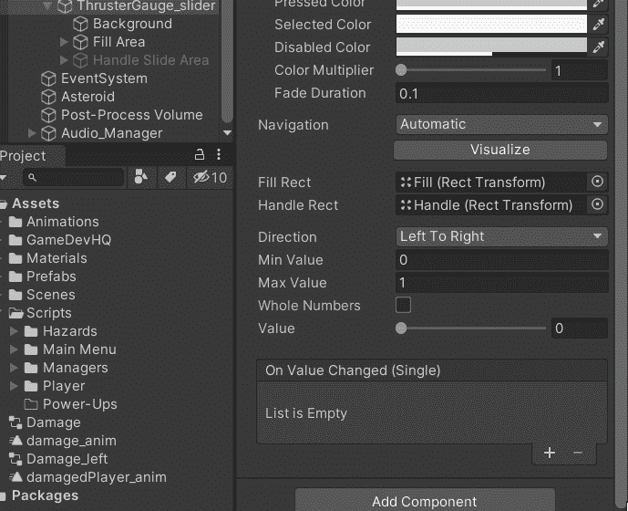

5.现在，是时候设置颜色了。首先，我们设置背景颜色，这是当仪表用完时可以看到的颜色。您可以选择任何颜色或使其完全透明。

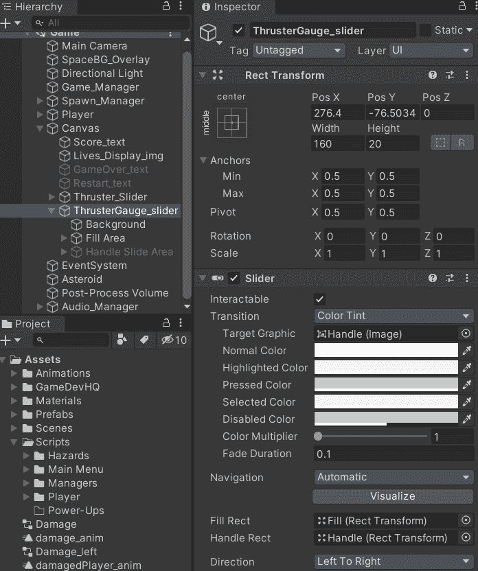

6.然后，我们可以选择代表完整仪表的填充颜色。

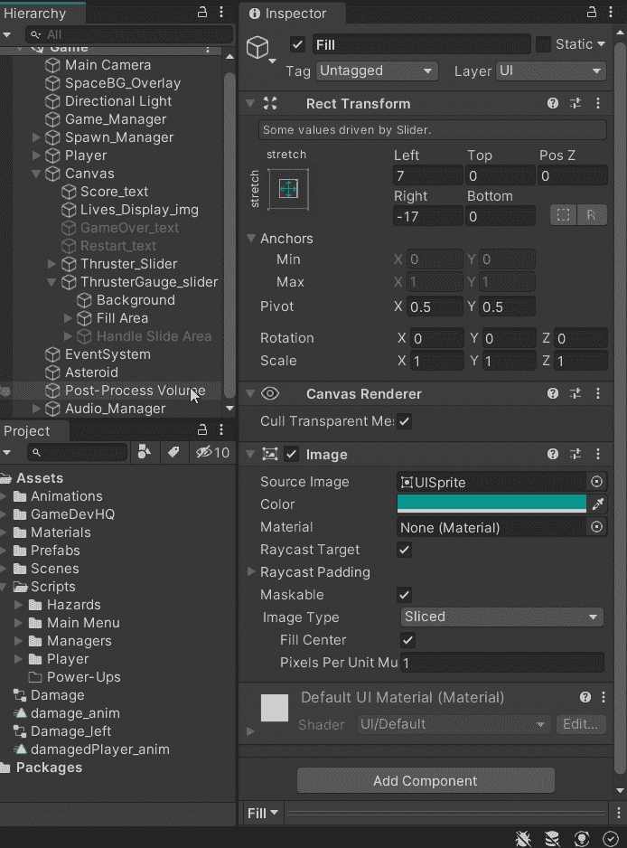

7.确保滑块不可交互，因为我们将对其全部功能进行编程。

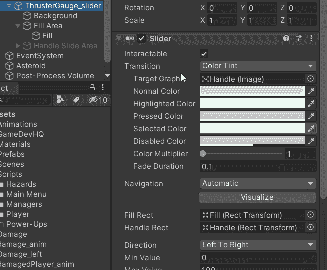

# 滑块编程

下面的例子展示了我为 2D 太空射手推力机构编写的代码，然而，同样的逻辑也适用于耐力棒。

1.  首先，我们的代码中需要 Unity UI 库。

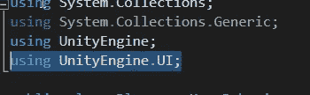

2.现在我们可以访问 UI 了，我们可以为滑块创建一个引用。这将是一个 SerializeField，以便我们可以在检查器中设置它。

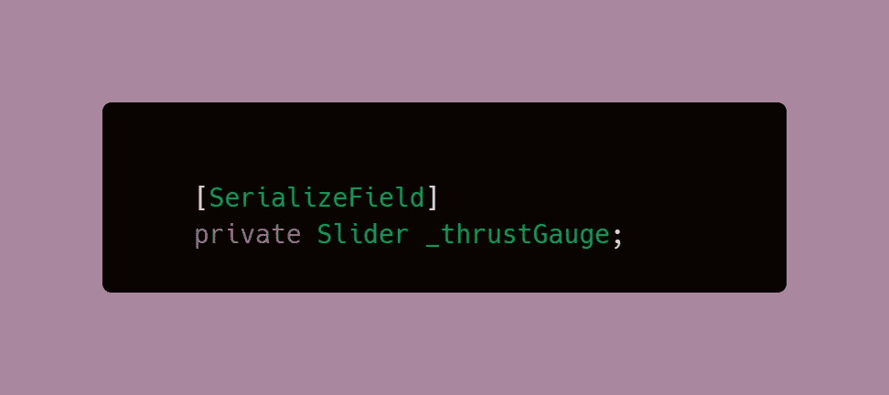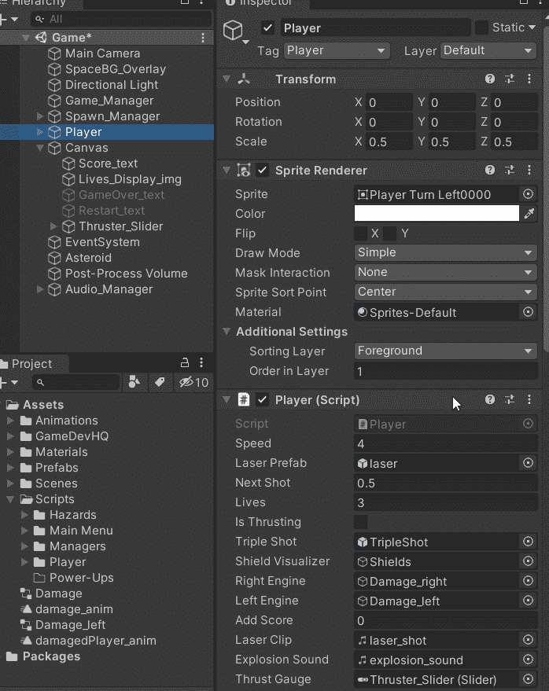

3.在 Start 方法中获取 Slider 组件。

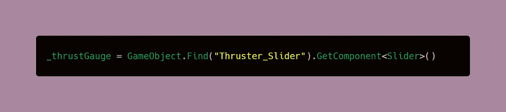

4.在试图在代码中使用组件之前，最好先检查它是否为空。

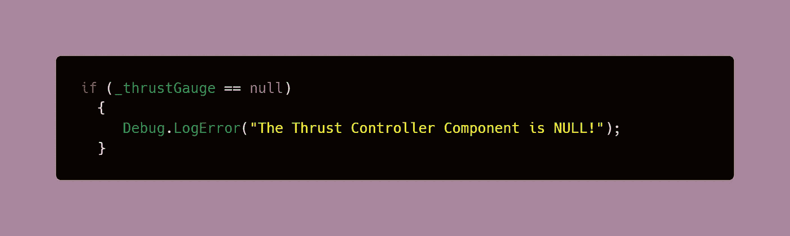

5.为最大或总燃料值创建一个全局**变量，并创建一个**布尔变量，帮助我们稍后控制推力**特性。默认情况下，推力变量将被设置为假，因为我们的球员不只是开始推力或运行。**

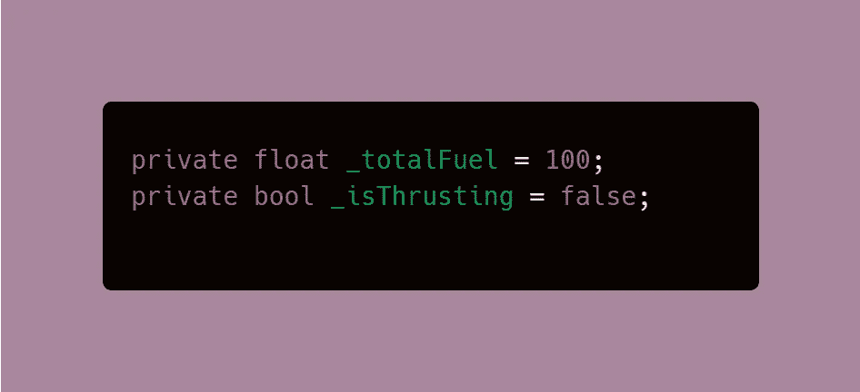

5.在 Update 方法中设置滑块值。

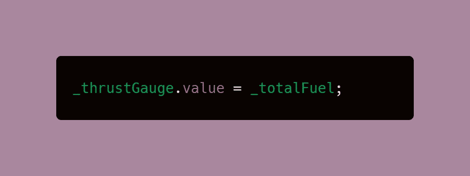

6.创建 void 方法来处理先前建立的布尔值。最佳实践是使用方法来更改此类变量的值，而不是动态更改。

请注意，每当玩家停止推进时，玩家代码中的速度变量是如何设置为默认值的，这意味着在此期间他们不会移动得更快。

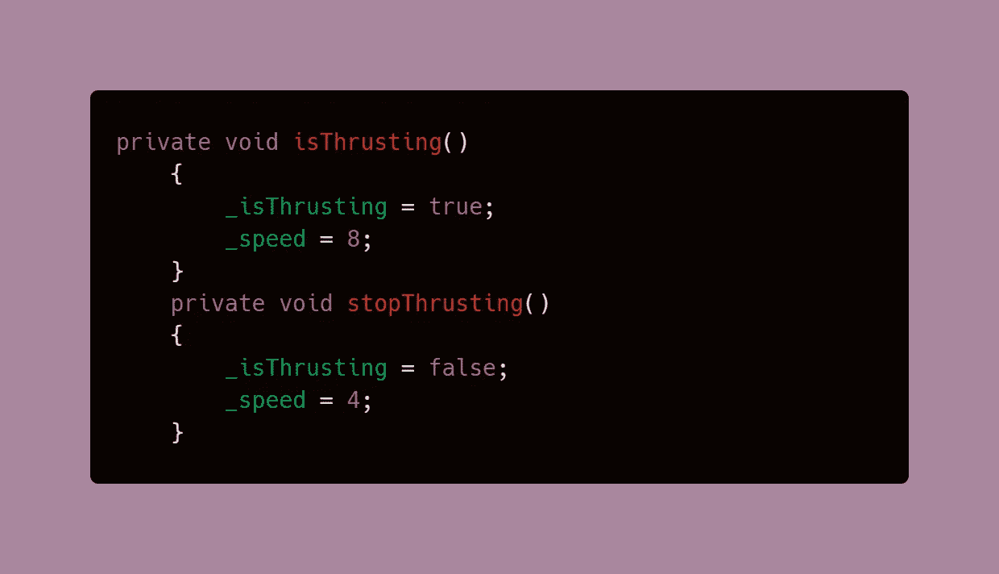

7.创建更新仪表或条形图的方法。这种方法是根据油量计减少或增加的速度来计算燃油总量的。int 参数值将在协程中设置。下面的 if 语句使用 stopThrusting 方法来确保当横杠用完时播放器的速度被设置为默认值。

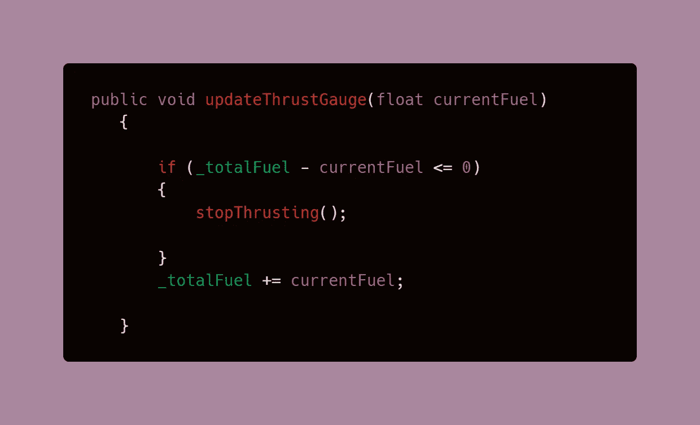

8.第一个协程用于推进或冲刺功能。只要我们之前创建的布尔值为真，while 循环就会运行，在此期间，它会每秒钟减少 20 的耐力，或者您在代码中选择的时间长度。

因为滑块值是在更新中设置的，所以这种计算会在发生时被它主动反映出来。

> **注意**:你可以在这里获得更多关于如何使用协程[的信息。](https://medium.com/codex/coroutines-with-unity-b5a2b3fc3426)

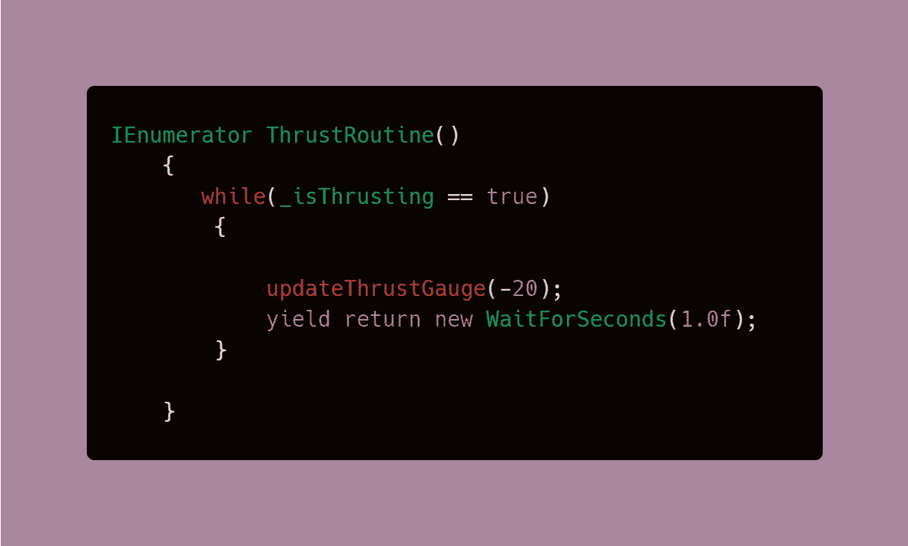

9.第二个协程是重新填充量表，总体上遵循与前一个相同的逻辑。

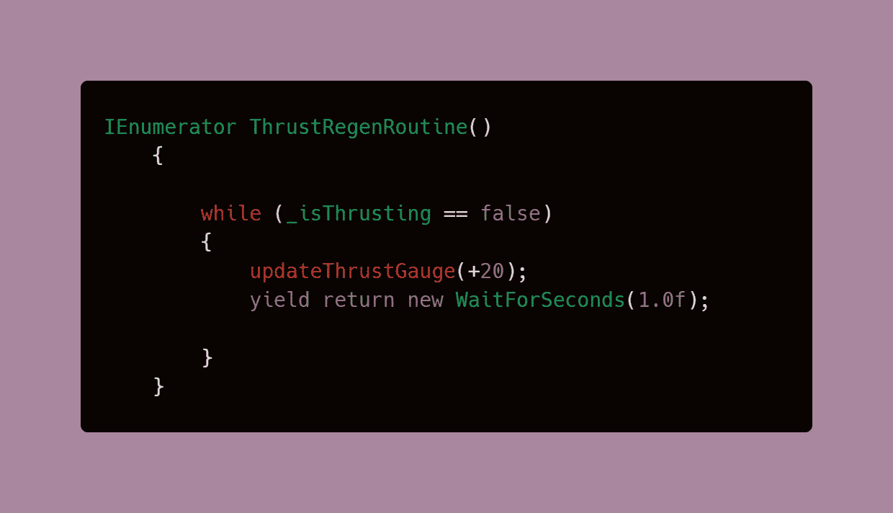

10.最后，我们需要能够完成按键时的行为。这就是使用处理布尔值的方法的地方，通过在按键被按下或释放时调用它们，我们可以控制协程内的 while 循环何时激活，并且只要条件分别为真或假，就连续执行它们。

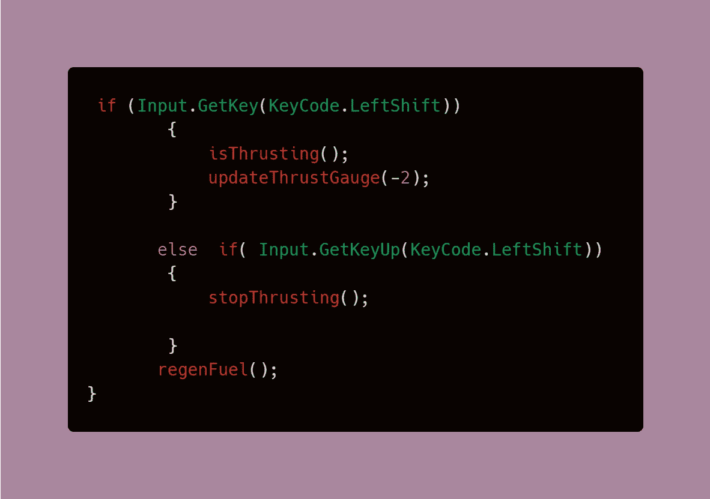

## **结果:**

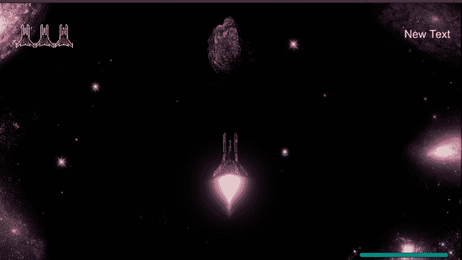

这篇文章是我在 GameDevHQ 学徒期间正在进行的一系列编码挑战的一部分。接下来的文章将会涉及更多的内容！