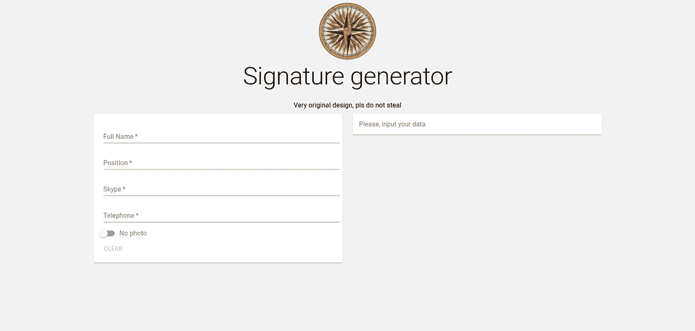
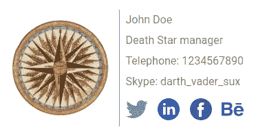
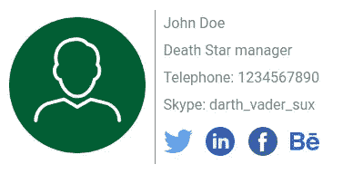

# 如何使用 React 创建签名生成应用程序

> 原文：<https://levelup.gitconnected.com/how-to-create-a-signature-generating-app-with-react-ffeb2f2201cc>

还记得名片很重要的时候吗？我说的大，是指——大。即使是电影，有时整个场景也只集中在一张名片上。

不，我不是说它不再是东西了。相反，我想你可以有把握地说，它在新时代失去了一点魅力。当然，并不是每个地方都一样——至少在日本，他们仍然对[石梅](https://en.wikipedia.org/wiki/Business_card#Japan)很认真。然而，有时候名片变得与众不同，非常独特——当他们试图摆脱[无聊的纸片](https://www.boredpanda.com/creative-business-card-designs)时。

这是最有趣的一点。如今，什么可以用作电子名片？最直白的回答就是——邮件签名！这是一种非常简单而有效的方式来接收关于发送者的附加甚至原始数据。例如，它可以是公司名称、职位、skype、电话号码等等。

为什么你甚至需要电子邮件签名？简而言之，就是增加你的商业价值。你可以很容易地用它给人们留下深刻印象，就像你用名片给他们留下深刻印象一样。有了有趣的电子邮件签名，你、你的品牌和你的公司会变得更容易辨认。最后，一个与众不同的电子邮件签名可以让人们知道到底是谁与他们保持电子邮件通信，这可以帮助你增加信任，它可以是一种辅助的安全功能。别忘了拯救树木！

作为个人和公司，你如何创建电子邮件签名？有 3 种方法可以做到:
1。使用提供的可视编校器，在 Gmail 设置部分创建它——远非用户友好。也是一个非常耗时的过程。
2。利用别人创建的 HTML 签名模板。不错，但是在哪里以及如何存储模板呢？
3。为该案例创建一个 web 应用程序！

所以，现在我们要使用 React 和 Material UI(我选择它只是为了更快的开发，你可以使用不同的框架或者根本不使用框架，直接使用сSS)来构建一个签名生成应用程序(某种虚构公司的内部站点)。它将能够根据提供的信息生成两种类型的签名——有照片的和没有照片的。其他信息包括全名、职位、电话、skype 和社交网络链接。

让我们用 create-react-app 工具创建一个项目。我还想使用打字稿和纱包管理器。当然，你可以使用 npm 和普通 javascript。转到您指定的项目目录并键入`npx create-react-app signature-generator — template typescript — use-yarn`。你已经安装了[节点](https://nodejs.org/en/)(在这个项目中我使用的是 v12.14.1)，对吗？

导航到签名生成器目录。您可以安全地删除`logo.svg`文件，删除`App.tsx`、`App.css`和`index.css.`文件中的所有内容，下一步是安装 Material-UI core-type`yarn add @material-ui/core`。我们还必须使用 Roboto 字体——进入`public`文件夹并将`<link rel="stylesheet" href="https://fonts.googleapis.com/css?family=Roboto:300,400,500,700&display=swap" />`添加到 index.html(将其放入`<head>`标签中)。最后一个是材质——UI 图标——type`yarn add @material-ui/icons`。终于，准备结束了，该编码了。

首先，让我们创建我们的状态接口和 initialState:

```
export interface PhotoSignatureProps {
    fullName: string;
    position: string;
    skype: string;
    phone: string;
    photo: string;
}

interface State extends PhotoSignatureProps {
    withPhoto: boolean;
    copied: boolean;
}

const initialState: State = {
    fullName: "",
    position: "",
    skype: "",
    phone: "",
    photo: "",
    withPhoto: false,
    copied: false,
};
```

和相应的挂钩:

```
const [state, setState] = React.*useState*<State>(initialState);

const handleChange = (event: React.ChangeEvent<HTMLInputElement>) => {
  if (event.target.name === "withPhoto") {
    setState((prevState) => ({
      ...prevState,
      [event.target.name]: event.target.checked,
    }));
  } else {
    setState((prevState) => ({
      ...prevState,
      [event.target.name]: event.target.value,
    }));
  }
};
```

如你所见，为了简单起见，`photo`实际上是一些图片的 URL，`withPhoto`是照片存在的标志，`copied`是复制操作的视觉批准标志。其他字段非常简单。

然后是带有输入字段的表单:

```
<form className={classes.root} noValidate autoComplete="off">
    <TextField
        fullWidth={true}
        required
        label="Full Name"
        value={state.fullName}
        name={"fullName"}
        onChange={handleChange}
        autoFocus={true}
    />
    <TextField
        fullWidth={true}
        required
        label="Position"
        value={state.position}
        name={"position"}
        onChange={handleChange}
    />
    <TextField
        fullWidth={true}
        required
        label="Skype"
        value={state.skype}
        name={"skype"}
        onChange={handleChange}
    />
    <TextField
        fullWidth={true}
        required
        label="Telephone"
        value={state.phone}
        name={"phone"}
        onChange={handleChange}
    />
    ...
</form>
```

让我们选择一个标志。我用了[这个](https://pixabay.com/illustrations/vintage-sign-nautical-ship-compass-1064142/)并把它放到了`assets`文件夹里。我还为 [Twitter](https://www.flaticon.com/free-icon/twitter_2111688?term=twitter&page=1&position=49&page=1&position=49&related_id=2111688&origin=search) 、 [LinkedIn](https://www.flaticon.com/free-icon/linkedin_145807?term=linkedin&page=1&position=3&page=1&position=3&related_id=145807&origin=style) 、[脸书](https://www.flaticon.com/free-icon/facebook_145802?term=facebook&page=1&position=2&page=1&position=2&related_id=145802&origin=search)和 [Behance](https://www.flaticon.com/free-icon/behance_733538?term=behance&page=1&position=26&page=1&position=26&related_id=733538&origin=search) 添加了社交网络链接和标识。

```
Few hints:
If you're using static images (like in this project):
  a) no SVGs - gmail proxy block it and gmail generally don't support it;
  b) no base64 - gmail don't support it and don't forget about global limit of 10000 symbols for web-based clients and 12000 for desktop ones (and base64 are usualy really long)
  c) don't forget to disable react-scripts\webpack function of converting small images to base64 utilizing environment variable **IMAGE_INLINE_SIZE_LIMIT**
  d) don't forget to write *homepage* in **package.json** or use **PUBLIC_URL** environment variable
```

最后，是签名模板的时候了。[这里](https://www.wisestamp.com/gmail-email-signature/)是有用的[提示](https://emailsignaturerescue.com/blog/the-ultimate-guide-to-creating-awesome-gmail-signatures)为此。

```
Hint:
Forget about complex fancy **div**s. Mr. **table** is our best friend here.
```

为了简单起见，我们会在左侧放一个徽标或照片，然后是一条长竖线和 5 行全名、职位、skype、电话和社交网络链接(我的链接只是它们的主页 URL)，类似这样:

```
<table cellPadding={0} cellSpacing={0} className={"signature"}>
    <tbody>
    <tr>
        <td rowSpan={5}>
            
        </td>
        <td rowSpan={5}>
            <div
                className={"vertical-line"}
            />
        </td>
        <td>{props.fullName}</td>
    </tr>
    <tr>
        <td colSpan={3}>{props.position}</td>
    </tr>
    <tr>
        <td colSpan={3}>Telephone: {props.phone}</td>
    </tr>
    <tr>
        <td colSpan={3}>Skype: {props.skype}</td>
    </tr>
    <tr>
        <td colSpan={3}>
            <div className={"social-logos-frame"}>
                <a href={"https://twitter.com/"}>
                    
                </a>
                <a href={"https://www.linkedin.com/"}>
                    
                </a>
                <a href={"https://www.facebook.com/"}>
                    
                </a>
                <a href={"https://www.behance.net/"}>
                    
                </a>
            </div>
        </td>
    </tr>
    </tbody>
</table>
```

不要忘记添加一些 CSS，这样看起来会更好！

```
Hints:
1\. Not all fonts are supported by gmail. Do your [research](https://www.omnisend.com/blog/email-safe-fonts-vs-custom-fonts/#:~:text=The%20most%20popular%20safe%20fonts,easy%2Dto%2Dread%20typefaces.) before.
2\. All hyperlinks would be displayed in [default](https://www.w3schools.com/html/html_links.asp) way. Try to use an image as a link.
```

最后，但同样重要的是，把东西按顺序放在`public`文件夹、`README.md`和`package.json`中。认真的家伙有他们自己的图标和所有的描述，不是吗？你完了！这是结果:



签名——带有公司标志和照片:



完整的代码可以在这里找到[。这里的例子是](https://github.com/al3xsus/email-signature-generator)[和](https://al3xsus.github.io/email-signature-generator/)。

**思想** :
1。电子邮件签名其实并不简单，但也远不是一件非常复杂的事情。
2。这个项目仍然是完整产品的骨架。你可以(或许应该)为用户提供不同设计的不同模板，让他们自由添加更多内容，将照片作为文件处理，等等。
3。React 是一个非常简单、有用和强大的工具。一如既往。

**好了，感谢阅读！请在评论中分享你的观点，并关注我。如果有不清楚的地方，不要害怕提问。**