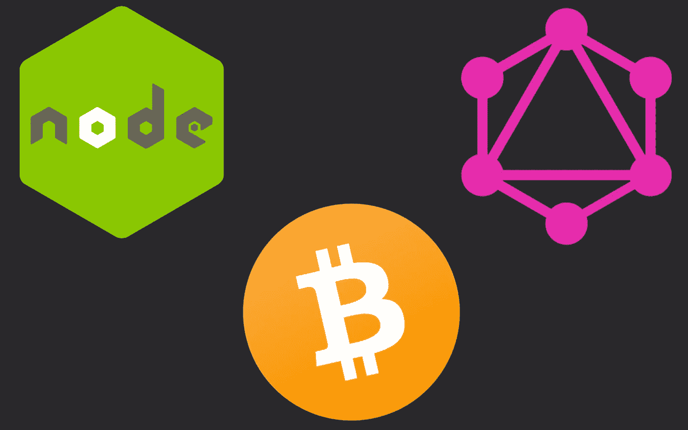
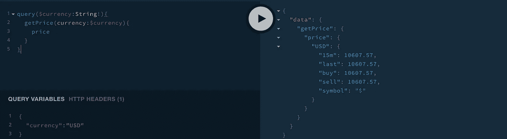

# 如何用 Node.js & GraphQL 创建一个简单的比特币 API

> 原文：<https://levelup.gitconnected.com/how-to-create-a-simple-bitcoin-api-with-nodejs-graphql-part-i-a8cd8832fed5>



# 什么是 GraphQL

在开始写代码之前，我想说这个教程是给初学者的。这个想法是以一种温和而简单的方式开始使用 GraphQL，在未来的部分中，我们将使我们的 API 更加复杂。

来自官方[网站](https://graphql.org/):

> GraphQL 是一种 API 查询语言，也是一种用现有数据完成这些查询的运行时语言。GraphQL 为您的 API 中的数据提供了完整且易于理解的描述。

GraphQL 将帮助我们标准化我们的 API 结构，并使它更易于维护、易于阅读、易于在我们的客户之间共享等等。

我们将构建一个非常简单的 API 来获取不同货币的比特币价格。我们将开始了解 GraphQL 是如何工作的，以及如何在我们的比特币应用程序中使用它。

# 开始使用。

我将介绍整个过程，但是你可以在这里得到整个库

# 项目设置

首先，我们需要建立我们的项目。

# 1 创建您的工作目录

在你的终端运行下面的命令:`mkdir btc-gql-api && cd btc-gql-api`，这个命令会在你当前的目录下创建并访问一个新的文件夹。

# 2 初始化您的项目

在您的终端上运行`yarn init`或`npm install`，并填写将被提示的字段。这将在您的目录中创建以下文件:

```
package.json
```

这个包看起来会像这样:

```
{
  "name": "my-new-project",
  "version": "1.0.0",
  "description": "My New Project description.",
  "main": "index.js",
  "repository": {
    "url": "https://example.com/your-username/my-new-project",
    "type": "git"
  },
  "author": "Your Name <you@example.com>",
  "license": "MIT"
}
```

*   运行`touch index.js`以便在您的工作目录中创建您的条目文件。(如果您在 windows 中，请在代码编辑器中手动创建该文件)。
*   添加一个开始命令，在你的`package.json`中添加一个新的章节:

```
...
"scripts": {
  "start": "node index.js"
},
...
```

您的包应该是这样的:

```
{
  "name": "my-new-project",
  "version": "1.0.0",
  "description": "My New Project description.",
  "main": "index.js","scripts": {
    "start": "node index.js"
  },
  "repository": {
    "url": "https://example.com/your-username/my-new-project",
    "type": "git"
  },
  "author": "Your Name <you@example.com>",
  "license": "MIT"
}
```

在您的工作目录中创建一个名为`graphql`的新文件夹，因此您的结构应该如下所示:

```
+ btc-gql-api
|__ graphql
|__ package.json
|__ index.json
```

在`graphql`目录下创建三个名为`types.js`、`resolvers.js`、`request.js`的新文件，您的项目应该如下所示:

```
+ btc-gql-api
|__+graphql
|____request.js
|____resolvers.js
|____types.js
|__ package.json
|__ index.json
```

# 3 安装依赖项

对于这个项目，我们需要两个依赖项:`axios`和`graphql-yoga`，所以我们运行`yarn add axios graphql-yoga`。

就这样，我们已经建立了我们的项目，我们可以开始写一些代码了！

# 类型

GraphQL 模式最基本的组成部分是对象类型，它只是表示一种可以从服务中获取的对象，以及它有哪些字段。在 GraphQL 模式语言中，我们可以这样表示它:

```
type User {
  name: String!
  email: String!
}
```

GraphQL 自带了一组默认的标量类型:

*   `Int`:一个带符号的 32 位整数。
*   `Float`:有符号双精度浮点值。
*   `String`:UTF‐8 字符序列。
*   `Boolean`:真或假。
*   `ID`:ID 标量类型表示一个惟一的标识符，通常用于获取一个对象或作为缓存的键。ID 类型的序列化方式与 a `String`相同；但是，将其定义为 ID 意味着它不适合人类阅读。

还有一种指定自定义标量类型的方法。例如，我们可以定义一个`Date`类型:

```
scalar Date
```

如果你想学习更多关于 GraphQL 中类型的知识，我鼓励你去看看 GraphQL 文档

让我们创造我们的类型！

在代码编辑器中打开文件`./graphql/types.js`并添加以下内容:

```
const typeDefs = `
scalar JSONtype Price {
  price:JSON!
}`;module.exports = typeDefs;
```

这里刚刚发生了什么？嗯，正如我们在 GraphQL 使用类型语言来表示 API 中的对象之前所了解的，对于我们的比特币 API，我们现在在模式中只需要一种类型，即类型`Price`

```
...
type Price {
  price:JSON!
}
...
```

如你所见，类型`Price`只有一个名为`price`的字段，它的类型是`JSON`并且不能为空(这就是符号`!`的含义)。我们已经讨论了默认情况下`GraphQL`包含的默认数据类型，而`JSON`不在其中，所以我们需要定义它:

```
scalar JSONtype Price {
  price:JSON!
}
...
```

# 问题

GraphQL 是关于管理数据的，a `query`基本上是询问对象上的特定字段:

```
query {
  getPrices {
    price
  }
}
```

结果:

```
{
  "data": {
    "getPrices": {
      "price": {
        "USD": {
          "15m": 10436.54,
          "last": 10436.54,
          "buy": 10436.54,
          "sell": 10436.54,
          "symbol": "$"
        }
        ...
      }
    }
  }
}
```

如您所见，响应具有与请求相同的结构。

# 查询和变异类型

在一个模式中还有另外两种特殊的类型，`Query`和`Mutation`。

每个 GraphQL 服务至少有一个查询类型，可能有也可能没有突变类型。这些类型与常规对象类型相同，但是它们定义了每个 GraphQL 查询的入口点。它们看起来像这样:

```
scalar JSONtype Price {
  price:JSON!
}type Query {
  getPrices: Price!
  getPrice(currency:String!): Price!
}
```

这意味着我们的 GraphQL 服务有一个带有`getPrices`和`getPrice`字段的查询类型，两者都等于我们的`Price`类型，我们可以看到字段`getPrice`有一个参数`(currency:String!)`。GraphQL 对象类型上的每个字段可以有零个或多个参数。

参数可以是必需的，也可以是可选的，在本例中，我们需要一个名为 currency 的必需参数，我们将使用它来选择要查询的货币。

到此为止，您已经了解了 GraphQL 中存在哪些类型，并且我们已经为我们的应用程序设置了必要的类型。

# 7 请求帮助者

在我们继续使用 GraphQL 之前，我们需要一个助手来负责获取比特币价格，为了实现这一点，我们将使用[Blockchain.com](https://www.blockchain.com/es/api/exchange_rates_api)API，但是您也可以使用任何其他您想要的服务。

打开我们之前创建的文件:`./graphql/request.js`并添加以下内容:

```
const axios = require("axios");module.exports = {
  getPrices: async () => {
    const url = "https://blockchain.info/ticker";
    try {
      return await axios.get(url);
    } catch (error) {
      console.error(error);
    }
  }
};
```

我们将使用`axios`来发出`GET`请求，但是您可以轻松地使用任何其他工具来实现这一点。

# 8 个解析器

每种类型上的每个字段都由 GraphQL 服务器开发人员提供的一个名为 resolver 的函数支持。当一个字段被执行时，相应的解析器被调用以产生下一个值。

如果一个字段产生一个标量值，如字符串或数字，则执行完成。但是，如果一个字段产生一个对象值，那么查询将包含适用于该对象的另一个字段选择。这一直持续到达到标量值。GraphQL 查询总是以标量值结束。

在每一个 GraphQL 服务器的顶层都有一个代表所有可能的 GraphQL API 入口点的类型，它通常被称为根类型或查询类型。

打开名为`./graphql/resolvers.js`的文件，添加以下内容:

```
const requests = require("./requests");const resolvers = {
  Query: {
    // Get all available prices
    async getPrices(parent, args, ctx, info) {
      const prices = await requests.getPrices();
      return { price: prices.data };
    },
    // Get the price of a given currency symbol
    async getPrice(parent, args, ctx, info) {
      const prices = await requests.getPrices();
      return { price: { [args["currency"]]: prices.data[args["currency"]] } };
    }
  }
};module.exports = resolvers;
```

让我们分解一下，首先我们导入我们的请求帮助器:

```
const request = require("./request");
```

我们不需要声明或解析对象:

```
const resolvers = {
  Query: {
    // Get all available prices
    async getPrices(parent, args, ctx, info) {
      const prices = await requests.getPrices();
      return { price: prices.data };
    },
    // Get the price of a given currency symbol
    async getPrice(parent, args, ctx, info) {
      const prices = await requests.getPrices();
      return { price: { [args["currency"]]: prices.data[args["currency"]] } };
    }
  }
};
```

我们的解析器对象有一个名为`Query`的根，在这个对象中，我们将声明我们在 GraphQL 模式中的所有解析器，请注意，我们已经像在`types.js`文件中一样命名了这些解析器。

每个解析器只是一个实现我们的请求帮助器的函数，我们的解析器函数接收四个参数:

*   `parent`:前一个对象，对于根查询类型上的字段通常不使用。
*   `args`:在 GraphQL 查询中提供给字段的参数。
*   `ctx`:提供给每个解析器的值，保存重要的上下文信息，如当前登录的用户或对数据库的访问。
*   `info`:保存与当前查询相关的特定于字段的信息以及模式细节的值。

# 9 服务器

现在我们已经有了`types`、`resolvers`和助手，我们只需要设置`server`来完成我们非常小的比特币 API。

打开我们之前创建的文件`index.js`，添加以下内容:

```
const { GraphQLServer } = require("graphql-yoga");
const typeDefs = require("./graphql/types.js");
const resolvers = require("./graphql/resolvers.js");const server = new GraphQLServer({
  typeDefs,
  resolvers,
  context: {
    //if we pass anything here can be available in all resolvers
  }
});server.start(() => console.log("Server is running on localhost:4000☄"));
```

如您所见，我们导入了 GraphQLServer 库和我们的 typeDefs 和解析器，然后我们创建了一个新的`GraphQLServer`实例，并传递了配置:

```
...
const server = new GraphQLServer({
  typeDefs,
  resolvers,
  context: {
    //if we pass anything here can be available in all resolvers
  }
});
...
```

最后，我们运行服务器！：

```
server.start(() => console.log("Server is running on localhost:4000☄"));
```

就是这样！现在我们只需要在终端中运行`npm start`，如果我们的代码一切正常，我们应该会看到下面的消息:

```
Server is running on localhost:4000☄
```

打开你的浏览器，进入`http://localhost:4000`，如果一切正常，你应该会看到操场界面。

测试查询:所有可用货币:

```
query{
  getPrices{
    price
  }
}
```

查询特定货币:

```
query($currency:String!){
  getPrice(currency:$currency){
    price
  }
}# Variables:
{
  "currency": "USD"
}
```

您应该会看到这样的响应:



就这样，我们用 GraphQL 建立了一个非常简单的比特币 API，我们已经了解了开始使用 GraphQL 的基础知识，如果你想了解更多关于这项技术的信息，请访问[GraphQL.org](https://graphql.org)。

在下面的帖子中，我们将学习如何使用突变来创建比特币地址，并使用测试网将交易推送到网络，然后我们将使用 Apollo client 构建一个 web 客户端，并与我们的 GraphQL API 进行交互。

如果您有任何问题，请在评论中提问或在 twitter 上关注我，我很乐意帮助您！

编码快乐！

资源:

[https://graphql.org/learn](https://graphql.org/learn)