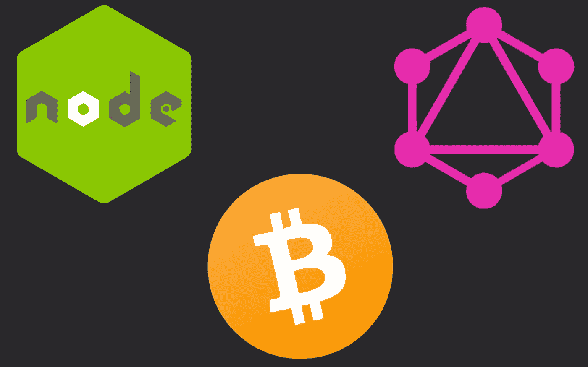
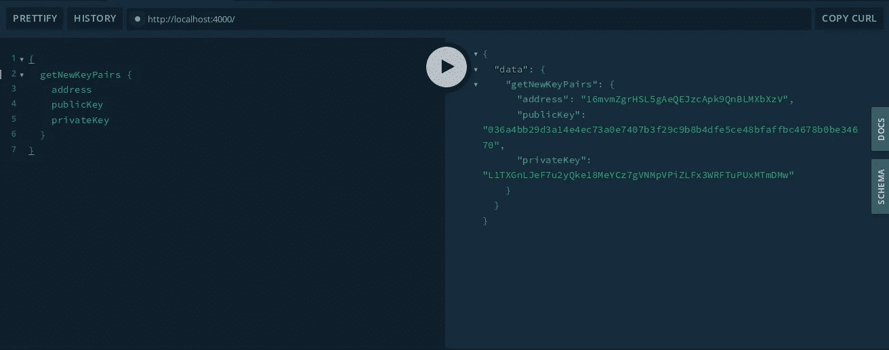
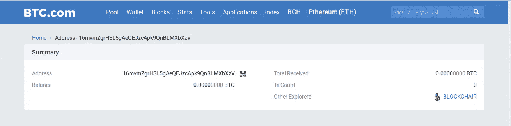

# 在节点中生成公共/私有比特币密钥——使用 NodeJS & GraphQL 第二部分创建一个简单的比特币 API

> 原文：<https://levelup.gitconnected.com/how-to-create-a-simple-bitcoin-api-with-nodejs-graphql-part-ii-9b5c268f6d50>



最近发表了教程的[第一部分，想对所有看过的人说声谢谢。我真的希望你学到了一些很酷的东西，玩得开心！](/how-to-create-a-simple-bitcoin-api-with-nodejs-graphql-part-i-a8cd8832fed5?source=friends_link&sk=63e5bb0439b0e19a1132891d1e4ba588)

现在，在这一部分，我们将比 GraphQL 更多地讨论比特币。我希望你喜欢！

# 引言。

比特币是一种去中心化的数字货币，它使用点对点技术，允许用户在世界任何地方进行即时支付，并且没有中央权威机构。它是由神话中的[中本聪](https://en.wikipedia.org/wiki/Satoshi_Nakamoto)创造的。

很多人可能认为比特币是炒作，市场是投机的。收养正在进行中。然而，作为一名开发者，我认为比特币是一个利基市场，我认为至少学习基础知识是一个好主意。

# **为什么？**

比特币的市值为 193，013，341，127 美元，有很多人试图进入这个行业，学习这项技术，知道如何使用它可能会让你的口袋里有一些钱。此外，比特币和区块链技术学习起来很有趣。你可以尝试和创造令人敬畏的东西，谁知道呢，你可能会成为下一个伟大的秘密企业家。

# 地址

在这一部分，我们将谈论地址。如果你想了解更多关于比特币及其系统的信息，你可以在这里阅读更多。

# 什么是比特币地址？

比特币地址是代表发送比特币支付的目的地的标识符。

比特币地址仅供一次性使用，每次交易都必须使用新的比特币地址。地址不是钱包，也不是账户，也不携带余额。他们只接收资金，而你在任何时候都不会发送“发件人”地址。

大多数比特币地址是 34 个字符。它们由随机数字和大小写字母组成，除了大写字母“O”、大写字母“I”、小写字母“l”和数字“0”从不用于防止视觉模糊。使用的格式有三种:

*   **以数字 1 开头的 P2PKH** ，例如:*1 bvbmseystwetqtfn 5 au 4m 4g fg 7 xjanvn 2*。
*   **以数字 3 开头的 P2SH** 类型，例如:*3j 98 t1 wpez 73 cnmqviecrnyiwrnqrhwnly*。
*   **bc1 开头的 Bech32** 类型，例如:*BC 1 qar 0 srrr 7 xf kvy 5 l 643 lyd NW 9 re 59 gtzzwf 5 mdq*。

# 私钥

比特币背景下的私钥是一个秘密数字，可以让你的比特币被花掉。每个比特币钱包都包含一个或多个私钥，这些私钥保存在钱包文件中。私钥在数学上与为钱包生成的所有比特币地址相关。这些必须保密和安全。私钥可以保存在计算机文件中，但也经常写在纸上。

证明你拥有一些比特币的唯一方法是拥有私钥。如果你没有自己的私钥，那么比特币就不是你的。

在下面的教程中，我们将学习如何使用私钥将事务推送到网络(testnet)。

*在我们开始有趣的部分之前，如果你还没有阅读教程的第一部分，你可以在这里**，你可以在这里 *获得完整的代码*。*

# 生成比特币密钥对

对于本教程，我们将使用库 [bitcoinjs-lib](https://github.com/bitcoinjs) 。

让我们从安装 bitcoinjs-lib 开始。在我们的工作目录中，我们运行:

```
npm install --save bitcoinjs-lib
```

或者如果你喜欢纱线

```
yarn add bitcoinjs-lib
```

现在我们已经安装了库，我们需要将它导入到一个`requests.js`文件中，如下所示:

```
const axios = require(“axios”);
const bitcoin = require(“bitcoinjs-lib”);…
```

太好了，我们现在可以开始使用库的方法了！

我们的 *requests.js* 文件应该如下所示:

```
const axios = require(“axios”);
const bitcoin = require(“bitcoinjs-lib”);module.exports = {
  getPrices: async () => {
    const url = “https://blockchain.info/ticker?currency=MXN";
    *try* {
      *return* *await* axios.get(url);
    } *catch* (e) {
      *throw* new Error(e);
    }
  }
};
```

我们将添加一个新方法来生成比特币密钥对。所以我们创建了方法`generateKeyPairs`:

```
…generateKeyPairs: () => {
*/*It can generate a random address [and support the retrieval of transactions for that address (via 3PBP)*/* const keyPair = bitcoin.ECPair.makeRandom(); const { address } = bitcoin.payments.p2pkh({ pubkey: keyPair.publicKey }); const publicKey = keyPair.publicKey.toString(“hex”); const privateKey = keyPair.toWIF(); *return* { address, privateKey, publicKey };}…
```

现在我们可以生成一个随机地址及其公钥和私钥。在接下来的教程中，我们将为我们的 API 添加从私钥生成地址的功能。

现在我们有了随机生成一个比特币地址的方法。我们需要能够在我们的 GraphQL API 中使用它，所以让我们开始吧！

## **GraphQL 类型**

目前，我们只有一种我们以前的教程叫做`Price`。现在我们需要添加一个名为`KeyPairs`的新类型，在我们的文件`types.js`中，当前应该如下所示:

```
const typeDefs = `
scalar JSONtype Price {
  price:JSON!
}type Query {
  getPrices: Price!
  getPrice(currency:String!): Price!
}`;module.exports = typeDefs;
```

我们将添加具有属性`address`、`publicKey`和`PrivateKey`的类型`KeyPairs`，如下所示:

```
const typeDefs = `
 scalar JSON type Price {
   price:JSON!
 } type KeyPairs {
   address:String!
   publicKey: String!
   privateKey: String!
 } type Query {
   getPrices: Price!
   getPrice(currency:String!): Price!
 }`;module.exports = typeDefs;
```

既然我们已经将新类型添加到了模式中，我们需要在查询类型中定义方法，应该如下所示:

```
const typeDefs = `
 scalar JSONtype Price {
   price:JSON!
 }type KeyPairs {
   address:String!
   publicKey: String!
   privateKey: String!
 }type Query {
   getPrices: Price!
   getPrice(currency:String!): Price!
   generateNewKeyPairs: KeyPairs!
}`;module.exports = typeDefs;
```

一旦我们添加了新的类型，我们需要更新我们的解析器。

在我们的`resolvers.js`文件中，我们将添加一个名为`getNewKeyPairs`的新文件，我们不需要导入任何东西，因为我们已经在之前的教程中导入了我们的请求助手，所以我们将把它添加到我们的文件中:

```
*...
// Get a new bitcoin random keypairs* getNewKeyPairs() {
  const { address, publicKey, privateKey } =   requests.generateKeyPairs(); *return* { address, publicKey, privateKey };
}
...
```

就是这样！我们现在可以使用`npm start`运行我们的 API，并在浏览器中使用`http://localhost:4000`测试我们的新查询，如下所示:

```
{
  getNewKeyPairs {
    address
    publicKey
    privateKey
  }
}
```

结果应该是这样的:



我们可以在[https://btc.com/](https://btc.com/)搜索我们生成的地址来检查生成的地址是否有效。



就是这样！在这一部分中，我们已经了解了一点什么是比特币，什么是地址和私钥，以及如何实现`bitcoinjs-lib`并在 GraphQL 上下文中使用它。在下面的教程中，我们将学习如何使用 testnet 将交易推送到网络，以及如何将余额“关联”到给定的地址。在本系列的最后一部分，我们将使用 React 和 Apollo 构建一个比特币钱包应用程序。

我希望你喜欢这个教程并从中得到乐趣，下次再见！

可以在 [@luis_acervantes](https://twitter.com/luis_acervantes) 提问或者问好。

编码快乐！

教程库:[https://github.com/LuisAcerv/graphql-api-tutorial](https://github.com/LuisAcerv/graphql-api-tutorial)

来源:

[https://github.com/bitcoinjs/bitcoinjs-lib](https://github.com/bitcoinjs/bitcoinjs-lib)

[https://en.bitcoin.it/wiki/Main_Page](https://en.bitcoin.it/wiki/Main_Page)