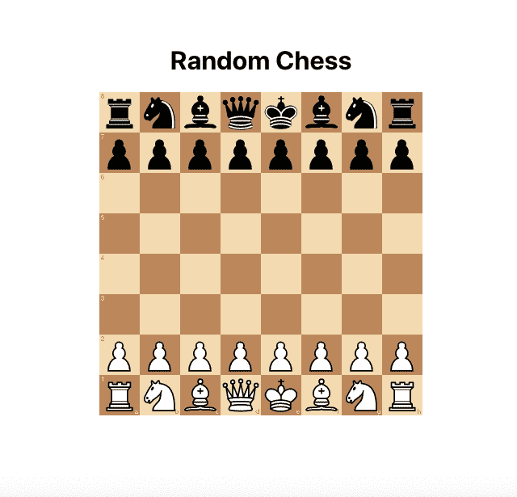
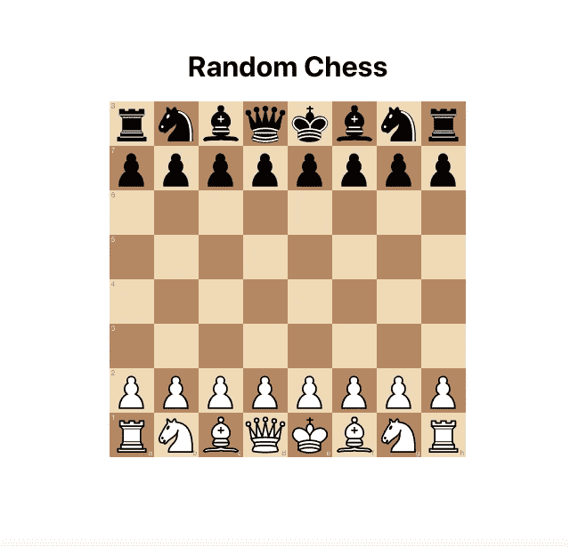

# 如何用 React 创建一个简单的象棋应用程序

> 原文：<https://levelup.gitconnected.com/how-to-create-a-simple-chess-app-with-react-e18c0179b167>

## 不到 50 行代码


照片由 [Jani Kaasinen](https://unsplash.com/@neon845b?utm_source=unsplash&utm_medium=referral&utm_content=creditCopyText) 在 [Unsplash](https://unsplash.com/s/photos/online-chess?utm_source=unsplash&utm_medium=referral&utm_content=creditCopyText) 上拍摄

## 我们在创造什么

如果你对我们将要创造的东西感兴趣。这是给你的演示。



随机象棋

这是一个简单的棋盘，你可以移动，计算机将发挥一个有效的随机移动。这种情况一直持续到游戏结束。

## 棋盘

不，我们不会创造自己的棋盘。如果我们在创造一个棋盘，我应该写一本书，而不是一篇文章。

我们将使用[棋盘. jsx](https://github.com/willb335/chessboardjsx) 。这是一个用于[棋盘. js](https://github.com/oakmac/chessboardjs) 的 react 包装器，可以免费使用。

## 国际象棋规则

要实现我们想要的，光靠棋盘是不够的。因为棋盘是一个组件，它不知道象棋的规则。我们需要`chess.js`，另一个知道国际象棋规则的开源国际象棋库。并且将帮助我们检查所下的棋是否有效，该轮到谁下了，游戏是否结束，等等。

## 我们开始吧

现在我们得到了我们需要的。让我们开始编码吧。首先，我们借助`create-react-app`工具，用 typescript 创建一个 react app。

```
$ npx create-react-app --template=typescript chess-game
```

接下来，在你最喜欢的编辑器中打开项目，然后打开`src/App.tsx`文件，删除所有代码。

我们将从渲染棋盘开始。如前所述，我们将使用`chessboardjsx`。在我们使用它之前，我们必须安装它。

```
// npm
$ npm install chessboardjsx
// yarn
$ yarn add chessboardjsx
```

现在，我们已经安装了`chessboardjsx`。让我们渲染棋盘。

我正在使用我在`App.css`中定义的`flex-center` css 类来将页面居中。

我们将 2 个道具传递给`Chessboard`组件。第一个很明显，`width`告诉我们棋盘的宽度。第二个是`position`，其实是一个[分](https://www.chessprogramming.org/Forsyth-Edwards_Notation)。如果你是象棋新手。Fen 是棋子位置的文本表示，还包含一些其他信息。如果你想了解更多关于 fen 的知识。你可以在这里做。

让我们运行应用程序，这是您应该在浏览器中看到的内容。



如果你试着走几步，你会发现你可以走任何一步。我们有一块免费的木板。

现在，我们用`[chess.js](https://github.com/jhlywa/chess.js)`来添加游戏逻辑。在我们使用`chess.js`之前，我们必须安装它。

```
npm install chess.js
```

因为我们使用了 typescript，所以我们也将为`chess.js`添加类型

```
npm install @types/chess.js --save-dev
```

让我们将`chess.js`添加到我们的应用程序中。

我用`require`导入`Chess`，用 import 导入`ChessInstance`。这是因为，在撰写本文时，`chess.js`和`@types/chess.js`并不同步。

并使用`useState`通过传递初始 fen 来实例化一个`Chess`实例。

通过使用`chess`，我们将允许用户只进行有效的移动。玩随机的电脑游戏。让我们开始吧。

我会试着分析一下这里发生了什么。

首先，我们给`Chessboard`组件添加了`onDrop`道具。每当拾取一个棋子并将其放到棋盘上时，就会调用`onDrop`。递给我们`sourceSquare`(从方格)和`targetSquare`(到方格)。

我们创建了一个`handleMove`函数，它从`chess.js`接收一个`ShortMove`。`ShortMove`是具有`from`、`to`、`promotion`属性的对象。当`onDrop`被调用时，我们将`sourceSquare`和`targetSquare`转换为`ShortMove`。我们将`promotion`作为`q`传递。告诉`chess.js`每当升级发生时自动升级为女王。

我们在`handleMove`做的第一件事是在`chess.js`采取行动。如果传递的移动有效，它将返回一个有效的完整移动，否则`null`。如果一个走法有效，我们从`chess.js`获取更新的`fen`并更新`fen`状态。

之后，更新`fen`。我们设置了 300 毫秒的超时。通过使用返回移动数组的`moves()`获得所有有效的移动。选择一个随机移动并在`chess.js`上玩，然后再次更新`fen`。这种情况一直持续到游戏结束。

在这个阶段，我们可以做得更多。但是我会在这里停下来，因为我想保持简单。

您可以在这里获得完整的源代码。

[](https://github.com/varunpvp/random-chess) [## 随机象棋

### GitHub 是超过 5000 万开发人员的家园，他们一起工作来托管和审查代码、管理项目和构建…

github.com](https://github.com/varunpvp/random-chess) 

如果你有兴趣的话，可以试试我开发的名为[益智游戏](https://puzzlerace.netlify.app/)的象棋应用。你可以和你的朋友实时比赛你的国际象棋解谜技巧。

 [## 拼图比赛-比赛你的国际象棋拼图技能

### 一个比赛你的国际象棋技巧的应用程序

puzzlerace.netlify.app](https://puzzlerace.netlify.app/) 

如果您有任何问题或想了解更多信息。让我知道。如果你喜欢你所读的，给它一个掌声。

感谢阅读。

# 分级编码

感谢您成为我们社区的一员！ [**订阅我们的 YouTube 频道**](https://www.youtube.com/channel/UC3v9kBR_ab4UHXXdknz8Fbg?sub_confirmation=1) 或者加入 [**Skilled.dev 编码面试课程**](https://skilled.dev/) 。

[](https://skilled.dev) [## 编写面试问题+获得开发工作

### 掌握编码面试的过程

技术开发](https://skilled.dev)