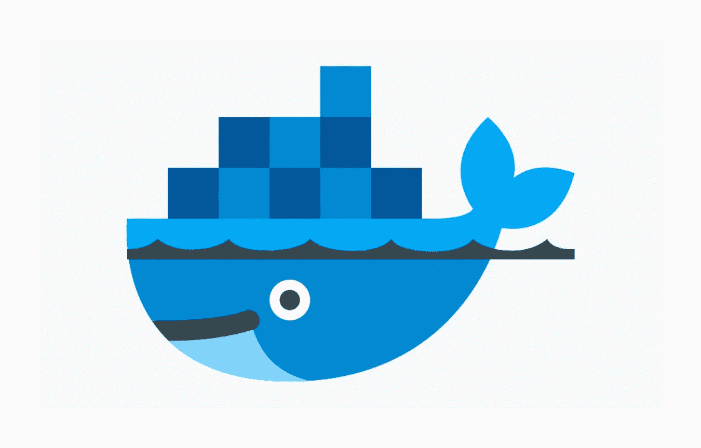
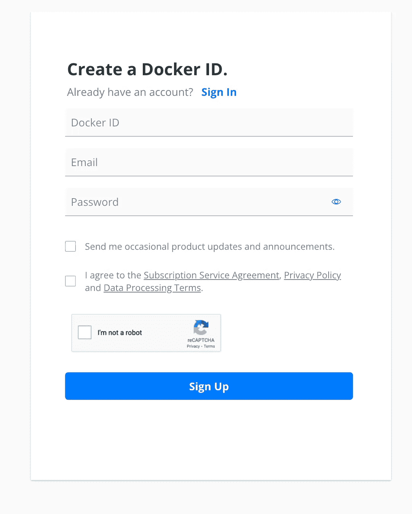
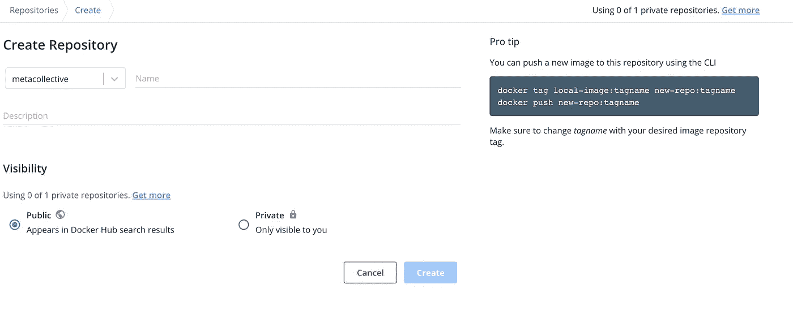
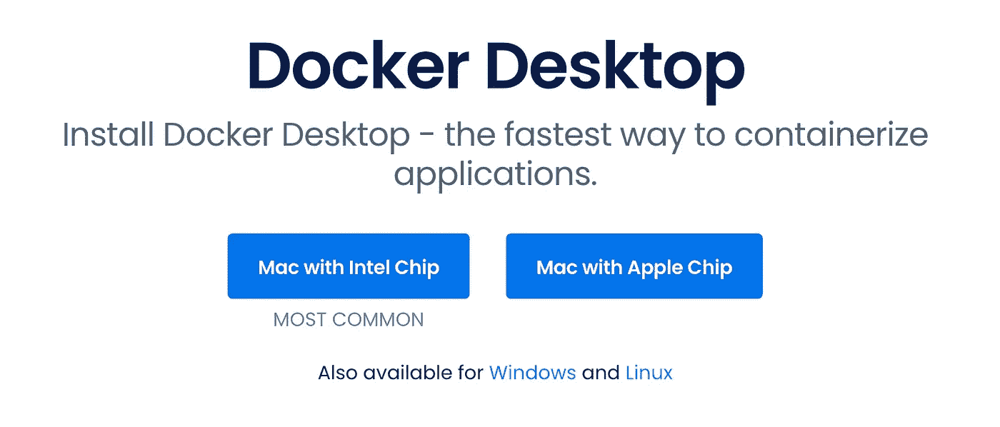
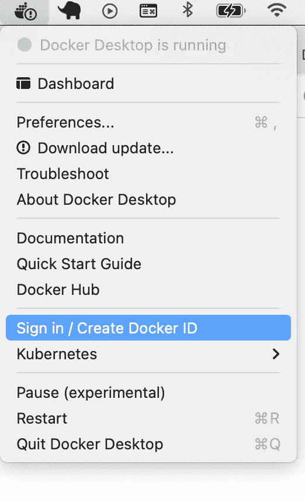
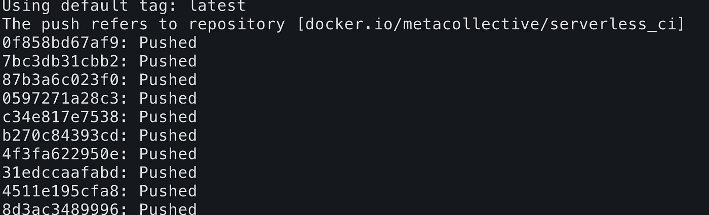

# 如何创建安装了 AWS CLI 和无服务器的 docker 映像

> 原文：<https://levelup.gitconnected.com/how-to-create-a-simple-docker-image-with-aws-cli-and-serverless-installed-d1cc2901946>

如何创建一个简单的 docker 映像并将其托管在 docker hub 上的分步指南

Docker 很酷！

关于如何创建自己的 docker 映像并将其托管在 docker hub 上的简单易行的分步指南。在本教程中，我们将创建一个安装了以下软件的映像

*   Nodejs (v14)
*   饭桶
*   尝试
*   卷曲
*   openssh
*   py3-pip
*   wget
*   aws cli
*   无服务器

> 第一步:在 docker hub 网站上创建一个账户，点击这里-[https://hub.docker.com/signup](https://hub.docker.com/signup)

注册 docker hub 帐户

> 第二步:在你的 docker hub 账户上创建一个新的存储库

[https://hub.docker.com/repository/create?namespace=](https://hub.docker.com/repository/create?namespace=metacollective)【你的账户名】。您可以根据需要将其标记为私有或公共。如果是私有的，那么只有那些你想要的人才能访问，对于公共的，它是为每个人准备的。

> 第三步:安装 docker for desktop。你可以从 https://www.docker.com/products/docker-desktop[下载可安装程序](https://www.docker.com/products/docker-desktop)

在你的机器上安装 docker

> 第四步:使用你的 docker hub 账户登录你的桌面 docker

使用 docker hub 帐户登录

> 步骤 5:打开你的编辑器(例如:visual studio 代码)并添加一个名为 Dockerfile 的新文件。将以下几行添加到文件中

> FROM node:14-alpine:此图片基于流行的 [Alpine Linux 项目](https://alpinelinux.org/)，可在`[alpine](https://hub.docker.com/_/alpine)`[官方图片](https://hub.docker.com/_/alpine)中获得。Alpine Linux 比大多数发行版基础映像要小得多(大约 5MB)，因此一般来说映像也要小得多。

像这样安装你想在这个映像中安装的各种包

> 运行 apk 更新&& apk 添加—更新—无缓存\
> git \
> bash \
> curl \
> OpenSSH \
> python 3 \
> py3-pip \
> py-cryptography \
> wget \
> curl

更新 NPM

> 运行 npm 配置集 unsafe-perm true
> 运行 npm 更新-g

安装 AWS CLI

> 运行 pip 安装—升级 pip && \
> pip 安装—升级 awscli

全局安装无服务器框架。您必须全局安装无服务器框架才能使其工作。如果你通过一个项目安装它，那么它将无法工作，你的任何无服务器命令将在这个镜像的容器中失败

> 运行 npm install -g 无服务器

现在，您已经准备好将该图像上传到 docker hub。

转到您的终端，运行以下命令，从这个 docker 文件构建一个映像-

构建图像

构建完成后，您可以通过运行以下命令在本地机器上找到您的映像-

现在，只需将您的图像推送到 docker hub

检查您的 docker hub 帐户，您的图像应该在那里。

GitHub repo→[https://github.com/metacollective9/serverless_ci](https://github.com/metacollective9/serverless_ci)

码头枢纽→ `docker pull metacollective/serverless_ci`

感谢您的阅读，如果您想支持我，请关注我，成为会员，支持更广泛的社区。

 [## 通过我的推荐链接加入媒体 Meta Collective

### 作为一个媒体会员，你的会员费的一部分会给你阅读的作家，你可以完全接触到每一个故事…

medium.com](https://medium.com/@metacollective/membership)