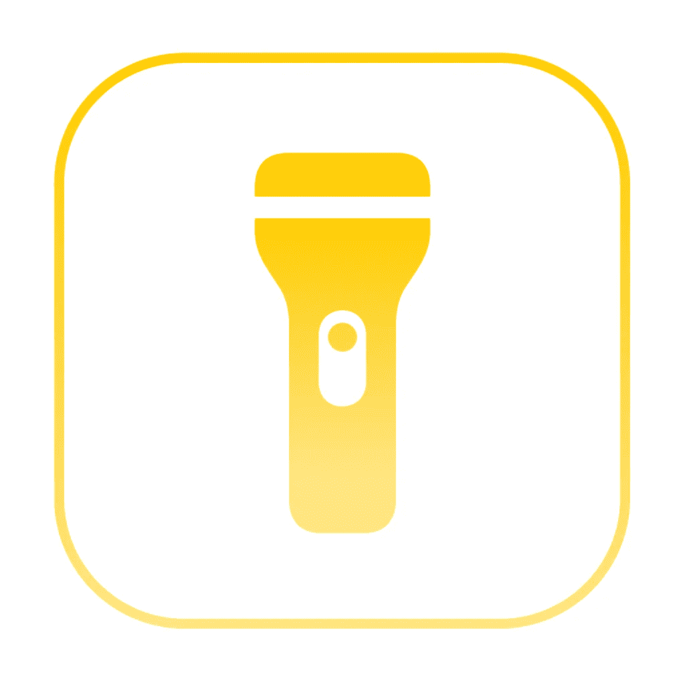
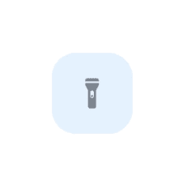
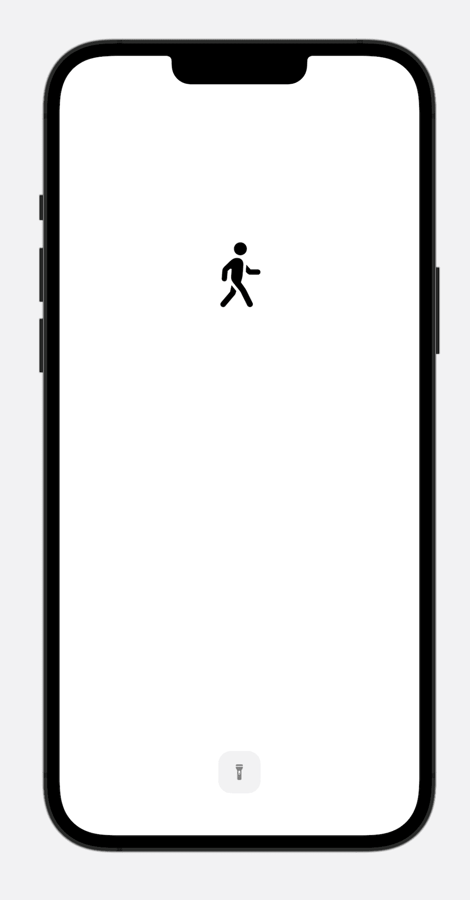

# 如何:使用 SwiftUI 创建简单的手电筒应用程序

> 原文：<https://levelup.gitconnected.com/how-to-create-a-simple-torch-light-app-with-swiftui-aa921124e65e>

## 让它工作的几行代码！



在本教程中，我们将使用 SwiftUI 和 AVFoundation 创建一个简单的手电筒应用程序。我们走吧！

## 演示预览

1.  创建一个名为`toggleTorch()`的函数。它依靠 AVFoundation 来工作。`*device.hasTorch*` *可以防止没有手电筒功能的设备崩溃。*

2.然后，创建一个视图和按钮来触发该功能。

可以先设置一个状态。例如:

```
@State **private** **var** torch = **false**- OR -
@AppStorage("torch") var torch = false
```

添加带动作的火炬按钮。

```
Button(action: {
  torch.toggle()
  toggleTorch(on: torch)
}) {
 .
 .
 .
}
```



火炬样本

3.(可选)美化视图。
在这里，我使用了`circle`、`triangle`和带`ZStack`的`SF symbols`，使其工作如下。你可以在页面底部找到源代码。



## 有问题吗？

别担心！找到下面的源代码。您可以随时打开新的问题并提问。

[](https://github.com/1998code/SwiftUI-Torch) [## GitHub - 1998code/SwiftUI-Torch:用 SwiftUI 制作的火炬。

### 此时您不能执行该操作。您已使用另一个标签页或窗口登录。您已在另一个选项卡中注销，或者…

github.com](https://github.com/1998code/SwiftUI-Torch) 

## 感谢阅读:)

## 跟踪并关注最新技术。

[](https://twitter.com/1998design) [## 明@ 1998 设计

### 跟随今天！

twitter.com](https://twitter.com/1998design) 

# 分级编码

感谢您成为我们社区的一员！在你离开之前:

*   👏为故事鼓掌，跟着作者走👉
*   📰查看[升级编码出版物](https://levelup.gitconnected.com/?utm_source=pub&utm_medium=post)中的更多内容
*   🔔关注我们:[Twitter](https://twitter.com/gitconnected)|[LinkedIn](https://www.linkedin.com/company/gitconnected)|[时事通讯](https://newsletter.levelup.dev)

🚀👉 [**加入升级人才集体，找到一份神奇的工作**](https://jobs.levelup.dev/talent/welcome?referral=true)