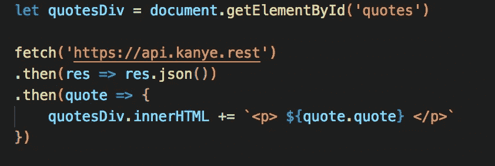

# 如何使用 JavaScript 创建简单的 Web 应用程序

> 原文：<https://levelup.gitconnected.com/how-to-create-a-simple-web-app-using-javascript-d27b28459fad>

PSA: JavaScript (JS)正在危险地上瘾。如此沉迷于此，以至于在业余时间，我开发随机的 web 应用程序来满足自己，当然，也是为了练习一些 JS 编码技能。JavaScript 就像任何一门外语一样，初看起来可能有些令人生畏(这个*到底是谁？为什么它不喜欢我？).但是，请记住:*


这里再插一句陈词滥调。

我们可以开始使用 JS 制作一个基本的交互式 web 应用程序。让我们也设定一个目标，用大约 20 行代码来实现这个目标。准备好了吗？我们走吧！

## 我们正在建造的东西

让我们建立一个网络应用程序，作为日常自我激励和点亮你心情的工具。我明白了。一个应用程序，向你显示一个随机的 Kanye 报价以及一个随机的猫照片的选项。天才！

为了实现这个想法，我们可以使用 2 个不同的 API(应用程序编程接口)来帮助后端，1) Kanye。Rest 和 Cat API

[https://kanye.rest](https://kanye.rest/)

[](https://thecatapi.com/) [## 猫作为一种服务，每天都是猫日。

### 一个关于猫的公共服务 API，在制作你的新应用、网站或服务时可以免费使用。

thecatapi.com](https://thecatapi.com/) 

## 该应用程序

打开您喜欢的文本编辑器(我使用 VS 代码)并创建一个包含两个文件的存储库:`index.js`和`index.html`。`index.js`文件是你所有 JS 代码的存放处。`index.html`文件保存了你的网页的结构和格式。

因为我们正在构建一个简单的 web 应用程序，所以我们不会在这里使用任何高级的 CSS 格式或设计。HTML 文件的主要结构如下所示:


在 HTML 文件中，一定要有这行代码:

```
<script defer src="src/index.js" charset="utf-8"></script>
```

“延迟”通知浏览器等待页面加载后运行 JavaScript。

接下来，我们应该创建一个【the Kanye 引用将被放置在那里。让我们给这个`div`一个`id`叫做“报价”这样，当我们需要时，我们可以很容易地找到这个带有这个特定的`id`的 div。

> 提示:最好在重要的 HTML 标签上添加 id，尤其是那些你知道你需要在代码中获取和调用的标签。通过“id”比类名更容易找到 HTML 元素，因为 id 必须是唯一的！


我们应该做一个按钮，当点击时，会在浏览器上显示一张随机的猫的照片。该按钮将有一个“give-cat”的`id`


最后，创建一个带有“cat-pic”的`id`的`div`，它将保存猫的照片。


现在，我们转到`index.js`文件，开始编码 JS！

## 使用 Kanye API 获取 Kanye 报价

我们应该做的第一步是找到引号所在的`div`，并将其声明为一个变量。我们可以通过键入:

```
let quotesDiv = document.getElementById('quotes')
```

为了从 Kanye 和 Cat API 中检索数据，我们需要利用`fetch`函数。对于第一部分，我们向 Kanye API 发送一个 GET 请求。


`fetch`返回一个对象作为请求的响应。我们对响应调用`.json ()`方法，将响应文本解析为 JSON。


接下来，我们做另一个`.then()`。这里我们接收 JSON 对象，我们最终可以用它来操作 DOM！我们可以把这个新的 JSON 对象叫做`quote`。


还记得我们之前声明的那个`quotesDiv`变量吗？我们现在需要在这里使用它。为了将这段引文添加到 DOM 中，我们可以调用`quotesDiv`上的`innerHTML`属性。

看看 JSON 对象的样子，我们可以看到`quote`也是一个键。


因此，我们写道:


整个代码块应该如下所示:



让我们看看我们的 DOM 现在是什么样子！

厉害！进入下一个交付品！

## 使用 Cat API 获取 Cat 图片

我们现在需要给按钮添加`onclick`功能。通过 id 找到按钮，并将其声明为一个名为`catButton`的变量。

```
let catButton = document.getElementById('give-cat')
```

接下来，我们需要向按钮添加一个事件侦听器。事件监听器有两个参数:1)事件 2)处理事件的回调函数。

```
catButton.addEventListener("click", evt => {
```

在我们获取之前，让我们指定猫照片应该放在 DOM 的哪个部分。找到 id 为“cat-pic”的`div`,并将其声明为变量。

```
let catDiv = document.getElementById('cat-pic')
```

现在，我们向 Cat API 发出 GET 请求。在最后一个`.then()`中，我们必须对 JSON 响应执行一个`forEach`方法，因为它是一个数组。


我们在`catDiv`上调用`innerHTML`属性。让我们为图片插入一个可爱的标题和一个图像标签。“URL”是响应对象中的一个键，所以我们需要在这里使用它来显示图像。


关键时刻到了。让我们看看最后的页面是什么样的！

呜哇！有用！🙌🎊。

让我们回到我们的代码，最后看一看它。


似乎我们也实现了用大约 20 行代码完成这项任务的目标！

你对 JavaScript 的练习越多，你对这种语言就会越流利(obvs)。尝试谷歌一下“有趣的 API ”,用于你的下一个创意项目。谁知道呢？也许你最终会创造下一个 Instagram。