# 如何在 React 中创建 Spotify 音乐搜索应用程序

> 原文：<https://levelup.gitconnected.com/how-to-create-a-spotify-music-search-app-in-react-1d71c8007e45>

创建带有 OAuth 认证的 Spotify 应用程序

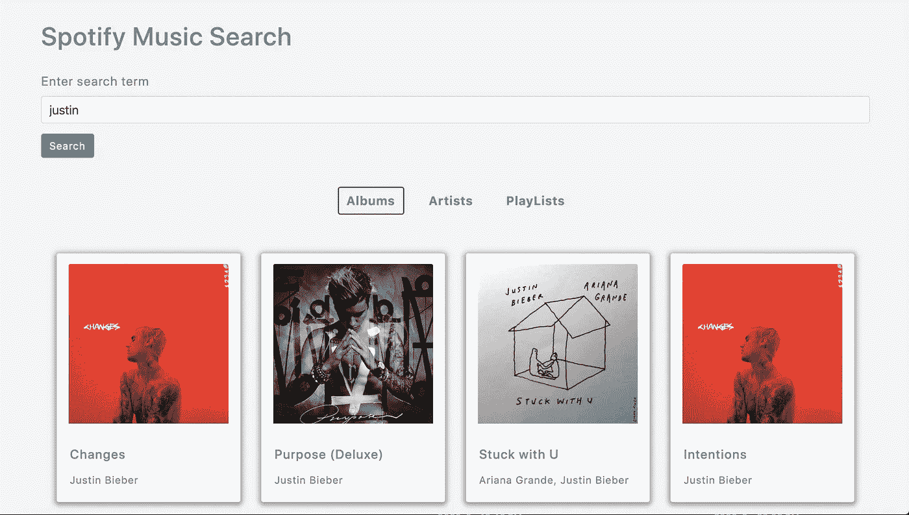

Spotify 音乐搜索应用

## 介绍

在本文中，您将使用 Spotify 音乐 API 创建一个完全响应的 Spotify 音乐搜索应用程序。

通过创建此应用程序，您将了解到

1.如何使用 Spotify API 提供 OAuth 认证
2？如何搜索专辑、艺术家和播放列表
3。用漂亮的用户界面显示细节。直接播放列表中的歌曲
5。如何在 app
6 中添加加载更多功能？如何为专辑、艺术家和播放列表添加和维护单独的加载更多功能

还有更多。

你可以在下面的视频中看到最终工作应用的现场演示

# 初始设置

使用`create-react-app`创建一个新项目

```
create-react-app spotify-music-search-app
```

项目创建完成后，删除 src 文件夹中的所有文件，并在`src`文件夹中创建`index.js`和`styles.css`文件。另外，在`src`文件夹中创建`actions`、`components`、`images`、`reducers`、`router`、`store`和`utils`文件夹。

安装必要的依赖项:

```
yarn add axios@0.19.2 bootstrap@4.5.2 lodash@4.17.19 prop-types@15.7.2 react-bootstrap@1.3.0 redux@4.0.5 react-redux@7.2.1 react-router-dom@5.2.0 redux-thunk@2.3.0
```

打开`styles.css`，将[中的内容添加到](https://github.com/myogeshchavan97/spotify-music-search-app/blob/master/src/styles.css)中。

# 创建初始页面

在`components`文件夹中新建一个文件`Header.js`，内容如下:

```
import React from 'react';
const Header = () => {
  return <h1 className="main-heading">Spotify Music Search</h1>;
};
export default Header;
```

在`components`文件夹中新建一个文件`RedirectPage.js`，内容如下:

```
import React from 'react';
const RedirectPage = () => {
 return <div>Redirect Page</div>;
};
export default RedirectPage;
```

在`components`文件夹中新建一个文件`Dashboard.js`，内容如下:

```
import React from 'react';
const Dashboard = () => {
 return <div>Dashboard Page</div>;
};
export default Dashboard;
```

在`components`文件夹中新建一个文件`Home.js`，内容如下:

```
import React from 'react';
import { connect } from 'react-redux';
import { Button } from 'react-bootstrap';
import Header from './Header';
const Home = (props) => {
  return (
    <div className="login">
      <Header />
      <Button variant="info" type="submit">
        Login to spotify
      </Button>
    </div>
  );
};
export default connect()(Home);
```

在`components`文件夹下创建一个新文件`NotFoundPage.js`，内容如下:

```
import React from 'react';
import { Link } from 'react-router-dom';
import Header from './Header';
const NotFoundPage = () => {
  return (
    <React.Fragment>
      <Header />
      Page not found. Goto <Link to="/dashboard">Home Page</Link>
    </React.Fragment>
  );
};
export default NotFoundPage;
```

在`router`文件夹中新建一个文件`AppRouter.js`，内容如下:

```
import React from 'react';
import { BrowserRouter, Route, Switch } from 'react-router-dom';
import Home from '../components/Home';
import RedirectPage from '../components/RedirectPage';
import Dashboard from '../components/Dashboard';
import NotFoundPage from '../components/NotFoundPage';
class AppRouter extends React.Component {
  render() {
    return (
      <BrowserRouter>
        <div className="main">
          <Switch>
            <Route path="/" component={Home} exact={true} />
            <Route path="/redirect" component={RedirectPage} />
            <Route path="/dashboard" component={Dashboard} />
            <Route component={NotFoundPage} />
          </Switch>
        </div>
      </BrowserRouter>
    );
  }
}
export default AppRouter;
```

在这里，我们已经使用`react-router-dom`库为各种页面设置了路由，如主页、仪表板页面、未找到页面和重定向页面。

在`reducers`文件夹中创建一个新文件`albums.js`，内容如下:

```
const albumsReducer = (state = {}, action) => {
  switch (action.type) {
    default:
      return state;
  }
};
export default albumsReducer;
```

在`reducers`文件夹下创建一个新文件`artists.js`，内容如下:

```
const artistsReducer = (state = {}, action) => {
  switch (action.type) {
    default:
      return state;
  }
};
export default artistsReducer;
```

在`reducers`文件夹下创建一个新文件`playlist.js`，内容如下:

```
const playlistReducer = (state = {}, action) => {
  switch (action.type) {
    default:
      return state;
  }
};
export default playlistReducer;
```

在所有上述减速器中，我们设置了具有默认状态的减速器。随着我们在应用程序中的进展，我们将添加更多的开关案例。

在`store`文件夹中创建一个新文件`store.js`，内容如下:

```
import { createStore, combineReducers, applyMiddleware, compose } from 'redux';
import thunk from 'redux-thunk';
import albumsReducer from '../reducers/albums';
import artistsReducer from '../reducers/artists';
import playlistReducer from '../reducers/playlist';
const composeEnhancers = window.__REDUX_DEVTOOLS_EXTENSION_COMPOSE__ || compose;const store = createStore(
  combineReducers({
    albums: albumsReducer,
    artists: artistsReducer,
    playlist: playlistReducer
  }),
  composeEnhancers(applyMiddleware(thunk))
);export default store;
```

这里，我们创建了一个 redux store，将所有的 reducers 组合在一起，这样我们就可以从`AppRouter.js`文件中定义的任何组件访问存储数据。

现在，打开`src/index.js`文件，在里面添加以下内容:

```
import React from 'react';
import ReactDOM from 'react-dom';
import { Provider } from 'react-redux';
import store from './store/store';
import AppRouter from './router/AppRouter';
import 'bootstrap/dist/css/bootstrap.min.css';
import './styles.css';ReactDOM.render(
  <Provider store={store}>
    <AppRouter />
  </Provider>,
  document.getElementById('root')
);
```

这里，我们添加了一个`Provider`组件，它将把 redux 存储传递给在`AppRouter`组件中声明的所有路由。

现在，通过从终端运行以下命令来启动 React 应用程序:

```
yarn start
```

当您在 [http://localhost:3000/](http://localhost:3000/) 访问应用程序时，您将看到以下屏幕

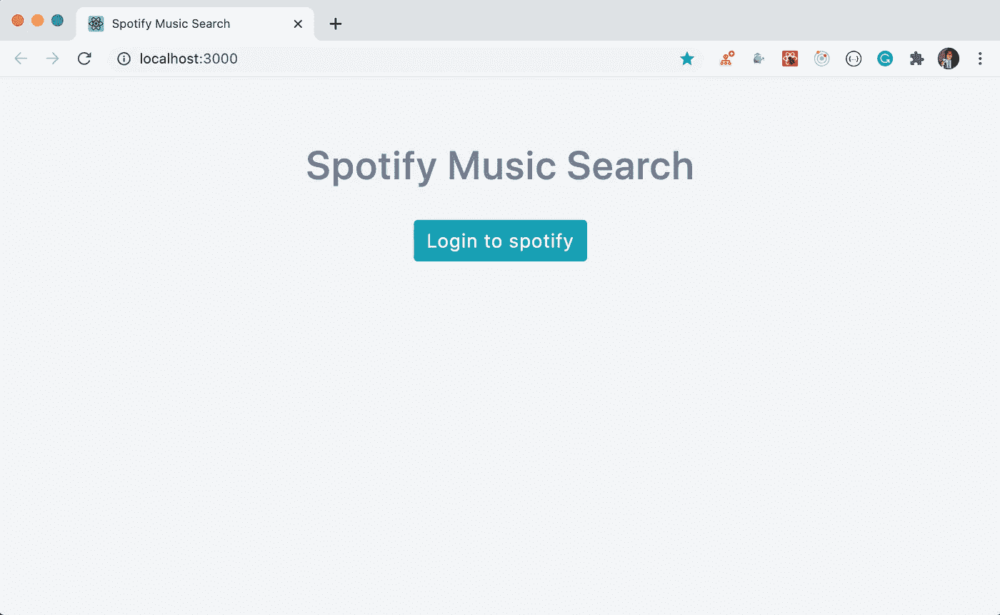

登录屏幕

# 添加登录验证功能

现在，让我们添加登录功能。要使用 App 登录 Spotify 账户，你需要三样东西:`client_id`、`authorize_url`和`redirect_url`。

为此，导航[此处](https://developer.spotify.com/dashboard/login)并登录 Spotify 开发者账户(如果您没有账户，请注册)。

登录后，您将看到一个类似于下图的页面来创建一个应用程序。

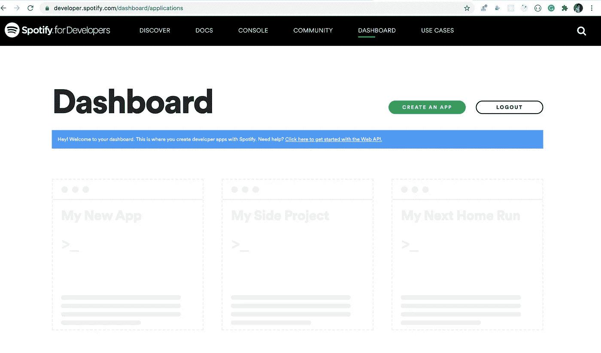

点击`CREATE AN APP`绿色按钮，输入应用名称和描述，然后点击`CREATE`按钮。

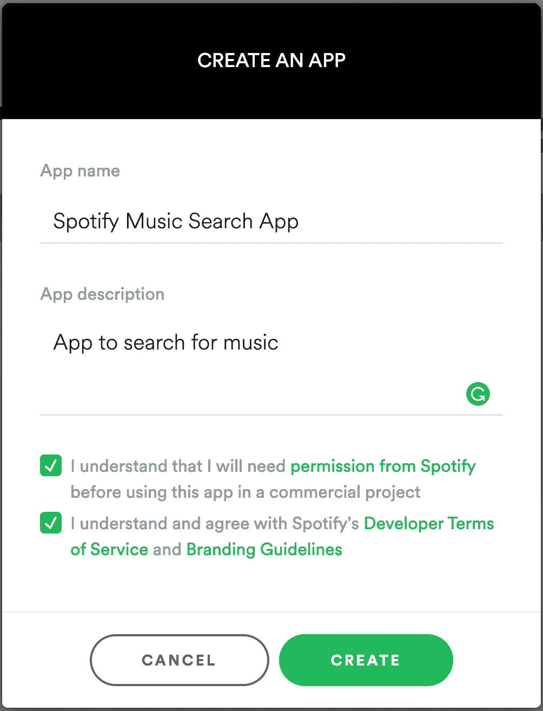

记下生成的客户端 ID。

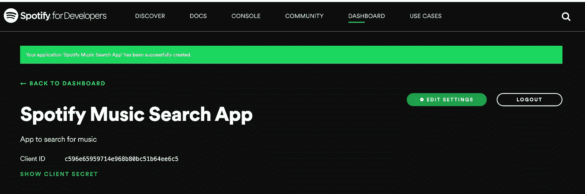

然后点击`EDIT SETTINGS`按钮。输入[http://localhost:3000/redirect](http://localhost:3000/redirect)作为`Redirect URIs`的值，点击`ADD`按钮，然后滚动一下，点击`SAVE`按钮。

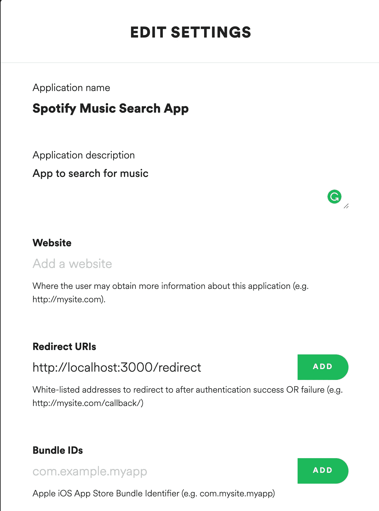

现在，在项目的根目录下创建一个名为`.env`的新文件，并在其中添加以下细节。

```
REACT_APP_CLIENT_ID=your_client_id
REACT_APP_AUTHORIZE_URL=https://accounts.spotify.com/authorize
REACT_APP_REDIRECT_URL=http://localhost:3000/redirect
```

这里，

*   `REACT_APP_AUTHORIZE_URL`将用于显示授权弹出窗口，以从您的应用程序访问您的 Spotify 帐户。
*   `REACT_APP_REDIRECT_URL`将是您希望用户在成功授权后被重定向到的 URL。
*   每个变量都以`REACT_APP_`开头，所以`Create React App`会自动将这些变量添加到`process.env`对象中，使其在应用程序中可访问。

> *确保将* `*.env*` *文件添加到* `*.gitignore*` *文件中，这样它就不会被添加到 git 中，因为它包含不应公开的私人信息*

注意，`REACT_APP_REDIRECT_URL`变量的值必须与上面显示的`Edit settings`截图中为`Redirect URIs`输入的值相匹配，否则应用程序将无法工作。

现在，打开`src/components/Home.js`并将`onClick`处理程序添加到登录按钮

```
<Button variant="info" type="submit" onClick={handleLogin}>
  Login to spotify
</Button>
```

并增加了`handleLogin`功能

```
const {
  REACT_APP_CLIENT_ID,
  REACT_APP_AUTHORIZE_URL,
  REACT_APP_REDIRECT_URL
} = process.env;const handleLogin = () => {
  window.location = `${REACT_APP_AUTHORIZE_URL}?client_id=${REACT_APP_CLIENT_ID}&redirect_uri=${REACT_APP_REDIRECT_URL}&response_type=token&show_dialog=true`;
};
```

更新后的`Home.js`文件将如下所示:

```
import React from 'react';
import { connect } from 'react-redux';
import { Button } from 'react-bootstrap';
import Header from './Header';const Home = (props) => {
  const {
    REACT_APP_CLIENT_ID,
    REACT_APP_AUTHORIZE_URL,
    REACT_APP_REDIRECT_URL
  } = process.env; const handleLogin = () => {
    window.location = `${REACT_APP_AUTHORIZE_URL}?client_id=${REACT_APP_CLIENT_ID}&redirect_uri=${REACT_APP_REDIRECT_URL}&response_type=token&show_dialog=true`;
  };
  return (
    <div className="login">
      <Header />
      <Button variant="info" type="submit" onClick={handleLogin}>
        Login to spotify
      </Button>
    </div>
  );
};export default connect()(Home);
```

现在，通过从终端运行`yarn start`命令启动您的应用程序，并验证登录功能

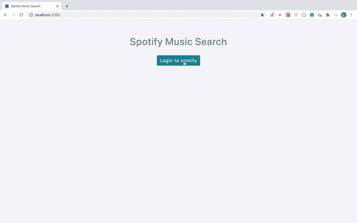

如你所见，一旦我们点击`AGREE`按钮，我们就会被重定向到`RedirectPage`组件，Spotify 会自动将`access_token`、`token_type`和`expires_in`添加到我们的重定向 URL，如下所示

```
http://localhost:3000/redirect#access_token=BQA4Y-o2kMSWjpRMD5y55f0nXLgt51kl4UAEbjNip3lIpz80uWJQJPoKPyD-CG2jjIdCjhfZKwfX5X6K7sssvoe20GJhhE7bHPaW1tictiMlkdzkWe2Pw3AnmojCy-NzVSOCj-aNtQ8ztTBYrCzRiBFGPtAn-I5g35An10&token_type=Bearer&expires_in=3600
```

*   `access_token`是一个不记名令牌，您稍后将把它添加到向 Spotify API 发出的每个请求中。
*   `expires_in`指定令牌过期时间，默认为`3600`秒，即 1 小时。之后需要重新登录。

# 添加搜索功能

现在，我们可以访问令牌，我们需要将它存储在某个地方，这样我们就可以为每个 API 请求使用它。

在`src/utils`文件夹中创建一个名为`functions.js`的新文件，内容如下:

```
import axios from 'axios';
export const getParamValues = (url) => {
  return url
    .slice(1)
    .split('&')
    .reduce((prev, curr) => {
      const [title, value] = curr.split('=');
      prev[title] = value;
      return prev;
    }, {});
};
export const setAuthHeader = () => {
  try {
    const params = JSON.parse(localStorage.getItem('params'));
    if (params) {
      axios.defaults.headers.common[
        'Authorization'
      ] = `Bearer ${params.access_token}`;
    }
  } catch (error) {
    console.log('Error setting auth', error);
  }
};
```

在这里，我们添加了:

*   `getParamValues`将`access_token`、`token_type`和`expires_in`值存储在如下所示对象中的函数:

```
{
 access_token: some_value,
 token_type: some_value,
 expires_in: some_value
}
```

*   `setAuthHeader`将`access_token`添加到每个`axios` API 请求的函数

打开`RedirectPage.js`文件，替换为以下内容:

```
import React from 'react';
import _ from 'lodash';
import { getParamValues } from '../utils/functions';
export default class RedirectPage extends React.Component {
  componentDidMount() {
    const { setExpiryTime, history, location } = this.props;
    try {
      if (_.isEmpty(location.hash)) {
        return history.push('/dashboard');
      }
      const access_token = getParamValues(location.hash);
      const expiryTime = new Date().getTime() + access_token.expires_in * 1000;
      localStorage.setItem('params', JSON.stringify(access_token));
      localStorage.setItem('expiry_time', expiryTime);
      history.push('/dashboard');
    } catch (error) {
      history.push('/');
    }
  }
  render() {
    return null;
  }
}
```

这里，我们添加了一个`componentDidMount`生命周期方法来访问 URL 参数并将它们存储在本地存储中。我们通过传递在`location.hash`中可用的 URL 值来调用`getParamValues`函数。

`expires_in`的值是以秒(`&expires_in=3600`)为单位的，所以我们将它乘以`1000`，然后加上当前时间的毫秒数，从而将其转换为毫秒数

```
const expiryTime = new Date().getTime() + access_token.expires_in * 1000;
```

因此`expiryTime`将包含令牌生成时间一小时后的毫秒时间(因为 expires_in 是 3600)。

在`utils`文件夹下新建一个文件`constants.js`，内容如下:

```
export const SET_ALBUMS = 'SET_ALBUMS';
export const ADD_ALBUMS = 'ADD_ALBUMS';
export const SET_ARTISTS = 'SET_ARTISTS';
export const ADD_ARTISTS = 'ADD_ARTISTS';
export const SET_PLAYLIST = 'SET_PLAYLIST';
export const ADD_PLAYLIST = 'ADD_PLAYLIST';
```

在`actions`文件夹中新建一个文件`result.js`，内容如下:

```
import {
  SET_ALBUMS,
  ADD_ALBUMS,
  SET_ARTISTS,
  ADD_ARTISTS,
  SET_PLAYLIST,
  ADD_PLAYLIST
} from '../utils/constants';
import { get } from '../utils/api';
export const setAlbums = (albums) => ({
  type: SET_ALBUMS,
  albums
});
export const addAlbums = (albums) => ({
  type: ADD_ALBUMS,
  albums
});
export const setArtists = (artists) => ({
  type: SET_ARTISTS,
  artists
});
export const addArtists = (artists) => ({
  type: ADD_ARTISTS,
  artists
});
export const setPlayList = (playlists) => ({
  type: SET_PLAYLIST,
  playlists
});
export const addPlaylist = (playlists) => ({
  type: ADD_PLAYLIST,
  playlists
});
export const initiateGetResult = (searchTerm) => {
  return async (dispatch) => {
    try {
      const API_URL = `https://api.spotify.com/v1/search?query=${encodeURIComponent(
        searchTerm
      )}&type=album,playlist,artist`;
      const result = await get(API_URL);
      console.log(result);
      const { albums, artists, playlists } = result;
      dispatch(setAlbums(albums));
      dispatch(setArtists(artists));
      return dispatch(setPlayList(playlists));
    } catch (error) {
      console.log('error', error);
    }
  };
};
```

在`utils`文件夹中新建一个文件`api.js`，内容如下:

```
import axios from 'axios';
import { setAuthHeader } from './functions';export const get = async (url, params) => {
  setAuthHeader();
  const result = await axios.get(url, params);
  return result.data;
};export const post = async (url, params) => {
  setAuthHeader();
  const result = await axios.post(url, params);
  return result.data;
};
```

在这个文件中，我们使用`axios`进行 API 调用，但是在此之前，我们通过调用`setAuthHeader`函数在`Authorization`头中添加了 access_token。

在`components`文件夹中新建一个文件`Loader.js`，内容如下:

```
import { useState, useEffect } from 'react';
import ReactDOM from 'react-dom';
const Loader = (props) => {
  const [node] = useState(document.createElement('div'));
  const loader = document.querySelector('#loader'); useEffect(() => {
    loader.appendChild(node).classList.add('message');
  }, [loader, node]); useEffect(() => {
    if (props.show) {
      loader.classList.remove('hide');
      document.body.classList.add('loader-open');
    } else {
      loader.classList.add('hide');
      document.body.classList.remove('loader-open');
    }
  }, [loader, props.show]); return ReactDOM.createPortal(props.children, node);
};
export default Loader;
```

在这个文件中，我们创建了一个加载器组件，它将显示一个带有背景覆盖的加载消息。我们使用了`ReactDOM.createPortal`方法来创建加载器。

要将加载程序添加到页面，打开`public/index.html`文件，在 id 为`root`的 div 之后添加加载程序 div

你的页面主体现在看起来会像这样:

```
<body>
  <noscript>You need to enable JavaScript to run this app.</noscript>
  <div id="root"></div>
  <div id="loader" class="hide"></div>
  <!--
    This HTML file is a template.
    If you open it directly in the browser, you will see an empty page.
    You can add webfonts, meta tags, or analytics to this file.
    The build step will place the bundled scripts into the <body> tag.
    To begin the development, run `npm start` or `yarn start`.
    To create a production bundle, use `npm run build` or `yarn build`.
  -->
</body>
```

默认情况下，加载程序是隐藏的，所以我们添加了`hide`类，在显示加载程序时，我们将删除`hide`类。

在`components`文件夹中创建一个新文件`SearchForm.js`，内容如下:

```
import React, { useState } from 'react';
import { Form, Button } from 'react-bootstrap';
const SearchForm = (props) => {
  const [searchTerm, setSearchTerm] = useState('');
  const [errorMsg, setErrorMsg] = useState('');
  const handleInputChange = (event) => {
    const searchTerm = event.target.value;
    setSearchTerm(searchTerm);
  };
  const handleSearch = (event) => {
    event.preventDefault();
    if (searchTerm.trim() !== '') {
      setErrorMsg('');
      props.handleSearch(searchTerm);
    } else {
      setErrorMsg('Please enter a search term.');
    }
  };
  return (
    <div>
      <Form onSubmit={handleSearch}>
        {errorMsg && <p className="errorMsg">{errorMsg}</p>}
        <Form.Group controlId="formBasicEmail">
          <Form.Label>Enter search term</Form.Label>
          <Form.Control
            type="search"
            name="searchTerm"
            value={searchTerm}
            placeholder="Search for album, artist or playlist"
            onChange={handleInputChange}
            autoComplete="off"
          />
        </Form.Group>
        <Button variant="info" type="submit">
          Search
        </Button>
      </Form>
    </div>
  );
};
export default SearchForm;
```

在这个文件中，我们添加了一个搜索框，并根据输入值更新组件的状态。

在`components`文件夹下创建一个新文件`SearchResult.js`，内容如下:

```
import React from 'react';
import _ from 'lodash';
import AlbumsList from './AlbumsList';
const SearchResult = (props) => {
  const { result, setCategory, selectedCategory } = props;
  const { albums, artists, playlist } = result;
  return (
    <React.Fragment>
      <div className="search-buttons">
        {!_.isEmpty(albums.items) && (
          <button
            className={`${
              selectedCategory === 'albums' ? 'btn active' : 'btn'
            }`}
            onClick={() => setCategory('albums')}
          >
            Albums
          </button>
        )}
        {!_.isEmpty(artists.items) && (
          <button
            className={`${
              selectedCategory === 'artists' ? 'btn active' : 'btn'
            }`}
            onClick={() => setCategory('artists')}
          >
            Artists
          </button>
        )}
        {!_.isEmpty(playlist.items) && (
          <button
            className={`${
              selectedCategory === 'playlist' ? 'btn active' : 'btn'
            }`}
            onClick={() => setCategory('playlist')}
          >
            PlayLists
          </button>
        )}
      </div>
      <div className={`${selectedCategory === 'albums' ? '' : 'hide'}`}>
        {albums && <AlbumsList albums={albums} />}
      </div>
    </React.Fragment>
  );
};
export default SearchResult;
```

在`images`文件夹中添加来自[的图片，此处为](https://github.com/myogeshchavan97/spotify-music-search-app/blob/master/src/images/music.jpeg)，名称为`music.jpeg`

如果任何专辑、艺术家或播放列表的图像不存在，我们将使用此图像作为默认图像。

在`components`文件夹中创建一个新文件`AlbumsList.js`，内容如下:

```
import React from 'react';
import { Card } from 'react-bootstrap';
import _ from 'lodash';
import music from '../images/music.jpeg';
const AlbumsList = ({ albums }) => {
  return (
    <React.Fragment>
      {Object.keys(albums).length > 0 && (
        <div className="albums">
          {albums.items.map((album, index) => {
            return (
              <React.Fragment key={index}>
                <Card style={{ width: '18rem' }}>
                  <a
                    target="_blank"
                    href={album.external_urls.spotify}
                    rel="noopener noreferrer"
                    className="card-image-link"
                  >
                    {!_.isEmpty(album.images) ? (
                      <Card.Img
                        variant="top"
                        src={album.images[0].url}
                        alt=""
                      />
                    ) : (
                      
                    )}
                  </a>
                  <Card.Body>
                    <Card.Title>{album.name}</Card.Title>
                    <Card.Text>
                      <small>
                        {album.artists.map((artist) => artist.name).join(', ')}
                      </small>
                    </Card.Text>
                  </Card.Body>
                </Card>
              </React.Fragment>
            );
          })}
        </div>
      )}
    </React.Fragment>
  );
};
export default AlbumsList;
```

现在，通过运行`yarn start`命令启动应用程序

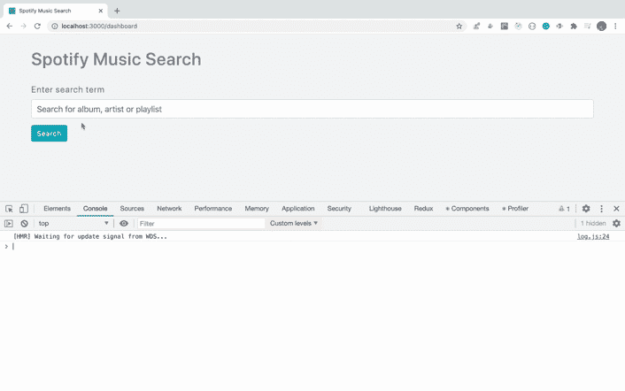

正如你所看到的，当我们搜索任何内容时，Spotify API 的响应都会显示在控制台中。所以我们成功地从 Spotify 获取了音乐数据。

# 在用户界面上显示相册

现在，我们将在 redux 存储中添加响应，这样我们就可以在 UI 上显示它。

打开`src/reducers/albums.js`文件，替换为以下内容:

```
import { SET_ALBUMS, ADD_ALBUMS } from '../utils/constants';
const albumsReducer = (state = {}, action) => {
  const { albums } = action;
  switch (action.type) {
    case SET_ALBUMS:
      return albums;
    case ADD_ALBUMS:
      return {
        ...state,
        next: albums.next,
        items: [...state.items, ...albums.items]
      };
    default:
      return state;
  }
};export default albumsReducer;
```

现在，再次运行`yarn start`命令并检查应用程序

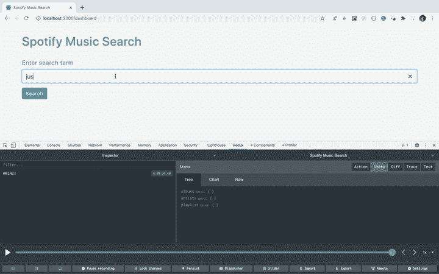

如您所见，当我们搜索时，redux store 被更新，结果显示在 UI 上。让我们来理解这个功能的代码。

在`Dashboard.js`文件中，我们调用了`handleSearch`函数中的`initiateGetResult`,当用户点击搜索按钮时会触发该函数。

如果您从`actions/result.js`文件中检查`initiateGetResult`函数，我们将通过传递搜索文本作为查询参数来对`https://api.spotify.com/v1/search` URL 进行 API 调用

```
export const initiateGetResult = (searchTerm) => {
  return async (dispatch) => {
    try {
      const API_URL = `https://api.spotify.com/v1/search?query=${encodeURIComponent(
        searchTerm
      )}&type=album,playlist,artist`;
      const result = await get(API_URL);
      console.log(result);
      const { albums, artists, playlists } = result;
      dispatch(setAlbums(albums));
      dispatch(setArtists(artists));
      return dispatch(setPlayList(playlists));
    } catch (error) {
      console.log('error', error);
    }
  };
};
```

一旦我们得到结果，我们通过从结果中提取相册来调用`setAlbums`动作生成器函数。

```
dispatch(setAlbums(albums));
```

`setAlbums`函数看起来像这样:

```
export const setAlbums = (albums) => ({
  type: SET_ALBUMS,
  albums
});
```

在这里，我们返回类型为`SET_ALBUMS`的动作。因此，一旦动作被分派，来自`reducers/albums.js`文件的`albumsReducer`被调用，对于匹配的`SET_ALBUMS`开关情况，我们从 reducer 返回传递的相册，因此 redux 存储将使用相册数据进行更新。

```
case SET_ALBUMS:
   return albums;
```

当我们使用`connect`方法将`Dashboard`组件(`Dashboard.js`)连接到 redux store 时，该组件使用`mapStateToProps`方法获取更新后的 redux store 数据，并将结果传递给`SearchResult`组件

```
const { albums, artists, playlist } = props;
const result = { albums, artists, playlist };
<SearchResult
  result={result}
  setCategory={setCategory}
  selectedCategory={selectedCategory}
/>
```

从`SearchResult`组件，数据被作为道具传递给`AlbumsList`组件

```
<div className={`${selectedCategory === 'albums' ? '' : 'hide'}`}>
  {albums && <AlbumsList albums={albums} />}
</div>
```

在`AlbumsList`组件中，我们使用 Array `map`方法遍历每个相册，并在 UI 上显示数据。

# 在用户界面上显示艺术家和播放列表

在`components`文件夹中新建一个文件`ArtistsList.js`，内容如下:

```
import React from 'react';
import { Card } from 'react-bootstrap';
import _ from 'lodash';
import music from '../images/music.jpeg';
const ArtistsList = ({ artists }) => {
  return (
    <React.Fragment>
      {Object.keys(artists).length > 0 && (
        <div className="artists">
          {artists.items.map((artist, index) => {
            return (
              <React.Fragment key={index}>
                <Card style={{ width: '18rem' }}>
                  <a
                    target="_blank"
                    href={artist.external_urls.spotify}
                    rel="noopener noreferrer"
                    className="card-image-link"
                  >
                    {!_.isEmpty(artist.images) ? (
                      <Card.Img
                        variant="top"
                        src={artist.images[0].url}
                        alt=""
                      />
                    ) : (
                      
                    )}
                  </a>
                  <Card.Body>
                    <Card.Title>{artist.name}</Card.Title>
                  </Card.Body>
                </Card>
              </React.Fragment>
            );
          })}
        </div>
      )}
    </React.Fragment>
  );
};
export default ArtistsList;
```

在`components`文件夹中新建一个文件`PlayList.js`，内容如下:

```
import React from 'react';
import { Card } from 'react-bootstrap';
import _ from 'lodash';
import music from '../images/music.jpeg';
const PlayList = ({ playlist }) => {
  return (
    <div>
      {Object.keys(playlist).length > 0 && (
        <div className="playlist">
          {playlist.items.map((item, index) => {
            return (
              <React.Fragment key={index}>
                <Card style={{ width: '18rem' }}>
                  <a
                    target="_blank"
                    href={item.external_urls.spotify}
                    rel="noopener noreferrer"
                    className="card-image-link"
                  >
                    {!_.isEmpty(item.images) ? (
                      <Card.Img variant="top" src={item.images[0].url} alt="" />
                    ) : (
                      
                    )}
                  </a>
                  <Card.Body>
                    <Card.Title>{item.name}</Card.Title>
                    <Card.Text>
                      <small>By {item.owner.display_name}</small>
                    </Card.Text>
                  </Card.Body>
                </Card>
              </React.Fragment>
            );
          })}
        </div>
      )}
    </div>
  );
};
export default PlayList;
```

现在，打开`SearchResult.js`文件，在`AlbumsList`旁边，添加`ArtistsList`和`PlayList`组件

```
<div className={`${selectedCategory === 'albums' ? '' : 'hide'}`}>
  {albums && <AlbumsList albums={albums} />}
</div>
<div className={`${selectedCategory === 'artists' ? '' : 'hide'}`}>
  {artists && <ArtistsList artists={artists} />}
</div>
<div className={`${selectedCategory === 'playlist' ? '' : 'hide'}`}>
  {playlist && <PlayList playlist={playlist} />}
</div>
```

此外，导入文件顶部的组件

```
import ArtistsList from './ArtistsList';
import PlayList from './PlayList';
```

打开`src/reducers/artists.js`文件，替换为以下内容:

```
import { SET_ARTISTS, ADD_ARTISTS } from '../utils/constants';
const artistsReducer = (state = {}, action) => {
  const { artists } = action;
  switch (action.type) {
    case SET_ARTISTS:
      return artists;
    case ADD_ARTISTS:
      return {
        ...state,
        next: artists.next,
        items: [...state.items, ...artists.items]
      };
    default:
      return state;
  }
};
export default artistsReducer;
```

打开`src/reducers/playlist.js`文件，替换为以下内容:

```
import { SET_PLAYLIST, ADD_PLAYLIST } from '../utils/constants';
const playlistReducer = (state = {}, action) => {
  const { playlists } = action;
  switch (action.type) {
    case SET_PLAYLIST:
      return playlists;
    case ADD_PLAYLIST:
      return {
        ...state,
        next: playlists.next,
        items: [...state.items, ...playlists.items]
      };
    default:
      return state;
  }
};
export default playlistReducer;
```

现在，再次运行`yarn start`命令并检查应用程序

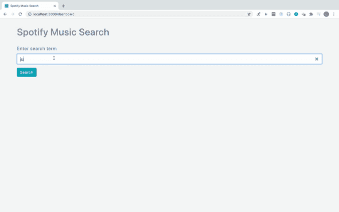

如您所见，艺术家和播放列表也填充了数据。

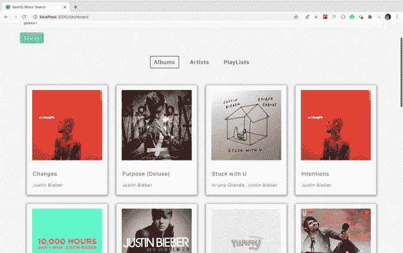

此外，如果您点击任何图像，您可以播放专辑，艺术家或播放列表中的音乐，如上所示。

# 添加加载更多功能

现在，让我们添加一个加载更多的按钮来加载更多的专辑，艺术家和播放列表的数据。

打开`SearchResult.js`文件，在结束`</React.Fragment>`标签前添加加载更多按钮

```
{!_.isEmpty(result[selectedCategory]) &&
 !_.isEmpty(result[selectedCategory].next) && (
  <div className="load-more" onClick={() => loadMore(selectedCategory)}>
    <Button variant="info" type="button">
      Load More
    </Button>
  </div>
)}
```

从 props 中析构`loadMore`函数，从`react-bootstrap`中导入`Button`

```
import { Button } from 'react-bootstrap';
const SearchResult = (props) => {
const { loadMore, result, setCategory, selectedCategory } = props;
```

打开`Dashboard.js`文件，添加`loadMore`功能

```
const loadMore = async (type) => {
  const { dispatch, albums, artists, playlist } = props;
  setIsLoading(true);
  switch (type) {
    case 'albums':
      await dispatch(initiateLoadMoreAlbums(albums.next));
      break;
    case 'artists':
      await dispatch(initiateLoadMoreArtists(artists.next));
      break;
    case 'playlist':
      await dispatch(initiateLoadMorePlaylist(playlist.next));
      break;
    default:
  }
  setIsLoading(false);
};
```

并将`loadMore`函数作为道具传递给`SearchResult`组件

```
return (
  <React.Fragment>
    <Header />
    <SearchForm handleSearch={handleSearch} />
    <Loader show={isLoading}>Loading...</Loader>
    <SearchResult
      result={result}
      loadMore={loadMore}
      setCategory={setCategory}
      selectedCategory={selectedCategory}
    />
  </React.Fragment>
);
```

打开`actions/result.js`文件，在文件末尾添加以下函数

```
export const initiateLoadMoreAlbums = (url) => {
  return async (dispatch) => {
    try {
      console.log('url', url);
      const result = await get(url);
      console.log('categoriess', result);
      return dispatch(addAlbums(result.albums));
    } catch (error) {
      console.log('error', error);
    }
  };
};
export const initiateLoadMoreArtists = (url) => {
  return async (dispatch) => {
    try {
      console.log('url', url);
      const result = await get(url);
      console.log('categoriess', result);
      return dispatch(addArtists(result.artists));
    } catch (error) {
      console.log('error', error);
    }
  };
};
export const initiateLoadMorePlaylist = (url) => {
  return async (dispatch) => {
    try {
      console.log('url', url);
      const result = await get(url);
      console.log('categoriess', result);
      return dispatch(addPlaylist(result.playlists));
    } catch (error) {
      console.log('error', error);
    }
  };
};
```

并将这些函数导入到顶部的`Dashboard.js`文件中

```
import {
  initiateGetResult,
  initiateLoadMoreAlbums,
  initiateLoadMorePlaylist,
  initiateLoadMoreArtists
} from '../actions/result';
```

现在，运行`yarn start`命令并检查加载更多功能

你可以在[这个分支](https://github.com/myogeshchavan97/spotify-music-search-app/tree/initial-code)中找到代码

# 重定向至“会话超时”登录页面

现在，我们完成了应用程序的功能。让我们添加代码来自动重定向到登录页面，并在访问令牌过期时显示会话过期的消息。这是因为，如果会话过期，那么 API 调用将失败，但是用户不会知道，直到用户打开 devtool 控制台查看错误。

如果您还记得的话，在`RedirectPage.js`文件中，我们在本地存储器中添加了`expiry_time`,代码如下

```
const expiryTime = new Date().getTime() + access_token.expires_in * 1000;
localStorage.setItem('expiry_time', expiryTime);
```

现在，让我们用它来确定何时重定向到登录页面。

打开`AppRouter.js`文件，替换为以下内容:

```
import React from 'react';
import { BrowserRouter, Route, Switch } from 'react-router-dom';
import Home from '../components/Home';
import RedirectPage from '../components/RedirectPage';
import Dashboard from '../components/Dashboard';
import NotFoundPage from '../components/NotFoundPage';
class AppRouter extends React.Component {
  state = {
    expiryTime: '0'
  };
  componentDidMount() {
    let expiryTime;
    try {
      expiryTime = JSON.parse(localStorage.getItem('expiry_time'));
    } catch (error) {
      expiryTime = '0';
    }
    this.setState({ expiryTime });
  }
  setExpiryTime = (expiryTime) => {
    this.setState({ expiryTime });
  };
  isValidSession = () => {
    const currentTime = new Date().getTime();
    const expiryTime = this.state.expiryTime;
    const isSessionValid = currentTime < expiryTime; return isSessionValid;
  };
  render() {
    return (
      <BrowserRouter>
        <div className="main">
          <Switch>
            <Route path="/" component={Home} exact={true} />
            <Route path="/redirect" component={RedirectPage} />
            <Route path="/dashboard" component={Dashboard} />
            <Route component={NotFoundPage} />
          </Switch>
        </div>
      </BrowserRouter>
    );
  }
}
export default AppRouter;
```

在这个文件中，我们添加了一个状态变量`expiryTime`，默认情况下初始化为`0`，在`componentDidMount`方法中，我们从本地存储中读取`expiry_time`值，并将其分配给状态。

我们还添加了一个`setExpiryTime`和`isValidSession`函数，这样我们就可以在其他组件中使用它。

现在，打开`RedirectPage.js`文件，在调用`history.push('/dashboard');`之前添加以下代码行

```
setExpiryTime(expiryTime);
```

但是要调用这个函数，我们需要把它作为道具传递给`RedirectPage`组件。

如果您检查`AppRouter`组件的渲染方法，它看起来像这样:

```
render() {
  return (
    <BrowserRouter>
      <div className="main">
        <Switch>
          <Route path="/" component={Home} exact={true} />
          <Route path="/redirect" component={RedirectPage} />
          <Route path="/dashboard" component={Dashboard} />
          <Route component={NotFoundPage} />
        </Switch>
      </div>
    </BrowserRouter>
  );
}
```

因此，要将`setExpiryTime`函数作为道具传递给`RedirectPage`组件，我们需要将其转换为渲染道具模式。

因此，更改下面一行代码

```
<Route path="/redirect" component={RedirectPage} />
```

对于此代码:

```
<Route
  path="/redirect"
  render={(props) => (
    <RedirectPage
      isValidSession={this.isValidSession}
      setExpiryTime={this.setExpiryTime}
      {...props}
    />
  )}
/>
```

这里，我们将`setExpiryTime`、`isValidSession`函数作为道具进行传递，同时也将自动传递给路线的道具展开，如`location`、`history`。

现在，打开`Dashboard.js`文件并析构道具，将`handleSearch`函数改为:

```
const { isValidSession, history } = props;
const handleSearch = (searchTerm) => {
  if (isValidSession()) {
    setIsLoading(true);
    props.dispatch(initiateGetResult(searchTerm)).then(() => {
      setIsLoading(false);
      setSelectedCategory('albums');
    });
  } else {
    history.push({
      pathname: '/',
      state: {
        session_expired: true
      }
    });
  }
};
```

另外，将`loadMore`功能改为:

```
const loadMore = async (type) => {
  if (isValidSession()) {
    const { dispatch, albums, artists, playlist } = props;
    setIsLoading(true);
    switch (type) {
      case 'albums':
        await dispatch(initiateLoadMoreAlbums(albums.next));
        break;
      case 'artists':
        await dispatch(initiateLoadMoreArtists(artists.next));
        break;
      case 'playlist':
        await dispatch(initiateLoadMorePlaylist(playlist.next));
        break;
      default:
    }
    setIsLoading(false);
  } else {
    history.push({
      pathname: '/',
      state: {
        session_expired: true
      }
    });
  }
};
```

将从`Dashboard`组件返回的 JSX 改为:

```
return (
  <React.Fragment>
    {isValidSession() ? (
      <div>
        <Header />
        <SearchForm handleSearch={handleSearch} />
        <Loader show={isLoading}>Loading...</Loader>
        <SearchResult
          result={result}
          loadMore={loadMore}
          setCategory={setCategory}
          selectedCategory={selectedCategory}
          isValidSession={isValidSession}
        />
      </div>
    ) : (
      <Redirect
        to={{
          pathname: '/',
          state: {
            session_expired: true
          }
        }}
      />
    )}
  </React.Fragment>
);
```

另外，导入顶部的`Redirect`组件:

```
import { Redirect } from 'react-router-dom';
```

打开`SearchResult.js`文件，在返回 JSX 之前，添加以下代码:

```
if (!isValidSession()) {
  return (
    <Redirect
      to={{
        pathname: '/',
        state: {
          session_expired: true
        }
      }}
    />
  );
}
```

同样，从 props 中析构`isValidSession`并从`react-router-dom`中添加`Redirect`组件。

现在，打开`Home.js`文件，用以下内容替换它:

```
import React from 'react';
import { Alert } from 'react-bootstrap';
import { connect } from 'react-redux';
import { Button } from 'react-bootstrap';
import Header from './Header';
import { Redirect } from 'react-router-dom';
const Home = (props) => {
  const {
    REACT_APP_CLIENT_ID,
    REACT_APP_AUTHORIZE_URL,
    REACT_APP_REDIRECT_URL
  } = process.env;
  const handleLogin = () => {
    window.location = `${REACT_APP_AUTHORIZE_URL}?client_id=${REACT_APP_CLIENT_ID}&redirect_uri=${REACT_APP_REDIRECT_URL}&response_type=token&show_dialog=true`;
  };
  const { isValidSession, location } = props;
  const { state } = location;
  const sessionExpired = state && state.session_expired; return (
    <React.Fragment>
      {isValidSession() ? (
        <Redirect to="/dashboard" />
      ) : (
        <div className="login">
          <Header />
          {sessionExpired && (
            <Alert variant="info">Session expired. Please login again.</Alert>
          )}
          <Button variant="info" type="submit" onClick={handleLogin}>
            Login to spotify
          </Button>
        </div>
      )}
    </React.Fragment>
  );
};
export default connect()(Home);
```

这里，如果会话有效，我们有代码重定向到`/dashboard`页面，否则重定向到登录页面。还显示了会话过期的消息，这样用户就会知道为什么页面被重定向到登录页面。

```
{sessionExpired && (
  <Alert variant="info">Session expired. Please login again.</Alert>
)}
```

现在，打开`AppRouter.js`文件，将`isValidSession`功能传递给`Home`和`Dashboard`路线。

```
render() {
  return (
    <BrowserRouter>
      <div className="main">
        <Switch>
          <Route
            path="/"
            exact={true}
            render={(props) => (
              <Home isValidSession={this.isValidSession} {...props} />
            )}
          />
          <Route
            path="/redirect"
            render={(props) => (
              <RedirectPage
                isValidSession={this.isValidSession}
                setExpiryTime={this.setExpiryTime}
                {...props}
              />
            )}
          />
          <Route
            path="/dashboard"
            render={(props) => (
              <Dashboard isValidSession={this.isValidSession} {...props} />
            )}
          />
          <Route component={NotFoundPage} />
        </Switch>
      </div>
    </BrowserRouter>
  );
}
```

一旦会话超时，您将看到以下屏幕。

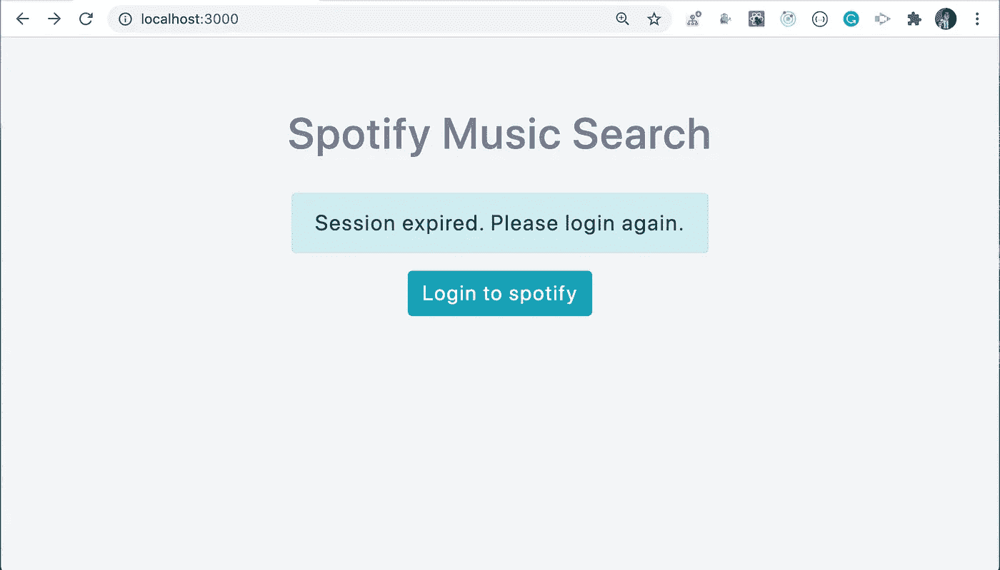

你可以在[这个分支](https://github.com/myogeshchavan97/spotify-music-search-app/tree/final-code)中找到到此为止的代码。

# 结论

现在，您已经使用 React 创建了一个 Spotify 音乐搜索应用程序。你可以在这里找到这个应用程序[的完整源代码](https://github.com/myogeshchavan97/spotify-music-search-app)

不要忘记订阅我的每周简讯，里面有惊人的技巧、窍门和文章，直接在这里的收件箱里。