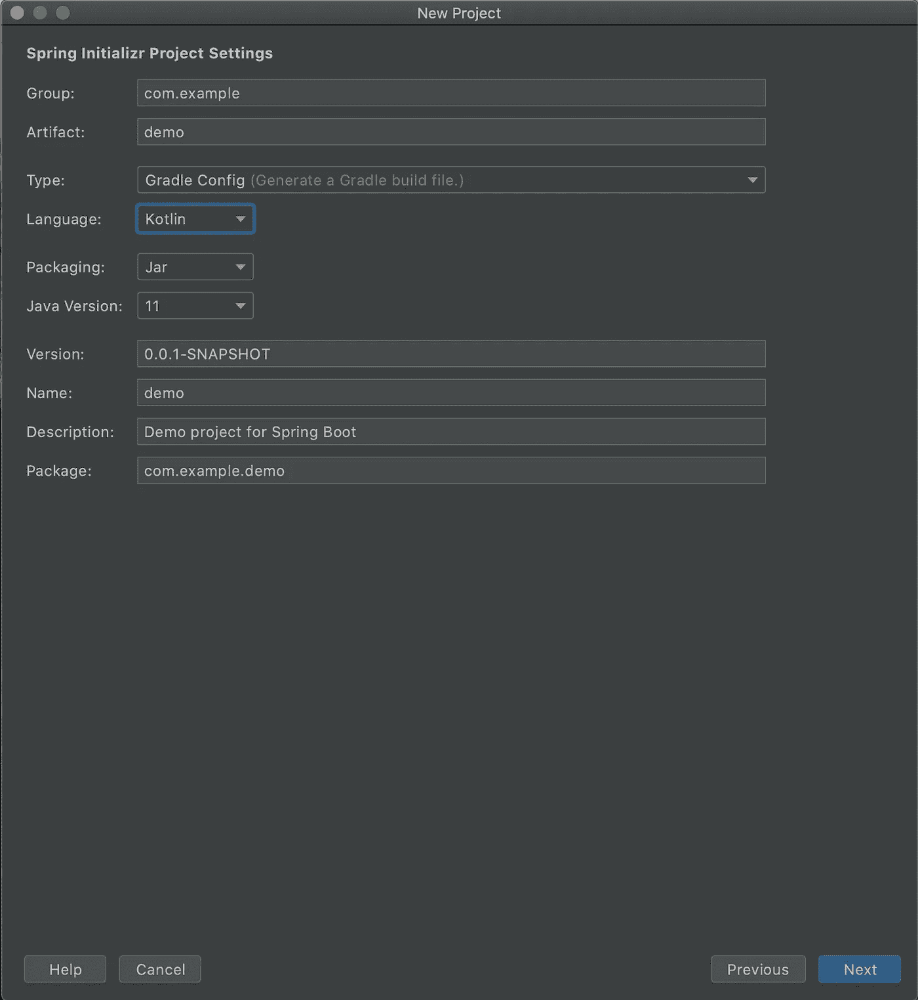

# 如何创建 Spring Boot 项目

> 原文：<https://levelup.gitconnected.com/how-to-create-a-spring-boot-project-17fa6f0696b6>

## 关于创建 Spring Boot 项目的不同方法的指南。Spring Boot 是创建 web 应用程序最流行的框架之一

Jo Szczepanska 在 [Unsplash](https://unsplash.com?utm_source=medium&utm_medium=referral) 上拍摄的照片

# 1.概观

在本教程中，我们将研究创建 Spring Boot 项目的不同方法。

# 2.在 spring.io 中使用 Spring 初始化器

我们可以通过使用 [start.spring.io](http://start.spring.io) 中的 Spring 初始化器来创建一个 Spring Boot 项目。这是在 Spring Boot 创建应用程序的最快方法，它是创建 web 应用程序最流行的框架之一。

Spring Initializer 为选择构建工具、编程语言、Spring Boot 版本和相关的依赖项提供了不同的选项。

# 2.1.构建工具

我们可以选择 Maven 或 Gradle 作为我们的构建工具。在这种情况下，我们将选择 Gradle 作为 Spring Boot 应用程序的构建工具。

# 2.2.语言

**Spring Initializer 支持 Java、Kotlin、Groovy 等多种 JVM 语言构建 web 应用**。在这种情况下，我们将选择 Kotlin 作为我们的编程语言。

# 2.3.版本

我们应该始终致力于选择最新的稳定的 Spring Boot 版本来构建我们的应用程序。**快照版本不稳定，应避免使用。标有 M 的版本表示里程碑版本**。它指的是未来的稳定版本。

在这种情况下，最新的稳定版本是 2.4.2，而 M1 应该有版本 2.5.0 (M1)。所以，版本 2.5.0 (M1)是未来的稳定发布版本。

# 2.4.项目元数据

**我们还可以定义项目元数据，包括组、工件、名称、描述、包名、打包和 Java 版本**。在这种情况下，我们将选择 Jar 作为打包选项。Java 版本将是 11。

# 2.5.属国

最后，我们必须通过选择 Add *Dependency* 按钮来定义依赖关系。在这种情况下，我们可以添加一个 Spring Web 依赖项，这足以构建一个简单的 RESTful web 应用程序。

我们可以选择 Generate 按钮并在本地下载 ZIP 存档。之后，我们可以提取项目并将其导入 IntelliJ IDEA、Spring Tools、Eclipse 等 IDE。

# 3.在 IntelliJ IDEA 中使用 Spring 初始化器

我们可以使用 IntelliJ IDEA 中的 Spring Initializer 插件创建一个 Spring Boot 项目。

# 3.1.创建新项目

首先，我们选择选项 Create New Project。

# 3.2.使用 Spring 初始化器

之后，我们选择 Spring 初始化器来生成一个 Spring Boot 应用程序。然后我们必须下载或分配一个项目 SDK 并选择 Next。

# 3.3.配置项目设置

现在，我们将根据我们的要求配置项目设置。**在这种情况下，我们选择 Gradle 作为构建工具，Kotlin 作为编程语言，Jar 作为打包选项，Java 版本 11** 。

选择下一步继续。

# 3.4.选择依赖关系

此外，我们需要定义我们的 Spring Boot 应用程序的外部依赖性。**我们可以选择 *Spring Web* 依赖，这应该足以构建一个简单的 RESTful web 应用程序**。

选择下一步继续。

# 3.5.项目名称和位置

最后，我们可以为 Spring Boot 项目和本地机器中的目录定义一个名称。在这种情况下，我们继续使用默认值。

选择 Finish，Spring Boot 项目就创建好了。

# 4.结论

在本教程中，我们讨论了创建 Spring Boot 项目的不同方法。

*最初发表于* [*阿尼班的科技博客*](https://theanirban.dev)