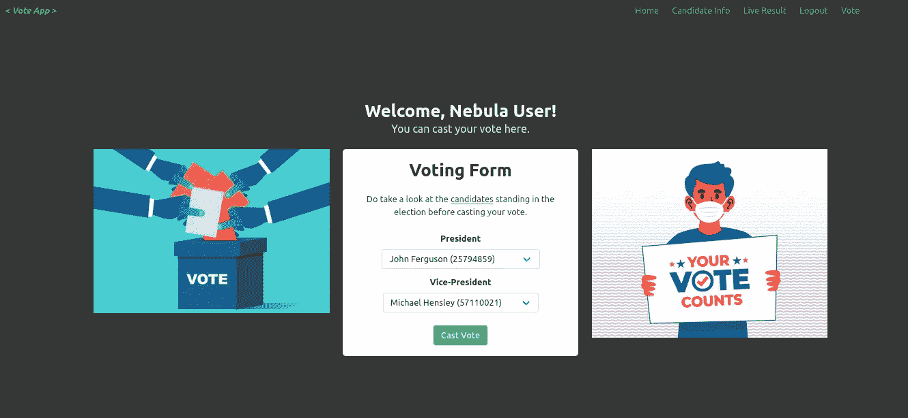

# 如何使用 Flask 创建学生会电子投票系统

> 原文：<https://levelup.gitconnected.com/how-to-create-a-student-council-e-voting-system-using-flask-322bac020447>

## Flask 项目:创建大学投票应用程序

阿诺·杰格斯在 [Unsplash](https://unsplash.com?utm_source=medium&utm_medium=referral) 上的照片

这篇文章解释了如何使用 Flask 创建一个学生会电子投票系统。

## 定义问题:

运行学生会选举的一个重要部分是选择正确的投票程序，允许全体学生参与。网上投票系统可以让你做到这一点，确保选票不被篡改，让选举更具合法性和透明度，从而增加你的投票率。在实现中，我们创建了一个电子投票系统，学生可以通过填写所需的详细信息来注册。我们只考虑目前实施的两个职位(总裁和副总裁),每个职位有 3-4 名候选人。注册学生要投票，需要登录系统。登录该系统后，将显示一个投票表格，选民可以根据自己的意愿为各自的职位分配选票。既然这是一个在线投票系统，它也应该有一个系统，可以根据投票结果直播。

# 步骤 1 —数据库创建

创建应用程序的第一步是根据应用程序的需求决定如何组织和管理数据。数据库的设计和操作是在 SQLAlchemy 的帮助下完成的。SQLAlchemy 是一个对象关系映射器(ORM)；它实现起来非常简单，可以帮助您更快地开发代码，并允许您将数据库定义为常规的 Python 对象和方法，通过将它们翻译成低级 SQL 数据库指令来获取和操作其中的数据。

我们将数据库分为三个模型(SQL 表)，UserModel —包含在平台上注册的学生的所有必要信息，CandidateModel —包含参加理事会选举的候选人的信息，VotesModel —跟踪所有已投的票。

ER 图[ *图片作者*

使用 SQLAlchemy 定义表的示例

# 步骤 2-路线和查看功能

第二步是定义路由和查看功能，这是将 URL 映射到动作、服务页面或数据的简单行为。

应用程序中定义的路线:

1.  **/register** —显示注册到平台的注册表单。一旦填写了细节并提交了表单，就会使用 SQL-Alchemy 将细节添加到 UserModel 表中。
2.  **/登录** —显示一个登录表单，学生必须输入他们注册的电子邮件和密码。提交表单后，它会检查 UserModel 表，查看输入的电子邮件和密码是否与现有记录匹配。如果有匹配的记录，则用户成功登录。
3.  **/注销** —注销当前用户，重定向到主页。
4.  **/个人资料** —显示投票表格(如果尚未投票)，允许学生为每个职位选择各自的候选人并投票。投票完成后，使用 SQL-Alchemy 将投票的详细信息存储在 VotesModel 表中。
5.  **/候选人** —显示学生会选举候选人的信息。从 CandidateModel 表中提取存储的有关候选人的信息，并显示包括候选人的详细信息、他们的批次、课程和选举议程等信息。
6.  **/candidate_register** —仅供管理员访问。显示一个注册新候选人的表单。填写并提交后，详细信息将使用 SQL-Alchemy 存储在 CandidateModel 表中。
7.  **/live_result** —一个条形图，实时显示各个职位的每个候选人的票数。
8.  **/vote/count** —仅 API 端点，此处不呈现任何内容。用于查询 db 以检查当前的投票数，并返回一个 JSON 响应，条形图使用该响应来呈现实时投票数。

应用程序中定义的路线示例

# 步骤 3—模板和用户界面

下一步是提供静态文件和呈现可重用的模板。Flask 的方法是通过一个名为 Jinja2 的模板系统，它允许用户在页面之间共享代码片段或根据上下文有条件地呈现页面。条件渲染在这个项目中经常使用，查询数据库并根据查询结果渲染模板。

现在创建一个只有 HTML 的应用程序会让它看起来很无聊和过时，这就是布尔玛的用武之地。

使用作者 的布尔玛 ***图片创建的界面示例***

布尔玛是一个免费的开源框架，它提供了现成的前端组件，您可以轻松地组合这些组件来构建响应迅速的 web 界面。我已经用布尔玛创建了我的最小应用程序。你可以通过[文档](https://bulma.io/documentation/)来了解创建网站所需的一切。超级简单。

Base.html 利用金贾和布尔玛创造了

# 第 4 步—表单

接下来，我们将创建表单并定义表单验证。该应用程序最令人厌烦和耗时的部分是创建表单，更不用说带有反馈的功能性表单了。

我创建表格的方式是:

1.  **向模板添加表格。**

向我们的 Jinja 模板添加表单

2.**向 flask route 和手动定义验证器添加表单。**

向 flask route 添加表单并定义验证器

3.**显示错误信息。**

Flask 提供了一种非常简单的方法，通过闪烁系统向用户提供反馈。闪存系统使得在请求结束时记录消息并访问下一个请求成为可能。这通常与实现此功能的布局模板结合使用。在前面的代码片段中，我已经定义了一些消息，如果我们在表单中遇到错误，需要显示这些消息。通过在模板中添加 flash 消息，我们得到了一个带有反馈的全功能表单。

将快速消息添加到模板

注册表单[ *作者图片*

# 步骤 5 —身份验证

使用“Flask-Login”进行认证管理。

[Flask-Login](https://flask-login.readthedocs.io/en/latest/) 是一个处理用户管理所有方面的库，包括用户注册、加密密码、管理会话以及保护登录墙后面的应用程序部分。还有通过Flask-SQLAlchemy 在数据库中存储用户数据的内置支持。

*   **初始化烧瓶-登录**

设置烧瓶-登录

*   **用户模型**

Flask-Login 与 Flask-SQLAlchemy 的 ORM 紧密耦合，这使得创建和验证用户变得非常容易。Flask-Login 有一个快捷方式叫做 UserMixin。UserMixin 是 Flask-Login 库提供的一个助手，用于提供管理用户所需的样板方法。

用 UserMixin 创建用户类

> 用于表示用户的类需要实现这些属性和方法:
> 
> `is_authenticated:` 如果用户通过了身份验证，即他们提供了有效的凭证，该属性应该返回`[True](https://docs.python.org/3/library/constants.html#True)`。(只有经过认证的用户才能满足`[login_required](https://flask-login.readthedocs.io/en/latest/#flask_login.login_required)`的标准。)
> 
> 如果这是一个活跃的用户，这个属性应该返回`[True](https://docs.python.org/3/library/constants.html#True)`——除了被认证之外，他们还激活了他们的帐户，没有被暂停，或者你的应用程序有拒绝帐户的任何条件。不活跃的帐户可能无法登录(当然不是被迫的)。
> 
> `is_anonymous:` 如果这是一个匿名用户，这个属性应该返回`[True](https://docs.python.org/3/library/constants.html#True)`。(实际用户应该返回`[False](https://docs.python.org/3/library/constants.html#False)`代替。)
> 
> `get_id():` 该方法必须返回唯一标识该用户的`[str](https://docs.python.org/3/library/stdtypes.html#str)`，并可用于从`[user_loader](https://flask-login.readthedocs.io/en/latest/#flask_login.LoginManager.user_loader)`回调中加载用户。注意，这个**必须是一个`[str](https://docs.python.org/3/library/stdtypes.html#str)`——如果 ID 本身是一个`[int](https://docs.python.org/3/library/functions.html#int)`或者其他类型，你需要把它转换成`[str](https://docs.python.org/3/library/stdtypes.html#str)`。**
> 
> 为了更容易实现用户类，您可以从`[UserMixin](https://flask-login.readthedocs.io/en/latest/#flask_login.UserMixin)`继承，它为所有这些属性和方法提供了默认实现。

你可以通过[文档](https://flask-login.readthedocs.io/en/latest/#how-it-works)来更好地理解它是如何工作的。

*   **保护视图**

您可以设置需要您的用户登录的视图，并且可以用`[login_required](https://flask-login.readthedocs.io/en/latest/#flask_login.login_required)`装饰器进行装饰。

使用 login_required decorator 的示例

然后，您可以使用每个模板中都有的`[current_user](https://flask-login.readthedocs.io/en/latest/#flask_login.current_user)`代理来访问登录的用户。

使用当前用户代理

用户注销时的导航条[ *作者图片*

用户登录时的导航条[ *作者图片* ]

# 第 6 步—实时结果

由于我们正在建立一个电子投票系统，这将是有意义的，我们有一个系统来查看现场投票结果。我们已经使用 Chart.js 动态呈现现场投票结果。

将 chart.js 集成到模板中

为了动态地呈现图表而不必每次都刷新页面，我们定义了一个端点( **/vote/count** )，该端点查询 db 以获得投票计数并返回一个可供图表使用的 JSON 响应。我们使用 JavaScript 中的 setInterval()方法进行后台数据获取，每 10 秒钟从端点提取一次 JSON 响应，并更新图表。

使用 setInterval()方法

条形图:候选人与票数[ *作者图片* ]

## 应用程序的运行:

工作示例[ *作者*的视频]

## **Github 链接:**

 [## GitHub-joice Joseph 3198/Flask-Voting-App at part 1

### 在 Flask 的帮助下创建了一个在线投票应用程序，并使用布尔玛创建了用户界面。- GitHub …

github.com](https://github.com/joicejoseph3198/Flask-Voting-App/tree/Part1) 

## 未来的改进:

*   使用 docker 部署这个应用程序。
*   利用 Flask-WTF 创建表单，而不是手工定义表单和验证器。
*   使用 Flask blueprints 构建一个更有组织的应用程序版本。
*   使用 Flask JWT 实现用户认证。
*   实现事件驱动的队列。

由于这是我第一次创建 Flask 应用程序，我可能犯了一些新手的错误。尽管指出来，我非常欣赏建设性的批评。

感谢您的阅读，您可以关注我在[媒体](https://medium.com/@joicejoseph)上的更多文章！我欢迎反馈和建议。你可以通过电子邮件在 joice.joseph3198@gmail.com 找到我

*更多内容请看*[***plain English . io***](https://plainenglish.io/)*。报名参加我们的* [***免费周报***](http://newsletter.plainenglish.io/) *。关注我们关于*[***Twitter***](https://twitter.com/inPlainEngHQ)*和*[***LinkedIn***](https://www.linkedin.com/company/inplainenglish/)*。查看我们的* [***社区不和谐***](https://discord.gg/GtDtUAvyhW) *加入我们的* [***人才集体***](https://inplainenglish.pallet.com/talent/welcome) *。*