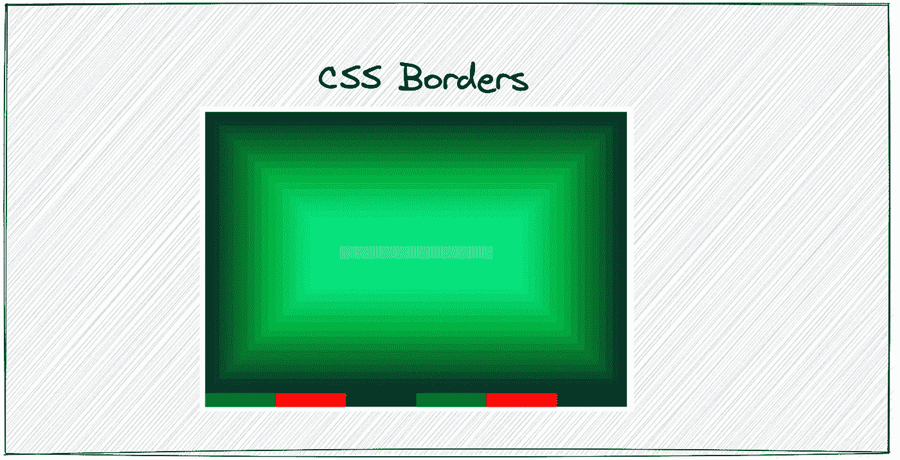
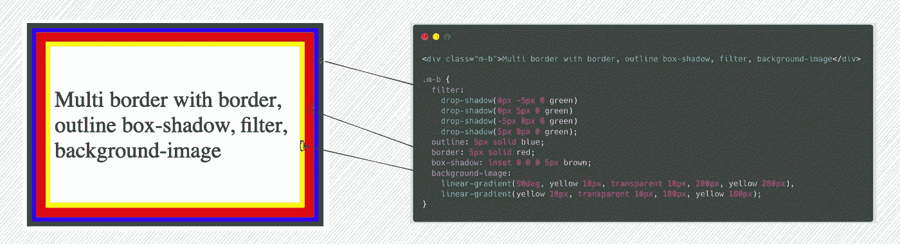
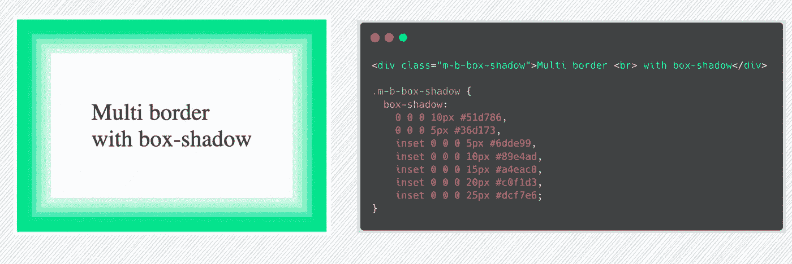
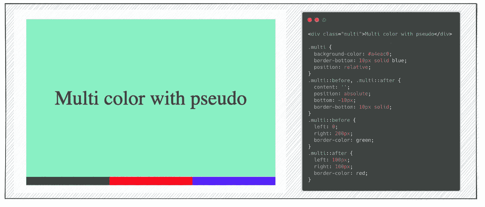
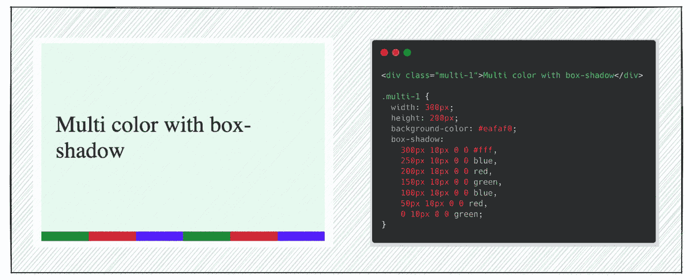
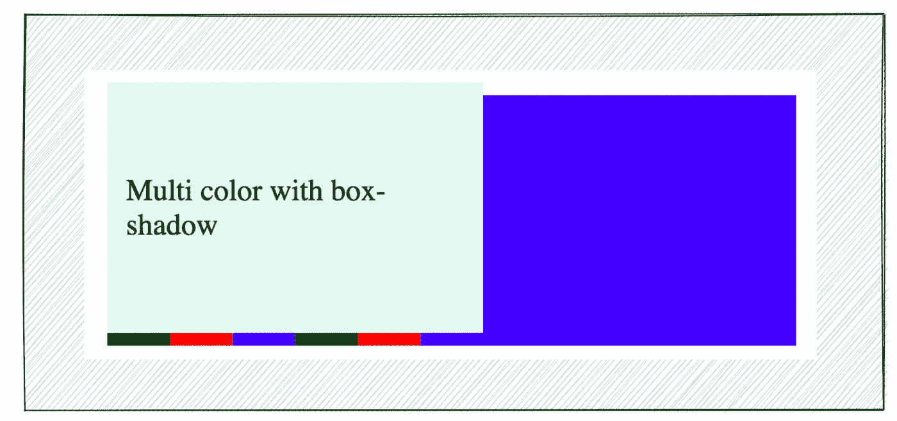
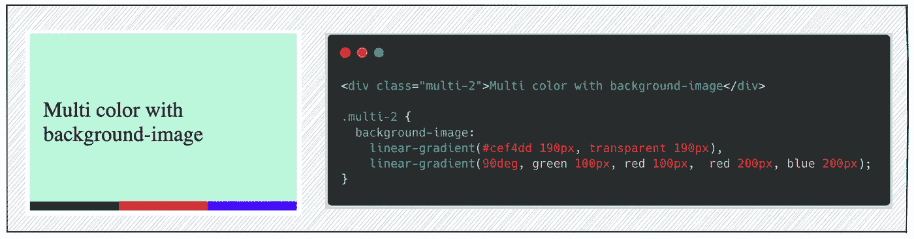

# 我的同事对边界感到惊讶

> 原文：<https://levelup.gitconnected.com/how-to-create-a-stunning-element-border-66b6f023b55c>

## 多边框和多颜色边框

# 前言

在下面的文章中，我们学习了 4 种不使用 CSS 的 border 属性来构造元素边框的方法:

 [## 如何在不使用 CSS 边框的情况下构造元素边框

### 4 实现边框效果的方法

levelup.gitconnected.com](/how-to-construct-an-element-border-without-using-csss-border-4a5c9fc7c9e6) 

如果你只需要在生产环境中构造一个元素边界，最好的方法是使用`border`属性。当我们需要构造多重边框或复杂边框时，我们可以将这些方式进行组合，以达到令人惊叹的视觉效果。

在这篇文章中，我将介绍如何建立多重边框和多种颜色的边框。

# 多重边框

要构造多个边框，在使用`outline`、`box-shadow`、`filter`、`background-image` CSS 属性时，需要注意哪个盒子可能受到影响，以及堆栈顺序。

在 Chrome 中，如果我们同时设置`outline`和`box-shadow`而不设置`inset`，那么`box-shadow`将不会工作。

对于支持多值的`filter`、`box-shadow`、`background-image`，我们可以使用该功能构建多个边框。下图显示了如何使用`box-shadow`进行构建:

通过重复`box-shadow`值，您可以构建任意多的边框。

# 多色边框

我见过一些网站页眉边框有多种颜色，看起来很酷。我们可以用伪元素`::before`和`:after`来实现

通过使用伪元素，我们可以设置多达 3 种颜色。如果我们想要更多的颜色，看起来很困难。

在前面的部分中，我们使用`box-shadow`用它的`spread-radius`值构造多个边界，它也支持其他值:

> *方框阴影:插入|偏移 x |偏移 y |模糊半径|扩散半径|颜色*

我们可以使用`offset-x`来设置不同的颜色，因此我们可以构建任意多的颜色:

`box-shadow`的第一个值用于清除`box-shadow`效应。如果没有该值，则如下图所示:

我们也可以使用`background-image`来达到同样的视觉效果:

对于支持多值的`linear-gradient`，边框颜色没有限制。

# 结论

在本文中，我们将学习如何使用`outline`、`box-shadow`、`filter`、`background-image` CSS 属性来构造多种边框，以及使用`box-shadow`、`background-image`来构造多种颜色的边框。这篇文章的所有代码都可以在 [Codepen.io](https://codepen.io/bitbug/pen/dymebVm) 中找到:

`box-shadow`在构建复杂视觉效果时非常强大，它甚至可以用来展示图片，你可以在[https://github.com/zhangxinxu/boxShadow](https://github.com/zhangxinxu/boxShadow)上查看更多。

希望这篇文章可以帮助你，你可以通过下面的文章学习更多的 CSS 实用技巧:

 [## 如何在不使用 CSS 边框的情况下构造元素边框

### 4 实现边框效果的方法

levelup.gitconnected.com](/how-to-construct-an-element-border-without-using-csss-border-4a5c9fc7c9e6)  [## 省略文本时不需要自动换行

### 断字可以满足所有情况

levelup.gitconnected.com](/you-dont-need-word-wrap-when-ellipsis-text-27307532a3c4)  [## 如何只用 CSS 实现滚动到顶部](/how-to-implement-scroll-to-top-with-only-css-ae27cb9d4678) 

### [布局使用 sticky，滚动使用](/how-to-implement-scroll-to-top-with-only-css-ae27cb9d4678)标签

levelup.gitconnected.com

 [## 不要使用变换使元素居中

### 一种更好的方法来使我们不知道大小的元素居中

levelup.gitconnected.com](/dont-use-transform-to-center-element-b378587ad1db)