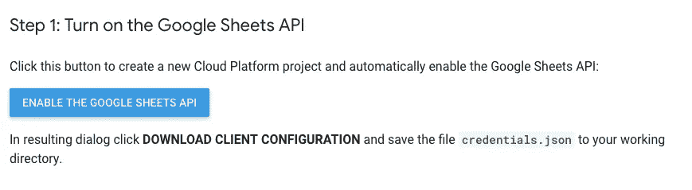

# 如何用 Node.js 和 Google Sheets 重新创建 GitHub 贡献图

> 原文：<https://levelup.gitconnected.com/how-to-create-a-tracker-like-the-github-contribution-graph-with-node-js-and-google-sheets-5e915c668c1>


今年，我决定专注于个人成长(T2)，面临两个主要挑战:学习如何编码，以及变得更好。两者都包括创造日常习惯。自一月份以来，我一直用电子表格来追踪这两方面的情况。

但是我注意到了一种我非常喜欢的格式，有几个产品都在使用这种格式:GitHub 的彩色方格网格因其贡献图而流行起来。

你可以在 [Makerlog](https://getmakerlog.com/) 上看到它用于跟踪日常任务，Puregym 用于跟踪健身课程，而 [Steph Smith](https://twitter.com/stephsmithio) 最近创建了[一个 web 应用](https://progression.page/)使用这个图表来跟踪编码课程。

我想挑战自己，看看我是否可以基于我的电子表格构建这样一个动态图表。

本教程使用 Node.js、Express、Google Sheets API 和 Bootstrap。我将介绍从从电子表格中提取数据到样式化数据的每个步骤。你可以在这里看到一个演示[，最终文件在这里](https://pixel-progress.herokuapp.com/)。你可以随意使用它们。

# 1)创建谷歌表单

我已经有一个电子表格，但创建了一个副本，以一个干净的文件开始。如果您想跳过这一部分，您可以复制一份[电子表格](https://docs.google.com/spreadsheets/d/1JnMcbcxlaX4ARvTM1ek8I4wcd4NXL_8pl3yDQvdEsKE/edit?usp=sharing)。如果你对我的编码之旅感兴趣的话，这是来自我实际的跟踪器的数据😊


如果你想跟着，让我们一起完成每一步。

首先，添加以下标题:

*   日期
*   主题
*   时间
*   水平
*   注释(可选)

我们不会从 web 应用程序的“笔记”栏中提取数据，这只是一个让您可以轻松写下任何值得记住的特定日子的地方。

然后，点击`View > Freeze > 1 Row`冻结标题。

用当年 1 月 1 日到 12 月 31 日的日期填写第一列。

在第二列和第三列中添加一些虚拟数据。例如，在“主题”栏中添加“jQuery”作为您学习的主题，在“时间”栏中添加“120”作为您学习的分钟数。这样做几天，这样我们就可以看到事情是否正常工作。

最后，在“级别”列中添加以下公式，从单元格 D2 开始:

```
=IF(C2=0,"0",IF(C2<=60,"1",IF(C2<=120,"2","3")))
```

这个公式的作用是根据“时间”栏的输入计算你的活动水平。

*   如果时间= 0，级别= 0
*   如果时间<= 60 minutes, level = 1
*   If time <= 120 minutes, level =2
*   Else level = 3

These will be helpful to allow us to pick a different colour for the squares based on how much time we dedicated to the chosen activity, in this case, learning how to code. You can edit the formula above to make the levels correspond to different times that make more sense for you and your chosen activity.

That’s it! Our spreadsheet is ready. And no, we don’t need to publish it.

# 2) Build your application

You can skip the first steps of this section if you’re comfortable with Node.js already. I want to write this part as I often struggle with tutorials that skip on some parts the author deems obvious.

If it’s your first time using Node.js, we’ll first need to install it. [到了，下载](https://nodejs.org/en/download/)安装程序并按照说明操作。

然后，打开你的终端。我强烈推荐安装 [Hyper](https://hyper.is/) ，但是这个教程绝对不需要。如果你想坚持默认的终端，在 Windows 上按 WinKey+R，然后输入`cmd`并回车，或者在 Mac 上搜索“终端”即可。

首先，让我们为我们的应用程序创建一个目录。键入`mkdir pixel-progress`并按回车键。`mkdir`代表“制作目录”,该命令创建一个名为“像素进度”的目录。

现在让我们进入这个目录。键入`cd pixel-progress` ( `cd`代表“更改目录”)并按回车键，这样我们现在就在我们的目录中了。

我们将在这个目录中创建两个文件夹。键入`mkdir public views`，将创建两个目录，分别名为“public”和“views”。稍后我会解释这些是做什么用的，但是它们基本上包含了我们应用程序的所有前端部分。

现在输入`touch app.js`——`mkdir`是创建文件夹，`touch`是创建文件，所以这个命令将创建一个名为“app.js”的文件，它将是我们应用程序的主干。

好了，我们已经有了所有必要的文件可以开始了！现在，让我们让它们更聪明一点。

Node.js 打包了一个叫做 [npm](https://www.npmjs.com/) 的东西，这基本上是一种重用其他 JavaScript 开发人员代码的超级简单的方法，所以你不必总是从头开始。

对于本教程，我们将使用一些 npm 包(即由其他优秀的开发人员编写的代码)，它们将使我们的生活变得更加轻松。

首先，让我们在目录中初始化 npm，这样我们就可以使用它了。在终端中键入`npm init`并按 enter 键。你将会看到一系列的提示，询问你一些问题，比如你的应用程序的许可，作者等等。只要不断地按 enter 键直到它停止询问任何东西，就可以让一切都保持默认状态。


然后，让我们安装我们的应用程序中需要的那些包。在终端中键入以下内容，然后按 enter 键:

```
npm install express request ejs googleapis@39 — save
```

让我们打开这个。

我们要求 npm 安装以下软件包:

*   **Express:**node . js 的框架，它将帮助我们创建动态页面
*   **请求:**这样客户端可以向服务器请求信息
*   **EJS:** 一种模板语言，它将让我们用 JavaScript 生成 HTML
*   **Google API @ 39:**Google Sheets API

前三个是基本包，通常在创建新的 Node.js 应用程序时安装。我在 [Google Sheets API 文档](https://developers.google.com/sheets/api/quickstart/nodejs)中找到了最后一个，我们将在后面更深入地回顾它。

唷。这是一个很大的开始。现在让我们开始吧。

在终端中，键入`{name of your programming text editor} .`，包括句号。如果你用 VS 代码，那就是`code .`，对于 Atom 是`atom .`，对于 Sublime 是`sublime .`—`.`告诉终端打开这个文件夹。

在`app.js`中键入以下内容并保存更改:

```
const express = require('express');const request = require('request'); app = express(); app.set('view engine', 'ejs'); app.use(express.static('public')); app.listen(process.env.PORT || 3000, function() {console.log('Server running on port 3000.');});
```

前两行告诉我们的应用程序需要我们之前安装的“Express”和“Request”模块。然后，我们创建一个新的 Express 实例，将模板引擎设置为 EJS，并告诉 Express 从我们之前创建的“公共”目录中提供静态文件。

最后，我们告诉服务器监听哪个端口。由于我们还没有部署我们的应用程序，我们将使用端口 3000，但是`process.env.PORT`位将让我们的环境(例如 Heroku)稍后为我们设置变量。

让我们通过创建第一条路线来检查一切是否正常。在`app.use`和`app.listen`部件之间，键入以下内容:

```
app.get("/", function(req, res){console.log("Hello!");}
```

现在打开你的浏览器，在地址栏输入`localhost:3000`。然后，打开你的终端。如果到目前为止一切顺利，您应该会看到“你好！”打印在终端中。

# 3)连接 Google Sheet 和 Node.js 应用程序

对于这一部分，我们将简单地遵循 [Google Sheets API 文档](https://developers.google.com/sheets/api/quickstart/nodejs)。您应该确保使用您的 Google 帐户登录。



首先，点击“启用 Google Sheets API”。在出现的弹出窗口中，单击“下载客户端配置”。将您刚刚下载的`credentials.json`文件放在您的工作目录中，与您的`app.js`文件所在的目录相同。

因为我们已经安装了这个库，所以我们可以直接将文档中提供的代码样本复制并粘贴到我们的`app.js`文件中。

首先，将这一部分添加到文件顶部其他必需包的下面:

```
const fs = require('fs');const readline = require('readline');const {google} = require('googleapis');
```

然后，用该零件替换用于测试目的的`console.log("Hello!")`线:

```
// Load client secrets from a local file.fs.readFile('credentials.json', (err, content) => {if (err) return console.log('Error loading client secret file:', err);// Authorize a client with credentials, then call the Google Sheets API.authorize(JSON.parse(content), listMajors);});/*** Prints the names and majors of students in a sample spreadsheet:* @see [https://docs.google.com/spreadsheets/d/1BxiMVs0XRA5nFMdKvBdBZjgmUUqptlbs74OgvE2upms/edit](https://docs.google.com/spreadsheets/d/1BxiMVs0XRA5nFMdKvBdBZjgmUUqptlbs74OgvE2upms/edit)* @param {google.auth.OAuth2} auth The authenticated Google OAuth client.*/function listMajors(auth) {const sheets = google.sheets({version: 'v4', auth});sheets.spreadsheets.values.get({spreadsheetId: '1BxiMVs0XRA5nFMdKvBdBZjgmUUqptlbs74OgvE2upms',range: 'Class Data!A2:E',}, (err, res) => {if (err) return console.log('The API returned an error: ' + err);const rows = res.data.values;if (rows.length) {console.log('Name, Major:');// Print columns A and E, which correspond to indices 0 and 4.rows.map((row) => {console.log(`${row[0]}, ${row[4]}`);});} else {console.log('No data found.');}});}
```

最后，将所有这些复制并粘贴到`app.listen`部分之前:

```
// If modifying these scopes, delete token.json.const SCOPES = [‘https://www.googleapis.com/auth/spreadsheets.readonly'];// The file token.json stores the user’s access and refresh tokens, and is// created automatically when the authorization flow completes for the first// time.const TOKEN_PATH = 'token.json';/*** Create an OAuth2 client with the given credentials, and then execute the* given callback function.* @param {Object} credentials The authorization client credentials.* @param {function} callback The callback to call with the authorized client.*/function authorize(credentials, callback) {const {client_secret, client_id, redirect_uris} = credentials.installed;const oAuth2Client = new google.auth.OAuth2(client_id, client_secret, redirect_uris[0]);// Check if we have previously stored a token.fs.readFile(TOKEN_PATH, (err, token) => {if (err) return getNewToken(oAuth2Client, callback);oAuth2Client.setCredentials(JSON.parse(token));callback(oAuth2Client);});}/*** Get and store new token after prompting for user authorization, and then* execute the given callback with the authorized OAuth2 client.* @param {google.auth.OAuth2} oAuth2Client The OAuth2 client to get token for.* @param {getEventsCallback} callback The callback for the authorized client.*/function getNewToken(oAuth2Client, callback) {const authUrl = oAuth2Client.generateAuthUrl({access_type: 'offline',scope: SCOPES,});console.log('Authorize this app by visiting this url:', authUrl);const rl = readline.createInterface({input: process.stdin,output: process.stdout,});rl.question('Enter the code from that page here: ', (code) => {rl.close();oAuth2Client.getToken(code, (err, token) => {if (err) return console.error('Error while trying to retrieve access token', err);oAuth2Client.setCredentials(token);// Store the token to disk for later program executionsfs.writeFile(TOKEN_PATH, JSON.stringify(token), (err) => {if (err) return console.error(err);console.log('Token stored to', TOKEN_PATH);});callback(oAuth2Client);});});}
```

通过在终端中键入`node .`来运行示例，并按照说明进行身份验证。您将获得一个授权码，您需要将它粘贴到终端上。这一步很重要，因为这是允许你的应用程序访问你的电子表格，即使你没有公开它。


现在一切都正常了，让我们修改代码，这样我们实际上使用的是我们自己的电子表格，而不是示例电子表格。

*   将该功能从`listMajors`重命名为`pullData` —小心它在`app.js`中出现两次，第一次是授权访问我们的电子表格，然后实际运行该功能。
*   用您的 ID 替换电子表格 ID—您可以在电子表格的 URL 中找到它。

current 函数只从一个区域提取数据。我们想从电子表格的几个区域中提取数据。幸运的是，Google Sheets API 提供了一个名为 [batchGet](https://developers.google.com/sheets/api/reference/rest/v4/spreadsheets.values/batchGet) 的方法，它允许我们*“从电子表格中返回一个或多个数值范围。”*

首先，我们用`sheets.spreadsheets.values.batchGet`代替`sheets.spreadsheets.values.get`来使用这个方法。

然后，用`ranges`替换`range`，并输入我们希望从电子表格中访问的范围:

```
ranges: ['2019!A2:A366', '2019!B2:B366', '2019!C2:C366', '2019!D2:D366']
```

在这种情况下，“2019”是电子表格中特定工作表的名称，您可以在底部的选项卡上看到该名称。

现在，让我们为它们创建变量，这样我们就可以访问它们并使用它们做一些事情。用以下内容替换行`const rows = res.data.values`:

```
const date = response.data.valueRanges[0].values;const topic = response.data.valueRanges[1].values;const time = response.data.valueRanges[2].values;const level = response.data.valueRanges[3].values; const data = [date, topic, time, level];
```

这创建了四个变量来存储我们的数据——日期、主题、时间和级别——然后将它们放在一个`data`数组中，这将使它们更容易操作。您可以通过控制台以与文档中所示相同的方式记录结果数据来测试一切是否正常:

```
if (data.length) {console.log('Data:');// Print columns A to C, which correspond to indices 0 to 2.data.map((row) => {console.log(`${row[0]}, ${row[1]}, ${row[2]}`);});} else {console.log('No data found.');}
```

这应该会在终端中打印出电子表格中的数据。

就是这样！我们现在连接上了，并从我们的电子表格中提取数据。现在，让我们在我们的应用程序中显示它。

# 4)在应用程序中显示来自谷歌工作表的数据

现在是时候使用我们选择的模板引擎 [EJS](https://ejs.co/) 了。模板允许我们在 HTML 标记中使用特殊的标签来插入变量或运行编程逻辑。

用以下内容替换我们刚刚用来测试一切正常的控制台日志位:

```
res.render('home', {data: data});
```

如果我们后退一步，看看我们的代码，我们告诉我们的应用程序的是*“如果有人访问/ route，运行所有访问我的 Google 电子表格的代码，并呈现主页，同时包含结果数据。”*

好的，但是我们没有主页，所以让我们创建它。在你的`views`文件夹中，创建一个`home.ejs`文件。用常规的 HTML 样板文件填充它。

在 div 中，添加以下内容:

```
<%= data %>
```

这告诉文件显示我们之前传递的数据。现在，在`localhost:3000`刷新你的浏览器页面，看看是否一切正常。在本教程开始时，您应该看到包含在电子表格中的所有占位符数据非常难看。


厉害！现在，让我们做得漂亮点。

# 5)将数据样式化，使其看起来像 GitHub 贡献图

我不擅长 CSS，也不想在这里多此一举，所以我用了[Ire Aderinokun](https://bitsofco.de/github-contribution-graph-css-grid/)的这个很酷的教程。可能有更好的方法，这不是最容易使用的方法(表格会更好)，但它确实起了作用。如果你想换一种方式，请分享！


[这里的](https://codepen.io/ire/pen/Legmwo/)是代码笔，你可以在这里复制 HTML 和 CSS。

首先，将这一部分粘贴到您的`home.ejs`文件中:

```
<div class="graph"><ul class="months"><li>Jan</li><li>Feb</li><li>Mar</li><li>Apr</li><li>May</li><li>Jun</li><li>Jul</li><li>Aug</li><li>Sep</li><li>Oct</li><li>Nov</li><li>Dec</li></ul><ul class="days"><li>Sun</li><li>Mon</li><li>Tue</li><li>Wed</li><li>Thu</li><li>Fri</li><li>Sat</li></ul><ul class="squares"><! -- added via javascript --></ul></div>
```

然后，转到你的`public`文件夹，创建一个`css`文件夹，然后在这个文件夹中创建一个`styles.css`文件来粘贴上面代码笔中提供的 CSS。

在您的`home.ejs`文件的`<head>`标签中，添加以下链接到电子表格:

```
<link href="css/styles.css" rel="stylesheet">
```

让我们忽略代码笔中的 JavaScript，因为它生成随机值来填充网格，让我们编写自己的代码。用以下内容替换`<! -- added via javascript -->`:

```
<% for (var i = 0; i < 364; i++) { %><li data-level="<%= data[3][i] %>"></li><% } %>
```

这将从我们的`data`数组中的第四个位置(我们的`app.js`文件中的`const data = [date, topic, time, level]`位)提取数据，这对应于我们之前定义的活动级别。我们从一年的第 1 天循环到第 365 天。

刷新您的页面，现在应该显示图表，以及您用占位符数据填充的日期的彩色方块！

另一个很好显示的数据是你那天实际做了什么，比如体育课或你学习的特定主题。让我们使用 Bootstrap 中的[工具提示](https://getbootstrap.com/docs/4.0/components/tooltips/)组件。

首先，让我们将它添加到我们的`home.ejs`文件的`<head>`标签中:

```
<link href="https://maxcdn.bootstrapcdn.com/bootstrap/4.0.0/css/bootstrap.min.css" rel="stylesheet”>
```

这个在文件的底部，就在结束的`</body>`标记之前:

```
<script src="https://code.jquery.com/jquery-3.4.1.min.js"></script><script src="https://cdnjs.cloudflare.com/ajax/libs/popper.js/1.12.9/umd/popper.min.js"></script><script src="https://maxcdn.bootstrapcdn.com/bootstrap/4.0.0/js/bootstrap.bundle.min.js"></script>
```

这些脚本只是 jQuery，以及基本的 Bootstrap 脚本和[popper . js](https://popper.js.org/),[工具提示文档](https://getbootstrap.com/docs/4.0/components/tooltips/)要求我们包含它们以显示工具提示。

文档还告诉我们用下面的方法初始化工具提示:

```
$(function () {$('[data-toggle="tooltip"]').tooltip()})
```

让我们在包含上述代码的`public/js`文件夹中创建一个`tooltips.js`文件，并像这样将其包含在 home.ejs 文件夹中的引导脚本之前:

```
<script src="js/tooltips.js"></script>
```

最后，让我们用电子表格中的“主题”数据实际显示悬停工具提示。

用以下内容替换`<li data-level="<%= data[3][i] %>"></li>`:

```
<li data-toggle="tooltip" data-placement="bottom" data-animation="false" delay="0" title="<%= data[1][i] %>" data-level="<%= data[3][i] %>"></li>
```

这告诉我们的应用程序:

*   悬停时切换工具提示
*   在方块底部显示工具提示
*   当它们出现时不要激活它们
*   使它们延迟 0 出现

工具提示的内容通过`<%= data[1][i] %>`提取，这是我们电子表格的第二列。

刷新你的页面，将鼠标悬停在一些彩色方块上，看看它是否有效。你可以使用 CSS 来设计工具提示的样式或者改变方块的颜色。

这一点特别允许你改变方块的颜色:

```
.squares li {background-color: #D7DDF2;}.squares li[data-level="1"] {background-color: #577AF9;}.squares li[data-level="2"] {background-color: #3960EF;}.squares li[data-level="3"] {background-color: #1B3699;}
```

例如，我决定使用蓝色的变体来代替绿色。


瞧啊。我希望你觉得这很有趣。你可以在这里找到最终文件[，在这里](https://github.com/anthilemoon/pixel-progress)找到演示[。](https://pixel-progress.herokuapp.com/)

附注:我通常不写教程，但如果你对我其他关于生产力、创造力和产品设计的文章感兴趣，你可以[订阅我的简讯](https://nesslabs.com/newsletter/)。