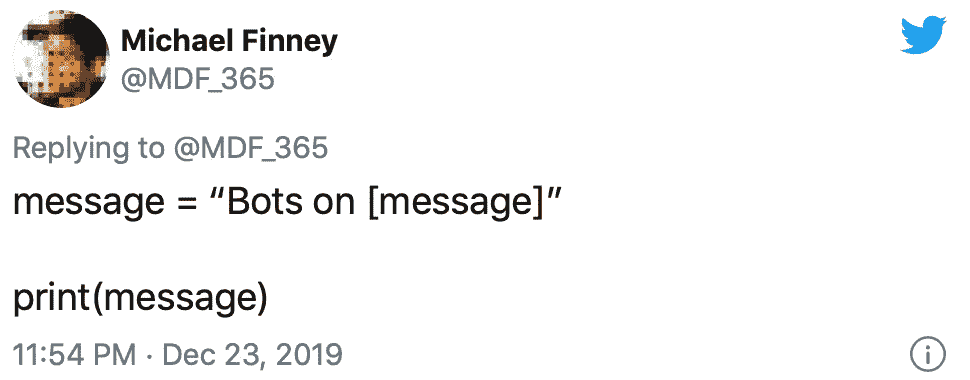

# 如何创建一个 Twitter 机器人

> 原文：<https://levelup.gitconnected.com/how-to-create-a-twitter-bot-b94d8abaabc8>

这篇文章是上一篇关于 Twitter 机器人文章的主题延续。在这一部分，我打算向你展示如何用开发者 API 快速构建一个 Twitter 机器人。您可以使用任何个人资料申请一个 Twitter 开发人员帐户，但是对于本演练，我已经创建了一个全新的帐户。

对于这个例子，我创建了一个名为新潮陈词滥调的帐户。选择或设置帐户后，打开带有 URL Developer.Twitter.com 的浏览器选项卡，申请开发人员帐户。

申请程序不是自动的，一旦你的账户被批准，你将会收到电子邮件通知。它们通常在 24 小时内获得批准。

获得批准后，返回开发者网址，点击顶部窗口右侧的“应用”标签。“制作机器人”是“爱好者”一栏的第一个选项。

您需要将一个电话号码连接到您的帐户，以接收带有确认代码的短信。

完成后，你就可以开始创建你的机器人应用程序了。(编者注:您将在这里看到开发人员门户设计的变化。Twitter 已经更新了它，我觉得最好展示新的外观和流程。)

你需要写一份关于你的应用的描述。保持简洁明了。不要可爱，也不要过分细节化。我从未拒绝过一个机器人，尽管有几次需要通过电子邮件请求进一步澄清语言。

一旦创建了 bot，您将需要生成一些 API 令牌。单击名为“密钥和令牌”的选项卡，生成您需要输入到代码中的密钥对。您将只能查看这组令牌一次，因此请确保将它们复制并粘贴到记事本应用程序或记下它们。如果您没有正确地记录它们，将需要重新生成，这并不困难，但可能是过程中令人讨厌的障碍。

当我通过更新的开发人员门户创建这个新应用程序时，它只获得了 API 密钥、API 秘密和一个新的不记名令牌，我不认为这是该流程的一部分或之前可用的。此外，应用程序权限是“只读”的。如果这种情况发生在你身上，输入你上面看到的“应用程序权限”,并将其更改为“读写”或你可能需要的任何选择。

这将允许您生成您的“访问令牌和密码”。单击名为“密钥和令牌”的选项卡，生成您需要输入到代码中的密钥对。您将只能查看这组令牌一次，因此请确保将它们复制并粘贴到记事本应用程序或记下它们。如果您没有正确地记录它们，将需要重新生成，这并不困难，但可能是过程中令人讨厌的障碍。

接下来是实际的 Python 代码，让您的脚本通过 API 触发 Twitter 帐户上的活动。在这个例子中，我使用的是 iOS 应用 Pythonista，它允许在你的 iPhone 上激活这个机器人。它的价格为 9.99 美元，非常方便，但不是构建 Twitter 机器人所必需的。本教程演示了如何使用 Twython Twitter 包激活一个机器人，但也有其他可用的。你可以在任何运行 Python 的机器上这样做，比如预装了 Python 的 Raspberry Pi。

将您的密钥和令牌粘贴到 app_key、app_secret、oauth_token 和 oauth_token_secret 代码中各自的位置。这是与 Twitter API“对话”所必需的。

下面的部分表明这个机器人正在寻找短语“vibecheck”来转发。它被设置为搜索并转发包含该短语的 5 篇帖子。如果脚本成功地找到了一篇文章，你的日志会显示“Tweet Retweeted”，如果你已经转发了一篇文章，它会显示 403 错误。

之后，进入账户，看看有哪些帖子被转发。

这是一种试验 Twitter API 的有趣方式，也是一种在 Twitter 上发现你目前可能还不知道的账户、媒体和想法的方式。当然，它很有可能涉及你可能不感兴趣甚至不同意的主题，所以如果你有特定的议程，你可能想监控它在做什么。对于一些帐户，我不断调整脚本，而对于另一些帐户，我只是跳进帐户，脱离一个职位。

希望这个演练已经帮助你启动了一个机器人，并考虑如何使用它。有许多不同的方法来应用它们，你的想象力是有限的。

**将此博客作为视频观看:**

***期待看到你创造的东西！***