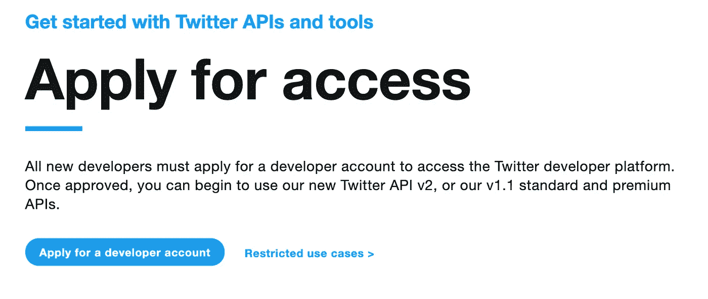

# 如何用 Python 创建一个 Twitter 机器人

> 原文：<https://levelup.gitconnected.com/how-to-create-a-twitter-bot-in-python-bf49a384905f>

## 自动化您的推文


照片由 [bongkarn thanyakij](https://www.pexels.com/@bongkarn-thanyakij-683719?utm_content=attributionCopyText&utm_medium=referral&utm_source=pexels) 从 [Pexels](https://www.pexels.com/photo/desktop-computer-beside-analog-camera-3759101/?utm_content=attributionCopyText&utm_medium=referral&utm_source=pexels) 和 [Brett Jordan](https://unsplash.com/@brett_jordan?utm_source=unsplash&utm_medium=referral&utm_content=creditCopyText) 在 [Unsplash](https://unsplash.com/s/photos/twitter?utm_source=unsplash&utm_medium=referral&utm_content=creditCopyText) 上拍摄

为了推广我的 medium 文章，有时我会把它们发布在我的 LinkedIn 和 Twitter 账户上。因为我一遍又一遍地重复同样的任务，所以我想自动化这个任务。所以我写了一个机器人，用 GitHub Actions 和 Python 来代表我更新我的 Twitter。这节省了我的时间，而且我也不用担心更新我的推特。

# 设置

你需要安装 [Python](https://www.python.org/downloads/) 并从 [GitHub](https://github.com/lifeparticle/twitter-tweet-bot) 下载一个 git 库。我使用 macOS 进行设置。现在按照这三个步骤来创建 Twitter 机器人。

## 第一步

如果你没有 Twitter 开发者账户，那么从 Twitter 的开发者[网站](https://developer.twitter.com/en/apply-for-access)申请。



申请 Twitter 开发者平台

## 第二步

一旦你有权限，访问 Twitter 开发者控制台[来创建一个应用程序。它将提示身份验证的详细信息。确保将`CONSUMER_KEY`、`CONSUMER_SECRET`、`ACCESS_TOKEN`和`ACCESS_TOKEN_SECRET`保存在某个地方。我们需要这些认证凭证来从我们的 Python 脚本进行 API 调用。不要太担心，因为您总是可以重新生成身份验证凭证。这里，我创建了一个具有 V1 和 V2 访问权限的应用程序。之后，点击设置图标，并确保其具有读写权限。](https://developer.twitter.com/en/portal/projects-and-apps)


初始设置

初始设置完成后，您可以单击钥匙图标来重新生成身份验证凭据。确保您的访问令牌& secret 具有读写权限。


重新生成身份验证凭据

## 第三步

现在我们将使用 [Tweepy](https://pypi.org/project/tweepy/) Python 库来访问 Twitter API。在您的终端中键入以下命令。

```
pip install tweepy
```

如果您使用 GitHub 进行设置，那么您需要添加加密的秘密。点击此[链接](https://docs.github.com/en/actions/reference/encrypted-secrets)添加您自己的。


仓库机密

这里是 [GitHub](https://github.com/lifeparticle/twitter-tweet-bot/blob/main/build_json.py) 上到 Python 文件 **build_json.py** 的链接。该文件比较来自介质的 **blog_links.json** 和[**RSS feed**](https://help.medium.com/hc/en-us/articles/214874118-Using-RSS-feeds-of-profiles-and-publications)**数据。如果有任何新的数据，它会在 Twitter 上发布。最后，它用新数据替换了 **blog_links.json** 文件。**

**build_json.py**

**让我们把重点放在`tweet(api, data)`函数上。这个函数有两个参数。**

1.  **认证对象`api`。**
2.  **推文数据`data`。**

**这里我使用 RSS 数据中的类别作为标签。最后，我使用 Tweepy 库发布了一条 tweet，带有帖子标题、标签和帖子 URL。**

# **包裹**

**使用这种方法，我不用担心在 Twitter 上发布，我可以更专注于解决问题和写作等重要任务。编码快乐！**

**如果您想了解更多关于 Python 脚本及其工作原理的信息，请阅读以下两篇文章。**

**[](/how-i-built-a-self-updating-blog-catalog-using-a-bot-part-1-bd7399ba1e4f) [## 我如何使用机器人构建自我更新的博客目录——第 1 部分

### 使用 GitHub 操作和 Python

levelup.gitconnected.com](/how-i-built-a-self-updating-blog-catalog-using-a-bot-part-1-bd7399ba1e4f) [](/how-i-built-a-self-updating-blog-catalog-using-a-bot-part-2-a67968be5f42) [## 我如何使用机器人构建自我更新的博客目录——第 2 部分

### 改进比较功能

levelup.gitconnected.com](/how-i-built-a-self-updating-blog-catalog-using-a-bot-part-2-a67968be5f42)**