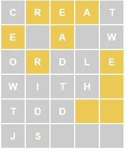
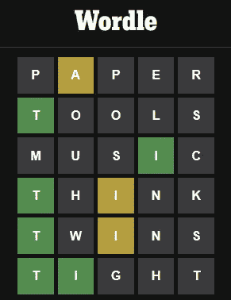
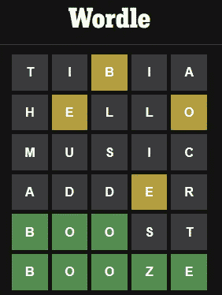

# 如何在 Javascript 中用 TDD 创建一个 Wordle

> 原文：<https://levelup.gitconnected.com/how-to-create-a-wordle-with-tdd-in-javascript-926d7947bd90>

## 我们不断练习这个惊人的形并学习。可以按照步骤来！



> *TL；DR: Javascript 对 TDD 来说也很棒*

在 2022 年 1 月的 Wordle rush 期间，我写了一篇文章描述[如何使用 PHP](https://blog.devgenius.io/how-to-develop-a-wordle-game-using-tdd-in-25-minutes-2157c93dda9f) 创建一个带有 TDD 的 Wordle。

[](https://blog.devgenius.io/how-to-develop-a-wordle-game-using-tdd-in-25-minutes-2157c93dda9f) [## 如何在 25 分钟内用 TDD 开发一个 Wordle 游戏

### 使用 TDD 开发一个完整的 Wordle 游戏非常容易

blog.devgenius.io](https://blog.devgenius.io/how-to-develop-a-wordle-game-using-tdd-in-25-minutes-2157c93dda9f) 

几个月后，我转录了用 Codex 人工智能创建的一个[单词的 UI 版本。](/step-by-step-wordle-creation-with-codex-ai-fcf243212594)

[](/step-by-step-wordle-creation-with-codex-ai-fcf243212594) [## 一步一步用 Codex 人工智能创造世界

### 我抄写指令，用自然语言创造一个工作词

levelup.gitconnected.com](/step-by-step-wordle-creation-with-codex-ai-fcf243212594) 

我将结合两个世界作为一个半人马来编程。

我还将比较不同语言版本的流程和输出。

这是 Javascript 版本。

# 建立

像往常一样，我们将专注于游戏业务逻辑，知道我们可以用[自然语言命令](/step-by-step-wordle-creation-with-codex-ai-fcf243212594)构建用户界面。

在本文中，我将使用一个带有 [Jest](https://jestjs.io/) 的 [repl.it](https://replit.com/@mcsee/Wordle-TDD) 。

Javascript 有许多单元测试框架。

你喜欢什么就用什么。

让我们开始吧…

# 定义一个词

遵循与上一篇文章相同的原则，我们将从定义一个单词开始。

Wordle 中最小的信息量是一个词。

我们可以争辩说*字母*更小，但是所有需要的字母协议都已经定义好了(我们可能错了)。

一个字不是一个*char⑤*。

一个字不是一个*数组*。

一言不合*成串*。

这是一个常见的错误，也是一个[双射违例](https://codeburst.io/the-one-and-only-software-design-principle-5328420712af)。

一个*单词*和一个*字符串*有不同的职责，尽管它们可能会相交。

> *将(偶然的)实现细节与(* [*【本质的】*](https://medium.com/dev-genius/no-silver-bullet-65cba1775f9b) *)行为混为一谈是一种普遍的错误。*

所以我们需要定义一下*什么是词*。

Wordle 中的一个单词是一个*有效的* 5 个字母的单词。

让我们从我们的快乐之路开始:

```
test("test01ValidWordLettersAreValid", async function() {
  const word = new Word('valid');
  expect(['v', 'a', 'l', 'i', 'd']).toStrictEqual(word.letters());
});
```

我们断言对‘有效’中字母的提示会返回一个字母数组。

这是结果:

```
Message: letters from word must be 'valid'
Stack Trace:
ReferenceError: Word is not defined
    at Object.<anonymous> (/home/runner/Wordle-TDD/_test_runnertest_suite.js:6:18)
    at Promise.then.completed (/home/runner/Wordle-TDD/node_modules/jest-circus/build/utils.js:333:28)
```

这很好，因为我们还没有定义单词是什么。

# 通知；注意

*   这是一个 TDD 模式。
*   甚至在它们存在之前，我们就根据它们的**行为**给它们命名。
*   *一词*类尚未定义。
*   我们的词的第一个琐碎的责任是回复它的字母。
*   这不是[吸气剂](https://blog.devgenius.io/code-smell-68-getters-68571a0f7fa8)。每个单词都必须符合它的字母。
*   我们不关心信件分类。这将是一个**过早优化**和镀金的场景。
*   我们从一个简单的例子开始。没有重复。
*   我们还没有弄乱单词验证(单词可能是 XXXXX)。
*   我们可以从一个更简单的验证单词创建的测试开始。这将违反总是需要断言的测试结构。
*   期望值应该始终是断言中的第一个值。

# 创造一个词

我们需要用 letters()函数创建一个单词。

```
class Word {
  letters() {
    return ['v', 'a', 'l', 'i', 'd'];
  }  
}
```

# 通知；注意

*   我们还不需要构造函数。
*   我们硬编码字母函数，因为这是迄今为止最简单的可能解决方案。
*   假装直到我们成功。

我们运行了所有的测试(只有一个)，我们都没问题。

```
✅  test01ValidWordLettersAreValid All tests have passed 1/1
```

# 几个字母

让我们编写另一个测试:

```
test("test02FewWordLettersShouldRaiseException", async function() {
  expect(() => { 
    new Word('vali');                 
               }).toThrow(Error);
});
```

测试不出所料…

```
❌  test02FewWordLettersShouldRaiseException
Stack Trace:
Error: expect(received).toThrow(expected)Expected constructor: ErrorReceived function did not throw
    at Object.toThrow (/home/runner/Wordle-TDD/_test_runnertest_suite.js:10:23)✅  test01ValidWordLettersAreValid 1/2 passed, see errors above
```

# 通知；注意

*   第一次测试通过了
*   第二个测试预计会抛出一个异常。但事实并非如此。
*   我们只是声明一个通用的异常会被抛出。
*   我们只是提出一个一般性的错误。
*   创建特殊异常是一种[代码味道](https://blog.devgenius.io/code-smell-26-exceptions-polluting-9246aca40234)污染名称空间。(除非我们抓住它，但这不是现在发生的事情)。

# 改变当前的实现

我们需要更改我们的实现来使 test02 通过(还有 test01)。

```
class Word {
  constructor(word) {
    if (word.length < 5)
      throw new Error('Too few letters. Should be 5');
  }
  letters() {
      return ['v', 'a', 'l', 'i', 'd'];
  }  
}
```

测试通过了。

```
✅  test02FewWordLettersShouldRaiseException✅  test01ValidWordLettersAreValid All tests have passed 2/2
```

# 通知；注意

*   我们还没有使用构造函数参数来设置实际的字母。
*   我们只是检查几封信。不会太多，因为我们还没有覆盖测试。
*   TDD 要求全覆盖。在没有测试的情况下添加另一个检查是违反技术的。

# 检查太多信件

让我们检查太多

```
test("test03TooManyWordLettersShouldRaiseException", async function() {
  expect(() => { 
    new Word('toolong');                 
               }).toThrow(Error);});
```

我们运行它们:

```
❌  test03TooManyWordLettersShouldRaiseException
Stack Trace:
Error: expect(received).toThrow(expected)Expected constructor: ErrorReceived function did not throw
    at Object.toThrow (/home/runner/Wordle-TDD/_test_runnertest_suite.js:10:23)✅  test02FewWordLettersShouldRaiseException✅  test01ValidWordLettersAreValid 2/3 passed, see errors above
```

我们添加了验证:

```
class Word {
  constructor(letters) {
    if (letters.length < 5)
      throw new Error('Too few letters. Should be 5');
    if (letters.length > 5)
      throw new Error('Too many letters. Should be 5');
  }
  letters() {
      return ['v', 'a', 'l', 'i', 'd'];
  }  
}
```

所有测试都通过了。

```
All tests have passed 3/3
```

# 重构(或不重构)

我们现在可以进行(可选的)重构，并更改函数以断言一个范围而不是两个边界。我们决定保留这种方式，因为它更具有声明性。

我们还可以按照[僵尸方法](https://blog.devgenius.io/how-i-survived-the-zombie-apocalypse-19905db22043)添加一个零单词测试。

让我们开始吧。

```
test("test04EmptyLettersShouldRaiseException", async function() {
  expect(() => { 
    new Word('');                 
               }).toThrow(Error);});✅  test04EmptyLettersShouldRaiseException✅  test03TooManyWordLettersShouldRaiseException✅  test02FewWordLettersShouldRaiseException✅  test01ValidWordLettersAreValid
```

测试通过并不奇怪，因为我们已经有了一个覆盖这个场景的测试。

由于这个测试没有增加任何价值，我们应该取消它。

# 有效信函

现在让我们检查一下什么是有效的字母:

```
test("test05InvalidLettersShouldRaiseException", async function() {
   expect(() => { 
    new Word('vali*');                 
               }).toThrow(Error);});
```

…测试中断，因为没有产生断言。

```
❌  test05InvalidLettersShouldRaiseException
Stack Trace:
Error: expect(received).toThrow(expected)Expected constructor: ErrorReceived function did not throw
```

我们需要更正代码…

```
class Word {
  constructor(word) {
    if (word.length < 5)
      throw new Error('Too few letters. Should be 5');
    if (word.length > 5)
      throw new Error('Too many letters. Should be 5');
    if (word.indexOf('*') > -1) 
      throw new Error('Word has invalid letters');
  }
}
```

并且所有测试都通过了，因为我们显然是硬编码的。

```
All tests have passed 5/5
```

# 通知；注意

*   我们将星号硬编码为唯一的无效字符(据我们所知)。
*   我们可以将校验码*放在前面验证的*之前，或者*放在*之后。—除非我们有无效的大小写(包含无效字符和无效长度),否则我们无法假设预期的行为。

# 更无效

让我们添加更多的无效字母并更正代码。

```
test("test06PointShouldRaiseException", async function() {
   expect(() => { 
    new Word('val.d');                 
               }).toThrow(Error);});// Solution constructor(word) {
    if (word.indexOf('*') > -1) 
      throw new Error('Word has invalid letters');
    if (word.indexOf('.') > -1) 
      throw new Error('Word has invalid letters');
}
```

# 通知；注意

*   我们还没有写一个更通用的函数，因为我们不能同时修正测试和重构(技术不允许我们这么做)。

# 重构

所有测试都没问题。

我们可以重构。

我们替换最后两句话。

```
class Word {
  constructor(word) {
    if (word.length < 5)
      throw new Error('Too few letters. Should be 5');
    if (word.length > 5)
      throw new Error('Too many letters. Should be 5');
    // Refactor  
    if (!word.match(/^[a-z]+$/i)) 
      throw new Error('word has invalid letters');
    //   
}
```

# 通知；注意

*   只有当我们不同时改变测试时，我们才能重构。
*   断言只检查大写字母。因为我们到现在都在处理这些例子。
*   我们尽可能推迟设计决策。
*   我们定义了一个基于英文字母的正则表达式。我们很确定它不接受西班牙语、德语等。

作为检查点，从现在开始我们只有五个字母单词。

让我们断言*字母()*函数。

我们把它硬编码了。

TDD 开放了很多路径。

在我们开新的之前，我们需要记录所有的。

# 比较单词

我们需要比较单词

```
test("test07TwoWordsAreNotTheSame", async function() {
    const firstWord = new Word('valid');
    const secondWord = new Word('happy');
    expect(firstWord).not.toStrictEqual(secondWord);
});test("test08TwoWordsAreTheSame", async function() {
    const firstWord = new Word('valid');
    const secondWord = new Word('valid');
    expect(firstWord).toStrictEqual(secondWord);
});
```

测试失败。

让我们使用发送给他们的参数。

```
class Word {
  constructor(word) { 
    // ...
    this._word = word;
  }
  letters() {
      return ['v', 'a', 'l', 'i', 'd'];
  }  
}✅  test08TwoWordsAreTheSame✅  test07TwoWordsAreNotTheSame✅  test06PointShouldRaiseException✅  test05InvalidLettersShouldRaiseException✅  test04EmptyLettersShouldRaiseException✅  test03TooManyWordLettersShouldRaiseException✅  test02FewWordLettersShouldRaiseException✅  test01ValidWordLettersAreValid All tests have passed 8/8
```

# 通知；注意

*   我们存储字母，这足以进行对象比较(这可能取决于语言)。
*   letters()函数仍然是硬编码的

# 更多单词

我们添加了一个不同的单词用于字母比较。

记住字母()一直到现在都是硬编码的。

```
test("test09LettersForGrassWord", async function() {
  const grassWord = new Word('grass'); 
  expect(['g','r','a','s','s']).toStrictEqual(grassWord.letters());
});
```

测试不出所料地失败了。

```
❌  test09LettersForGrassWord
Stack Trace:
Error: expect(received).toStrictEqual(expected) // deep equality- Expected  - 4
+ Received  + 4 Array [
-   "v",
+   "g",
+   "r",
    "a",
-   "l",
-   "i",
-   "d",
+   "s",
+   "s",
  ]
    at Object.toStrictEqual (/home/runner/Wordle-TDD/_test_runnertest_suite.js:9:37)
```

# 通知；注意

*   检查相等/不相等而不是 assertTrue()是非常重要的，因为许多 ide 打开了一个基于对象的比较工具。
*   这是使用 ide 而不使用文本编辑器的另一个原因。

让我们更改 letters()函数，因为我们一直在伪造它。

```
class Word {
  letters() {
      return this._word.split("");
  }  
}
```

# 比较不同的案例

我们需要确保比较不区分大小写。

```
test("test10ComparisonIsCaseInsensitve", async function() {
    const firstWord = new Word('valid');
    const secondWord = new Word('VALID');
    expect(firstWord).toStrictEqual(secondWord); 
});
```

测试失败。

我们需要做出决定。

我们决定我们所有的域名都是小写的。

尽管用户界面有大写字母，我们也不允许大写字母。

我们不会进行魔法转换。

我们改变测试来捕捉无效的大写字母并修正它们。

```
test("test10NoUppercaseAreAllowed", async function() {
   expect(() => { 
    new Word('vAliD');                 
               }).toThrow(Error);
});class Word {
  constructor(word) {
    // We remove the /i modifier on the regular expression  
    if (!word.match(/^[a-z]+$/)) 
      throw new Error('word has invalid letters');   
  }
```

# 英语词典

我们的单词和英语单词一模一样。还是没有？

让我们试试一个非英语单词

```
test("test11XXXXIsnotAValidWord", async function() {
  expect(() => { 
    new Word('XXXXX');                 
               }).toThrow(Error);
});
```

这个测试失败了。

我们没有捕捉无效的英语 5 个字母的单词。

# 通知；注意

*   我们需要做出决定。根据我们的[双射](https://codeburst.io/the-one-and-only-software-design-principle-5328420712af)，有一个外部字典断言有效单词。
*   我们可以在造词时用字典来验证。但是我们希望字典存储有效的单词。没有条件。
*   这是一个先有蛋还是先有鸡的问题。
*   我们决定处理字典中的无效单词，而不是单词。
*   我们取消测试。
*   一会儿我们会找到更好的方法。

# 沃尔多游戏

让我们来创造这个游戏。

我们开始谈论一个不存在的游戏。

```
test("test11EmptyGameHasNoWinner", async function() {
  const game = new Game()
  expect(false).toStrictEqual(game.hasWon());
});
```

测试失败。

我们需要创建类和函数。

# 创建游戏对象

```
class Game {
  hasWon() {
      return false;
  }  
}
```

# 尝试的单词

我们实施话语尝试。

也是最简单的解决方案。

一如既往的硬编码。

```
test("test12EmptyGameWordsAttempted", async function() {
  const game = new Game()
  expect([]).toStrictEqual(game.wordsAttempted());
});class Game {
  wordsAttempted() {
    return [];
  }
}✅  test12EmptyGameWordsAttempted
...
  All tests have passed 12/12
```

# 开始猜测

```
test("test13TryOneWordAndRecordIt", async function() {
  var game = new Game();
  game.addAttempt(new Word('loser'));
  expect([new Word('loser')]).toStrictEqual(game.wordsAttempted());   
});class Game {
  constructor() {
    this._attempts = [];
  }
  hasWon() {
      return false;
  }
  wordsAttempted() {
    return this._attempts;
  }
  addAttempt(word) {
    this._attempts.push(word);    
  }
}
```

# 通知；注意

*   我们在本地存储尝试，添加尝试，并更改 wordsAttempted() real 实现。

# 已经输了

我们可以实现 hasLost()，如果它错过了 6 次尝试。

通常使用最简单的实现。

```
test("test14TryOneWordAndDontLooseYet", async function() {
  const game = new Game();
  game.addAttempt(new Word('loser'));
  expect(false).toStrictEqual(game.hasLost());   
});class Game { 
  hasLost() {
      return false;
  }
}
```

# 通知；注意

*   随着模型的增长，我们正在学习规则。

# 我们输了比赛

一如既往。我们不再假装，而是决定去做。

```
test("test15TryFiveWordsLoses", async function() {
  const game = new Game([new Word('loser'), new Word('music')], new Word('music'));
  game.addAttempt(new Word('loser'));
  game.addAttempt(new Word('loser'));
  game.addAttempt(new Word('loser'));
  game.addAttempt(new Word('loser'));
  game.addAttempt(new Word('loser'));
  expect(false).toStrictEqual(game.hasLost());  
  // last attempt
  game.addAttempt(new Word('loser'));
  expect(true).toStrictEqual(game.hasLost());  
});class Game {
  hasLost() {
    return this._attempts.length > 5;
  }
}
```

# 我们按字典来玩

我们有大部分的机械。

我们来添加有效单词字典，玩无效。

```
test("test16TryToPlayInvalid", async function() {
  const game = new Game([]);  
  expect(() => { 
    game.addAttempt(new Word('xxxxx'));            
               }).toThrow(Error);
});
```

测试不出所料地失败了

我们修好它。

```
class Game {
  constructor(validWords) {
    this._attempts = [];
    this._validWords = validWords;
  }   
  addAttempt(word) {
    if (!this._validWords.some(validWord => validWord.sameAs(word))) {
      throw new Error(word.letters() + " is not a valid word");
    }
    this._attempts.push(word);    
  }
}// fix previous tests
// change const game = new Game([]);// to const game = new Game([new Word('loser')]);Also add: 
Class Word {
 sameAs(word) {
    return word.word() == this.word();
  }
}
```

测试是固定的，但是…

```
test16TryToPlayInvalid❌  test15TryFiveWordsLoses
Stack Trace:
TypeError: Cannot read properties of undefined (reading 'includes')❌  test14TryOneWordAndDontLooseYet
Stack Trace:
TypeError: Cannot read properties of undefined (reading 'includes') ❌  test13TryOneWordAndRecordIt
Stack Trace:
TypeError: Cannot read properties of undefined (reading 'includes')✅  test12EmptyGameWordsAttempted✅  test10EmptyGameHasNoWinner 12/15 passed, see errors above
```

# 通知；注意

*   测试 13、测试 14 和测试 15 之前是工作的。
*   现在，由于我们添加了新的业务规则，它们被打破了。
*   我们在创建游戏时需要通过字典。
*   我们通过添加一个包含我们将要使用的单词的数组来修复这三个问题。
*   我们的设置变得复杂，以不断创建有效的场景，这是一个好迹象。

# 为赢而战

现在，我们为胜利而战

我们添加了测试，并需要相应地更改 hasWon()。

```
test("test17GuessesWord", async function() {
  const words = [new Word('happy')];
  const correctWord = new Word('happy');
  const game = new Game(words, correctWord);  
  expect(game.hasWon()).toStrictEqual(false);
  game.addAttempt(new Word('happy'));
  expect(game.hasWon()).toStrictEqual(true);
});// we need to store the correct word
class Game {
  constructor(validWords, correctWord) {
    this._attempts = [];
    this._validWords = validWords;
    this._correctWord = correctWord;
  }
  hasWon() {
    return this._attempts.some(attempt => attempt.sameAs(this._correctWord)); 
}
```

# 通知；注意

*   我们不使用标志来检查是否有人赢了。我们可以直接去查。
*   我们不在乎它在之前的尝试中是否赢过。
*   我们用这个新元素对以前的游戏定义做了一个 *addParameter* 重构。

# 正确的单词

我们添加了*正确词*。

我们需要断言这个单词在字典中。

```
test("test18CorrectWordNotInDictionary", async function() {
  const words = [new Word('happy')];
  const correctWord = new Word('heros');  
   expect(() => { 
     new Game(words, correctWord);                 
               }).toThrow(Error);
});class Game {
  constructor(validWords, correctWord) {
    if (!validWords.some(validWord => validWord.sameAs(correctWord)))
      throw new Error("Correct word " + word.word() + " is not a valid word");  
  }
```

# 通知；注意

*   我们需要改变所有以前的游戏，因为我们需要在开始前通过获胜游戏
*   这是一个好的副作用，因为它有利于完整和不可变的对象。

```
✅  test18CorrectWordNotInDictionary
...✅  test01ValidWordLettersAreValid All tests have passed 17/17
```

# 输了，赢了，都输了？

如果我们在最后一次尝试中获胜会发生什么？

僵尸要求我们总是检查虫子藏身的边界。

```
test("test19TryFiveWordsWins", async function() {
  const game = new Game([new Word('loser'),new Word('heros')],new Word('heros'));
  game.addAttempt(new Word('loser'));
  game.addAttempt(new Word('loser'));
  game.addAttempt(new Word('loser'));
  game.addAttempt(new Word('loser'));
  game.addAttempt(new Word('loser'));
  expect(false).toStrictEqual(game.hasLost());  
  expect(false).toStrictEqual(game.hasWon());  
  // last attempt
  game.addAttempt(new Word('heros'));
  expect(false).toStrictEqual(game.hasLost());  
  expect(true).toStrictEqual(game.hasWon());  
});// And the correctionhasLost() {
    return !this.hasWon() && this._attempts.length > 5;
  }
```

我们有所有的机制。

# 字母位置

让我们把字母的位置加起来。

我们可以在单词课上做。

```
test("test20LettersDoNotMatch", async function() {
  const firstWord = new Word('trees');
  const secondWord = new Word('valid');
  expect([]).toStrictEqual(firstWord.matchesPositionWith(secondWord));
});
```

像往常一样，我们得到一个*未定义函数*错误:

```
❌  test20LettersDoNotMatch
Stack Trace:
TypeError: firstWord.matchesPositionWith is not a function
```

我们像往常一样假装一下。

```
class Word {
  matchesPositionWith(correctWord) {
    return [];    
  }
}
```

# 通知；注意

*   名字总是很重要的。
*   我们可以把这个参数命名为*，换句话说就是*。
*   我们更喜欢*正确词*。
*   我们意识到，我们将很快需要一个复杂的算法，角色应该是明确的和上下文相关的。

# 比赛

让我们比赛

```
test("test21MatchesFirstLetter", async function() {
  const guessWord = new Word('trees');
  const correctWord = new Word('table');
  expect([1]).toStrictEqual(guessWord.matchesPositionWith(correctWord));
});
```

失败了。

我们需要更好地定义它

这是一个足够好的算法。

丑陋而迫切

当然，我们以后会重构它。

```
matchesPositionWith(correctWord) {
   var positions = [];
   for (var currentPosition = 0; 
      currentPosition < this.letters().length; 
      currentPosition++) {
       if (this.letters()[currentPosition] == correctWord.letters()[currentPosition]) {
             positions.push(currentPosition + 1); 
             //Humans start counting on 1
       }
   }
   return positions;
}
```

所有的测试都通过了。

# 通知；注意

*   匹配属性不对称

# 不正确的位置

现在我们需要最后的步骤。

在不正确的位置匹配。

而且总是最简单的解决方案…

```
test("test23MatchesIncorrectPositions", async function() {
  const guessWord = new Word('trees');
  const correctWord = new Word('drama');
  expect([2]).toStrictEqual(guessWord.matchesPositionWith(correctWord));
  expect([]).toStrictEqual(guessWord.matchesIncorrectPositionWith(correctWord));
});// The simplest solutionclass Word {
  matchesIncorrectPositionWith(correctWord) {
     return [];
  }
}
```

# 通知；注意

*   通过添加这些安全的零案例，我们可以忽略许多常见的错误。

更辛辣的测试案例。

```
test("test24MatchesIncorrectPositionsWithMatch", async function() {
  const guessWord = new Word('alarm');
  const correctWord = new Word('drama');
  expect([3]).toStrictEqual(guessWord.matchesPositionWith(correctWord));
  expect([1, 4, 5]).toStrictEqual(guessWord.matchesIncorrectPositionWith(correctWord));
  // A*ARM vs *RAMA
  expect([3]).toStrictEqual(correctWord.matchesPositionWith(guessWord));
  expect([2, 4, 5]).toStrictEqual(correctWord.matchesIncorrectPositionWith(guessWord));
});
```

让我们开始实现吧

```
class Word {
  matchesIncorrectPositionWith(correctWord) {
      var positions = [];
      for (var currentPosition = 0; currentPosition < 5; currentPosition++) {
        if (correctWord.letters().includes(this.letters()[currentPosition])) {
          positions.push(currentPosition + 1);
        }
      }
      return positions.filter(function(position) {
        return !this.matchesPositionWith(correctWord).includes(position);
     }.bind(this));
    }
  }
}
```

就是这样。

我们实现了一个非常小的模型，包含了所有有意义的规则。

```
All tests have passed 21/21
```

# 玩真实的例子

```
test("test20220911", async function() {
  const correctWord = new Word('tibia');
    // Sorry for the spoiler
  const words = [
    // all the words I've tried
    new Word('paper'), 
    new Word('tools'),
    new Word('music'),
    new Word('think'), 
    new Word('twins'),
    new Word('tight'),
    // plus the winning word
    correctWord
  ]; const game = new Game(words, correctWord);  
  expect(game.hasWon()).toStrictEqual(false);
  expect(game.hasLost()).toStrictEqual(false);
  // P(A)PER vs TIBIA
  game.addAttempt(new Word('paper'));
  expect([]).toStrictEqual((new Word('paper')).matchesPositionWith(correctWord));
  expect([2]).toStrictEqual((new Word('paper')).matchesIncorrectPositionWith(correctWord));
  // [T]OOLS vs TIBIA
  expect([1]).toStrictEqual((new Word('tools')).matchesPositionWith(correctWord));
  expect([]).toStrictEqual((new Word('tools')).matchesIncorrectPositionWith(correctWord));  
  game.addAttempt(new Word('tools'));
  // MUS[I]C vs TIBIA
  expect([4]).toStrictEqual((new Word('music')).matchesPositionWith(correctWord));
  expect([]).toStrictEqual((new Word('music')).matchesIncorrectPositionWith(correctWord));
  game.addAttempt(new Word('music'));
  // [T]H(I)NK vs TIBIA
  expect([1]).toStrictEqual((new Word('think')).matchesPositionWith(correctWord));
  expect([3]).toStrictEqual((new Word('think')).matchesIncorrectPositionWith(correctWord));
  game.addAttempt(new Word('think'));
  // [T]W(I)NS vs TIBIA
  expect([1]).toStrictEqual((new Word('twins')).matchesPositionWith(correctWord));
  expect([3]).toStrictEqual((new Word('twins')).matchesIncorrectPositionWith(correctWord));  
  game.addAttempt(new Word('twins'));  
  expect(game.hasWon()).toStrictEqual(false);
  expect(game.hasLost()).toStrictEqual(false);
  // [T][I]GHT vs TIBIA
  expect([1, 2]).toStrictEqual((new Word('tight')).matchesPositionWith(correctWord));
  expect([]).toStrictEqual((new Word('tight')).matchesIncorrectPositionWith(correctWord));  game.addAttempt(new Word('tight'));
  expect(game.hasWon()).toStrictEqual(false);
  expect(game.hasLost()).toStrictEqual(true);
});
```



(你会在回购中找到更多日常例子)

# 遵守复杂的规则

我对我的工作很满意。

然后我读到了[它复杂的规则](https://jonahlawrence.hashnode.dev/why-most-wordle-clones-are-wrong)

当我们有了 [TDD](https://blog.devgenius.io/tdd-conference-2021-all-talks-e1eeef89497e) 的时候，学习新规则不是问题。

让我们看看文章中的例子

```
test("test25VeryComplexWrongPositions", async function() { const guessWord = new Word('geese');
  const correctWord = new Word('those');
  expect([4, 5]).toStrictEqual(guessWord.matchesPositionWith(correctWord));
  expect(['s','e']).toStrictEqual(guessWord.lettersAtCorrectPosition(correctWord));
  expect([]).toStrictEqual(guessWord.lettersAtWrongtPosition(correctWord));
  expect([]).toStrictEqual(guessWord.matchesIncorrectPositionWith(correctWord));
  // GEE[S][E] vs THOSE const anotherGuessWord = new Word('added');
  const anotherCorrectWord = new Word('dread');
  expect([5]).toStrictEqual(anotherGuessWord.matchesPositionWith(anotherCorrectWord));
  expect(['d']).toStrictEqual(anotherGuessWord.lettersAtCorrectPosition(anotherCorrectWord));
  expect(['a', 'd', 'e']).toStrictEqual(anotherGuessWord.lettersAtWrongtPosition(anotherCorrectWord));
  expect([1, 2, 4]).toStrictEqual(anotherGuessWord.matchesIncorrectPositionWith(anotherCorrectWord));
  // (A)(D)D(E)[D] vs DREAD const yetAnotherGuessWord = new Word('mamma');
  const yetAnotherCorrectWord = new Word('maxim');
  expect([1, 2]).toStrictEqual(yetAnotherGuessWord.matchesPositionWith(yetAnotherCorrectWord));
  expect(['m', 'a']).toStrictEqual(yetAnotherGuessWord.lettersInCorrectPosition(yetAnotherCorrectWord));
  expect(['m']).toStrictEqual(yetAnotherGuessWord.lettersAtWrongtPosition(yetAnotherCorrectWord));
  expect([3]).toStrictEqual(yetAnotherGuessWord.matchesIncorrectPositionWith(yetAnotherCorrectWord));
  // [M][A](M)MA vs MAXIM
});
```

让我们从文章中窃取算法

```
matchesIncorrectPositionWith(correctWord) {     
    const correctPositions = this.matchesPositionWith(correctWord);
    var incorrectPositions = [];
    var correctWordLetters = correctWord.letters();
    var ownWordLetters = this.letters();
    for (var currentPosition = 0; currentPosition < 5; currentPosition++) {
      if (correctPositions.includes(currentPosition + 1)) {
        // We can use these wildcards since they are no valid letters
        correctWordLetters.splice(currentPosition, 1, '*');
        ownWordLetters.splice(currentPosition, 1, '+');
      }
    }    
    for (var currentPosition = 0; currentPosition < 5; currentPosition++) {
      const positionInCorrectWord = correctWordLetters.indexOf(ownWordLetters[currentPosition]);
      if (positionInCorrectWord != -1) {        
        correctWordLetters.splice(positionInCorrectWord, 1, '*');
        ownWordLetters.splice(currentPosition, 1, '+');
        incorrectPositions.push(currentPosition + 1); 
      }
    }    
    return incorrectPositions;
  }
```

我们需要添加另一个功能(将用于键盘颜色)

```
lettersAtCorrectPosition(correctWord) {
    return this.matchesPositionWith(correctWord).map(position => this.letters()[position -1 ]);
}lettersAtWrongtPosition(correctWord) {
    return this.matchesIncorrectPositionWith(correctWord).map(position => this.letters()[position -1]);
}
```

# 通知；注意

*   当正确的位置匹配时，该算法通过放置“*”来改变正确单词的副本
*   它还通过将访问过的字母更改为特殊的(无效)“+”来隐藏它们

```
DREAD vs ADDED
DREA* vs ADDE+
DRE** vs +DDE+
*RE** vs ++DE+
*R*** vs ++D++
```

# 结论

这个解决方案与[之前的](https://blog.devgenius.io/how-to-develop-a-wordle-game-using-tdd-in-25-minutes-2157c93dda9f)不同，也更完整。

世界规则没有改变。

大卫·法利认为，我们需要成为学习专家。

我们通过练习像这样的形来学习。

我们以 2 个紧凑的类结束，在那里我们定义了我们的业务模型。

这个小模型在真实世界的[映射器](https://medium.com/@mcsee/what-is-software-9a78c1172cf9)中有一个真实的 1:1 双射。

它准备好进化了。

这个游戏是真正的软件工程的隐喻。

希望你会觉得有趣，跟我学这个形。

# 试试吧！

你可以玩玩这个工作[回复](https://replit.com/@mcsee/Wordle-TDD)

[](https://replit.com/@mcsee/Wordle-TDD) [## Wordle - TDD - Node.js Repl

### 跳到 content shields.io，但是对于 Replit。我也包括一些其他的东西(用户/回复预览)。无限…

replit.com](https://replit.com/@mcsee/Wordle-TDD) 

# 后续步骤

*   将这个解决方案与人工智能生成的
*   使用真正的字典
*   改变语言和字母表。
*   将规则更改为不同的单词