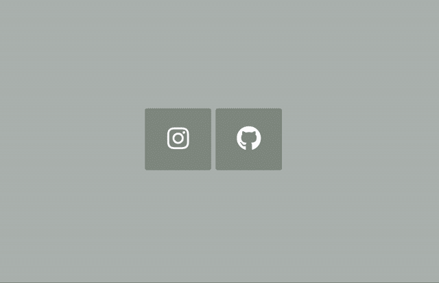
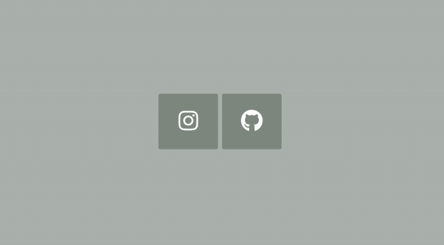

# 如何使用 CSS3 三次贝塞尔曲线创建动画链接悬停效果

> 原文：<https://levelup.gitconnected.com/how-to-create-an-animated-link-hover-effect-using-css3-cubic-bezier-440d40eca498>

## 我们将使用 CSS3 动画过渡来创建一个简单而迷人的链接悬停效果。


今天我们将创建一个简单的悬停链接效果。当你将鼠标悬停在一个链接上时，会弹出一个小弹出框。

我们还将研究 CSS3 三次贝塞尔曲线，这是一种 CSS 转换，它使弹出框的运动更加流畅，而不是僵硬的机器人运动。

下面是我们将要创建的一个示例:

# 常规 HTML 标记

这里是我们链接的一般标记。社交媒体图标来自[字体牛逼](https://fontawesome.com/)。

```
<div class="container">
  <section>
    <a href="#">
      <i class="fab fa-instagram"></i>
      <span>Instagram</span>
    </a>
    <a href="#">
      <i class="fab fa-github"></i>
      <span>Github</span>
    </a>
  </section>
</div>
```

span 标签将成为当您将鼠标悬停在链接上时出现的弹出框。接下来，我们继续学习 CSS。

# **CSS 样式和动画**

我们将 div 容器居中，这样两个链接就在屏幕上居中。这也使得动画小弹出框更容易，因为它们会从链接的顶部出现。

```
div.container {
  display: inline-block;
  position:absolute;
  top:50%;
  left:50%;
  -ms-transform:translate(-50%,-50%);
  -webkit-transform:translate(-50%,-50%);
  transform:translate(-50%,-50%);
}
```

接下来，我们设计我们的链接，创建一个简单的背景悬停效果，并定位我们的社交媒体图标。

```
a {
  color:#fff;
  background: #8a938b;
  border-radius:4px;
  text-align:center;
  text-decoration:none;
  position: relative;
  display: inline-block;
  width: 120px;
  height: 100px;
  padding-top:12px;
  margin:0 2px;
  -o-transition:all .5s;
  -webkit-transition: all .5s;
  -moz-transition: all .5s;
  transition: all .5s;
   -webkit-font-smoothing: antialiased;
}a:hover {
  background: #5a665e;
}i{
  font-size: 45px;
  vertical-align: middle;
  display: inline-block;
  position: relative;
  top: 20%;
}
```

接下来，我们将为弹出文本设置样式和动画。

```
a span {
  color:#666;
  position:absolute;
  font-family: 'Chelsea Market', cursive;
  bottom:0;
  left:-15px;
  right:-15px;
  padding: 15px 7px;
  z-index:-1;
  font-size:14px;
  border-radius:5px;
  background:#fff;
  visibility:hidden;
  opacity:0;
  -o-transition:all .5s cubic-bezier(0.68, -0.55, 0.265, 1.55);
  -webkit-transition: all .5s cubic-bezier(0.68, -0.55, 0.265, 1.55);
  -moz-transition: all .5s cubic-bezier(0.68, -0.55, 0.265, 1.55);
  transition: all .5s cubic-bezier(0.68, -0.55, 0.265, 1.55);
}/* text pops up when icon is in hover state */a:hover span {
  bottom: 130px;
  visibility:visible;
  opacity:1;
}
```

三次贝塞尔曲线由四个点 p0、p1、p2 和 p3 定义。点 p0 是曲线的起点，而点 p3 是曲线的终点。曲线看起来越线性，运动就越僵硬(或不流畅)。

如果一个点开始时是正数，而下一个点是负数，那么运动开始时会很慢。随着点值变得比它之前的点值高，移动速度越快。

这就是 CSS 中的三次贝塞尔曲线点的情况。动作很微妙，因为动画很短。弹出框在方块底部周围缓慢启动，然后加速到顶部。

虽然可以创建没有三次贝塞尔曲线过渡的动画，但动画的区别如下:



有三次贝塞尔曲线(左)和没有三次贝塞尔曲线(右)

动画为悬停效果增添了一些活力。

最后一组 CSS 包括对弹出框底部的小箭头进行样式化。要了解更多关于 CSS 中三角形是如何制作的，请看这篇 [CSS 技巧文章](https://css-tricks.com/snippets/css/css-triangle/)。

```
a span:before {
  content:'';
  width: 0; 
  height: 0; 
  border-left: 5px solid transparent;
  border-right: 5px solid transparent;
  border-top: 5px solid #fff;
  position:absolute;
  bottom:-5px;
  left:68px;
}
```

# 就是这样。

我们创建了一个极简按钮风格的链接。该链接有一个基本的背景悬停效果，但我们并没有就此止步。我们添加了一个小弹出框来显示链接的文本。在 CSS3 三次贝塞尔曲线的帮助下，动画看起来很流畅，也很赏心悦目。

这种东西很有用，可以作为你展示社交媒体账户的网站组合设计的一部分。你可以尝试设计和动画，看看你能想出什么。

如果你觉得这个教程有帮助，看看我最近的其他 HTML 和 CSS 相关教程:

[](/how-to-create-a-responsive-image-css-flexbox-grid-layout-4e890505b31d) [## 如何创建一个响应式图像 CSS Flexbox 网格布局

### 我们将使用 flexbox 创建一个简单的图像 CSS 网格布局。

levelup.gitconnected.com](/how-to-create-a-responsive-image-css-flexbox-grid-layout-4e890505b31d) [](https://medium.com/swlh/how-to-create-a-basic-responsive-navigation-bar-beb8692953e3) [## 如何创建一个基本的响应式导航栏

### 我们将学习如何使用 CSS 和 JavaScript 的组合来构建一个极简的导航条。

medium.com](https://medium.com/swlh/how-to-create-a-basic-responsive-navigation-bar-beb8692953e3) [](/how-to-create-a-blog-post-preview-layout-with-css-using-flexbox-c616f0fd0b10) [## 如何使用 Flexbox 创建带有 CSS 的博客文章预览布局

### 我们使用 flexbox 的基础来帮助创建这个极简的博客文章预览布局。

levelup.gitconnected.com](/how-to-create-a-blog-post-preview-layout-with-css-using-flexbox-c616f0fd0b10)