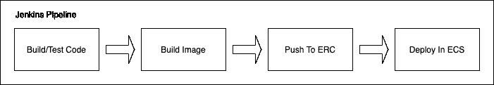
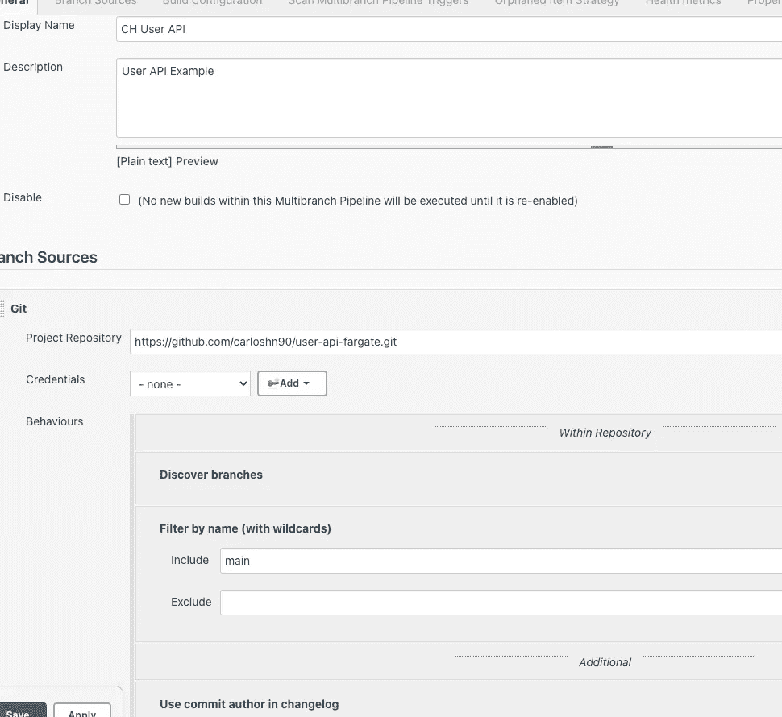
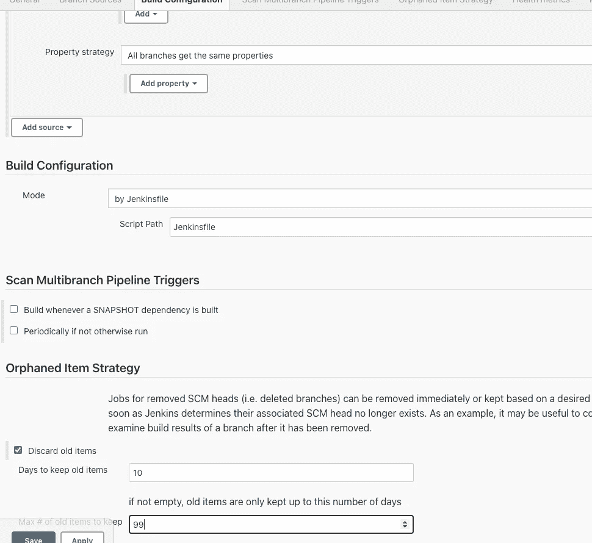
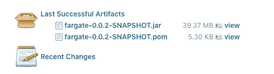
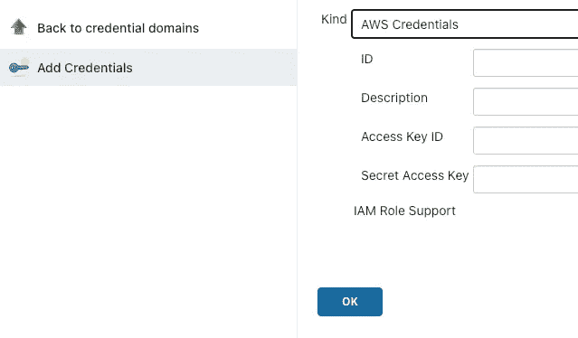
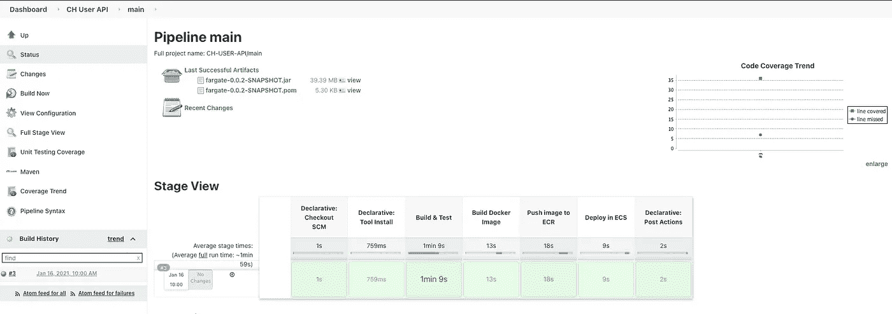

# 如何使用 Jenkins 创建自动 ECS 部署

> 原文：<https://levelup.gitconnected.com/how-to-create-an-automatic-ecs-deployment-with-jenkins-84c0e83e7cd0>

编程中最大的挑战之一是当我们有几个人同时在同一个项目上工作时，平滑地集成任何变化。对于这些情况 [*维克托·伦泰*](http://victorrentea.ro/) 说:

> *如果疼，那就多做几次，把疼痛带出来。*

这就是持续集成和持续部署发挥作用的地方。我们知道，集成和部署小的变更远比更大、更重要的变更更容易实现，并且随着这些变更的增长，难度会成倍增加。那么这个问题的解决方法是什么呢？解决方案是更频繁地这样做，不断地、尽可能快地集成和部署小段代码。

但是我们知道，为了达到这个目标，并不是不断地合并和部署我们的代码那么简单。我们需要将以下概念引入我们的项目:

*   测试:这对于验证我们正在集成的变更是否正常工作以及它们是否破坏了其他任何东西非常重要。
*   自动化:如前所述，我们的目标是更频繁地进行这些变更，因此，最好的方法是采用自动化流程来节省时间并减少人为错误。

在本文中，我们将关注第二点，并更具体地解释如何使用 *Jenkins* 在 [*ECS(弹性容器服务)*](https://aws.amazon.com/ecs/?whats-new-cards.sort-by=item.additionalFields.postDateTime&whats-new-cards.sort-order=desc&ecs-blogs.sort-by=item.additionalFields.createdDate&ecs-blogs.sort-order=desc) 中自动集成和部署我们的代码。在我们开始之前，我建议看一下我以前的文章 [*如何在 AWS*](https://carloshn90.medium.com/how-to-deploy-a-microservice-using-elastic-container-service-in-aws-b1ac20685f4) 中使用弹性容器服务部署微服务，因为我们将从那里将代码部署到这个集群中。

# 概观

在这个例子中，我们将创建一个简单的管道来部署我们的代码。你可以在 *Github* ( [用户 api 代码](https://github.com/carloshn90/user-api-fargate))中看到这个例子的代码。这是一个非常简单的微服务，有两个端点:

*   Get /users:返回用户名列表
*   Post /users:创建一个接收 json 的用户，其主体中包含名称

管道:

*   **构建/测试**:第一步是使用 *maven* 构建并测试我们的代码。
*   **构建映像**:第二步是创建一个 *Docker* 映像。
*   **推送到 ERC** :有了前面步骤中创建的 *Docker* 映像，现在是时候把它推送到我们的 *ERC(弹性存储库容器)*。
*   **在 ECS 中部署**:最后，我们必须用新的映像版本更新我们的任务定义并部署它。

# 陷害詹金斯

这里的第一步是安装*詹金斯*并设置它。要安装 J *enkins* ，我建议遵循 [*官方指南*](https://www.jenkins.io/doc/book/installing/) 。除此之外，我们还需要以下工具:

*   Java 11
*   Maven 3.6.3
*   20.10.2
*   AWS CLI 1.18.178

以及以下插件:

*   Docker 管道 1.25
*   HTML Publisher 1.25
*   管道 2.6
*   管道 AWS 步骤 1.43
*   管道 Maven 集成 3.9.3
*   管道实用程序步骤 2.6.1
*   管道:GitHub Groovy 库 1.0
*   工作空间清理插件 0.38

# 多分支管道

现在我们已经安装了*詹金斯*并设置好了，我们可以开始了。第一步是创建一个*多分支管道*，我们可以通过点击新项目(左侧菜单)找到该选项。下面您可以看到配置:

# 詹金斯文件

在我看来，设置我们管道的最佳方式是使用 *jenkinsfile* ，这是一个包含 *Jenkins 管道*定义的文本文件。我把我的理由概述如下:

为什么要用 *jenkinsfile* ？

*   管道将在我们的存储库中进行版本控制(我们可以看到变更，并在必要时回滚它们)。幕后没有魔法。
*   我们将开发人员的责任从开发人员转移到开发人员身上。没有人比项目的创建者更了解如何部署项目。
*   更容易和更快地，我们可以有一个初学者模板(使用公司标准)，我们可以在我们的项目中复制，根据具体的配置进行修改，并在必要时添加额外的阶段。

我们的 *jenkinsfile* 的主要结构如下所示:

## 选择

该指令允许在管道内部配置*管道特定的*选项。在我们的案例中，我们使用以下选项:

*   **buildDiscarder** :在这个选项中，我们指定了我们想要保存多少工件和日志。在这种情况下，我们将持续最后 10 个构建。
*   **disableConcurrentBuilds**:禁止并发执行*管道*。
*   **超时**:设置*流水线*运行的超时时间，之后 Jenkins 应该中止*流水线*。我们的暂停时间是 1 小时。这是防止我们的 *Jenkins* 中出现无限阻塞的好方法。
*   **时间戳**:将发出该行的时间作为*管道*运行生成的所有控制台输出的前缀。

## 工具

本节定义了要自动安装的工具，并放在以下路径中:

## 环境

在这里，我们可以指定一系列键值对，这些键值对将被定义为所有步骤的环境变量:

## 阶段

在这个部分，我们将定义为了部署代码，我们需要在*管道*中执行的不同步骤。

**构建和测试**

在这个阶段，我们将构建我们的项目，并使用 *maven* 进行测试。我们使用 *maven* 插件来发布最后一个成功的*工件*:

**构建 Docker 映像**

在这个阶段，我们将使用*docker 文件构建 *docker* 映像。*你可以在项目的根路径中找到这个文件:

Dockerfile 非常简单，我们使用 *openjdk:13-alpine* 来执行我们的 java 应用程序，我们正在第 5 行安装 *curl* 。我们使用 *ECS* 中的*卷曲*来检查集装箱是向上还是向下。

在这一阶段，我们使用 *docker* 插件来构建图像，并用 *ERC* url 对其进行标记，该 url 是我们之前保存在 *Jenkins 的*凭证中的。在本文的后面，我们将看看如何在 *Jenkins* 中设置凭证。

**将图像推送到 ECR**

在建立了 *docker* 图像之后，是时候把它推送给我们的 *ERC* 了。在本节中，我们将使用 *AWS* 插件来使用 *AWS* 凭证来推送图像。在第 7 行中，我们有一个不同的 *sh* 命令，这样做的原因是我们隐藏了 login 命令，以防止在我们的日志文件中打印它。

**在 ECS 中部署**

在最后阶段，我们将使用新的映像版本更新 *AWS* 中的任务定义，并部署此服务:

## 邮政

本节定义了一个或多个在*管道*运行完成后运行的附加步骤。

一旦*管道*完成，我们希望使用 [*jacoco*](https://github.com/jacoco/jacoco) 显示代码的覆盖信息，并清理我们的目录，从我们的本地资源库中删除 *docker* 映像。

# 詹金斯证书

这些凭证允许我们以安全的方式将用户名、密码等敏感数据保存在 *Jenkins* 中。在本文中，我们使用凭证来保存我们的 *AWS* 用户。**重要！您需要为 *Jenkins* 创建一个 *AWS* 用户，并拥有必要的最小权限**。在我们的例子中 *Jenkins 的*用户只拥有将映像推送到 *ERC* 并执行部署的权限。

要创建凭证，我们首先必须转到我们的*管道*，在左侧菜单中，我们将看到选项凭证。从该菜单中，我们可以选择我们的*管道*范围，最后我们将有添加凭证的选项。

添加凭证后，可以从*管道*中使用 *ID* 来识别凭证。

# 摘要

完成本指南后，我们可以执行我们的*管道*并部署我们的代码([用户 api Github 代码](https://github.com/carloshn90/user-api-fargate)):

现在，我们可以使用这个基本的*管道*并根据我们的项目需要添加尽可能多的步骤来获得完美的管道。例如，我们可以在 ECS 中的部署阶段之后再添加一个阶段，该阶段会监视并等待，直到新版本的应用程序成功启动，或者显示错误。