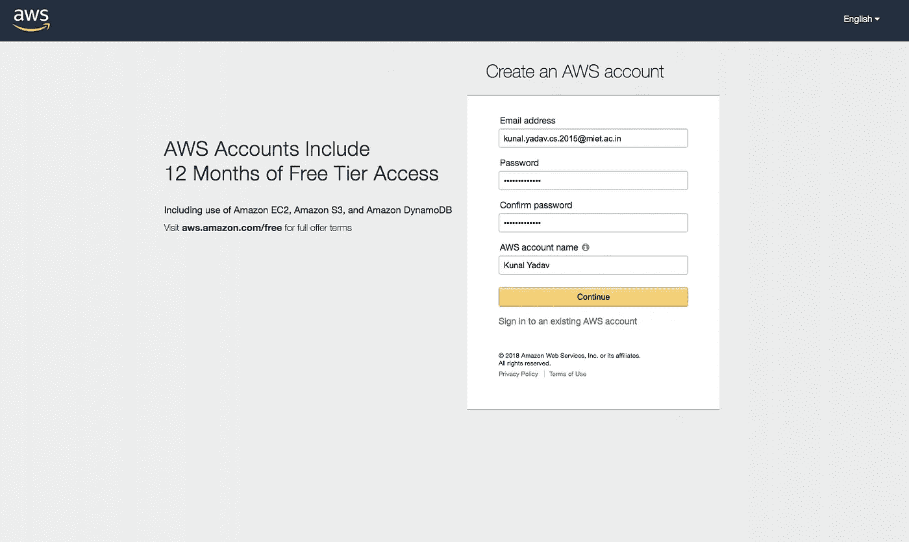
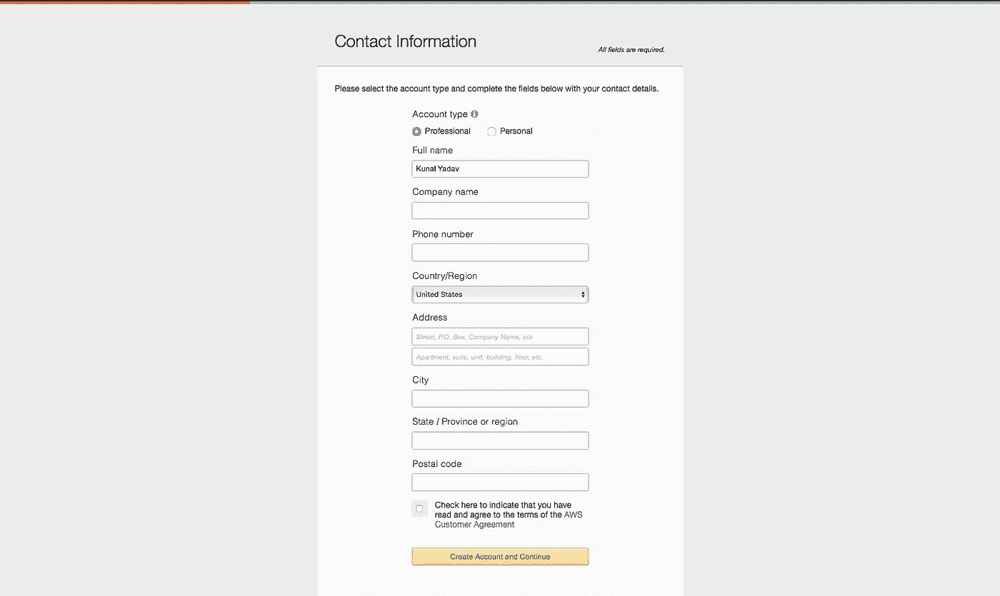
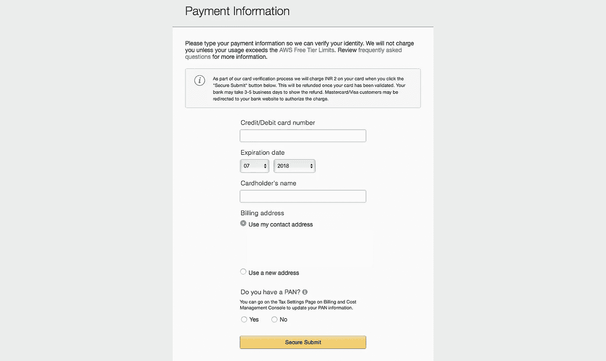
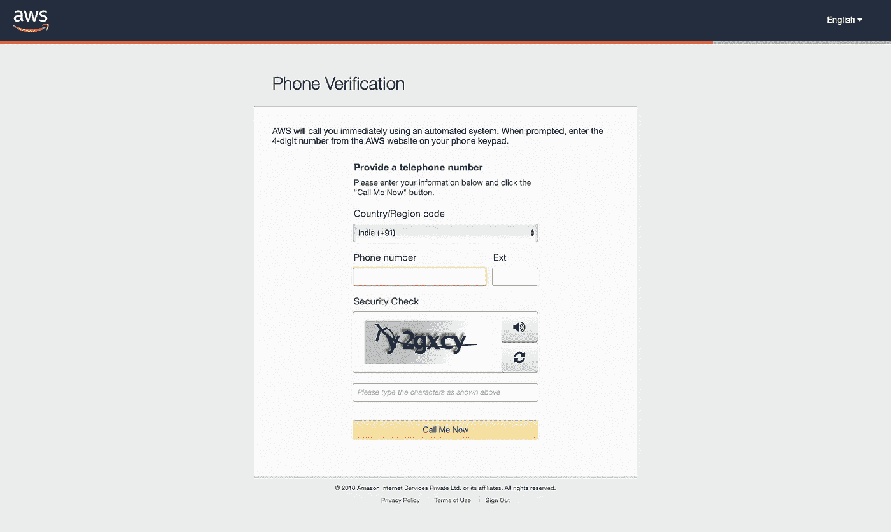
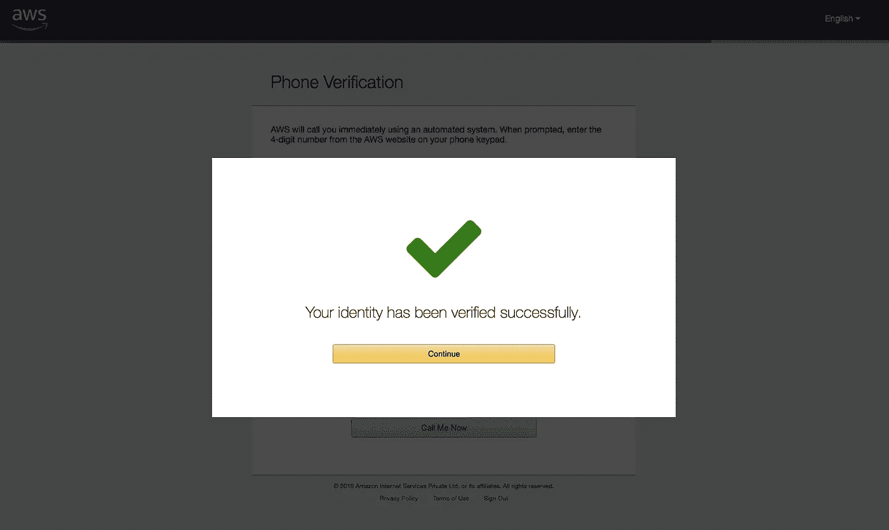
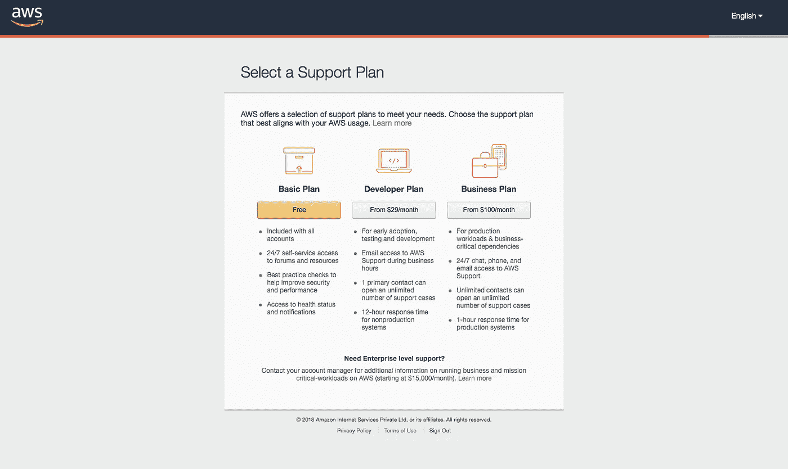
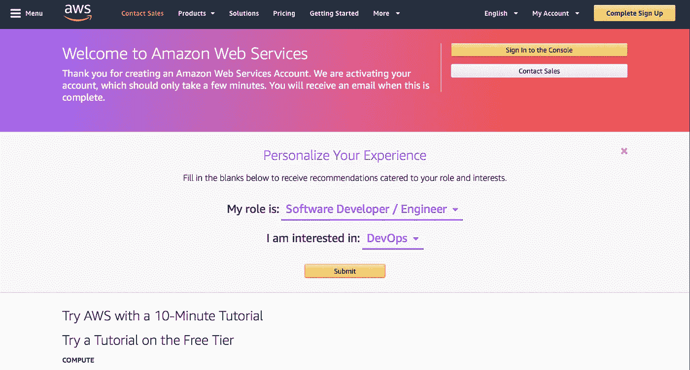

# 如何创建 AWS 帐户

> 原文：<https://levelup.gitconnected.com/how-to-create-an-aws-account-4377b19f6468>

大家好，我希望你们喜欢我的上一篇文章，在这篇文章中，我非常简要地解释了 90+ AWS 服务。

在本文中，我将向您展示如何在 AWS 上创建一个帐户。

现在，有一个好消息，你可以免费开始使用 AWS。AWS 为新账户提供 12 个月的免费等级。所以，你将可以免费使用大部分的服务。

在后面的文章中，我还将展示如何设置账单警报，以便当您的月账单超过某个特定阈值(比如 5 美元)时，您会收到一封电子邮件。这通常是因为人们忘记停止他们的 EC2 实例，或者他们使用了像 Route53 这样的免费层中不包含的服务。

# 我们开始吧

**1。登录** [**报名页面**](https://portal.aws.amazon.com/billing/signup#/start) —在这里，你要输入你的邮箱、密码和账户名。我在这里使用我的大学电子邮件，你可以使用你的任何电子邮件。

选择一个**强密码**并在帐户名字段中输入您的姓名，然后点击“继续”按钮。

**2。输入您的联系信息—** 现在将要求您输入联系信息。如果你在某个地方工作，你可以选择“专业”作为你的账户类型，否则，你可以选择“个人”账户。

输入您的信息，选中复选框。如果有兴趣，请阅读 AWS 客户协议，然后单击“创建帐户并继续”按钮。

**3。输入您的支付信息—** 要使用 AWS，您必须输入您的借记卡或信用卡详细信息。

别担心，AWS 会保护您的卡详细信息，除非您离开免费层，否则不会向您收费。

AWS 从您的卡中收取很少的费用来验证它，一旦验证成功，您将在 3-5 个工作日内获得退款。

在我的文章中，如果我离开了自由层，我会强调它。

填写完您的卡详细信息后，单击“安全提交”，您将被重定向到您的银行网站以授权交易。

**4。验证您的电话号码—** 现在，您必须验证您的电话号码。选择您的国家代码，输入您的电话号码和给定的安全代码，然后单击“立即给我打电话”按钮。

验证您的电话号码后，您将看到以下成功消息。

**5。选择一个支持计划—** 点击“自由”按钮选择基本计划。

## **账户创建成功**

恭喜你！您已经成功创建了一个 AWS 帐户。选择您的角色和您感兴趣的领域，以便 AWS 可以个性化您的体验。

现在，您可以将 AWS 服务作为免费层的一部分使用了。

在下一篇文章中，我们将深入 IAM(身份和访问管理)，因为了解如何保证您的 AWS 帐户的安全是非常重要的。

如果你喜欢这个帖子，请在下面鼓掌并分享，这样其他人也能从中受益！

**非常感谢您的阅读！**

*原帖* [*我的博客*](https://kunalyadav.me)