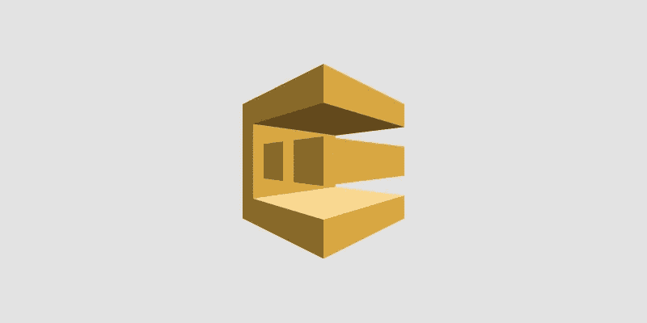

# 如何使用无服务器创建 AWS SQS 队列

> 原文：<https://levelup.gitconnected.com/how-to-create-an-aws-sqs-queue-with-serverless-2a538fe2413a>



## 这篇文章假设你熟悉 AWS 和无服务器框架。

这将只显示使用[无服务器](https://www.serverless.com/)部署新 SQS 队列的相关配置设置。在底部，你可以找到如何用 Node 发送 SQS 消息的链接。

## 期待结果

1.  一个触发 lambda 的 [AWS SQS](https://aws.amazon.com/sqs/) 队列(触发器是可选的，您可以创建没有触发器的队列)。
2.  SQS 队列 URL 保存为一个环境变量，我们可以在应用程序的其余部分使用它。

这里我只展示了无服务器 yaml 的相关部分。您的文件肯定会有其他配置。这只是为了让它只关注 SQS 部分。

*serverless.yml*

```
...
provider:
  name: aws
  runtime: nodejs12.x
  region: us-east-1
  stage: prod
  environment:
    ...
    **SQS_QUEUE_URL**: { Ref: **NewSQSQueue** }
  iamRoleStatements:
    - Effect: Allow
      Action:
        - sqs:*
      Resource:
        Fn::GetAtt: [ **NewSQSQueue**, Arn ]

...

resources:
  Resources:
    **NewSQSQueue**:
      Type: "AWS::SQS::Queue"
      Properties:
        QueueName: sqs-queue-${opt:stage, self:provider.stage}.fifo
        FifoQueue: true
```

这将创建一个新的先进先出(FIFO) SQS 队列以及使用它所必需的 IAM 角色。

队列名称将为`sqs-queue-prod.fifo`(所有 FIFO 队列必须以后缀结尾。fifo)和 SQS url 将通过使用`process.env.SQS_QUEUE_URL`作为环境变量在应用程序的其余部分中使用。

## λ触发器(可选)

如果您希望在收到新的 SQS 消息时触发 lambda，您可以添加一个带有事件触发器的简单 lambda，如下所示:

```
eventRouter:
  handler: src/handlers/event_router.handler
  **events:
    - sqs:
        arn:
          Fn::GetAtt:
            - *NewSQSQueue*
            - Arn**
```

每次有消息发送到您刚刚创建的队列时，都会调用这个函数。