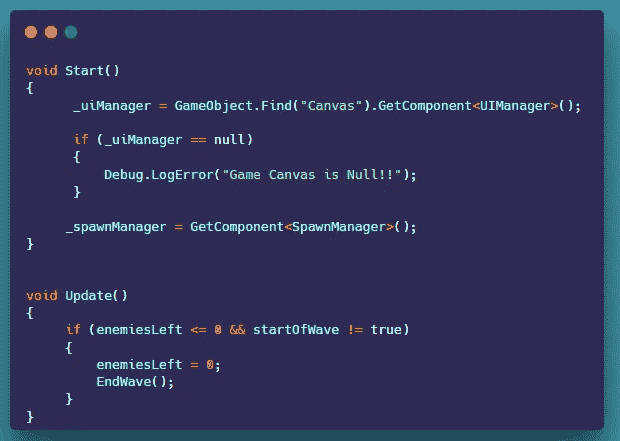

# 如何在 Unity 中创建敌方波系

> 原文：<https://levelup.gitconnected.com/how-to-create-an-enemy-wave-system-in-unity-49c5328564e7>

**概述:**

今天我们将讨论如何在 Unity 中创建一个敌人的波动系统。

**波浪系统:**

对于 wave 系统，我们创建了一个新的脚本，并将其附加到 spawn manager 中。

1.  首先，我们获得了 spawn manager 脚本和 UI 的引用，供以后使用。我们需要一个 int 来表示当前的浪潮，我们还需要一个 int 来表示要繁殖的敌人数量以及我们左边有多少敌人。我们还创建了一个 Bool 来知道它是否是一个波的开始。

2.在 start 方法中，我们可以使用 GameObject。从画布中找到 UI 管理器脚本。我们还需要得到产卵经理。在更新方法中，我们检查剩下的敌人是否小于或等于零，以及波的开始是否等于假。如果这是真的，我们将左边的敌人设置为零，以防止变负，并调用结束波方法。

3.我们有一个名为 start wave 的公共方法，它将 startOfWave 设置为 true，并启动 wave 协程。在 IEnumerator 内部，我们调用 UI 脚本上的 Update wave 显示方法，并传入当前 wave。然后，我们等待 3 秒钟，检查是否剩下的敌人不等于要产卵的敌人。如果为真，那么我们在 Spawn Manager 上调用 start spawning 方法。

4.我们还有一个公共的 End wave 方法来启动 End Wave 协程。在 IEnumerator 中，我们将 wave 的开始设置为 true，将当前 wave 增加 1，并增加 5 个敌人来产卵。然后我们等待两秒半，调用 start wave 方法。

**更新 UI 显示波:**

1.  在 UI 管理器脚本中。我们需要为波形显示文本创建一个新的 TextMeshProUGUI 变量。
2.  接下来，我们创建一个新的公共方法来启用文本并显示当前的波数。

**繁殖敌人:**

在产卵管理器中，我们简单地修改了产卵 couratine。我们创建了一个新的局部 int 变量，每次产生一个敌人，这个变量就增加一次。如果产生的敌人数量等于 wave 管理器的“要产生的敌人”变量，那么我们停止产生，将 wave 的开始设置为假，并将产生的敌人重置为零。

**消灭敌人:**

在敌方脚本中，我们需要创建一个新变量来获取 wave manager 类。在 start 方法内部，我们可以使用游戏对象。Find 方法在场景中找到 spawn manager 并获取 Wave manager 脚本。现在在我们消灭敌人之前进入舷外支架。我们减少了一个敌人。

我们现在应该有一波又一波的敌人。

本文到此为止。

感谢您的时间和关注。

# 分级编码

感谢您成为我们社区的一员！在你离开之前:

*   👏为故事鼓掌，跟着作者走👉
*   📰查看[级编码出版物](https://levelup.gitconnected.com/?utm_source=pub&utm_medium=post)中的更多内容
*   🔔关注我们:[推特](https://twitter.com/gitconnected) | [LinkedIn](https://www.linkedin.com/company/gitconnected) | [时事通讯](https://newsletter.levelup.dev)

🚀👉 [**将像你这样的开发人员安置在顶级创业公司和科技公司**](https://jobs.levelup.dev/talent/welcome?referral=true)