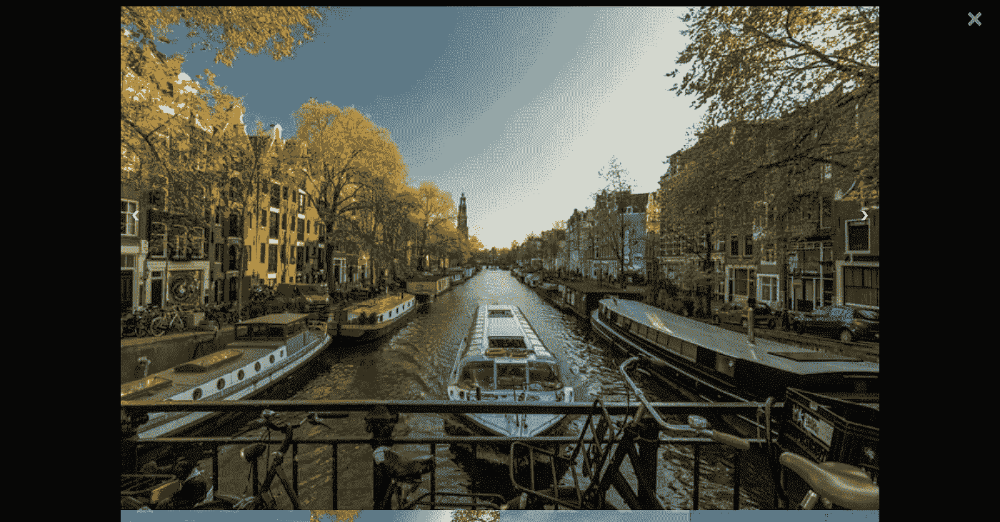

# 如何在 Angular 中创建图像灯箱

> 原文：<https://levelup.gitconnected.com/how-to-create-an-image-lightbox-in-angular-d7254e2c099>


许多 web 项目，如列表网站、电子商务、文件夹网站和许多其他动态网站，都有一个名为“图像灯箱”的组件，用于全屏缩放图像，并以更大的尺寸浏览它们。有大量的第三方库可以为开发者解决这个问题，但是为什么要安装额外的包来获得这个简单的功能呢？在本教程中，我们将建立自己的图像灯箱，而不使用第三方库。让我们开始吧。

## **创建新的角度项目**

让我们创建一个新项目并运行它。

```
ng new angular-lightboxcd angular-lightboxng serve
```

让我们生成`ImageLightboxComponent`组件

```
ng generate component ./components/image-lightbox
```

现在我们需要添加一些可以通过我们的`ImageComponent`使用的数据。只需创建一个新的数据文件夹并创建`image.data.ts`

然后添加这些数据。图像已经放置在“资产”文件夹中。

```
export const images = [
  {
    id: 1,
    url: "../../assets/img1.jpeg"
  },
  {
    id: 2,
    url: "../../assets/img2.jpeg"
  },
  {
    id: 3,
    url: "../../assets/img3.jpeg"
  },
  {
    id: 4,
    url: "../../assets/img4.jpeg"
  }
];
```

## **创建影像服务**

为了获取图像，我们需要使用 observables，因此我们需要为此创建一个服务。

```
ng generate service image
```

让我们更新我们的服务:

```
import { Injectable } from "[@angular/core](http://twitter.com/angular/core)";
import { Observable, of } from "rxjs";
import { images } from "../data/image.data";
[@Injectable](http://twitter.com/Injectable)()
export class ImageService {
  constructor() {}
  fetchImages(): Observable<any> {
    return of(images);
  }
}
```

## **处理 ImageLightbox 组件**

是时候让我们的组件发挥作用了。

```
import {
 Component,
 OnInit,
 ViewEncapsulation
} from '[@angular/core](http://twitter.com/angular/core)';import { ImageService } from '../../services/image.service';[@Component](http://twitter.com/Component)({
 selector: 'app-image-lightbox',
 templateUrl: './image-lightbox.component.html',
 styleUrls: ['./image-lightbox.component.css'],
 encapsulation: ViewEncapsulation.None
})export class ImageLightboxComponent implements OnInit {
 images = [];
 slideIndex = 0;
 constructor(private imageService: ImageService) {} ngOnInit(): void {
  this.loadImages();
 } loadImages(): void {
  this.imageService.fetchImages()
   .subscribe(images => this.images = images);
 } openModal() {
  document.getElementById('imgModal').style.display = "block";
 } closeModal() {
  document.getElementById('imgModal').style.display = "none";
 } plusSlides(n) {
  this.showSlides(this.slideIndex += n);
 } currentSlide(n) {
  this.showSlides(this.slideIndex = n);
 } showSlides(slideIndex); showSlides(n) {
  let i;
  const slides = document.getElementsByClassName("img-slides") as HTMLCollectionOf < HTMLElement > ;
  const dots = document.getElementsByClassName("images") as HTMLCollectionOf < HTMLElement > ;
  if (n > slides.length) {
   this.slideIndex = 1
  }
  if (n < 1) {
   this.slideIndex = slides.length
  }
  for (i = 0; i < slides.length; i++) {
   slides[i].style.display = "none";
  }
  for (i = 0; i < dots.length; i++) {
   dots[i].className = dots[i].className.replace(" active", "");
  }
  slides[this.slideIndex - 1].style.display = "block";
  if (dots && dots.length > 0) {
   dots[this.slideIndex - 1].className += " active";
  }
 }
}
```

我们通过上一节创建的服务获取图像，然后使用 ID 和类名来处理模态的打开、关闭和滑动。

现在我们需要在 HTML 模板中实现这些功能。

```
<div class="image-row">
    <div class="image-column" *ngFor="let image of images; let i = index">
        
    </div>
</div>
<div id="imgModal" class="slide-modal">
    <span class="close cursor" (click)="closeModal()">&times;</span>
    <div class="slide-modal-content">
        <div class="img-slides" *ngFor="let image of images; let i = index">
            
        </div>
        <a class="prev" (click)="plusSlides(-1)">&#10094;</a>
        <a class="next" (click)="plusSlides(1)">&#10095;</a>
        <div class="image-row">
            <div class="image-column" *ngFor="let image of images; let i = index">
                
            </div>
        </div>
    </div>
</div>
```

我们遍历图像 3 次。

我们第一次使用`ngFor`时，它只显示缩略图。


第二次，我们使用它来显示和滑动模态中的大图像。



最后，我们最后一次使用它来显示模态主滑块下的小图像，这样你就可以立即选择你想要显示的大图像，而不是点击下一个或上一个按钮。下面是它的样子:


为了得到这个外观，我们需要使用一些 CSS:

```
.image-row {
  display: flex;
  flex-wrap: wrap;
}.image-row > .image-column {
  padding: 5px 10px;
}.image-row:after {
  content: "";
  display: table;
  clear: both;
}.image-column {
  float: left;
  width: 25%;
}img {
  width: 100%;
}.slide-modal {
  display: none;
  position: fixed;
  z-index: 1;
  padding-top: 10px;
  left: 0;
  top: 0;
  width: 100%;
  height: 100%;
  overflow: auto;
  background-color: #000000;
}.slide-modal-content {
  position: relative;
  margin: auto;
  padding: 0;
  width: 100%;
  max-width: 1200px;
}.slide-modal-content .image-column {
  padding: 0;
}.close {
  color: white;
  position: absolute;
  top: 10px;
  right: 25px;
  font-size: 35px;
  font-weight: bold;
}.close:hover,
.close:focus {
  color: #888888;
  text-decoration: none;
  cursor: pointer;
}.img-slides {
  display: none;
}.cursor {
  cursor: pointer;
}.prev,
.next {
  cursor: pointer;
  position: absolute;
  top: 35%;
  width: auto;
  padding: 18px;
  margin-top: -50px;
  color: white !important;
  font-weight: bold;
  font-size: 20px;
  transition: 0.8s ease;
  border-radius: 0 5px 5px 0;
  user-select: none;
  -webkit-user-select: none;
}.next {
  right: 0;
  border-radius: 3px 0 0 3px;
}.prev:hover,
.next:hover {
  background-color: rgba(0, 0, 0, 0.8);
}img {
  margin-bottom: -4px;
}.images {
  opacity: 0.7;
}.active,
.images:hover {
  opacity: 1;
}img.hover-shadow {
  transition: 0.3s;
}.hover-shadow:hover {
  box-shadow: 0 4px 8px 0 rgba(0, 0, 0, 0.2), 0 6px 20px 0 rgba(0, 0, 0, 0.2);
}
```

## **最后一步**

最后一步，我们需要在`app.component.html`中包含我们的组件

它将只包含这一行:`<app-image-lightbox></app-image-lightbox>`

此外，确保`ImageLightboxComponent`和`ImageService`包含在`app.module.ts`中

## **结论**

我们的图像灯箱已经准备好了。你可以在这里找到完整的源代码:
[Github](https://github.com/haykoyaghubyan/angular-image-lightbox)