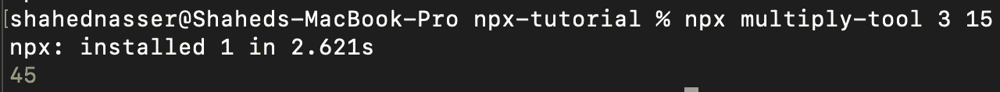

# 如何创建 NPX 工具

> 原文：<https://levelup.gitconnected.com/how-to-create-an-npx-tool-fbbace6a3918>


*此文最初发布于* [*我的个人博客*](https://blog.shahednasser.com/how-to-create-a-npx-tool/) *。*

[NPM](https://www.npmjs.com) (代表节点包管理器)被 web 开发者广泛用于安装和管理各种 JavaScript 库。这是如今更多网站的必需品。默认情况下，它随 Node.js 一起安装。

然而，你可能已经见过很多库或框架指导你在安装它们的包时使用 NPX。 [React](https://reactjs.org/docs/create-a-new-react-app.html) 甚至有一个警告，向开发者澄清使用 NPX 不是一个输入错误。

NPX 是一个软件包运行程序，允许您运行 NPM 托管的 CLI 工具或可执行文件，而无需先安装 NPM。

例如，以前您需要在系统上全局安装`create-react-app`，然后运行`create-react-app my-website`。

自从 NPM v5.2 以后，就不需要全球安装`create-react-app`(而且建议不要)。您可以简单地运行`npx create-react-app my-website`，相同的脚本将运行来创建您的 React 应用程序。

在本教程中，您将了解如何创建自己的 NPX 工具。您将通过本教程创建的工具非常简单——它只会将两个或更多的数字相乘。您还将了解如何在本地使用您的工具，以及如何将其发布到 NPM 注册中心供他人使用。

## 先决条件

这是显而易见的，但是你需要安装 [Node.js](https://nodejs.dev) 来完成本教程。安装 Node.js 将依次安装 NPM 和 NPX。

## 项目设置

创建一个新目录来存放您的工具:

```
mkdir multiply-tool
```

接下来，用 NPM 初始化您的项目:

```
npm init
```

你会被问到一些关于这个包的问题，比如包名和作者名。填写完之后，在当前目录下会创建一个`package.json`文件。

## 创建 Bin 文件

当您创建 CLI 工具或可执行文件时，您需要创建一个文件，并将其包含在您的 package.json 中的`bin`字段下。

创建目录`bin`,并在该目录中创建包含以下内容的文件`index.js`:

```
#! /usr/bin/env node
console.log("Hello, World!");
```

这个文件所能做的(目前)就是打印“Hello，World！”到您的命令行或终端。但是，这里需要注意的重要内容是下面一行:

```
#! /usr/bin/env node
```

应该将这一行添加到将通过命令行执行的所有文件中。它被称为 [Shebang](https://en.wikipedia.org/wiki/Shebang_(Unix)) ，基本上，它指定了文件应该传递给哪个解释器，以便在类 Unix 系统中执行。

接下来，在`package.json`中添加新字段`bin`:

```
"bin": {
	"multiply": "bin/index.js"
},
```

这意味着当用户运行`npx <package_name>`时，脚本`bin/index.js`也会运行。

## 在本地测试

要在本地测试它，首先，在您的系统中全局安装软件包:

```
npm i -g
```

您应该在保存您的包的目录中运行这个命令。

然后，在您的终端中，运行以下命令来运行您的 NPX 工具:

```
npx multiply
```

在这里，`multiply`是这个包的名字。如果你给你的包起了别的名字，一定要写上包的名字。

当您运行该命令时，您将看到“Hello，World！”打印在你的终端上。


## 使用参数

在本节中，您将实现`multiply`包的功能。这个包应该接受至少两个参数(如果参数少于 2，用户将得到一个错误)。然后，它会将所有的参数相乘。如果结果是`NaN`,这意味着至少有一个参数不是数字，在这种情况下用户也会看到一个错误。

用以下内容替换`bin/index.js`的内容:

```
#! /usr/bin/env node
const args = process.argv.slice(2);
if (args.length < 2) {
  console.error('Please enter at least 2 numbers');
  process.exit(1); //an error occurred
}

const total = args.reduce((previous, current) => parseFloat(current) * parseFloat(previous));

if (isNaN(total)) {
  console.error('One or more arguments are not numbers');
  process.exit(1); //an error occurred
}

console.log(total);
process.exit(0); //no errors occurred
```

需要注意一些事情:

1.  `process.argv`用于检索命令行参数。前两个参数是运行这个脚本的解释器(在本例中是 Node)，第二个参数是包的名称(在本例中是`multiply`)。传递的任何其他参数将从索引`2`开始可用。因此，要获得用户传递的参数，您需要分割数组`process.argv`并从索引`2`开始获取元素。
2.  当出现错误时，可以使用`process.exit(1)`来指示。如果`process.exit`收到 0 以外的值，则意味着 CLI 工具中出现错误。
3.  [reduce](https://developer.mozilla.org/en-US/docs/Web/JavaScript/Reference/Global_Objects/Array/Reduce) 数组函数用于将数组中的所有项目逐一相乘。
4.  如果`total`的最终结果是`NaN`，用户会得到一个错误。
5.  如果一切顺利，结果将被打印出来，过程将退出，并显示`0`指示过程成功结束。

让我们来测试一下。在您的终端中再次运行该命令，向其传递 2 个数字:

```
npx multiply 3 15
```

您将在终端上看到乘法的结果。

你也可以试着增加两个以上的数字，你会看到结果。要查看错误消息是如何工作的，请尝试输入少于 2 个数字或输入字符串而不是数字。

## 发布包

现在你的工具已经准备好了，你可以在 NPM 上发布它了。这一步需要一个 NPM 账户，所以如果你没有，确保[创建一个](https://www.npmjs.com/signup)。

然后，在您的终端中，运行以下命令，使用您的 NPM 帐户登录:

```
npm login
```

系统会提示您输入用户名和密码。如果一切正确，您将登录并发布您的工具。

要发布您的工具，只需运行:

```
npm publish
```

> 注意:如果您的项目使用 GitHub 库，请确保在运行该命令之前提交所有内容。

这将把您的工具发布到 NPM 注册表中。请注意，如果创建了另一个同名的包，您需要在`package.json`中更改包的名称，然后再次尝试发布。

## 使用您发布的包

要使用已发布的包，您可以运行之前运行本地命令时使用的相同命令:

```
npx <package_name>
```

请注意，在这种情况下，您不需要全局安装软件包。你可以在 NPX 运行它。

在我的例子中，我不得不将我的包重命名为`multiply-tool`，因为`multiply`已经存在于 NPM 注册表中。然后，我运行了以下命令:

```
npx multiply-tool 3 15
```

并且接收乘法的结果:



## 更新您的包

要更新您的软件包，您可以使用以下命令:

```
npm version <type>
```

其中`<type>`决定如何增加版本。它可以是下列值之一:

1.  `patch`:这将增加你的版本的最后一个数字，通常意味着一个小的改变。例如，它会将版本从`1.0.0`更改为`1.0.1`。
2.  `minor`:这将增加你的版本中的第二个数字，通常意味着一个不一定影响用户如何使用这个工具的小变化。例如，它会将版本从`1.0.0`更改为`1.1.0`。
3.  这将增加你的版本中的第一个数字，这通常意味着发生了一个很大的变化，可以影响这个工具的使用。例如，它会将版本从`1.0.0`更改为`2.0.0`。

运行上述命令后，再次运行发布命令:

```
npm publish
```

您的工具将会更新。

## 结论

在本教程中，您学习了如何创建一个可以直接与 NPX 一起运行的工具，而无需全局安装。您还了解了如何发布和更新该工具。

这个工具是一个简单的工具，然而，对于更复杂的工具，你可以使用助手库，如[指挥官](https://www.npmjs.com/package/commander)和[粉笔](https://www.npmjs.com/package/chalk)。