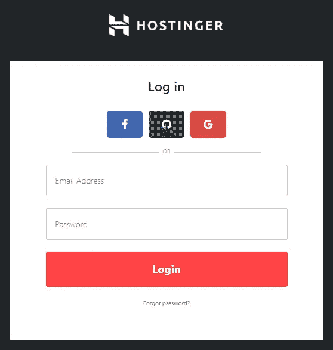
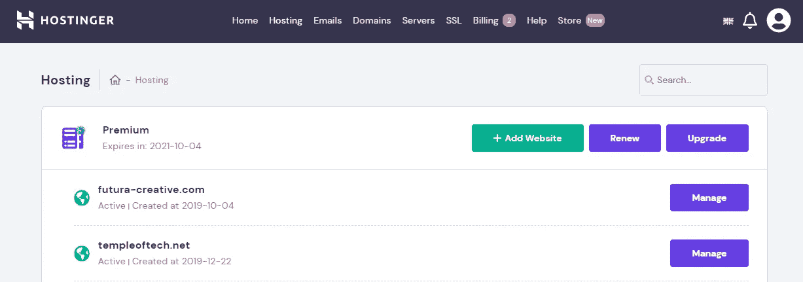
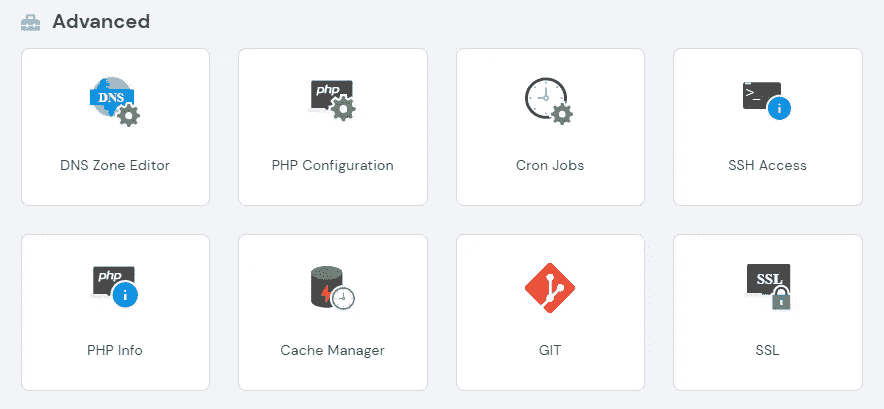
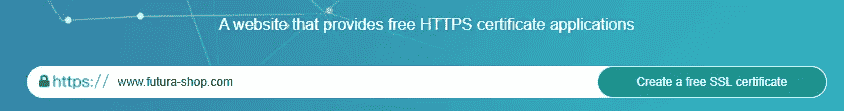
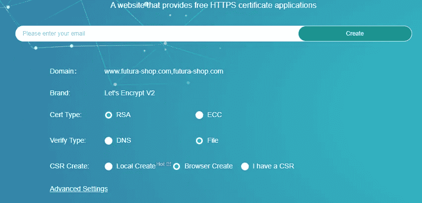
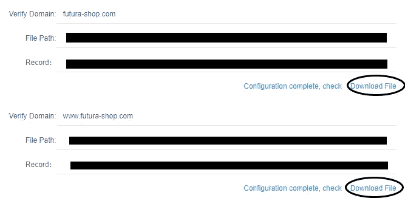
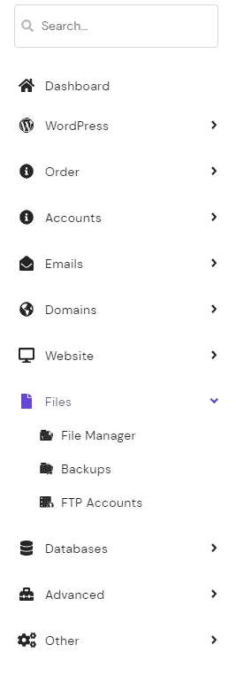
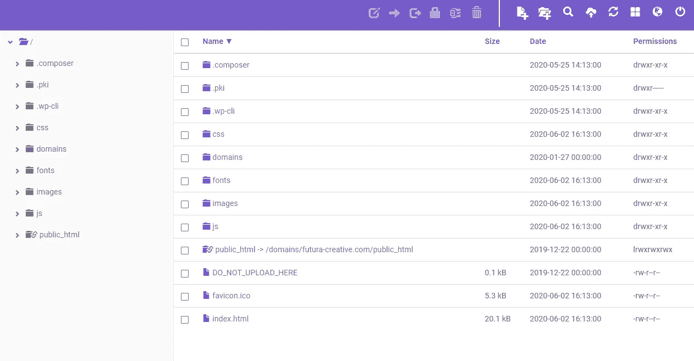
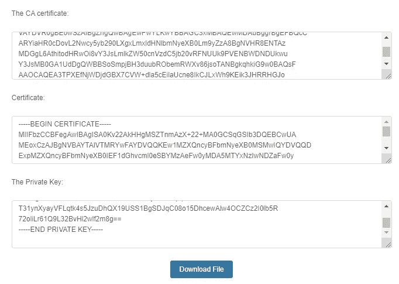
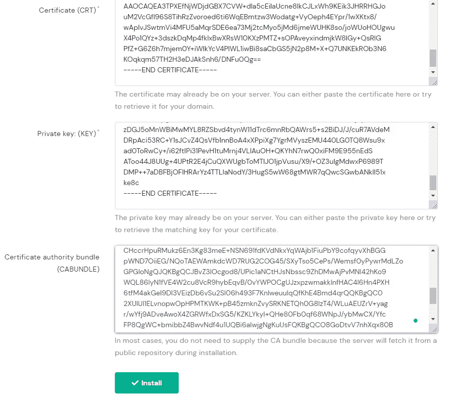

# 如何免费创建 SSL 证书

> 原文：<https://levelup.gitconnected.com/how-to-create-an-ssl-certificate-for-free-667f7d453424>

为你的网站制作一个 SSL 证书并不难，只要你按照本文中的步骤去做，任何人都可以做到。我不得不面对这个问题，建立我的网站，经过大量的实践，我知道闭上眼睛所需的步骤。在这篇文章中，我将使用 Hostinger 管理面板的例子，但同样的逻辑应该适用于任何其他主机提供商。

斯蒂芬·菲利普斯-Hostreviews.co.uk 在 [Unsplash](https://unsplash.com?utm_source=medium&utm_medium=referral) 上的照片

# 登录您的主机管理面板或 hpanel。

您将需要登录到您的管理面板有机会改变您的网站的 SSL 证书设置。如果客户允许您访问网站，您也可以使用您的个人帐户登录并为他们管理网站。

# 转到您的主机选项卡，并选择网站。

在您登录到您的帐户后，您需要选择主机选项卡，将会有一个主机计划，其中包含您拥有的所有域名。在您想要获取 SSL 证书的网站上单击“管理”。

# 从高级部分选择 SSL 选项

一旦您选择了您的网站，该网站的特定页面将会打开，您可以调整许多不同的功能和设置。向下滚动到高级部分，从那里按下 SSL 选项。

# 现在让我们创建免费的 SSL

你需要去[这个](https://freessl.org/)网站，在那里你可以按照下面的步骤创建一个免费的 SSL 证书。

*   首先，添加您的网站的网址，然后按按钮。

*   选择如图所示的选项，并在上面的空白处添加电子邮件地址后按创建。

*   您将自动下载一个带有安全密钥的 zip 文件夹，因为我已经选择了这些选项。您将看到下面用于验证域的字段、您需要转到的文件路径以及作为 SSL 文件的记录。你需要下载这两个软件。

# 再次进入主机面板，找到文件管理器。

现在，当你在网页的边栏中完成了 hpanel 的最后一步后，你可以很容易地找到文件管理器，它在文件下面。

# 上传目录中的文件。

然后，您需要按照 SSL 网站提供的路径，将下载的文件上传到那里。就是这样，这一步相当简单。

# 验证证书。

现在，您需要返回到下载 SSL 文件的网站，并按下验证按钮。将出现三个带加密代码的字段。

您必须将它们复制并粘贴到 Hostinger 面板 SSL 网页中的相应字段。然后像这样按下页面末端的安装按钮。

就这样，您完成了 SSL 证书安装在您的网站上。