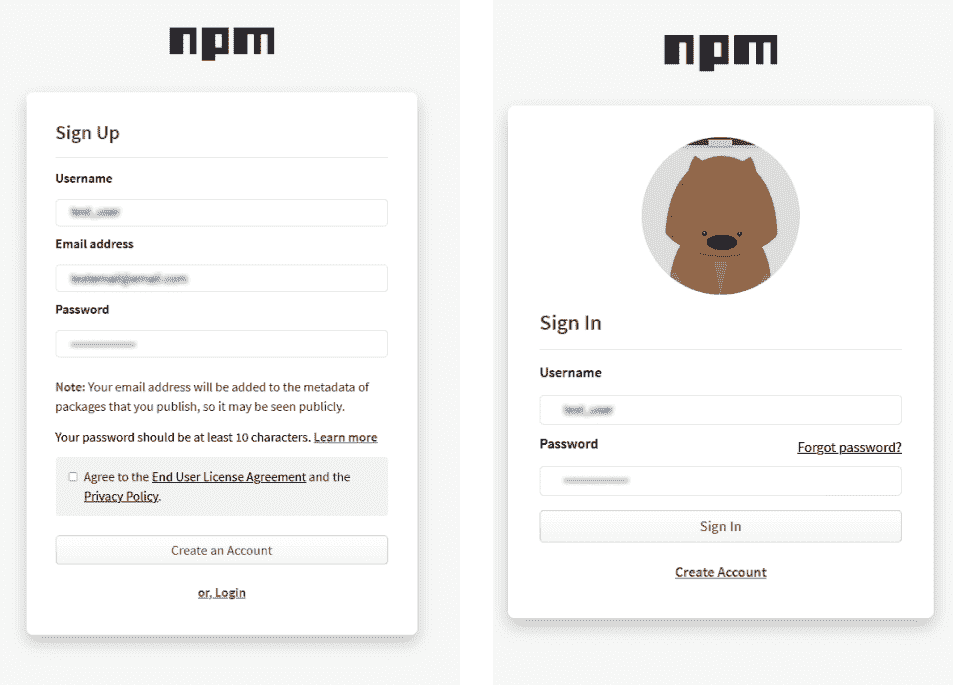
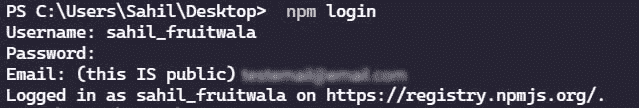
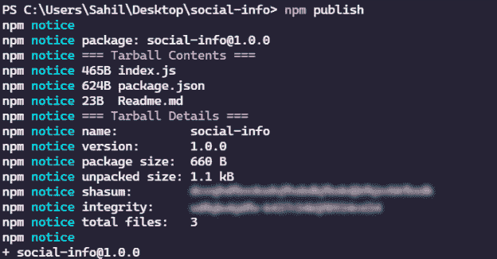

# 如何创建包并将其发布到 NPM 注册中心

> 原文：<https://levelup.gitconnected.com/how-to-create-and-publish-a-package-to-npm-registry-4967a5c44c69>

## 7 个步骤中你需要知道的一切


保罗·埃施-洛朗在 [Unsplash](https://unsplash.com?utm_source=medium&utm_medium=referral) 上拍摄的照片

# 介绍

在本教程中，我们将了解如何创建、测试和发布我们自己的 npm 包。但是为什么有人想发布 npm 包呢？

作为开发人员，我们使用其他开发人员发布的许多 npm 包。这些 npm 包改进了我们的开发周期，节省了大量时间。Npm 包提供了一些功能，这样我们就不必重新编码了。例如，在前端，我们使用 **Axios** 从 API 获取数据。或者我们使用 **UUID** 在后端给我们的数据一个唯一的 ID。

通过在 IT 领域的工作，我们了解到效率是发展的一个重要方面。但是，有时，我们会遇到一些情况，不得不编写一段代码。这些代码可能对世界上的许多人或您的组织有用。现在我们总是可以使用 **git** 库来完成这个任务。但是，每次设置代码库可能有点棘手。相反，在发布代码之后，我们可以使用一个命令来设置这个代码库。

**注意:**包和模块是两回事。但是对于本教程，我们不需要担心差异。

# 初始设置

在发布 npm 软件包之前，您必须满足一些先决条件。

1.  我们需要 [**创建**一个 npm 帐户](https://www.npmjs.com/signup)并**验证**它。(请记住，如果您不验证您的帐户，当您尝试发布软件包时，将会遇到一些错误。)
2.  下载安装 [**Node.js**](https://nodejs.org/en/download/)
3.  使用 npm 凭据登录您的本地系统。



NPM 登录页面

创建 npm 帐户后，打开终端并编写以下命令。要验证节点和 npm 的安装，请执行以下命令。

```
node -vnpm -v
```

现在，要登录 npm 帐户，请使用以下命令。它会询问您的用户名、密码和您注册时使用的电子邮件。

```
npm login
```



NPM 登录终端

Npm 包有两种类型:普通包和作用域包。作用域包主要用于私有包或组织的内部使用。但是你也可以找到一些公共的作用域包，比如 [**@angular**](https://hashnode.com/@angular) 作用域包。

**注意:**在开始编写代码之前，检查包名的有效性。这不是一个大问题，我们可以随时更改名称，但这是一个很好的做法。

# 编写包的核心逻辑

在大多数情况下，Npm 包就像普通的节点项目。因此，当我们初始化节点项目时，我们使用下面的命令得到了这个项目。

```
npm init
```

在本教程中，我将创建一个 npm 包来记录我所有的社交媒体链接。如下所示，我已经填写了必要的细节。在这里，我在 GitHub 上创建了一个存储库，并提到了到该存储库的链接。绘制地图变得很容易

```
C:\social-info> npm init package name: (social-info)
version: (1.0.0)
description: Log all social media information of Sahil Fruitwala.
entry point: (index.js)
test command:
git repository: https://github.com/SahilFruitwala/social-info.git
keywords: social media, Twitter, Linkedin, Instagram
author: Sahil Fruitwala
license: (ISC)
About to write to C:\Users\Sahil\Desktop\social-info\package.json:{
  "name": "social-info",
  "version": "1.0.0",
  "description": "Log all social media information of Sahil Fruitwala.",
  "main": "index.js",
  "scripts": {
    "test": "echo \"Error: no test specified\" && exit 1"
  },
  "repository": {
    "type": "git",
    "url": "git+https://github.com/SahilFruitwala/social-info.git"
  },
  "keywords": [
    "social-media",
    "Twitter",
    "Linkedin",
    "Instagram"
  ],
  "author": "Sahil Fruitwala",
  "license": "ISC",
  "bugs": {
    "url": "https://github.com/SahilFruitwala/social-info/issues"
  },
  "homepage": "https://github.com/SahilFruitwala/social-info#readme"
}Is this OK? (yes) yes
```

完成这个过程后，我们必须创建一个启动文件。这种情况下，会有一个 **package.json** 中提到的 **index.js** 文件。在这个 index.js 文件中，我们将为包编写核心逻辑。这是一个非常简单的包，这就是为什么我们只有一个文件。

现在，在 index.js 文件中，我们将为我们的包编写主要逻辑。正如我前面提到的，这个包将记录社交媒体链接。逻辑如下:

```
const twitter = "https://twitter.com/Sahil_Fruitwala";
const linkedin = "https://www.linkedin.com/in/sahilfruitwala/";
const github = "https://github.com/SahilFruitwala";const logData = (option) => {
    option === 1
    ? console.log(`Twitter: ${twitter}`)
    : option === 2
    ? console.log(`LinkeIn: ${linkedin}`)
    : option === 3
    ? console.log(`GitHub: ${github}`)
    : console.log(`Enter Valid Input!`);
};module.exports = logData;
```

在这里，当用户传递一个特定的数字时，logData 函数将记录一个特定的社交媒体 URL。

# 测试您的包

现在，为了在本地测试这个包，我们可以使用`npm link`命令。这个命令将把包文件夹链接到全局`node_modules`目录。

要使用这个包，创建一个名为的目录，在这个目录中测试并打开一个终端。该目录仅用于测试目的。所以，我们可以忽略一些构型。在测试目录下运行`npm init -y`命令，创建一个名为 **index.js** 的 JavaScript 文件。

现在，主要的问题是，我们如何使用我们创建的包？要使用这个包，打开测试目录中的终端，写`npm link social-info`。请注意，包的名称是**社会信息**。名称必须匹配，然后只有这个命令才能工作。该命令将在**测试**目录中生成**节点 _ 模块**目录。

在**测试**目录的 ***index.js*** 文件中编写如下代码。我们正在导入“社交信息”包。这里，因为 logData 函数是默认的导入，所以我们可以直接使用它。

```
const info = require('social-info')info(3)
info(13)
```

输出:

```
GitHub: https://github.com/SahilFruitwala
Enter Valid Input!
```

# 发布包

最后，在测试之后，包就可以发布了。要发布这个包，我们只需要一个命令。

```
npm publish
```

成功发布后，您将看到如下图所示的输出。



# [取消发布&更新包](https://blog.sahilfruitwala.com/how-to-create-and-publish-a-package-to-npm-registry#Update)

如果您想从 npm 注册表中删除任何包，请使用`npm unpublish`取消发布该包。

有时，需要更新软件包。当您更改代码并希望更新包时，必须更新包的版本。使用`npm version <type>`更新版本。这里的`<type>`是一个[语义版本](http://semver.org)发布类型(**补丁，次要或者主要**)。更新版本号后，可以再次发布包。使用相同的`npm publish`命令发布包。

# 结论

厉害！现在你可以创建和发布你自己的包了。您可以用我们创建这个包的相同方法来创建作用域包。尝试使用这个[文档](https://docs.npmjs.com/creating-and-publishing-scoped-public-packages/)创建一个作用域包。你也可以看看我的第一个 npm 包。我创建了一个名为 [Twi-JS](https://www.npmjs.com/package/twi-js) 的 Twitter 搜索 API 包装器。

请务必在下面的评论中留下你的想法、问题或担忧。我很想看看他们。如果你需要任何帮助或者想讨论什么，请告诉我。

```
***Want to Know More?****Signup for my* [***Newsletter***](https://bit.ly/3Menk8Q) *or Reach out to me on* [***Twitter***](https://bit.ly/3KjwgZV) ***or*** [***LinkedIn***](https://bit.ly/3JbsPDm)***.***
```