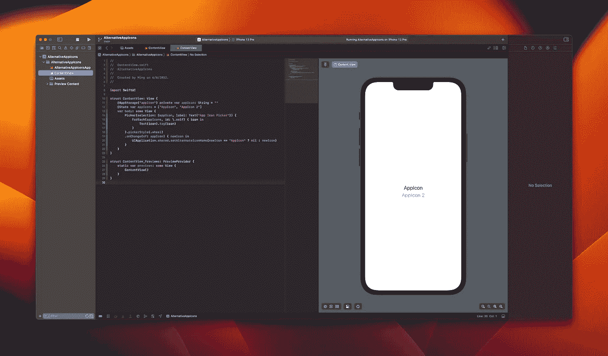
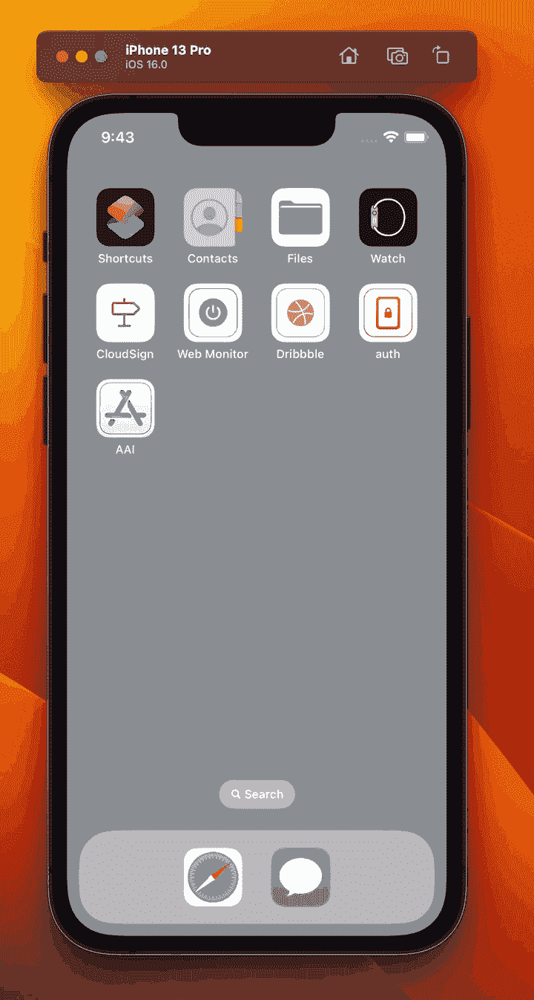
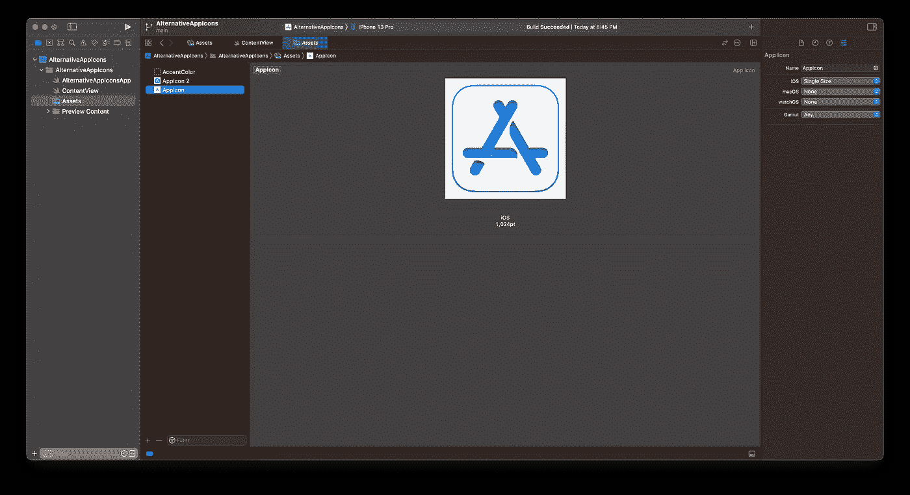
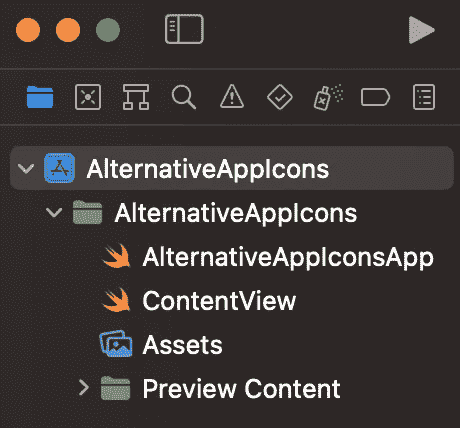
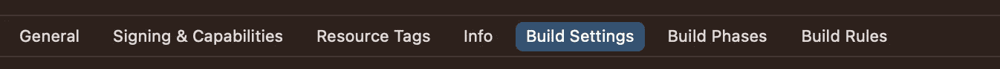
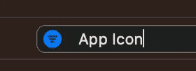
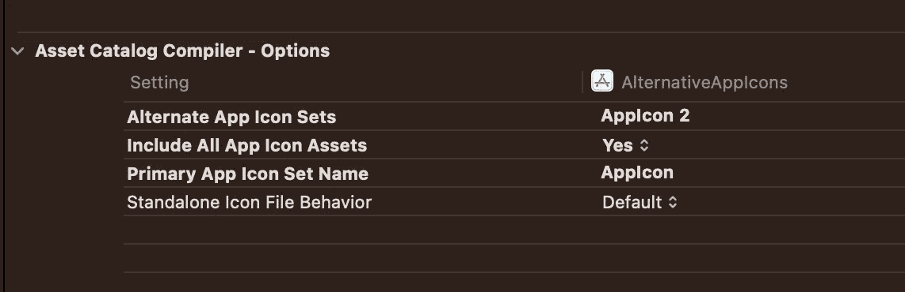
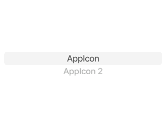

# 如何:使用 SwiftUI 为 iOS 16 创建应用程序图标选择器

> 原文：<https://levelup.gitconnected.com/how-to-create-app-icon-picker-with-swiftui-for-ios-16-e48446aab58e>

## 让用户用几行代码选择一个替代的应用程序图标。

凭借 iOS16 的优势，用户现在可以更容易地选择替代图标。下面的 GIF 结果是我们期望在本教程后看到的。我们开始吧！

## 发展环境

*   iOS 16 beta 4 或以上
*   Xcode 14 beta 4 或更高版本

## 步伐

1.  在资产文件夹中创建 2 个或更多应用程序图标。
    **使用 iOS 16，可以使用单一尺寸图片作为 App 图标。🎉**

2.转到根项目，蓝色的应用程序商店图标一。

3.选择`Build Settings in the top bar.`

4.在搜索栏中输入“应用程序图标”。

搜索字段

5.1.将`Include All App Icon Assets`从`No`改为`Yes`。
5.2。将图标名称(除了默认的`AppIcon`)添加到`Alternate App Icon Sets`。

5.1–5.2

6.1.使用选择器/按钮允许用户选择应用程序图标字符串。
6.2。用 onChange 或 action 观察用户选择，然后处理:
`UIApplication.shared.setAlternateIconName(STRING)`

警告框是由 Apple 生成的。不需要进一步的代码/操作。

## 示例代码片段

## 有问题吗？

别担心！找到下面的源代码。您可以随时打开新的问题并提问。

 [## GitHub-1998 code/AlternativeAppIcons:让用户在 iOS 16 上用 SwiftUI 选择应用图标

### 此时您不能执行该操作。您已使用另一个标签页或窗口登录。您已在另一个选项卡中注销，或者…

github.com](https://github.com/1998code/AlternativeAppIcons) 

## 感谢阅读:)

## 跟踪并关注最新技术。

 [## 明@ 1998 设计

### 现在跟随

twitter.com](https://twitter.com/1998design) 

# 分级编码

感谢您成为我们社区的一员！在你离开之前:

*   👏为故事鼓掌，跟着作者走👉
*   📰查看[升级编码出版物](https://levelup.gitconnected.com/?utm_source=pub&utm_medium=post)中的更多内容
*   🔔关注我们:[Twitter](https://twitter.com/gitconnected)|[LinkedIn](https://www.linkedin.com/company/gitconnected)|[时事通讯](https://newsletter.levelup.dev)

🚀👉 [**加入升级人才集体，找到一份惊艳的工作**](https://jobs.levelup.dev/talent/welcome?referral=true)