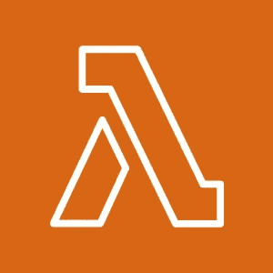
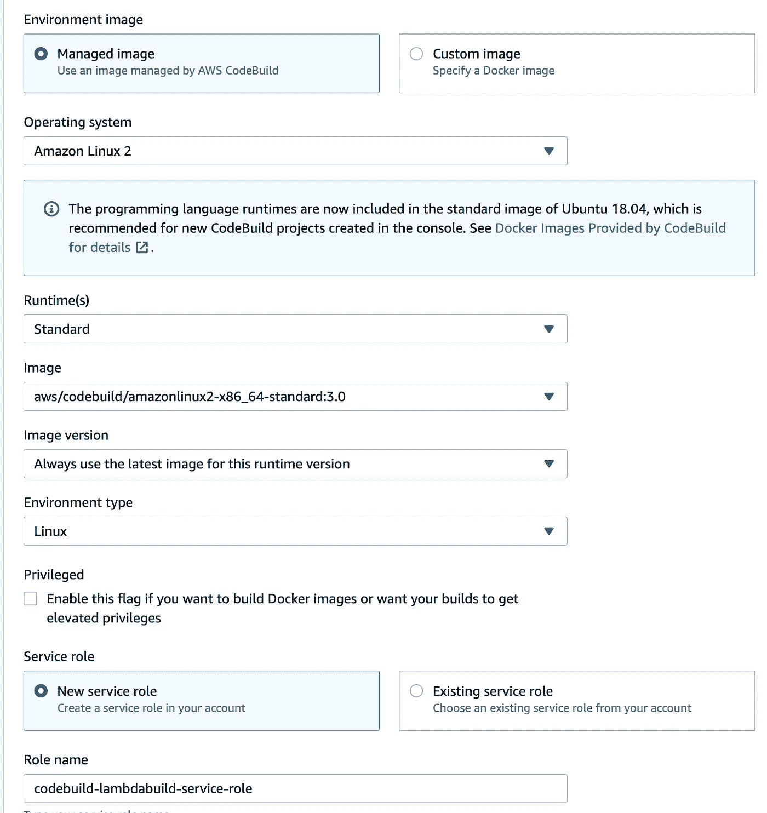

# 如何为无服务器 Lambda 函数创建 AWS 云本机 CI CD 设置

> 原文：<https://levelup.gitconnected.com/how-to-create-aws-cloud-native-ci-cd-pipeline-for-lambda-acdf6f7fccd>



缩略图*叹息*的强制标志

AWS Lambda 是一种无服务器的事件驱动计算服务，允许您运行代码，而无需担心基础设施管理或供应。作为功能即服务(FaaS)的一部分，它的按使用付费模式提供了无限的可能性，尤其是在 AWS 环境中。

但是，没有明确的方法为 AWS Lambda 这样的无服务器设置设置 CI/CD 解决方案。在本文中，我们的目标是使用原生 AWS 服务:Codepipeline 和 Cloudformation 为 AWS Lambda 等无服务器服务创建 CI/CD 解决方案。类似的步骤也可以复制到 GCP 和 Azure。

我们将首先看一下关于我们正在做什么的一些理论。然后，我们将创建适当的代码和设置。然后，我们将创建管道，最后，我们将端到端地测试管道。

# 步骤 0:我们实际在做什么？

请转到本步骤的末尾查看简明摘要。请继续阅读我们做这些事情背后的详细原因:)。

任何 CI/CD 设置，如 AWS Codepipeline、Jenkins 等。由 3 个主要部分组成:

*   我们提交代码和维护回购的源代码仓库。这也将触发我们的渠道。例如:代码提交，饭桶。
*   一个构建解决方案，它根据提供的指令从 repo 构建源代码。也叫 CI。代码构建，詹金斯。
*   部署构建代码的部署解决方案。它使用某种部署代理。也称为 CD。通常，它是 CI 解决方案的一部分。例如:代码部署，詹金斯。

在这个解决方案中，对于源代码回购，我们将使用 CodeCommit。对于构建解决方案，我们将使用 CodeBuild。最后，对于部署解决方案，我们将使用带有 Cloudformation 的 CodeDeployment 作为部署代理。

为什么是云形成？这是因为 Lambda 的部署方式。根据官方的[文档](https://docs.aws.amazon.com/lambda/latest/dg/lambda-deploy-functions.html)，你可以通过上传一个 zip 文件档案，或者通过创建和上传一个容器映像来将代码部署到你的 Lambda 函数中。

当您使用 Lambda 控制台或工具包创作函数时，Lambda 会自动为您的代码创建一个. zip 文件存档。

当您使用 Lambda API、命令行工具或 AWS SDKs 创建函数时，您必须创建一个部署包。如果函数使用编译语言，或者要向函数添加依赖项，还必须创建部署包。要部署您的函数代码，您可以从亚马逊简单存储服务(亚马逊 S3)或您的本地机器上传部署包。

这里的可以引用一个 Python 包构建的例子[。因此，很明显会创建一个包。所以，我们可以使用 Cloudformation 打包并上传到 Lambda。](https://docs.aws.amazon.com/lambda/latest/dg/python-package.html)

现在，如果你想更新你现有的 Lambda 函数呢？如果现有功能是使用 Cloudformation 或无服务器应用程序模型(SAM)模板创建的，您可以将构建步骤放在 CodeBuild 中。然而，如果它是使用 Lambda 控制台而不是使用任何包来完成的，您将需要使用 [update-function-code](https://docs.aws.amazon.com/cli/latest/reference/lambda/update-function-code.html) API 调用来更新 Lambda 函数的源代码(在构建包之后)。

因此，综上所述，建议使用 Cloudformation 或 SAM 来部署 Lambda 功能。否则，在第一次创建函数时，您将需要一个 [create-function](https://docs.aws.amazon.com/cli/latest/reference/lambda/create-function.html) API 调用，然后在随后的更新中更新函数代码。通过使用 Cloudformation，您可以简单地定义包，Cloudformation 会完成剩下的工作。

但是，如果您希望节省成本(和复杂性)，请使用控制台或 AWS CLI 首次创建您的函数，然后在构建文件中使用以下命令进行后续更新:

```
aws lambda update-function-code --function-name MyLambdaFunction --zip-file fileb://my-deployment-package.zip
```

**所以长话短说(TL；CodeCommit 将存储我们的代码。CodeBuild 将创建 zip 包并构建 Cloudformation 工件。CodeDeploy 将部署这个云形成人工制品。所有这些步骤都将使用 CodePipeline 捆绑在一起。现在，随着理论的方式，让我们建立！**

# 步骤 1:完成先决条件

从前面的步骤可以清楚地看出，我们需要以下三样东西:

*   λ码(咄！).
*   IAM 授权 Cloudformation 访问 Lambda。
*   部署 Lambda 代码的 Cloudformation 模板。
*   Buildspec.yaml 文件来指导 CodeBuild 构建和打包我们的 Lambda 代码。

让我们逐一完成:

## a)λ代码:

对于代码部分，我们将使用默认的 Python 代码，没有从 AWS 文档[引用的依赖项，这里是](https://docs.aws.amazon.com/lambda/latest/dg/python-package.html#python-package-create-package-with-dependency)。然而，这个演示也适用于任何其他代码，包括依赖关系。仅包含依赖项(如请求包等。)，您需要对文件夹的结构更加小心，以创建正确的。zip 文件。否则你会得到导入错误。

不需要增加这篇文章的长度。按照这里提到的所有步骤[创建。部署包的 zip 文件。我在这个演示中使用了相同的文件夹名称和相同的代码。仅供参考，我们这个演示的包名是:*my-deployment-package . zip*。](https://docs.aws.amazon.com/lambda/latest/dg/python-package.html#python-package-create-package-no-dependency)

## b) IAM 授权 Cloudformation 访问 Lambda:

由于 Cloudformation 将直接访问 Lambda 并进行更改，我们需要创建适当的角色来允许 Cloudformation 访问。

进入 IAM->Roles->Create Role，选择 Cloudformation 作为可信实体。在策略中，附加: *AWSLambdaExecute* 托管策略。现在，单击“*创建策略*，并创建以下自定义策略:

将此自定义策略也附加到您在上一步中的角色。

给定一个合适的名称并创建这个角色。记住这个名字，因为我们以后会用到它。

## c)部署 Lambda 代码的 Cloudformation 模板

现在有两种使用 Cloudformation 定义 Lambda 函数的方法。首先是通过使用`[AWS::Lambda::Function](https://docs.aws.amazon.com/AWSCloudFormation/latest/UserGuide/aws-resource-lambda-function.html)` *。*其次是通过使用`[AWS::Serverless::Function](https://docs.aws.amazon.com/serverless-application-model/latest/developerguide/sam-resource-function.html)`，它在内部使用 SAM 模板。

你可以使用其中任何一个。对于本教程，我选择了`AWS::Serverless::Function`,仅仅是因为它不太复杂，还因为如果将来我们想扩展到 SAM 模板，我们不需要重新定义模板。

为了更好地说明缩放部分，请注意我们将使用`AWS::Serverless` transform 宏。用 AWS 自己的[话来说](https://docs.aws.amazon.com/AWSCloudFormation/latest/UserGuide/transform-aws-serverless.html):CloudFormation 托管的宏`AWS:Serverless` transform，采用 AWS 无服务器应用模型(AWS SAM)语法编写的整个模板，将其转换和扩展为兼容的 cloud formation 模板。

因此，对于我们来说，使用 SAM 模板来进一步扩展会容易得多。

记住这一点，请在下面找到标题为 unpacked.yaml 的云信息模板:

```
Transform: AWS::Serverless-2016-10-31
Resources:
  DemoServerless:
    Type: AWS::Serverless::Function
    Properties:
        Runtime: python3.8
        Handler: lambda_function.lambda_handler
        CodeUri: ./my-deployment-package.zip
        PackageType: Zip
```

适当地选择运行时和处理程序。函数处理程序反映了函数名(`lambda_handler`)和存储处理程序代码的文件(`lambda_function.py`)。更多细节可以在官方文件[这里](https://docs.aws.amazon.com/lambda/latest/dg/python-handler.html)找到。

CodeUri 将与您在上一步中创建的部署包相同。请注意，我们没有引用 S3 的位置，而是使用 S3 的本地参考，并将使用 Cloudformation [package](https://docs.aws.amazon.com/cli/latest/reference/cloudformation/package.html) 命令来引用它们。

同样，用 AWS 自己的[话来说](https://docs.aws.amazon.com/AWSCloudFormation/latest/UserGuide/using-cfn-cli-package.html):您可以在模板中指定本地引用，称为本地工件，然后使用`package`命令快速上传它们，而不是手动将文件上传到 S3 桶中，然后将位置添加到您的模板中。

因此，如果您指定了一个文件，`package`命令会直接将它上传到 S3 存储桶。上传工件之后，该命令返回您的模板的副本，用该命令上传工件的 S3 位置替换对本地工件的引用。然后，您可以使用返回的模板来创建或更新堆栈。在我们下一步构建 Buildspec.yaml 文件时，会有更多的细节。

## d) Buildspec.yaml 文件来指示 CodeBuild 构建并打包我们的 Lambda 代码。

我们已经准备好了云层模板。我们已经准备好了 Lambda 压缩文件。现在是时候创建命令来创建 Lambda 堆栈了。

一个 *buildspec* 是构建命令和相关设置的集合，采用 YAML 格式，代码构建使用它来运行构建。它分为诸如预构建、构建等阶段。我们不会深入它的细节，但是你可以在这里找到完整的语法和更多可用的信息。

我们使用以下文件:

```
version: 0.2
phases:
  pre_build:
    commands:
      - zip my-deployment-package.zip lambda_function.py
  build:
    commands:
      - aws cloudformation package --template-file unpacked.yaml --s3-bucket <bucketname> --output-template-file packed.yaml
artifacts:
  files:
  - unpacked.yaml
  - packed.yaml
```

`pre_build`阶段用于为 Cloudformation 模板创建 zip 文件。为什么我们要再次创建 zip？这是因为，如果您只是对代码进行任何更改，CodeBuild 将确保自动创建 zip 文件，并且您不需要在每次更改代码时手动创建 zip 文件。

在`Build`阶段，如前所述，我们使用`package`命令引用之前创建的 Cloudformation 模板中给出的本地 zip 文件(`unpacked.yaml`)。`packed.yaml`将是输出文件。请确保在工件部分引用了这两者。

# 步骤 2:建立管道

一切准备就绪，现在让我们来建造管道吧！

## 代码提交

首先，转到 CodeCommit->Repositories 并创建一个存储库。按照前提条件和给出的步骤在您的本地系统中克隆 repo。我在用 HTTPS。

把上一步创建的文件(`lambda_function.py and my-deployment-package.zip`)。另外，放上之前创建的云形成模板(`unpacked.yaml`)和`buildspec.yml`文件。

办手续:

```
git add .
git commit -m "first commit"
git push origin master
```

代码现在会上传到我们的回购。

现在，随着我们的 repo 启动并准备就绪，我们将创建一个使用 CodeBuild 和 CodeDeploy 的端到端 CI/CD 管道。

## **具有代码构建的代码管道:**

首先，我们构建我们的项目。转到 CodePipeline，然后单击 New Service Role。


在下一部分中，选择 source provider 作为 AWS CodeCommit，选择您的 repo 和分支，并将其余内容保持默认:


在 Build Provider 部分，选择 AWS CodeBuild，并点击 Create a New Project(如果还没有创建的话)。


在打开的弹出窗口中，输入以下设置:

*   **环境图像**:管理图像
*   **操作系统**:亚马逊 Linux 2
*   **运行时**:标准
*   **图片**:AWS/code build/amazonlinux 2-x84 _ 64-标准:3.0
*   **镜像版本**:总是使用这个运行时版本的最新镜像
*   **环境类型** : Linux
*   **服务角色**:新服务角色



*   保留附加配置。转到 Buildspec。
*   构建规范:使用一个构建规范文件。
*   **Buildspec Name** (可选):如果您的 Buildspec 文件使用不同于 buildspec.yaml 的名称，或者位于不同于存储库根目录的位置，请在此处输入其来自源根目录的路径(例如，buildspec-two.yml 或 configuration/buildspec.yml)。
*   **日志**:选择 Cloudwatch 日志(可选)。请注意，这将花费一点额外的费用，但对调试非常有用。


单击“继续到代码管道”继续。您应该会看到“在 CodeBuild 中成功创建”消息和所选的项目名称。


然而，这是步骤的一半。记住，在构建步骤中，Cloudformation 将引用本地包。但是，它会将包放入我们在“s3-bucket”参数中指定的 S3 桶中。因此，如果我们不向 S3 putObjects 提供代码构建权限，我们将得到 S3 访问被拒绝错误。

因此，打开一个新的选项卡，然后在 AWS 控制台中进入 CodeBuild。选择您创建的构建项目，并选择“构建细节”选项卡。在环境部分向下滚动，并单击 ServiceRole。

这将在 IAM 中打开一个新标签。这里，要么为 buildspec.yml 中指定的目标 bucket 添加 S3 putObjects 权限(从 AddPermissions 选项卡)，要么如果您像我们大多数人一样懒惰，只需添加 S3FullAccess 托管策略。这将是一个安全警告！

现在让我们回到我们离开的代码管道选项卡。选择“构建类型”为“单一”,然后单击“下一步”转到部署。

## 使用 CodeDeploy 的代码管道:

现在，我们使用 CodeDeploy 进入部署阶段。使用以下设置:

*   **部署提供者** : AWS Cloudformation
*   **动作模式:**创建或更新堆栈
*   **堆栈名称:**输入将由 Cloudformation **创建的堆栈名称。**如果您正在更新现有堆栈，选择该堆栈名称。
*   **Template:** 选择工件名称作为 BuildArtifact，并在文件名中提供我们在 buildspec.yml 中指定的 Cloudformation 构建步骤文件的输出，在本例中，它将是 packed.yaml。
*   **能力**:选择“能力 _IAM”和“能力 _ 自动 _ 扩展”。


*   **角色**:选择我们在步骤 1: IAM 授权 Cloudformation 访问 Lambda 步骤中创建的角色。点击下一步。

做最后一次检查，然后点击创建管道。

# 步骤 3:测试管道

第一次创建管道后，默认情况下，您会在管道窗口中看到正在进行的第一次构建。可以查看详情，建立日志等。您可以单击部署阶段的详细信息来检查 Cloudformation 堆栈本身。如果一切顺利，你将在这三个阶段都获得成功！

要验证它是否成功，请转到您的 Lambda 控制台，在那里，您应该会看到一个名为的新函数，其格式为: <pipelinename>- <cloudformationtemplatename>- <somerandomid>。</somerandomid></cloudformationtemplatename></pipelinename>

恭喜你走到这一步！

现在，我们将测试从源代码到部署的管道。对代码做一些小的修改，然后提交到为 CodeCommit 创建的 github repo 中。

您的管道现在应该会自动开始一个新的构建。在 Cloudformation 事件中，您会看到它正在更新现有的堆栈。


如果您现在在同一个函数中检查您的代码，您会看到这些更改已经被更新了！

瞧，从源代码到生产 Lambda，全部使用 AWS 原生 CI/CD 解决方案。

# 结论

使用 Lambda 的本地 AWS 服务创建 CI/CD 解决方案的步骤到此结束。

我们首先研究了 Lambda 如何为其代码使用 zip 包的理论。然后，我们通过创建 buildspec.yml、Cloudformation 模板并创建适当的角色来完成先决条件。

然后，我们使用 CodePipeline 从 AWS 存储库 CodeCommit 获取代码，使用 CodeBuild 构建和打包我们的 Cloudformation 模板，最后使用 CodeDeploy 部署我们的 Cloudformation 模板堆栈。

我们最后从源代码到产品测试了我们的 Lambda 代码，看到任何提交更改都会自动启动管道，Cloudformation 通过更新现有堆栈无缝地部署它。

我真诚地相信，无服务器很快就会赶上容器世界，容器和无服务器将携手走向 DevOps 的未来，用于无服务器的云原生 CI/CD 解决方案将更加普遍。

AWS EKS·法盖特是这种容器和无服务器融合的先行者之一。如果您对这些感兴趣，请点击此处查看在 EKS 法盖特[部署 2 层多容器解决方案(带 CI/CD)的步骤。](https://medium.com/@shrut_terminator/how-to-deploy-a-multi-container-two-tier-go-application-in-eks-fargate-6266494f5bcf)

希望你喜欢这篇文章和演示。请随意放弃任何疑问和评论。拍手取乐:)。