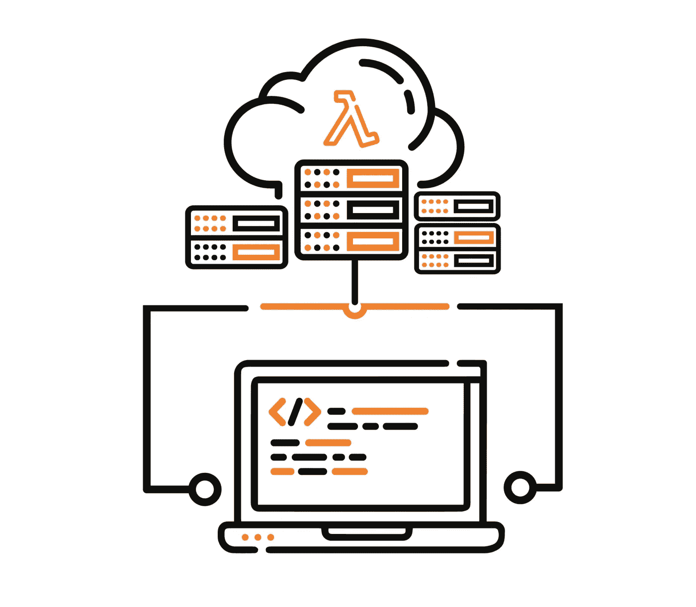

# 如何在 Java 11 中创建 AWS Lambda

> 原文：<https://levelup.gitconnected.com/how-to-create-aws-lambda-in-java-11-9b034a73d399>

## 以下是 Lambda 部署所需的内容



[来源](https://medium.com/kredx-engineering/aws-lambda-best-practices-e15724fd02d3)

部署 AWS Lambda 很难。从我自己的经验来看，用 Java 实现 Lambda 更难。

本教程将帮助您创建 Lambda 并将其部署到 AWS。这里是你在 Java 11 中构建 Lambda 所需要的。

# Lambda 代码是什么？

Lambda 实现了类`RequestHandler<IN, OUT>`。Type `IN`是 lambda 的输入类型。式中`OUT`是λ结果的类型。您需要为类型`IN`提供 Jackson 反序列化。类型`OUT`可以是一个简单的字符串化 JSON。

请求体输入模型

我们需要定位端点，因此需要配置`WebClient`。对于本教程，SSL 设置为不安全。在生产中，应该设置安全`TrustManagerFactory`。要配置 HttpClient 进行日志记录，我们可以使用`wiretap`方法。部署时，日志将在`CloudWatch`中提供。

第一个请求需要一个自定义表单作为主体。我们在主体中设置了`Mono#just`。如果没有问题，我们继续第二个请求。

第二个请求没有请求体，但有一个查询参数。我们使用`WebClient#uri`方法放置参数。在`retrieve`完成之后，我们以`String`的格式返回响应。

端点在`Dockerfile`中。另一种选择是使用`application.properties`。因为简单的覆盖，我使用了 Docker 属性。

# 属国

AWS 所需要的就是`aws-lambda-java-runtime-interface-client`依赖性。这包含了`RequestHandler`，以及我们稍后将使用的错误处理异常。

我的 lambda 会触发两个端点。如果第一个端点成功，则定位第二个端点。我将使用`WebClient`来处理 HTTP 请求。为了包含`WebClient`，我们需要`spring-boot-starter-webflux`。

# 容器图像

Docker 文件包含环境属性和命令。我将使用`openjdk11`而不是 15。前两个属性是 env 属性，都是我需要定位的端点。

将`JAVA_TOOL_OPTIONS`设置为[启用网络性能优化](https://stackoverflow.com/a/57892679/5999670)。这些选项将允许访问 netty 的内部模块。lambda 不一定要工作，但是你会得到警告。

接下来，我们复制目标依赖项，并复制应用程序的实际 jar。第一次复制操作将发生在依赖关系更改之后。当依赖关系没有变化时，Docker 映像的创建速度会更快。第二个将打包的项目复制到 docker 映像中。

我们需要将`function/`和`AWSLambda`放在类路径中。*为什么？*所以我们可以在`Dockerfile`的`CMD`中调用`handleRequest`方法。`CMD`将与`ENTRYPOINT`连接，这将执行我们的处理程序。

让我们看看构建过程是如何工作的。

# 构建流程

构建 jar 文件是用`mvn compile package`完成的。下面是 pom.xml。

[来源](https://rieckpil.de/java-aws-lambda-container-image-support-complete-guide/)

完成后，你需要创建`Docker`图像。

```
docker build . -t test-lambda:latest
```

# 如何在本地进行测试

你需要先为你的机器安装 Docker。为了在本地测试，你需要 AWS Lambda RIE。安装 RIE，把可执行文件放到 path 中，然后你就可以运行 docker 容器了。

这个命令将旋转一个监听端口`9000`的 Docker 容器。与 Dockerfile 中的一样，您需要使用`-cp`将类放到类路径中。最后一个类`(com.zivce.aws.TestLambda)`是实现 AWS `RequestHandler`的类。

*如何测试实现？以下是方法。*

你需要用`requestBody`瞄准端口`9000`。`requestBody`的类型需要是`RequestBody`。

让我们来处理错误。

# 如何处理 Lambda 错误

使用`WebClient#onStatus`方法进行错误处理。`onStatus`的消费者有以下签名`Function<ClientResponse, Mono<? extends Throwable>> errorHandler`。

错误处理程序的输入是保存错误的`ClientResponse`。输出是`Mono<Throwable>`，在我们的例子中，它是`LambdaRuntimeClientException`的子类。

你应该有异常内的`statusCode`。*为什么？*因为错误过滤，你需要在 API 网关上做。

# 如何将 Lambda 部署到 ECR

首先，您需要登录 AWS ECR。

为您的`Docker`图像创建存储库。

构建、标记和推送您的图像到 ECR。

连接容器镜像和 API 网关在这里[描述](https://aws.amazon.com/blogs/aws/new-for-aws-lambda-container-image-support/)。

# 参考

[1] [Java AWS Lambda 容器教程](https://rieckpil.de/java-aws-lambda-container-image-support-complete-guide/)