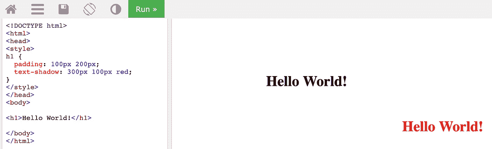

# 如何使用 CSS 文本阴影属性创建块文本

> 原文：<https://levelup.gitconnected.com/how-to-create-block-text-using-the-css-text-shadow-property-f43d4f5cdb84>

帮助您创建视觉对比和阴谋，而不用使用一百万种不同的字体。

作者截图

在构建一个新项目时，我想在不混合太多字体的情况下，与我的主页`h1`形成一些对比。我个人认为，当网站变得“字体疯狂”时，我会很恼火，因为我的注意力开始集中在文本的风格上，而不是内容本身。我的第一步是浏览可用的谷歌字体，但我没有找到任何我渴望使用的“神圣”文本字体。经过大量的搜索，我意识到`text-shadow`属性实际上可以实现我正在寻找的东西。

下面是用来创建你上面看到的标题的最终 CSS 元素。如果你想更深入地了解`text-shadow`房产，请继续阅读到文章末尾。

# TL；DR —最终代码

急着要最终代码？在这里…

以上是我们文本的 HTML。

以上是我们标题的最终 CSS 代码。

# 分解文本阴影

在我开始在`.title`选择器中解释我的 CSS 的其余部分之前，让我们来看看`text-shadow`的基本构成。

顾名思义，CSS 中的`text-shadow`属性给文本添加了阴影。至少，`text-shadow`有两个值，分别代表**水平**和**垂直**值。`text-shadow`的可选值包括**模糊**值和**颜色**值。我们将开始查看使用水平、垂直和颜色值的`text-shadow`的不同示例。这样会更容易区分阴影和原文。

值得注意的是,`text-shadow`属性创建了整个文本的副本，并根据您提供的值水平或垂直移动它。让我们来看看实际情况:

使用 W3Schools 的代码编辑器生成的代码。

在上面的代码中，我们看到`text-shadow`的水平值被设置为`300px`，垂直值被设置为`0px`，颜色值被设置为`red`。这个例子虽然有些夸张，但展示了`text-shadow`如何创建我们文本的副本，并使其符合我们的规范。结果是红色的`text-shadow`被水平移动`300px`和垂直移动`0px`。

# 正值和负值

关于`text-shadow`的水平和垂直值，接下来要知道的是它们可以是正的也可以是负的。一个**正**像素值将水平值向右**移动**，同时将垂直值**向下**移动。

如果我们调整我们的代码来包含一个垂直值`100px`，我们可以看到我们的阴影现在在原文下面`100px`。

文本阴影具有正的水平值(300 像素)和正的垂直值(100 像素)。这将文本阴影向右移动 300 像素，并在原始文本下方移动 100 像素。使用 W3Schools 的代码编辑器生成的代码。

如果我们改变我们的水平和垂直值为负，我们的阴影将向左移动，向上移动，向上移动，T21。让我们实现一些更改，并在下面的代码中看看这是如何工作的。

文本阴影的水平值为负(-200 像素)，垂直值为负(-50 像素)。这将文本阴影向左移动 200 像素，并在原始文本上方移动 50 像素。使用 W3Schools 的代码编辑器生成的代码。

现在，我们的阴影(红色)在原文的左边`-200px`和上方`-50px`。

下面是一个简单的图表，帮助您直观地了解正负水平和垂直值如何改变`text-shadow`的位置。

上图显示了文本阴影出现的位置，这取决于正负水平/垂直值。作者图表

# 模糊值(可选)

模糊值是可选的第三个值，可以添加到`text-shadow`中。该值与水平和垂直值一样，在`px`中表示。模糊像素值越低，图像越清晰，反之亦然。随着模糊`px`值的增加，`text-shadow`变得更加分散和不透明。

上面的截图显示了一个 2px 模糊值的文本阴影。使用 W3Schools 的代码编辑器生成的代码。

左边是以模糊值为内容的原文。右边是带有上述模糊值的文本阴影。

# 颜色值(可选)

颜色是`text-shadow`属性的第四个可选值。您不需要为了在您的`text-shadow`属性中分配一个颜色值而包含一个模糊值，您可以简单地为水平、垂直和颜色分配`text-shadow`值。然而，如果您选择不将模糊值分配给`text-shadow`，最好的做法是包含一个`0`或`0px`。

另外，颜色可以写成文本值，如`white`，也可以写成相应的十六进制码(`#ffffff`)或十进制码(`rgb(255,255,255)`)值。

上面的截图给我们的文本阴影分配了一个颜色值#ffc0cb。如果我们将颜色的值设为“粉色”或 rgb(100，75，80)，我们会得到相同的结果。使用 W3Schools 的代码编辑器生成的代码。

# 添加多个文本阴影

除了四个核心值——水平、垂直、模糊和颜色— `text-shadow`允许我们创建多个具有独特属性的阴影。

要添加多个`text-shadow`，只需添加另一行水平、垂直、模糊和颜色值。核心价值的每一个额外的行应该用逗号分开，最好放在单独的一行。请看下面的例子，我们使用两个`text-shadow`属性在文本中创建 3D 效果。

此示例包括两个文本阴影属性，用于创建 3D 文本效果。使用 W3Schools 的代码编辑器生成的代码。

如果我们渲染模糊效果，将水平和垂直值保留在`0`，我们可以创建一个发光的霓虹灯效果！

使用 W3Schools 的代码编辑器生成的代码。

# 最后…创建块文本！

既然我们已经介绍了基础知识，那么在本文开始时创建块标题文本似乎并不困难。下面是 CSS 中除了`text-shadow`之外的每一行正在做的事情的分解——我们将一步一步地查看它！

创建块文本的 CSS 代码分解。作者图解。

# 文本-阴影:第一行

在我们的`text-shadow`的第一行，我们正在创建一个水平移动`-1px`和垂直移动`1px`的小阴影，将阴影放置在原文的**左下方**。这个阴影的颜色值是浅紫色。下面是标题的样子，只有`text-shadow`中的第一行。

只有我们的文本阴影的第一行被应用在我们的 CSS 代码中。

这是我们的文本阴影代码中第一行的标题。

# 文本-阴影:第 2 行

我们的`text-shadow`中的第二行是创建一个水平移动`1px`和垂直移动`1px`的阴影，将阴影放置在原文的**右下方**。有了这两行，我们就完成了一半的完整文本效果！

# 文本-阴影:第 3 行

我们的第三行`text-shadow`正在创建一个水平移动`1px`和垂直移动`-1px`的阴影，将它放置在原文的**右上角**。

有了这三行代码，我们很容易认为我们已经完成了，但事实并非如此！如果你想一想我们到目前为止在图表方面所做的事情，我们已经在四个象限中的三个中创建了阴影，并且缺少了**左上角的**象限(负水平和负垂直值)。

正/负图向我们展示了到目前为止我们在文本阴影属性方面的进展。对于代码集的前三行，我们只是错过了左上角的象限。

# 文本-阴影:第 4 行

我们的`text-shadow`属性中的最后一行通过添加水平移动`-1px`和垂直移动`-1px`的阴影来完成块文本效果，将阴影放置在原始文本的左上**处。**

我们的块文本效果的全文阴影代码在这里！

我们的方块文本完成了——耶！！！

# 结论

如果你跟了我这么久，那就太好了！您不仅掌握了 CSS 中`text-shadow`属性的艺术，而且还创建了一些非常棒的块文本，非常适合您的下一个项目。

感谢阅读。如果你觉得这篇文章有用，请留下评论和/或鼓掌！