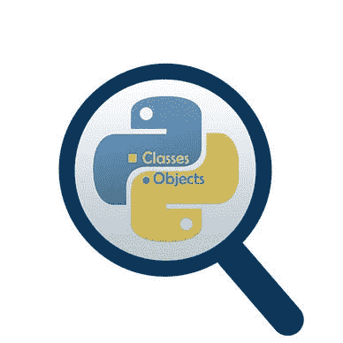

# 如何在 Python 中创建可调用对象:Python OOP 完整教程—第 20 部分

> 原文：<https://levelup.gitconnected.com/how-to-create-callable-objects-in-python-python-oop-complete-course-part-20-15fe46e3e2c3>

## 了解如何在 Python OOP 中调用你的类对象。


照片由 [Arturo Rey](https://unsplash.com/@arturorey) 在 [Unsplash](https://unsplash.com/s/photos/callable-objects) 拍摄

在我们开始之前，让我告诉你

*   这篇文章是 Python 面向对象编程完整课程的一部分，你可以在这里找到它。
*   所有资源都可以在下面的“资源”部分找到。

## 介绍

你试过调用你的类对象吗？？

在编写 Python 代码时，通常可以调用预定义的函数和方法，但不能调用类对象。

重要的是要知道在 Python 中你可以将你的对象转换成**可调用的**对象。要了解如何做到这一点，请继续阅读…

**目录**

1.  [什么是可调用对象？](#963f)
2.  [如何使对象可调用](#39b4)
3.  [如何覆盖](#4b1c) `[__call__](#4b1c)` [方法？](#4b1c)

## 1.什么是可调用对象？

它是可以像 Python 中任何其他传统函数一样调用的对象。

这些对象最常见的一个用例是在**深度学习**库中(如`PyTorch`)，在这些库中可以调用数据转换类对象。
在这种情况下，首先，你定义一个对象并通过所需的转换参数初始化它，然后你调用这个对象将实际的转换应用到数据本身。

## 2.如何使对象可调用

简单地说，你通过覆盖特殊方法`__call__()`使一个对象**可调用**。

`__call__(self, arg1, .., argn, *args, **kwargs)`:这个方法和 Python 中的其他普通方法一样。它还可以接受位置参数和任意参数。当你在你的类中定义这个方法时，你实际上是在定义当你的类中的一个对象被调用时的行为。如果需要，这个方法**返回**一个值。

## 3.如何重写 __call__ 方法？

现在，让我们看一个真实的用例来理解**可调用的**对象。

这个例子的灵感来自于 NLP 的深度学习库。假设您想要定义一个`TextSlicing`类来帮助您从字符串中提取一些单词。在这个例子中，我假设这个类有两个实例属性:

*   `world_ind`:也就是第一个字的位置。
*   `num_words`:你要返回的字数。

为了使这些类对象可调用，我们必须覆盖`__call__()`方法。这个方法将决定这个类应该如何根据属性`word_ind`和`num_words`分割传递的文本。

下面的代码显示了类定义和两个具有不同参数的不同对象。

输出:

```
['I', 'Live']
['USA.', 'I']
```

正如您所看到的，对象的行为取决于参数的值，这就是创建一个可调用对象的简单程度。

现在，让我们总结一下我们在这篇文章中学到了什么。


照片由[安 H](https://www.pexels.com/@ann-h-45017/) 在[像素](https://www.pexels.com/)上拍摄

*   **可调用对象:**是 Python 中可以像其他传统函数一样调用的对象。
*   您可以通过覆盖特殊方法`__call__()`来使您的类的对象**可调用**。

***附:*** 非常感谢您花时间阅读我的故事。在你离开之前，让我快速地提两点:

*   首先，要直接在您的收件箱中获得我的帖子，请在此处订阅[](https://medium.com/@samersallam92/subscribe)*，您可以在此处关注我*[](https://medium.com/@samersallam92)*。***
*   ***第二，作家在媒体上赚了几千美元。为了无限制地访问媒体故事并开始赚钱， [***现在就注册成为媒体会员***](https://medium.com/@samersallam92/membership) ，每月仅需 5 美元。通过此链接 报名[***，可以直接支持我，不需要你额外付费。***](https://medium.com/@samersallam92/membership)***

**

萨梅尔·萨拉姆** 

## **Python 面向对象编程的完整教程**

**[View list](https://medium.com/@samersallam92/list/the-complete-course-in-objectoriented-programming-in-python-7b54126a7f4e?source=post_page-----15fe46e3e2c3--------------------------------)****24 stories**************

**要回到上一篇文章，您可以使用以下链接:**

**[第 19 部分:如何在 Python OOP 中创建自定义上下文管理器](/how-to-create-a-custom-context-manager-in-python-oop-python-oop-complete-course-part-19-6f6647a97f5c)**

**要阅读下一篇文章，您可以使用以下链接:**

**[第 21 部分:Python OOP 中的特殊方法结论](/special-methods-in-python-oop-conclusion-python-oop-complete-course-part-21-23eba4b18d3)**

## **资源:**

*   **GitHub [这里](https://github.com/samersallam/The-Complete-Course-in-Object-Oriented-Programming-in-Python/tree/main/Callable%20Objects)。**