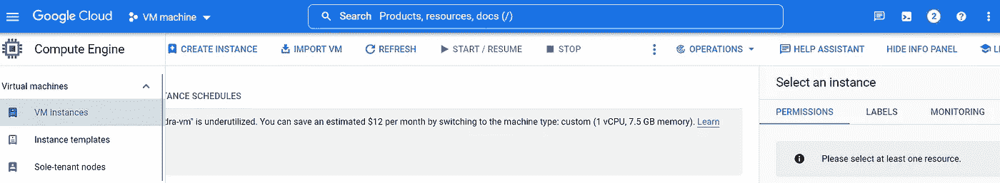
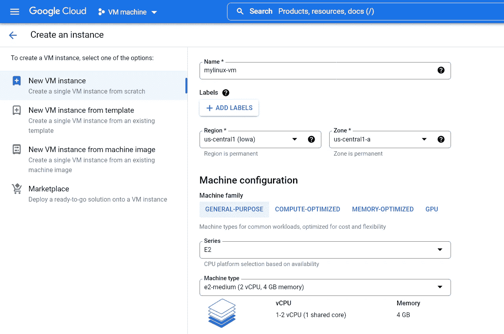
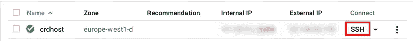

# 如何在谷歌云平台上创建 chrome 远程桌面 Linux 虚拟机

> 原文：<https://levelup.gitconnected.com/how-to-create-chrome-remote-desktop-linux-virtual-machine-on-google-cloud-platform-ed8e6159701c>


图片来源:Waferwire

在本文中，我们将在谷歌云平台(GCP)上创建基于 chrome 远程桌面的 Linux 虚拟机(VM)。

## 开始之前，请完成以下步骤

1.  在 Google Cloud 控制台中，在项目选择器页面上，选择 [**或**](https://cloud.google.com/resource-manager/docs/creating-managing-projects) 创建一个 Google Cloud 项目。

> **注意**:如果您不打算保留在此过程中创建的资源，请创建一个项目，而不是选择一个现有的项目。完成这些步骤后，您可以删除该项目，删除与该项目关联的所有资源。

2.确保为您的云项目启用了计费。了解如何 [**检查项目**](https://cloud.google.com/billing/docs/how-to/verify-billing-enabled) **是否启用计费。**

3.启用计算引擎 API。要启用 API，请点击 [**启用 API**](https://console.cloud.google.com/flows/enableapi?apiid=compute.googleapis.com)

**注意:**本教程要求您在本地计算机上使用谷歌浏览器。如果还没有，可以从 [**谷歌 Chrome 主页**](https://www.google.com/chrome/) **安装。**

让我们通过以下步骤来创建我们的 Linux 虚拟机。一旦你完成了以上给定的步骤，现在遵循这些。

1.  进入谷歌云控制台页面，点击 [**虚拟机实例**](https://console.cloud.google.com/compute/instances/?_ga=2.234211739.446689145.1661675812-81163894.1661675812) 选项。



创建虚拟机实例的屏幕

2.单击创建实例。

3.将实例名称设置为您想要的任何名称，这里我们将其命名为 ***mylinux-vm*** 。

4.或者，选择您附近的地区和区域。请参考下面显示的屏幕。



屏幕显示虚拟机配置的可用选项

5.将有默认的节点 **1 vCPU** ( `e2-standard`)机器类型，或者可以根据要求选择节点和存储 ***(成本将根据所选选项)*** ，对于 OS 服务器，您需要选择 Ubuntu Linux 作为**引导磁盘。**

6.创建实例后，通过单击实例列表中的 **SSH** 按钮连接到新实例:



屏幕显示创建的虚拟机详细信息，这里我们使用了来自 Google 云平台的示例图像

一旦你点击 **SSH** 按钮，一个**接线盒**将会打开，你只需要复制和分页所有的命令，如下所示，一步一步。

# 在虚拟机实例上安装 Chrome 远程桌面

接下来的步骤是**在虚拟机实例上安装 Chrome 远程桌面**。

1.  在连接到虚拟机实例的 **SSH 窗口**中，更新软件包管理器数据并安装`wget`:

```
sudo apt update
sudo apt install --assume-yes wget tasksel
```

2.在 Debian 9 (stretch)上，从 backports 库安装`libgbm1`:

```
[[ $(/usr/bin/lsb_release --codename --short) == "stretch" ]] && \
   sudo apt install --assume-yes libgbm1/stretch-backports
```

3.下载并安装 Debian Linux Chrome 远程桌面安装包:

```
wget https://dl.google.com/linux/direct/chrome-remote-desktop_current_amd64.deb
sudo apt-get install --assume-yes ./chrome-remote-desktop_current_amd64.deb
```

# 现在，安装 X Windows 系统桌面环境

你需要安装一个 **X Window 系统桌面环境**和 window manager 供 Chrome Remote Desktop 使用。常见选项有:

*   [Xfce](https://www.xfce.org/)
*   [肉桂](https://www.linuxmint.com/)
*   [侏儒](https://www.gnome.org/)
*   [侏儒经典](https://help.gnome.org/users/gnome-help/stable/gnome-classic.html.en)
*   [KDE 血浆](https://kde.org/)

这里我们用的是 Gnome，你可以根据自己的需要使用其他的。

1.  在连接到 VM 实例的 SSH 窗口中，安装完整的 **Gnome 桌面环境**，包括 **Firefox 浏览器**、 **LibreOffice 办公应用套件**和 **Evince PDF viewer** :

```
sudo DEBIAN_FRONTEND=noninteractive \
    apt install --assume-yes  task-gnome-desktop
```

`DEBIAN_FRONTEND=noninteractive`参数禁止提示为直接连接到 VM 实例的键盘配置布局。

> **注意:**在安装过程中，您可能会看到一个`update-initramfs`过程的`Permission Denied`错误。这是正常的，您可以忽略该错误。

2.设置你的 Chrome 远程桌面会话使用 Gnome

```
sudo bash -c 'echo "exec /etc/X11/Xsession /usr/bin/gnome-session" > /etc/chrome-remote-desktop-session'
```

## 无论您安装了哪种桌面环境，请按照以下步骤完成安装过程:

1.  禁用实例上的显示管理器服务。没有显示器连接到您的实例，因此显示管理器服务不会启动。

```
sudo systemctl disable lightdm.service
```

2.或者，在您的实例上安装 Chrome 浏览器:

```
wget https://dl.google.com/linux/direct/google-chrome-stable_current_amd64.deb
sudo apt install --assume-yes ./google-chrome-stable_current_amd64.deb
```

# 配置和启动 Chrome 远程桌面服务

要启动远程桌面服务器，您需要有一个 Google 帐户的授权密钥，以便连接到它:

1.  在谷歌云控制台，进入 [**虚拟机实例**](https://console.cloud.google.com/compute/instances/?_ga=2.195045801.446689145.1661675812-81163894.1661675812) 页面。
2.  通过点击 **SSH** 按钮连接到您的实例。
3.  在你的本地电脑上，使用 Chrome 浏览器，进入 Chrome 远程桌面命令行设置页面:[**https://remotedesktop.google.com/headless**](https://remotedesktop.google.com/headless)
4.  如果您尚未登录，请使用 Google 帐户登录。这是将用于授权远程访问的帐户。
5.  在**设置另一台计算机**页面，点击**开始**。
6.  在**下载安装 Chrome 远程桌面**页面，点击**下一步**。
7.  点击**授权**。

您需要允许 Chrome 远程桌面访问您的帐户。如果您同意，该页面将显示 Debian Linux 的命令行，如下所示:

```
DISPLAY= /opt/google/chrome-remote-desktop/start-host \
    --code="4/xxxxxxxxxxxxxxxxxxxxxxxx" \
    --redirect-url="https://remotedesktop.google.com/_/oauthredirect" \
    --name=$(hostname)
```

您可以使用这个命令在 VM 实例上设置和启动 Chrome 远程桌面服务，并使用授权代码将它与您的 Google 帐户链接起来。

> **注意:**命令行中的授权码有效期只有几分钟，只能使用一次。

8.将该命令复制到连接到您的实例的 SSH 窗口，然后运行该命令。

9.出现提示时，请输入一个 6 位数的 PIN。此号码将在您以后连接时用于额外授权。

您可能会看到类似于`No net_fetcher`或`Failed to read`的错误。您可以忽略这些错误。

10.使用以下命令验证服务是否正在运行。

```
sudo systemctl status chrome-remote-desktop@$USER
```

如果服务正在运行，您会看到包含状态`active`的输出:

```
chrome-remote-desktop.service - LSB: Chrome Remote Desktop service
    Loaded: loaded (/lib/systemd/system/chrome-remote-desktop@USER.service; enabled; vendor preset: enabled)
    Active: **active (running)** since DATE_TIME; ELAPSED_TIME
```

# 连接到虚拟机实例

您可以使用 Chrome 远程桌面 web 应用程序连接到 VM 实例。

1.  在你的本地电脑上，进入 Chrome 远程桌面网站。
2.  点击**进入我的电脑。**
3.  如果您尚未登录 Google，请使用您用来设置 Chrome 远程桌面服务的同一个 Google 帐户登录。
4.  您会在**远程设备**列表中看到您的新虚拟机实例 **mylinux-vm** 。
5.  单击远程桌面实例的名称。
6.  出现提示时，输入您之前创建的 PIN，然后单击箭头按钮进行连接。

现在，您已连接到远程计算引擎实例上的桌面环境。

我希望这篇文章对你有所帮助。更多此类文章，请关注、投票并与朋友分享。

如果你有兴趣学习 Google Apps 脚本和自动化你的 Google Workspace？一定要试试这本**电子书**上的 [**谷歌应用套件脚本:初学者指南**](https://www.amazon.com/dp/B0BTJC9X5R)

快乐学习…😁✌️

关于本文的任何疑问或任何其他技术建议，您可以发送电子邮件至—**dilipkashyap.sd@gmail.com**。