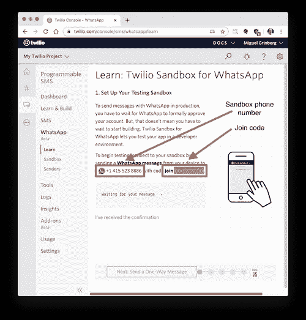
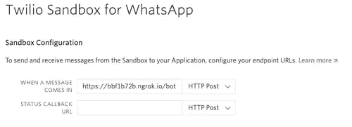

# 如何创建 Covid Whatsapp Bot

> 原文：<https://levelup.gitconnected.com/how-to-create-covid-whatsapp-bot-2d424c96a4d6>

## 使用 Python Flask，Twilio SMS API 和 Heroku。

在本教程中，你将学习如何制作一个 Whatsapp 机器人，并将其部署在 Heroku 服务器上。bot 提供了报告的案例数量和一些预防措施。


图片鸣谢:塞巴斯蒂安-贝德纳雷克-i1M1nQD2l5w-unsplash

## 开始之前，您需要准备好以下物品

*   Heroku 免费账户
*   [Twilio](http://twilio.com) 账户

# 1.配置 Twilio WhatsApp 沙盒

*   Twilio 提供了一个 [WhatsApp 沙箱](https://www.twilio.com/console/sms/whatsapp/learn)，在这里你可以轻松开发和测试你的应用。
*   让我们将智能手机连接到沙盒。从你的 [Twilio 控制台](https://www.twilio.com/console)中，选择[可编程短信](https://www.twilio.com/console/sms/dashboard)，然后点击 [WhatsApp](https://www.twilio.com/console/sms/whatsapp/learn) 。WhatsApp 沙盒页面将显示分配给你的帐户的沙盒号码和加入代码。



*   要为您的智能手机启用 Whatsapp 沙盒，请向分配给您的帐户的号码发送带有给定代码的 Whatsapp 消息。代码将以单词 **join** 开始，后面是一个随机生成的两个单词的短语。

# 2.创建一个 Python 虚拟环境

```
$ mkdir covid-bot && cd covidbot
$ pip install virtualenv
$ virtualenv covid-bot
$ covid-bot\Scripts\activate$ pip install flask twilio requests
```

现在有趣的部分开始了。我们将从 Flask 的初始设置开始。

# Webhook

WhatsApp 的[Twilio API](https://www.twilio.com/whatsapp)使用一个 [webhook](https://sendgrid.com/blog/whats-webhook/) 来通知应用程序何时有新消息。我们的 chatbot 应用程序需要定义一个端点，该端点将被配置为这个 webhook，以便 Twilio 可以与之通信。

```
from flask import Flask

app = Flask(__name__)

@app.route('/bot’, methods=['POST'])
def bot():
    # add webhook logic here and return a response
```

关于上面的代码，需要记住的重要一点是，应用程序定义了一个监听`POST`请求的`/bot`端点。每当 Twilio 收到来自用户的传入消息时，它们将依次调用这个端点。

# 3.消息和响应

在聊天机器人中，我们需要做的第一件事是获取用户输入的消息。该消息包含在`POST`请求的有效载荷中，密钥为`Body`。我们可以通过 Flask 的`request`对象访问它:

```
from flask import request
incoming_msg = request.values.get('Body', '')
```

Twilio 期望从 web hook 得到的响应需要用 [TwiML 或 Twilio 标记语言](https://www.twilio.com/docs/glossary/what-is-twilio-markup-language-twiml)给出，这是一种基于 XML 的语言。Python 的 Twilio helper 库附带了一些类，可以轻松地创建这个响应，而不必直接创建 XML

# 4.聊天机器人逻辑

对于实际的聊天机器人逻辑，我将使用一种非常简单，但却非常有效的方法。我要做的是在收到的消息中搜索关键字`A,B,C`等等，并根据请求处理查询。以下是聊天机器人的基本结构:

# 第三方 API

向聊天机器人提供 covid 案例的信息。我将使用公开可用的[API](https://en.wikipedia.org/wiki/Application_programming_interface)。我选择了这个 [COVID API](https://github.com/javieraviles/covidAPI) 。

对`[https://coronavirus-19-api.herokuapp.com/all](https://coronavirus-19-api.herokuapp.com/all)`的`GET`请求以 JSON 格式返回 covid 病例的病例数、死亡数和恢复数。

# 一切都在一起

现在您已经看到了 chatbot 实现的所有方面，所以我们准备将所有部分集成到完整的 chatbot 服务中。您可以将以下代码复制到一个`app.py`文件中:

# 5.在 Heroku 部署机器人

在制作我们的应用程序之前，我们需要几样东西。

*   Heroku 无法知道你的项目使用了什么库，所以我们必须告诉他使用`requirements.txt`文件来生成需求文件使用 pip

```
pip freeze > requirements.txt
```

现在您已经准备好了您的需求文件

*   其次，您需要`Procfile`来告诉 heroku 我们的应用程序从哪里开始，因此创建一个`Procfile`文件，并在其中键入以下内容

```
web: gunicorn app:app
```

*   您还可以向您的项目添加一个`.gitignore`文件，这样不重要的文件就不会上传到存储库中。
*   前往 Heroku 上的[仪表盘](https://dashboard.heroku.com/apps)并创建一个新应用。一旦你创建了一个应用程序，它将引导你到部署页面，在新的窗口和应用程序的域中打开设置选项卡，这将是类似于`[https://appname.herokuapp.com/](https://appname.herokuapp.com/)`

现在使用 Heroku-CLI 进行部署

*   登录 heroku

```
$ heruko login
```

*   在我们的目录中初始化一个 git 存储库

```
$ git init
$ heroku git:remote -a {heroku-project-name}
```

*   部署应用程序

```
$ git add .
$ git commit -m "Final Commit Deploying to Heroku"
$ git push heroku master
```

此时，您将在终端中看到构建进度，如果一切顺利，您将看到类似这样的内容。

```
remote: -----> Launching...
remote:        Released v6
remote:        [https://project-name.herokuapp.com/](https://project-name.herokuapp.com/) deployed to Heroku
remote:
remote: Verifying deploy... done.
```

*   现在转到应用程序页面`http://covidjv-bot.herokuapp.com`，因为我们已经设置了一个默认端点，它显示 Hello World！！
*   最后一步是将上述`herokuapp url` 放入[沙箱](https://www.twilio.com/console/sms/whatsapp/sandbox)。



# 演示

要使用这个机器人，只需点击这个[链接](https://api.whatsapp.com/send?phone=14155238886&text=join%20shout-daughter&source=&data=)或手动方式发送一条 WhatsApp 消息到 **(+1) 415523 8886** ，代码为**加入女儿**。它会显示一条消息说连接到沙箱。现在说**嗨|印度|美国|意大利**开始聊天，它会显示后续聊天。

# **结论**

我希望这篇教程是有用的，并且你现在对如何构建你的 WhatsApp 聊天机器人有了更好的想法。查看源代码。

[](https://github.com/Jatin-8898/covid-bot) [## Jatin-8898/covid-bot

### Whatsapp bot 提供了世界范围内以及一些类似国家的病例/死亡报告数…

github.com](https://github.com/Jatin-8898/covid-bot) 

谢谢你走了这么远。如果你喜欢，就给它一两下掌声👏👏👏

请随时在 LinkedIn 上与我联系。

[](https://linkedin.com/in/jatin-varlyani/) [## Jatin Varlyani - Veermata Jijabai 技术学院(VJTI) -孟买，马哈拉施特拉邦

### 充满激情和自我激励的全栈开发人员，拥有现代技术方面的经验。能够设计、开发和…

linkedin.com](https://linkedin.com/in/jatin-varlyani/)