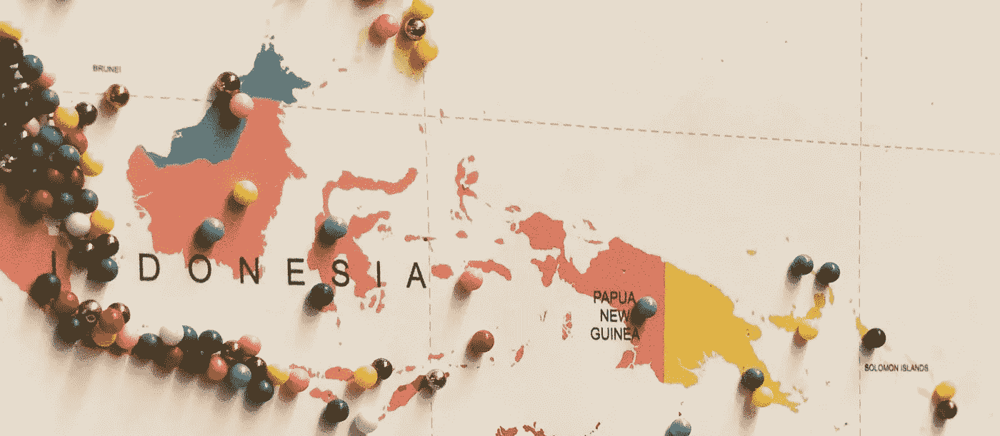

# 如何在谷歌地图上创建自定义 HTML 标记

> 原文：<https://levelup.gitconnected.com/how-to-create-custom-html-markers-on-google-maps-9ff21be90e4b>

如何用 HTML & CSS，ES6 类和闭包在谷歌地图上创建标记



在谷歌地图上创建标记的默认方法(当使用谷歌地图的 JavaScript API 时)是使用图像或 SVG 路径，这限制了开发的可能性。本教程将介绍如何使用 HTML 和 CSS 在谷歌地图上创建地图标记。该技术涉及扩展 Google Map 的库类`OverlayView`，这带来了自身的挑战，因此我们还将介绍如何异步扩展我们的新类，以避免构建问题、竞争条件和重复依赖。

# 地图和标记是如何制作的

在现代应用中，大多数依赖项将通过包管理器(如 npm 或 yarn)添加，通过`import`语句在代码中使用，并通过构建工具(如 webpack)在构建时捆绑成高性能代码块。另一方面，谷歌地图通常通过脚本标签加载到 webapp 的 HTML 文件中，然后将谷歌地图 JavaScript 库放在全局对象(`window.google`)上，供运行时使用。

Google Maps JavaScript API 中的每个特性在`google.maps`的父名称空间下都有自己的类/名称空间。向地图添加标记的最简单方法是使用位于`google.maps.Marker`的[标记类](https://developers.google.com/maps/documentation/javascript/reference/marker#Marker)。这个用于在地图上创建标记的接口仅限于接受两种类型的标记内容实体:图像或 SVG 路径。这对于许多用例来说都很好，但是也引入了对开发人员如何处理地图上的标记的限制。

Google Maps JavaScript API 也有一个更通用的类用于在地图上创建实体:位于`google.maps.OverlayView`的 [OverlayView 类](https://developers.google.com/maps/documentation/javascript/reference/overlay-view#OverlayView)。文档称这些*自定义覆盖图为*，并将它们定义为“地图上与纬度/经度坐标相关的对象，因此当你拖动或缩放地图时，它们会移动。”

这听起来很像使用 marker 类定义的地图标记！事实证明，`google.maps.Marker`只是一个预定义的覆盖类型。因此，通过利用`OverlayView`类，开发人员可以使用适合给定项目的任何 HTML 内容来创建地图标记。由于自定义覆盖图的内容只是 HTML，CSS 和 JavaScript 都可以通过元素的 id 和/或类属性来定位自定义覆盖图，从而允许对行为、更灵活的内容和 CSS 动画进行更精细的控制！

# 创建 HTMLMapMarker 类

我们将创建一个名为`HTMLMapMarker`的 ES6 类，它扩展了`OverlayView`类。构造函数将接受三个参数:

1.  纬度/经度对象。这将是另一个 Google Maps 类的实例，[lating 类](https://developers.google.com/maps/documentation/javascript/reference/coordinates) ( `google.maps.LatLng`)。这个类的构造函数接受两个`Number`参数，分别代表地图上标记应该放置的位置的纬度和经度。
2.  应该用作标记内容的 HTML。这是用字符串表示的 HTML。对于用 webpack 构建的更复杂的应用程序，这可以是通过 [html-loader](https://github.com/webpack-contrib/html-loader) 导入的 HTML 文件。
3.  将放置标记的 Google 地图实例。

我们的类还需要实现四个方法来满足一个`OverlayView`的要求:

1.  `draw()`。此方法将用于在地图上绘制标记。
2.  `remove()`。此方法将用于从地图中移除标记。
3.  `getPosition()`。该方法将用于跟踪标记放置的位置(纬度/经度)。
4.  `getDraggable()`。这个方法将决定我们的标记是否是可拖动的。既然不是，这个方法就简单的返回`false`。

让我们从类定义和构造函数开始。我们将通过一个具有上述三个属性的`args`对象将参数传递给构造函数:

如您所见，传递给构造函数的 LatLng 和 HTML 只是保存为同名的实例属性(`this.latlng`和`this.html`)。然而,`map`的实例可以马上使用。在构造函数中，我们调用继承自扩展`OverlayView`的`setMap`方法，传入`map`实例，有效地将新标记链接到页面上当前的`map`实例。

接下来，让我们继续讨论`draw`方法。这个方法将为这个类完成大部分繁重的工作。

第一步是检查`this.div`是否被定义。这是实例属性，它将保存最终放置在地图上的`<div>`元素。如果不是，我们通过`document.createElement(“div”)`创建一个新的`<div>`并存储在`this.div`中，并将其`position`设置为`absolute`。

从构造函数分配给`this.html`的 HTML 然后被设置为`<div>`的`innerHTML`属性，定义元素的 HTML 内容。

在方法的第 8 行，我们使用`google.maps.event`类方法`addDomLister`向我们的新 div 添加一个事件监听器。该方法将`this.div`作为第一个参数，将事件名称(‘click’)作为第二个参数，将事件发生时要执行的回调作为第三个参数。在我们的例子中，回调参数只需要将点击事件传递给`this`，一旦我们使用了我们的类，它就变成了创建的标记。稍后将详细介绍。

`draw`方法的第 10 行使用从`OverlayView`继承的`getPanes`方法来获取当前地图实例的窗格。谷歌地图将窗格称为不同的层，实体可以放置在这些层中，以便在地图上显示。有关可用窗格的更多信息，您可以[阅读此处的文档](https://developers.google.com/maps/documentation/javascript/reference/overlay-view#MapPanes)。我们使用`overlayImage`窗格的`appendChild`方法来追加存储在`this.div`中的`<div>`元素。

`draw`方法的最后一步是将新放置的`<div>`定位到正确的纬度/经度。这可以通过用继承的方法`getProjection`获取地图投影，然后在返回的投影上调用`fromLatLngToDivPixel`方法来完成。该方法将提供的纬度/经度转换为屏幕上相应的 x，y 位置。然后我们将 div 的`left`和`top`属性分别定位到 x 和 y 值。这也是添加基于像素的偏移来精确调整呈现元素的位置的最佳位置。在本文底部的演示中，您会注意到我在高度和宽度上添加了 25px 的偏移量，因为图像是 50px 的平方，期望的效果是图像在提供的纬度/经度上居中。

我们的类的`draw`方法是完整的，但是一点点重构真的可以提高可读性。我选择将函数的逻辑重构为三个助手方法，这三个方法根据它们的功能命名:`createDiv`、`appendDivToOverlay`和`positionDiv`。下面是重构后的方法，以及它使用的助手方法:

我们准备继续使用`remove`方法:

这个方法只是检查存储在`this.div`中的 HTML 元素是否存在。如果它存在，我们可以通过从 div 的`parentNode`调用`removeChild`将其从 DOM 中移除。一旦从 DOM 中移除，我们还将`this.div`设置为`null`，这样实例引用也被移除。

剩下的方法，`getPosition`和`getDraggable`都非常简单:

`getPosition`方法只返回保存在构造函数`this.latlng`中的纬度/经度，而`getDraggable`只返回布尔值`false`，因为我们的标记是不可拖动的。

我们已经完成了类的定义。最终的类定义应该如下所示:

# 在运行时定义 OverlayView

因为我们扩展了 Google Maps JavaScript 库提供的`OverlayView`类，所以我们需要保证在扩展它的时候已经定义了`google.maps.OverlayView`。

如果您正在构建一个不使用构建过程的应用程序，您也许能够将`HTMLMapMarker`类定义为直接扩展`OverlayView`。如果在定义类的时候已经定义了全局`google.maps`对象，那么可以直接扩展这个类:

```
class HTMLMapMarker extends google.maps.OverlayView {
```

然而，如果你在一个有任何构建过程的项目中工作，当你试图用它来扩展`HTMLMapMarker`类时，很有可能`google.maps.OverlayView`还没有被定义。虽然将`OverlayView`类直接添加到项目代码中可能会解决这个问题，但这会导致重复的代码，因为`OverlayView`总是在 Google Maps 库加载时被加载。

感谢闭包的力量，我们可以包装我们的类定义，这样保证在使用它的时候定义好了`google.maps.OverlayView`。没有竞争条件，没有重复的代码。


让我们将闭包函数命名为`createHTMLMapMarker`。这个函数接受一个具有两个属性的对象:一个具有默认值`google.maps.OverlayView`的`OverlayView`属性，以及一个 [rest 操作符](https://developer.mozilla.org/en-US/docs/Web/JavaScript/Reference/Functions/rest_parameters) ( `…args`)来收集调用时传递给`createHTMLMapMarker`的参数。

通过这个小小的改变，我们可以保证`google.maps.OverlayView`将由我们调用`createHTMLMapMarker`的时间来定义，因为我们可以完全控制何时调用`createHTMLMapMarker`。

现在我们已经有了我们的类和闭包，让我们使用它们吧！本教程的其余部分将采用以下文件夹结构:

```
/index.html
/src/index.js
/src/html-map-marker.js <-- Our closure + class definition
/src/style.css
```

对于我们的教程来说，`index.html`只需要加载我们的 CSS，加载谷歌地图 JavaScript 库，并在`src/index.js`加载应用程序的入口点。页面上唯一的元素是一个 ID 为`map`的 singe `<div>`，它将用于显示谷歌地图。

我们的`index.js`将定义一个新的 Google Maps `map`实例，以廷巴克图的纬度和经度为中心。然后，它将使用我们之前定义的导入的`createHTMLMapMarker` closer 函数定义一个`marker`，传递相同的`latlng`、`map`实例和要作为标记内容呈现的`html`。我们将在一个图像标签中使用一只 party parrot，它的 ID 属性为`parrot`用于样式化。

还记得我们在`HTMLMapMarker`类的`draw`方法中定义了‘click’的 DOM 事件吗？如前所述，点击事件只是传递给了`marker`实例。这允许我们通过`addListener`方法将事件监听器直接添加到新创建的`marker`中，如`index.js`的第 16–18 行所示。

`style.css`中的样式只是用地图`<div>`填充页面，并对`marker`应用边框、高度和宽度作为概念证明。由于我们用来创建`marker`的 HTML 元素的 ID 是`parrot`，我们可以用`#parrot`选择器来设计它的样式。

就是这样！有了新的`createHTMLMapMarker`函数，我们现在可以轻松地向 google map 实例添加任何 HTML。你可以在下面的 codesandbox 中看到教程的最终结果。

*注意，CodeSandbox 也会有一个来自 Google 的警告，说“这个页面不能正确加载 Google 地图”，因为没有使用 API 键。该应用程序应该仍然按照预期工作。*

如果您觉得这篇文章有帮助，请务必👏👏👏。你也可以[关注我](http://www.medium.com/@warlyware)获取更多关于 JavaScript、Vue 和 React 原生开发的文章。

[](http://levelup.gitconnected.com)[](https://gitconnected.com/learn/javascript) [## 学习 JavaScript -最佳 JavaScript 教程(2018) | gitconnected

### 排名前 64 的 JavaScript 教程。课程由开发者提交并投票，使您能够找到最好的…

gitconnected.com](https://gitconnected.com/learn/javascript)