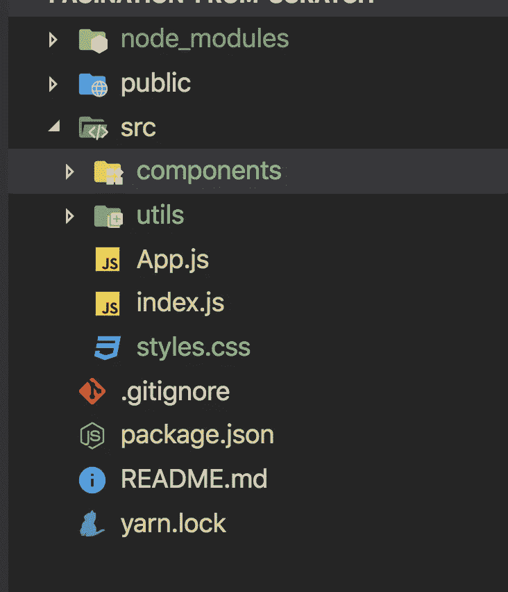
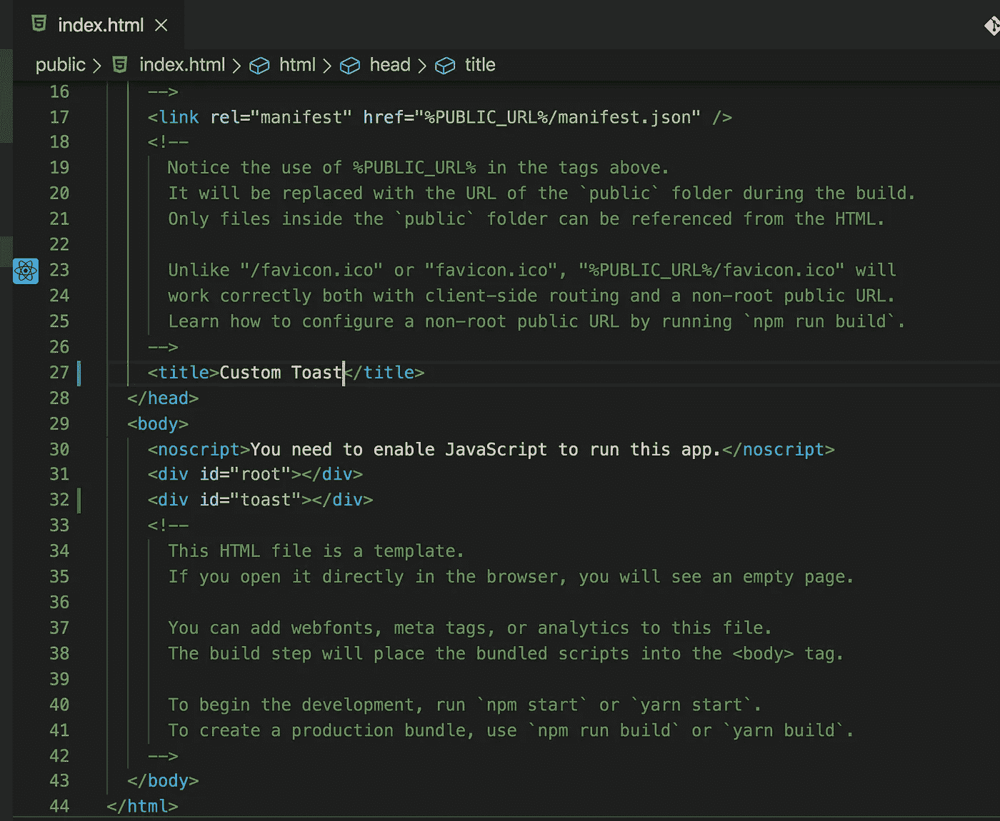
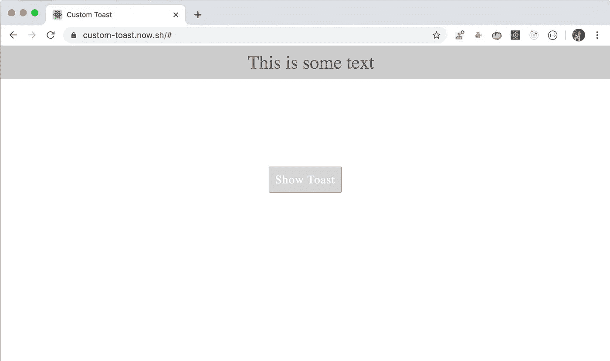

# 如何在 React 中创建自定义的可重用 toast 组件

> 原文：<https://levelup.gitconnected.com/how-to-create-custom-reusable-toast-component-in-react-d556bf624b85>

轻松构建自定义 toast 组件，以便在任何其他组件中使用


由 [Filiberto Santillán](https://unsplash.com/@filijs?utm_source=medium&utm_medium=referral) 在 [Unsplash](https://unsplash.com?utm_source=medium&utm_medium=referral) 上拍摄的照片

在本文中，我们将从头开始创建一个定制的 toast 组件。那么让我们开始吧。

我们将使用`create-react-app`来初始化项目。

通过运行以下命令创建一个新项目

```
create-react-app custom-toast
```

项目创建完成后，删除`src`文件夹中的所有文件，在`src`文件夹中创建`index.js`、`App.js`、`styles.css`文件。同样，在`src`文件夹中创建`components`和`utils`文件夹。

因此，您的文件夹结构将如下所示



打开`src/index.js`并添加以下代码

```
import React from 'react';
import ReactDOM from 'react-dom';
import App from './App';
import './styles.css';ReactDOM.render(<App />, document.getElementById('root'));
```

打开`src/styles.css`并添加以下代码

在`src/utils`文件夹中创建`constants.js`,声明如下:

```
export const TOAST_TIMEOUT = 3000;
```

这将指示何时隐藏 toast 消息。在这种情况下，消息将在 3000 毫秒(即 3 秒)后隐藏。

在`src/components`内部，用以下代码创建`Toast.js`

在`src/App.js`内添加以下代码

打开`public/index.html`并添加

```
<div id="toast"></div>
```

在...之后

```
<div id="root"></div>
```



现在，通过从终端执行`yarn start`运行应用程序



让我们来理解来自`Toast.js`的代码，它具有 toast 的主要逻辑。

1.  为了显示 toast，我们在`render`方法中使用了`ReactDOM.createPortal`方法(React 版本 16 中添加的),该方法允许我们显示根容器外部的元素，这有助于显示模态，或者在我们的例子中，显示 toast。
2.  我们在 id 为`root`的 div 旁边添加了 id 为`toast`的 div，我们将在其中显示 toast 消息。
3.  为了使用我们的 Toast 组件，我们将其用作
    `<Toast show={show} hideToast={hideToast}>This is some text</Toast>`
4.  当我们在组件的开始和结束标签之间添加文本时，该文本将在组件内部的`props.children`或`this.props.children`属性中可用，我们将这些属性传递给`createPortal`方法。
5.  我们已经使用`document.createElement(‘div’)`用 html div 元素初始化了状态，所以我们稍后可以使用它来添加或删除 toast div。
6.  在`useEffect`钩子中，我们将节点添加到来自 index.html 的 toast div，并为其添加 CSS，这样 CSS 在默认情况下不会显示，而是仅在我们想要显示 toast 消息时才显示。
7.  我们将一个数组`[node, props]`作为第二个参数传递给`useEffect` hook，这样`useEffect`中的代码只有在`node`或`props`被更改时才会被执行，这类似于`componentDidUpdate`生命周期方法。
8.  我们还添加了`removeNode`方法，当组件被卸载时，我们通过从`useEffect`钩子返回一个函数来调用这个方法。
9.  我们使用 CSS 动画来显示 toast 消息，并在 3 秒后隐藏它，如 CSS 中为 toast 声明的那样`animation: slideDown 3s;`
10.  当 toast 隐藏时，我们将`show`状态标志设置为 false，因此当我们再次单击`Show Toast`按钮时，将再次显示 toast 消息。
11.  我们还禁用了`Show Toast`按钮，这样用户就不会不必要地点击它，并且一旦隐藏了 toast，我们就启用它。

你可以在这里找到这个应用的完整源代码[，在这里](https://github.com/myogeshchavan97/custom-toast)找到现场演示

今天到此为止。我希望你学到了新东西。

**别忘了直接在你的收件箱** [**这里订阅我的每周简讯，里面有惊人的技巧、窍门和文章。**](https://yogeshchavan.dev/)