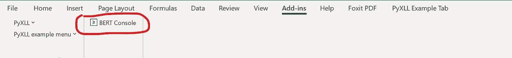
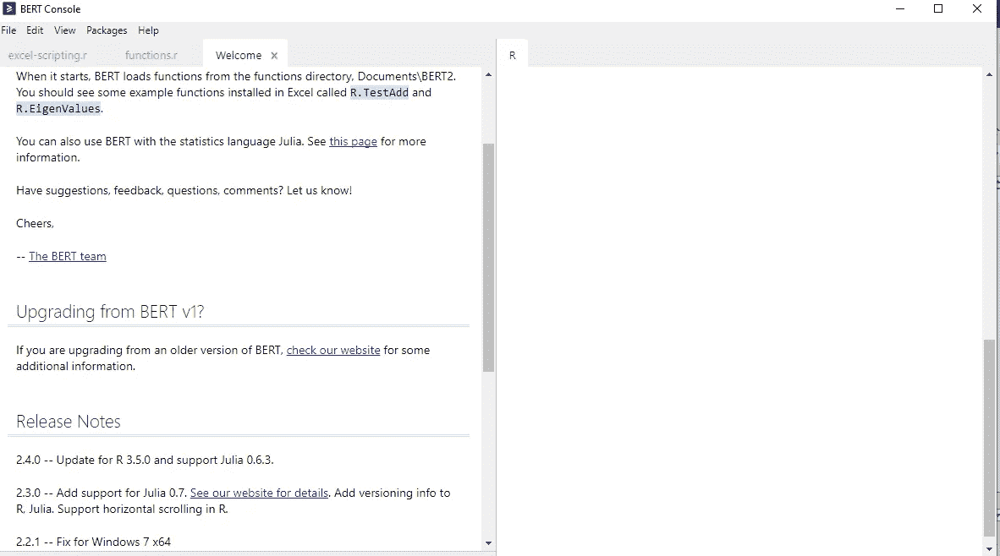
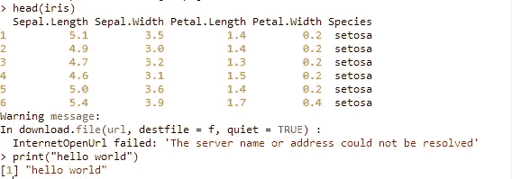
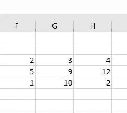
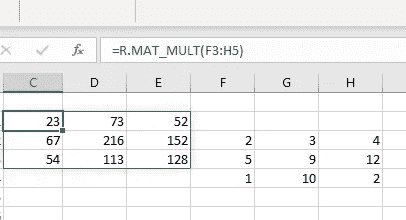
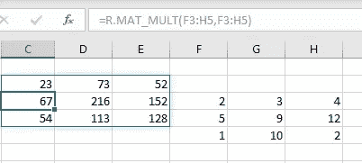
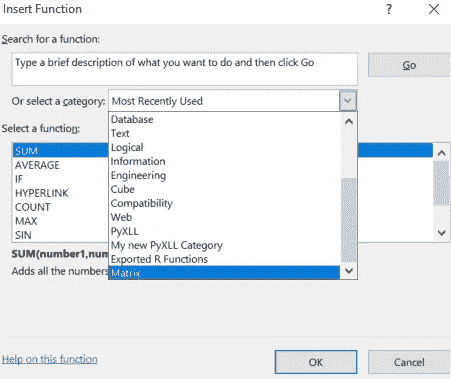
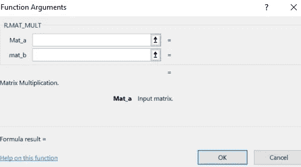

# 如何用 R 编程创建 Excel 函数

> 原文：<https://levelup.gitconnected.com/how-to-create-excel-functions-with-r-programming-fa26cf9be698>


在文章[如何用 Python 创建 Excel 函数](https://medium.com/codex/how-to-create-excel-functions-with-python-6c6da75082e8?source=your_stories_page-------------------------------------)中，我谈到了如何在 Excel 中使用 Python 创建自己的 Excel 函数，也称为用户定义函数(U.D.F)。

由于 Python 和 R 在数据科学领域很受欢迎，我们现在有插件来支持它们在 Excel 中的使用，以使那些来自编程背景的人的生活更容易。

在本文中，您将学习如何用 r 中的知识创建 Excel 函数。

# 开始使用 B.E.R.T

没有来自 Transformers *的 *t* [双向编码器表示，而是基本的 Excel R Toolkit](https://en.wikipedia.org/wiki/BERT_(language_model))* ，一个连接 Excel 和 R 的工具，让您有机会在 Excel 中创建自己的用户定义函数(UDF)。

你可以在这里下载 BERT 安装程序[并安装它。](https://bert-toolkit.com/download-bert)

安装后，启动 Excel 并单击 Excel 加载项选项卡，您将看到 BERT 控制台按钮。

点击按钮打开控制台，



作者图片



作者图片

控制台左边有一个代码编辑器，右边有一个 R shell，就像 R Studio 中的一样。

例如，在 BERT 上运行这段代码，

```
head(iris)
print("hello world")
```

你得到了，



作者图片

# 创建您自己的 Excel 函数

在 Excel 中打开 BERT 控制台时，您会看到一个默认打开的文件`functions.R`，它位于启动文件夹`Documents\BERT2\functions.`中

您可以在这个文件中创建您的函数，也可以在文件夹中创建其他文件。

让我们创建一个在两个矩阵之间执行矩阵乘法的函数。

```
MAT_MULT <- function(mat_a,mat_b){
  return(mat_a%*%mat_b)
}
```

保存文件并关闭控制台，不要担心您的文件保存在 BERT 目录中，

去 excel 创建一个 3x3 的矩阵，



作者图片

就像你会调用一个常规的 excel 函数一样，在 Excel 中调用以`R.MAT_MULT()`开头的`MAT_MULT()`。



作者图片



作者图片

# 记录您的功能

您可以通过进入`functions.R` 文件并添加下面的代码并保存来记录`MAT_MULT()` 函数。

```
attr(MAT_MULT, "category") <- "Matrix"
attr(MAT_MULT, "description") <- "Input Matrix"
```

这将为您创建的函数提供一个类别和描述。

当你回到 Excel，点击公式栏上的函数图标，浏览类别，你会看到新添加的类别矩阵。



作者图片

点击确定，您将看到`MAT_MUL()`功能交互文档。



作者图片

# 结论

这篇文章只是你可以在 Excel 中使用 R 做的事情的表面，你可以通过进入官方文档阅读更多内容，也可以从 Julia 阅读如何与 Excel 交互。

# 相关阅读

[](https://medium.com/codex/how-to-combine-multiple-plots-in-one-page-f17c21bf930b) [## R 编程中如何在一页中组合多个图

### 我工作的一个客户最近告诉我，他提交文章的一个出版物，只接受 6 个情节，他…

medium.com](https://medium.com/codex/how-to-combine-multiple-plots-in-one-page-f17c21bf930b) [](https://medium.com/codex/using-r-programming-on-power-bi-desktop-9db9492d7aad) [## 在 Power BI 桌面上使用 R 编程

### 了解如何结合 R 和 BI 的力量

medium.com](https://medium.com/codex/using-r-programming-on-power-bi-desktop-9db9492d7aad) 

# 分级编码

感谢您成为我们社区的一员！在你离开之前:

*   👏为故事鼓掌，跟着作者走👉
*   📰更多内容请查看[升级编码刊物](https://levelup.gitconnected.com/?utm_source=pub&utm_medium=post)
*   🔔关注我们:[推特](https://twitter.com/gitconnected) | [LinkedIn](https://www.linkedin.com/company/gitconnected) | [时事通讯](https://newsletter.levelup.dev)

🚀👉 [**加入升级人才集体，找到一份神奇的工作**](https://jobs.levelup.dev/talent/welcome?referral=true)