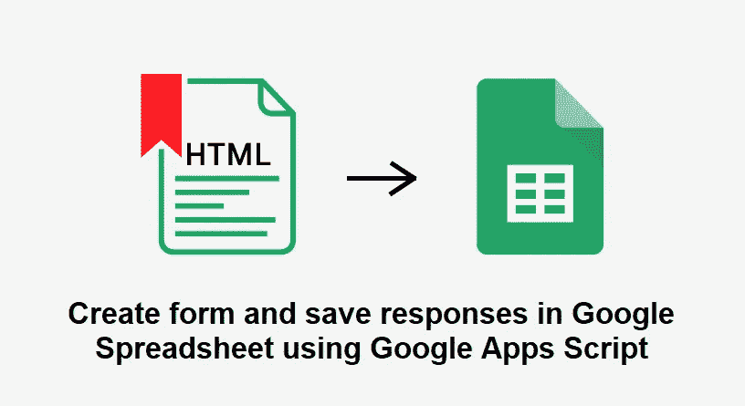

# 如何使用 Google Apps 脚本在 Google 电子表格中创建表单和保存响应

> 原文：<https://levelup.gitconnected.com/how-to-create-form-and-save-response-in-google-spreadsheet-using-google-apps-script-f79fbc06ecdf>



我们将学习如何创建一个 HTML 表单，并将其连接到 Google 电子表格，以便使用 Google Apps 脚本保存响应。

让我们看看使用 Google Apps 脚本创建这样一个表单需要做些什么。

1.  转到电子表格内的脚本编辑器。
2.  从“添加文件”菜单选项创建 index.html、JavaScript.html 和 Code.gs 文件。

**index.html**—在这个文件中，我们将为表单编写 HTML 代码。

stylesheet.html**—这个文件需要一些 CSS 来设计你的 HTML 表单。**

JavaScript.html**——在这个文件中，我们有一个脚本，它将处理来自 Google Apps 脚本的传入和传出响应。**

**Code.gs** —这个文件是默认的 Google 脚本文件，它只有 Google Apps 脚本来编写对 Google 电子表格的表单响应。

请按照这些步骤创建 HTML 表单和 Google 电子表格连接。

**步骤 1:** 在编辑器页面中，创建**index.html**页面，并编写您的 HTML 代码来构建表单。请参见下面的示例代码。

```
<!DOCTYPE html><html><head><base target="_top"><?!= include("JavaScript"); ?><meta name="viewport" content="width=device-width, initial-scale=1.0"><link rel="stylesheet" href="https://cdn.jsdelivr.net/npm/bootstrap@4.5.3/dist/css/bootstrap.min.css" crossorigin="anonymous"><script src="//ajax.googleapis.com/ajax/libs/jquery/1.9.1/jquery.min.js"> </script></head><body><div class="container"><div class="row"><div class="col-8" style="background: bisque;"><div id="output"></div><center><div><h1>-HTML Form-</h1><form id="myForm" onsubmit="addRow(this)"><p class="h4 mb-4 text-center">Details</p><div class="form-row"><div class="form-group col-md-6"><label for="fyear">Financial Year</label><input type="text" class="form-control" id="fyear" name="fyear" placeholder="Financial Year" required></div><div class="form-group col-md-6"><label for="source_file">Source File Path</label><input type="text" class="form-control" id="source_file" name="source_file" placeholder="Source File Path" required></div></div><div class="form-row"><div class="form-group col-md-6"><label for="resume_no">No of Resume to Shortlist </label><input type="number" class="form-control" id="resume_to_shortlist" name="resume_to_shortlist" placeholder="" required></div><div class="form-group col-md-6"><label for="overall_experience">Overall Experience </label><input type="number" class="form-control" id="overall_experience" name="overall_experience" placeholder="Overall Experience" required></div></div><div class="form-row"><div class="form-group col-md-6"><label for="primary_skills">Primary Skills</label><input type="text" class="form-control" id="primary_skills" name="primary_skills" placeholder="Primary Skills" required></div><div class="form-group col-md-6"><label for="skill_looking_for">Skills Looking For</label><input type="text" class="form-control" id="skill_looking_for" name="skill_looking_for" placeholder="Skills Looking For" required></div></div><div class="form-group"><label for="exclude_search">Exclude from Search</label><input type="text" class="form-control" id="exclude_search" name="exclude_search" placeholder="Exclude from Search"></div><button type="submit" class="btn btn-primary btn-block">Submit</button></form><br><br></div></center></div></div></div></body></html>
```

在上面的示例代码中，我们有一些输入字段，并使用 name、id 属性对它们进行了定义，除此之外，我们还包括了如下的**JavaScript.html****<？！= include(" JavaScript ")；？>** ，我们使用这样的语法来包含文件。

我们也有函数:" **addRow(this)** "在表单中，它将被用来传递数据到 JavaScript 页面。

**步骤 2:** 创建**JavaScript.html**文件，并编写您的脚本来获取基于输入字段的名称属性的数据。请参见下面的示例代码。

```
<script>function preventFormSubmit() {var forms = document.querySelectorAll('form');for (var i = 0; i < forms.length; i++) {forms[i].addEventListener('submit', function(event) {event.preventDefault();}); }}window.addEventListener('load', preventFormSubmit);function addRow(formObject){google.script.run.withSuccessHandler(updateUrl).withFailureHandler(onFailure).addRecord(formObject);\}function updateUrl(url) {var div = document.getElementById('output');if(url !=""){// div.innerHTML =  url;div.innerHTML = '<div class="alert alert-success" role="alert"> Details have been received successfully! </div>';document.getElementById("myForm").reset();}}function onFailure(error) {var div = document.getElementById('output');// div.innerHTML = error.message;div.innerHTML = '<div class="alert alert-danger" role="alert"> Something went wrong</div>';}</script>
```

在上面的代码中，我们有 addRow 函数，它有几个 Google 脚本库函数，让我们理解一下。

```
google.script.run.withSuccessHandler(updateUrl).withFailureHandler(onFailure).addRecord(formObject);
```

在这个脚本中，根据脚本执行的成功和失败事件调用两个函数。因此，我们有一些函数，例如成功执行时将调用“ **updateUrl** ”函数，失败时将调用“ **onFailure** ”。成功后，我们将表单对象发送到 Google 脚本文件，该文件是“ **Code.gs** ”。

**第 3 步:**在这一步中，我们已经处理了相同的问题，并按照我们想要的方式执行了任务。让我们先看样本代码，然后再看解释。

```
function doGet(request) {return HtmlService.createTemplateFromFile('index').evaluate();}function include(filename){return HtmlService.createHtmlOutputFromFile(filename).getContent();}function addRecord(formObject) {try {var ss = SpreadsheetApp.openById("YOUR_SPREADSHEET_ID");var webAppSheet = ss.getSheetByName("Sheet1");webAppSheet.getRange(2,1,1,webAppSheet.getLastColumn()).setValues([[formObject.fyear,formObject.resume_to_shortlist,formObject.overall_experience,formObject.primary_skills,formObject.skill_looking_for,formObject.exclude_search,formObject.source_file]]);return fileUrl;} catch (error) {return error.toString(); }}
```

在这个示例代码中，我们有以下函数，让我们来理解每一个。

1.  **doGet()** :该函数用于获取响应，返回 HTML 模板页面中的内容。
2.  **include()** :函数用于将文件包含在我们的索引文件中，因为这与将文件嵌入到您的主文件中是一样的，我们应该遵循这一点，为了保持代码的整洁，也为了更好地理解这一点，当我们在函数中传递文件名为**include(" JavaScript . html ")**时，它会将脚本文件添加到【index.html】文件中**。**
3.  **addRecord() :这是一个函数，它采用我们在 JavaScript 文件中定义的 formobject。在该函数中，我们声明了 Google 电子表格 ID 和范围来保存表单的响应。**

**为了获取表单数据，我们使用 formobject 的输入字段的 name 属性，如下所示——假设您的 name 属性是" **fyear** "，那么我们将其作为 **formObject.fyear** ，以获取其值，类似地，我们将对所有值进行处理，并且有一个数组声明接受其中的所有值。**

**现在，我们只需要在 Google 电子表格的范围内设置这些值，如下所示。**

```
webAppSheet.getRange(2,1,1,webAppSheet.getLastColumn()).setValues([[formObject.fyear,formObject.resume_to_shortlist,formObject.overall_experience,formObject.primary_skills,formObject.skill_looking_for,formObject.exclude_search,formObject.source_file]]);
```

**我希望这篇文章能让你对 Google Apps 脚本有更多的了解。**

**如果你有兴趣学习 Google Apps 脚本和自动化你的 Google Workspace？必须试试这本**电子书**上的“ [**谷歌应用套件脚本:初学者指南**](https://www.amazon.com/dp/B0BTJC9X5R) ”**

**如果您能在 medium platform 上关注并投票支持更多这样的学习文章，我将非常高兴。非常感谢！**