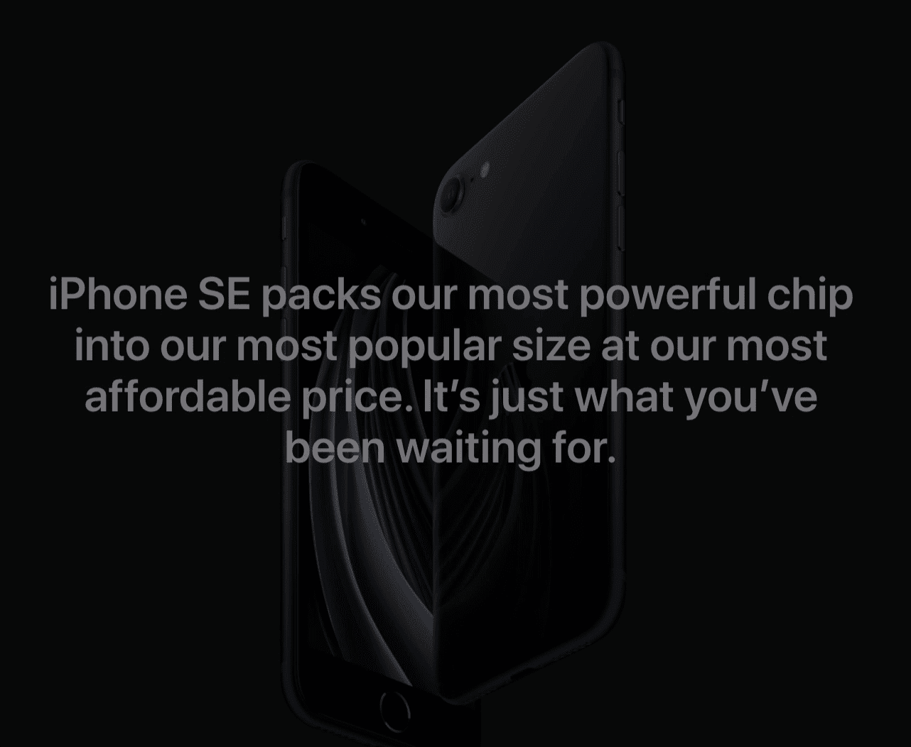
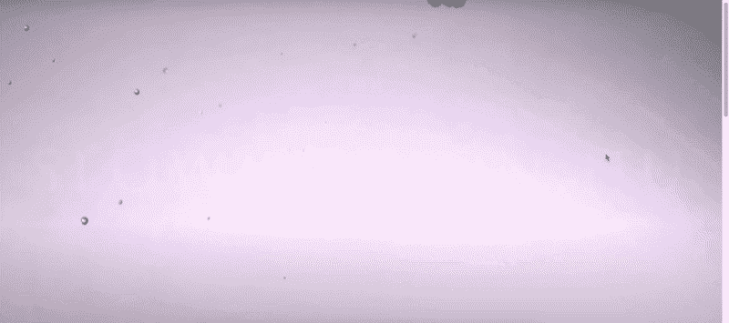
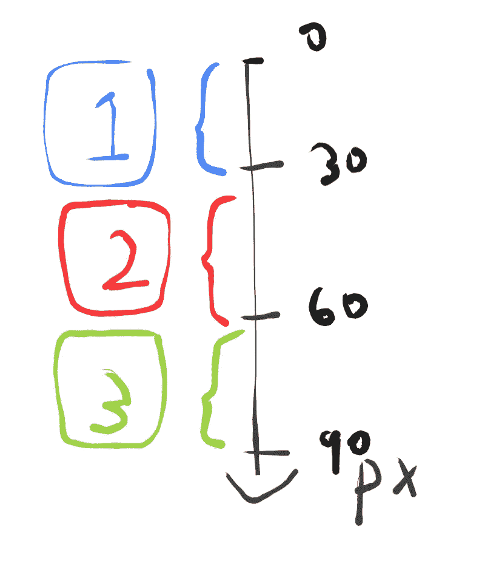
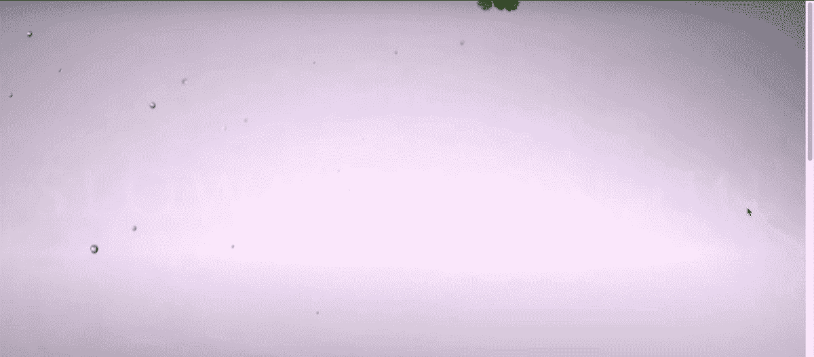

# 如何在滚动效果上创建逐帧运动图像

> 原文：<https://levelup.gitconnected.com/how-to-create-frame-by-frame-moving-image-on-scroll-effect-30ce577c63c2>

如何创建随处可见动态图像背景的逐步指南。

# 内容

1.  介绍
2.  结果演示
3.  先决条件
4.  逐步指南
5.  下一步

# 介绍

滚动图像是前端的新视差。在过去，视差无处不在。但对于新网站来说，这种情况更少见。相反，我们通过滚动模式看到许多移动图像——例如，苹果新推出的 iPhone SE 网站:



向下滚动时，iPhone 可以很好地旋转(向上滚动时可以反转)

如你所见，当你向下滚动时，iPhone 会逐帧旋转。在本教程中，我将分享我复制这种模式的方法。

# 结果演示



正如您在滚动条上看到的，内容随着滚动位置而变化

代号:【https://codepen.io/josephwong2004/pen/wvKPGEO】T2

# 先决条件

只有 CSS 和 JS 的基础知识

# 逐步指南

**第一步:获取一些图像**

好吧，我想你已经明白了。“运动图像”其实只是一堆差别不大的图像，像动画一样一帧一帧播放。通过将滚动位置映射到相应的图像，我们得到图像中的物体本身正在移动或旋转的错觉。

正如你从演示中看到的，我得到了一些蔬菜倒下的图像(总共 20 张)。

> 我使用的图片来自这个 youtube 视频，我不拥有这些图片，只是用于教学目的。来源:
> 
> [https://www.youtube.com/watch?v=8DsDH3JQ384](https://www.youtube.com/watch?v=8DsDH3JQ384)

**第二步:设置基本**

让我们开始建立我们的“移动图像”效果。html 非常简单:

```
<div class='container'>
  <div class='image-container'></div>
</div>
```

我们将把图像放在“图像容器”类中。对于 CSS:

```
body {
  margin: 0;
  font-family: 'Permanent Marker', cursive;
}.container {
  position: relative;
  width: 100%;
  height: 1500px;.image-container {
    width: 100%;
    height: 0;
    padding-top: 45.347%;
    position: sticky;
    top: 0;
    background-size: cover;
    background-image: url('[https://drive.google.com/uc?id=1vtaubItASKilyvb5sgQO7D7gjAQ7xo0i'](https://drive.google.com/uc?id=1vtaubItASKilyvb5sgQO7D7gjAQ7xo0i'));
  }
}
```

现在，那里的大多数东西都很标准。我后来为覆盖文本添加了一种字体。对于图像容器本身，我们希望它和页面宽度一样大，并且有一个动态高度。不幸的是，我们不能在这里做`height: auto`，因为我们的图像容器没有任何内容，背景图像不算。容器的高度总是 0px。

为了弥补这一点，我们使用百分比填充。这个百分比不是随机的，而是图像高宽比(高/宽* 100%)。有了这个和`background-size: cover`，我们就有了填满整个页面的容器。

**第三步:添加滚动效果**

背景图片设置好了，让我们给代码添加一些 JS，让它“动”起来。

我已经上传了 20 张图片到 google drive，并保存了它们的链接，如下所示:

```
// Images asset
const fruitImages = {
    1:'[https://drive.google.com/uc?id=1vtaubItASKilyvb5sgQO7D7gjAQ7xo0i'](https://drive.google.com/uc?id=1vtaubItASKilyvb5sgQO7D7gjAQ7xo0i'),
    2:'[https://drive.google.com/uc?id=1FJNbSIMKRPBnGPienoYK1Qf8wIwQSdpR'](https://drive.google.com/uc?id=1FJNbSIMKRPBnGPienoYK1Qf8wIwQSdpR'),
    3:'[https://drive.google.com/uc?id=1TODQyZgnCjDX2Slr0ll8g-ymIV8Yizkh'](https://drive.google.com/uc?id=1TODQyZgnCjDX2Slr0ll8g-ymIV8Yizkh'),
    ....... (I am not going to copy everything here)
    20:'[https://drive.google.com/uc?id=1D7PBddCxxb6aRk43maJ_BXgQD-PRS6R7'](https://drive.google.com/uc?id=1D7PBddCxxb6aRk43maJ_BXgQD-PRS6R7'),
}
```

> 小贴士:
> 
> 默认的 google drive 共享链接类似于:
> [https://drive.google.com/open?id = 1 vtaubitaskilyvb 5 sgqo 7d 7 gjaq 7 xo0 I](https://drive.google.com/open?id=1vtaubItASKilyvb5sgQO7D7gjAQ7xo0i)
> 
> 要在代码中使用，需要替换 **/open？用/uc？**

每个键代表我们滚动动画中的一个“帧”。接下来，让我们添加滚动功能:

```
// Global variable to control the scrolling behavior
const step = 30; // For each 30px, change an imagefunction trackScrollPosition() {
  const y = window.scrollY;
  const label = Math.min(Math.floor(y/30) + 1, 20);
  const imageToUse = fruitImages[label];
  // Change the background image
  $('.image-container').css('background-image', `url('${imageToUse}')`);}$(document).ready(()=>{
  $(window).scroll(()=>{
    trackScrollPosition();
  })
})
```

我在这里使用 jquery 只是为了方便。逻辑非常简单，我们正在创建一个关键帧动画，但我们使用像素而不是时间作为我们的基本单位来计算下一帧应该在何时出现。

我们感兴趣的是当前的`scrollY`值，它表示用户已经滚动了多远。我们还为屏幕上显示的每一帧的最小和最大边界创建了一个`step`变量。当`step`设置为 30 时，假设用户持续滚动，每幅图像将显示“30px”的滚动时间。

我们的`onScroll`函数计算哪个图像用于当前的`scrollY`位置，然后设置。图像容器`background-image`属性。



代替时间，我们使用像素来改变帧

让我们看看我们的结果:



相当不错！现在让我们添加文本。

**第四步:添加浮动文本**

除了移动的背景，我们还希望一些文本浮在图像上来传达我们的信息。

我添加文本的方法也很简单(也就是愚蠢)。因为我的图像有 20 个“框架”，所以我简单地创建了另一个数组来存储每个“框架”中相应的文本样式。(使用相同的数组会更好，但是出于教程的目的，我在这里使用一个新的数组)

但是首先，让我们先添加一些 html 和 css:

html:

```
<div class='container'>
  <div class='image-container'></div>
  <div class='text-container'>
    <div class='subtitle' id='line1'>These lines float in one by one</div>
    <div class='title' id='line2'>How to make</div>
    <div class='title' id='line3'>Moving background</div>
    <div class='subtitle' id='line4'>Disappear again when scroll top</div>
  </div>
</div>
```

css:

```
.text-container {
    width: 100%;
    height: 100%;
    position: fixed;
    display: flex;
    flex-direction: column;
    justify-content: center;
    align-items: center;
    top: 0;
    color: white;
    .subtitle { 
      opacity: 0;
      font-size: 30px; 
    }
    .title { 
      opacity: 0;
      font-size: 80px; margin: -20px 0;
    }
  }
```

现在，让我们为数组中的文本样式添加关键帧:

```
const textStyle = {
  1: {opacity: 0, transform: '0px'},
  2: {opacity: 0, transform: '0px'},
  3: {opacity: 0, transform: '0px'},
  4: {opacity: 0, transform: '0px'},
  5: {opacity: .25, transform: '15px'},
  6: {opacity: .5, transform: '10px'},
  7: {opacity: .75, transform: '5px'},
  8: {opacity: 1, transform: '0px'},
  ... 9 - 19are the same with 8
  20: {opacity: 1, transform: '0px'}
]
```

每个文本有 5 种状态:

1.  无形，无转化
2.  25%可见，向下转换 15px
3.  50%可见，向下转换 10px
4.  75%可见，向下转换 5px
5.  完全可见，无变形

您可以看到，在 1 到 4 帧中，文本是不可见的，而在 8 到 20 帧中，文本总是可见的。所以我们的文本在滚动一定量后会停留在那里。

让我们修改我们的`trackScrollPosition`函数来更新文本样式:

```
function trackScrollPosition() {
  const y = window.scrollY;
  const label = Math.min(Math.floor(y/30) + 1, 20);
  const imageToUse = fruitImages[label];
  // Change the background image
  $('.image-container').css('background-image', `url('${imageToUse}')`);
  // Change the text style
  const textStep = 2;
  const textStyleToUseLine1 = textStyle[label];
  const textStyleToUseLine2 = textStyle[Math.min(Math.max(label - textStep, 1), 20)];
  const textStyleToUseLine3 = textStyle[Math.min(Math.max(label - textStep * 2, 1),20)];
  const textStyleToUseLine4 = textStyle[Math.min(Math.max(label - textStep * 3, 1),20)];
  $('#line1').css({'opacity': textStyleToUseLine1.opacity, 'transform': `translateY(${textStyleToUseLine1.transform})`});
  $('#line2').css({'opacity': textStyleToUseLine2.opacity, 'transform': `translateY(${textStyleToUseLine2.transform})`});
  $('#line3').css({'opacity': textStyleToUseLine3.opacity, 'transform': `translateY(${textStyleToUseLine3.transform})`});
  $('#line4').css({'opacity': textStyleToUseLine4.opacity, 'transform': `translateY(${textStyleToUseLine4.transform})`});}
```

我们有 4 行文本，我们希望它们一个接一个地显示。他们的风格基本一致。所以我们简单地使用一个`textStep`为每一行添加一些“延迟”。

这将带您回到我们的开始演示:


就是这样！如果你愿意，你可以更进一步，创造更多的“框架”，但概念是一样的。

# 下一步

显然，这里最难的是得到你需要的图像，而不是编码部分。与视差不同，不是每个图像都有效。你的结果很大程度上取决于你的图像质量。

我想要记住的一件事是图像也需要时间来加载，在现实生活中的应用程序，你可能想等待所有的图像加载第一，否则当你滚动，图像仍在加载，将有白色区域下方你的"半加载"的图像。

毫无疑问，本教程并不是这个问题的“最佳”解决方案，只是我的解决方案。如果你有更好的方法，欢迎发表评论！