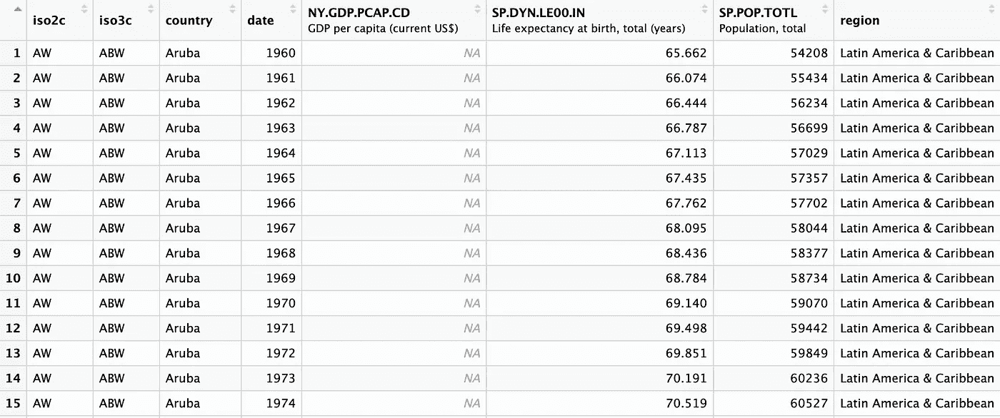
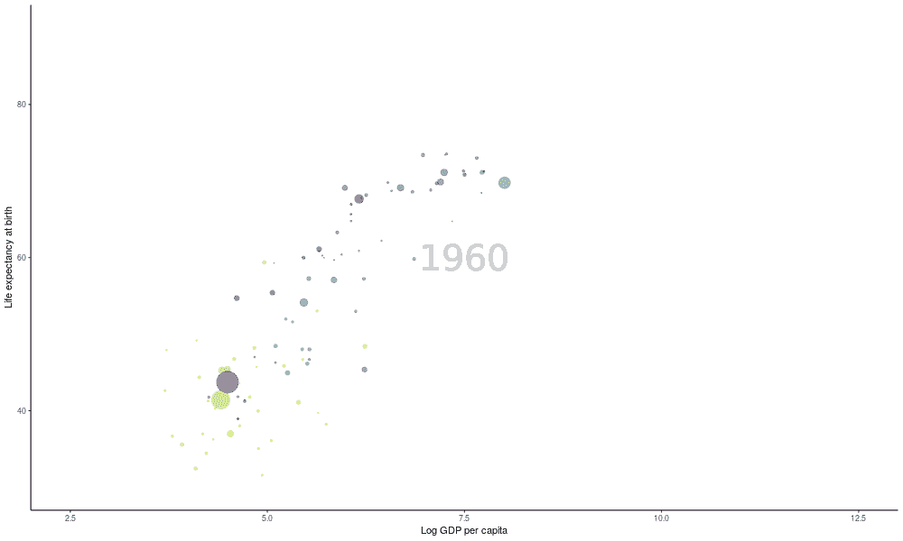

# 如何在 R 中创建汉斯·罗斯林著名的动画泡泡图

> 原文：<https://levelup.gitconnected.com/how-to-create-hans-roslings-famous-animated-bubble-chart-in-r-e89607dbf73a>

## 一个很棒的小学习练习，展示了 R 语言的范围和灵活性

在我学习编程的早期，我决定尝试从零开始在 r . com 上创建汉斯·罗斯林的 Gapminder 气泡图——因他极具娱乐性的讲座和 TED 演讲而闻名。

当我继续下去的时候，我心中有几个标准:

1.  我是否可以直接使用世界银行的经济数据，而不需要使用可能不是最新的本地数据文件或打包数据？
2.  我能让它看起来更接近罗斯林的图表吗？
3.  在 R 中用一个管道命令就能做到吗？

我能够满足我所有的标准，这样做之后，我意识到这对那些希望更多地从事动画图形工作的人来说是一个很好的学习练习，也让我意识到 R 中的`wbstats`包，这是我以前从来不知道的。所以我在这里分享一下。

如果你懒得看这个，可以直接去 [Github](https://github.com/keithmcnulty/hans_rosling_bubble/blob/master/rosling.R) 上看代码。

作为预防措施，这不是做这件事的捷径。您可以用更少的字符来完成这项工作，但这将意味着没有命名空间功能(为了代码读者的利益，我总是试图这样做)，或者从中间源提取数据。但我认为这是一个很好的、独立的、面向未来的方法，既干净又高效。

## 设置和获取数据

为此，您需要以下 R 包:`dplyr`、`ggplot2`、`gganimate`、`viridis`来帮助着色，以及`wbstats`来从世界银行获取数据。如果你想让它看起来和我的一模一样，你可能还需要安装谷歌字体的`Oswald`字体系列，但这并不重要。

对你想要的最终产品有一个计划总是好的，尤其是在使用`ggplot2`的时候。这是我的计划:

1.  x 轴:对数人均 GDP(使用对数有助于传播渐进数据)
2.  y 轴:出生时的预期寿命
3.  气泡大小与人口成比例
4.  按照世界银行区域，按经济区域进行气泡颜色编码
5.  从 1960 年开始逐年过渡到最新可用数据(写这篇文章时是 2020 年)。

这意味着我需要从世界银行获得三种类型的数据:人均 GDP、出生时预期寿命和人口。

`wbstats`包是一个非常棒的实用程序，它允许您使用它的 API 直接插入世界银行的数据库，并将数据直接下载到您的 R 会话中。你可以访问世界银行开放数据网站[这里](https://data.worldbank.org/)浏览你想要的指标。一旦找到一个，你只需要记下它的指示器 ID 代码。例如，如果您搜索“人均 GDP(当前美元)”，您将被带到[此页面](https://data.worldbank.org/indicator/NY.GDP.PCAP.CD) —然后单击“详细信息”图标，您将看到 ID。在本例中是 NY.GDP.PCAP.CD。

使用这些指标 ID 代码，您可以使用`wbstats`包，使用我们的第一个命令立即获取您需要的三个指标的数据:

```
rosling <-
# pull the country data down from the World Bank - three indicators
wbstats::wb_data(
  indicator = c("SP.DYN.LE00.IN", "NY.GDP.PCAP.CD", "SP.POP.TOTL"), 
  country = "countries_only", 
  start_date = 1960, 
  end_date = 2020
)
```

`country = "countries_only"`的论点很重要——世界银行的数据也包括地区和世界范围的平均值，这是你在分析中不想要的。

这几乎是我们所需要的全部数据。但是对于我们的颜色编码，我们需要将我们的国家分配到世界银行区域。`wbstats`有一个方便的功能叫做`wb_countries()`，在这里你可以选择 iso3c 国家代码及其地区，并加入到前面的表格中，将国家分配到地区，如下所示:

```
rosling <-
# pull the country data down from the World Bank - three indicators
wbstats::wb_data(
  indicator = c("SP.DYN.LE00.IN", "NY.GDP.PCAP.CD", "SP.POP.TOTL"), 
  country = "countries_only", 
  start_date = 1960, 
  end_date = 2020
) |> 
  # pull down mapping of countries to regions and join   
  dplyr::left_join(
    wbstats::wb_countries()  |>  
      dplyr::select(iso3c, region)
  )
```

这将为您提供如下所示的数据帧:



作者生成的图像

## 创建一年的静态图表

由于动画是静态图表之间的简单移动，我们的大部分图形工作将是使用`ggplot2`创建一年的静态样式的图表。

在`ggplot2`中绘图非常直观:以下是我想做的事情:

1.  定义我的审美:x 是对数人均 GDP，y 是预期寿命，大小是人口，颜色是使用`ggplot()`的地区
2.  使用`geom_point()`将它设置为一个阿尔法值为 0.5 的散射，以确保气泡的半透明性
3.  使用`scale_size()`缩放气泡大小，以确保它们对于图表的外观和感觉是合理的
4.  使用`scale_x_continuous()`和`scale_y_continuous()`设置轴的边界
5.  使用`viridis::scale_color_viridis()`设置漂亮的泡泡配色方案
6.  使用`labs()`设置轴标签
7.  使用`theme_classic()`给图表一个漂亮干净的主题
8.  最后，按照罗斯林的原图，我们希望日期以浅灰色显示在背景中央，以免过多干扰视觉效果——你可以用`geom_text()`来设置

下面是实现这一切的代码—您只需将数据输入该代码，即可创建图表的静态版本:

```
# plot the data (pipe in previous code using |>)
ggplot2::ggplot(
  aes(x = log(NY.GDP.PCAP.CD), 
      y = SP.DYN.LE00.IN,                      
      size = SP.POP.TOTL)
) +  
ggplot2::geom_point(alpha = 0.5, aes(color = region)) +  ggplot2::scale_size(range = c(.1, 16), guide = "none") +  ggplot2::scale_x_continuous(limits = c(2.5, 12.5)) +  ggplot2::scale_y_continuous(limits = c(30, 90)) +  viridis::scale_color_viridis(
  discrete = TRUE, 
  name = "Region", 
  option = "viridis"
) +  
ggplot2::labs(
  x = "Log GDP per capita",                
  y = "Life expectancy at birth"
) +  
ggplot2::theme_classic() +  
ggplot2::geom_text(
  aes(x = 7.5, y = 60, label = date), 
  size = 14, 
  color = 'lightgrey', 
  family = 'Oswald'
)
```

## 制作图表动画

现在是工作的最后也是最简单的部分。现在你已经设置好了静态动画，你只需要使用包`gganimate`来制作动画。所有`gganimate`需要知道的是转换变量是什么(在这个例子中是日期列)，以及一些关于转换的时间和样式的细节。您可以通过在上面的代码中添加这个简单的动画命令来实现这一点:

```
# animate it over years (add to all previous code using +) 
gganimate::transition_states(
  date, 
  transition_length = 1, 
  state_length = 1
) +  
gganimate::ease_aes('cubic-in-out')
```

瞧，如果你已经有效地组合了你的代码，你可以通过在控制台中键入`rosling`来看到成品(这里为了更好的效果，我去掉了颜色图例——你可以通过在上面的`scale_color_viridis()`命令中添加参数`guide = "none"`来做到这一点):



作者生成

您可以将您的`rosling`动画对象保存为 gif 文件，并使用`anim_save()`设置一些参数，例如:

```
# save animation as a gif
anim_save(
  "rosling_noguide.gif", 
  rosling, 
  nframes = 125, 
  height = 600, 
  width = 1000
)
```

还有各种其他渲染选项，包括视频渲染，假设您的系统上安装了 FFMPEG 之类的渲染，您可以随意使用。

你可以在 Github [这里](https://github.com/keithmcnulty/hans_rosling_bubble/blob/master/rosling.R)找到完整的代码(在介质上很难保持代码格式良好)。请随意抓取代码并添加其他功能，如命名感兴趣的国家，如果你有什么有趣的东西，请在评论中添加链接。