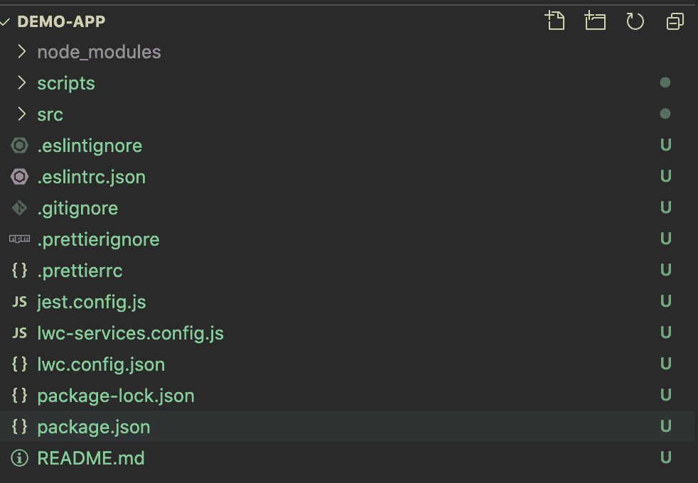

# 如何创建、托管和部署 LWC OSS 应用程序

> 原文：<https://levelup.gitconnected.com/how-to-create-host-and-deploy-an-lwc-oss-app-ff5e05a12409>

在本教程中，我们将了解从头创建一个 [LWC 开源](https://lwc.dev/)应用程序，将其托管在 Github 页面上，并最终部署到 [Heroku](https://www.heroku.com) 的端到端过程。我们还将研究各种 [Heroku](https://www.heroku.com) 部署选项，包括 Express server 和其他替代方案。所以，让我们开始构建我们的第一个 LWC 开源应用吧！

# Lightning Web 组件简介

Lightning Web Components (LWC)是一个开源的轻量级可重用组件集，由 JavaScript、JavaScript 和 CSS 构建。

对于 Salesforce 开发人员来说,, LWC 最好的部分是组件与 Aura 组件在一个页面上共存和互操作。公平地说，LWC 在销售队伍发展方面引入了一个重大的范式转变。作为一名开发人员，您不再使用 Visualforce 这样的专有语言。相反，您可以利用使用现代和开放网络标准构建的 LWC 框架，该框架允许您不仅为 Salesforce，还为其他平台创建应用程序。

对于**全栈开发**，LWC 代表“使用你的团队喜欢的栈和工具的快速、通用的 web 组件和应用”换句话说，它们是一组快速的、可重用的、开源的 web 组件，你可以在你的项目中使用，在大多数 web 栈之上。

LWC 框架的主要优势包括更好的应用程序性能，以及由于开放标准而不断发展和改进的路线图。欲了解更多信息和示例，请查阅官方指南。

因此，让我们构建一个 LWC 项目，并查看托管和部署它的选项。

注意:如果你更喜欢看视频而不是阅读，我受这些视频的启发写了这篇文章，内容包括如何[创建 LWC 应用](https://www.youtube.com/watch?v=-GMvhbZgqAI&feature=youtu.be)，[在 Github 页面上托管 LWC OSS 应用](https://www.youtube.com/watch?v=LqPPDyTD67U&feature=youtu.be)，[用 Heroku 和 Express 部署 LWC 应用](https://www.youtube.com/watch?v=WHD5VZVabNw&feature=youtu.be)，以及[用 Heroku 部署 LWC 应用*而不使用* Express](https://www.youtube.com/watch?v=UoO_-3kC7x4&feature=youtu.be) 。

# 我们开始吧！

为了开始构建我们的 LWC 应用程序，我们利用开源的[*create-LWC-app*](https://github.com/muenzpraeger/create-lwc-app)*工具来构建具有所需结构的种子项目。让我们称我们的示例 LWC 应用程序为“ *demo-app”**

*在创建演示应用程序之前，您需要以下内容:*

*   *[Node.js](https://nodejs.org/en/) 及 npm 5.2 以上*
*   *[节点包运行器](https://nodejs.dev/learn/the-npx-nodejs-package-runner) (npx)*
*   **Git 命令行**

*具备这些先决条件后，您现在可以进入终端了。从那里，创建一个新目录，然后运行以下命令:*

*`npx create-lwc-app demo-app`*

*运行上述命令后，它会要求您确认以下参数。现在，让我们只选择默认选项——我们将在本教程的后续部分探索它们。*

*   ***您想使用简单设置吗？是的***
*   ***NPM**演示应用程序的包名*
*   ***选择您想要创建的应用类型**标准 web 应用*
*   *你想要一个基本的 Express API 服务器吗？没有*

*一旦命令完成，它将安装默认的结构和框架及其相关的依赖项。如果一切顺利，您应该会看到如下确认消息:*

*`🎉 Created demo-app in /Users/gaurav/Desktop/demo-app.. Checkout the `scripts` section of your `package.json` to get started.`*

# *了解项目框架结构*

*让我们打开 Visual Studio 代码中的 *demo-app 项目*来了解一下 app 的骨架结构。*

**

*演示应用程序结构*

*我们示例应用程序的源代码位于 *src* 文件夹中。我们的应用程序的入口点是 *src/index.html**

**

*index.html*

*基于在 *index.js* 中创建的路线，在路线 *demo-app* 上提供示例应用*

**

*索引. js*

*所有 LWC 都存在于“我的”命名空间内的*模块文件夹中。**

**

*模块结构*

*对于这个*演示应用程序，*我们有两个预构建的组件— *应用程序*和*问候。*每个构件的结构包含:*

*   *包含用于呈现的组件标记的 HTML 文件*
*   *包含组件业务逻辑的 JS 文件*
*   *具有组件样式的 CSS 文件*
*   *一个包含组件单元测试的**测试**目录*

# *在本地运行应用程序*

*最好先在本地运行应用程序，以确保没有构建问题。为此，请执行以下命令:*

*`npm run watch`*

*这将在 *localhost:3001* 上启动应用程序*

**

*本地执行*

*你可以在任何浏览器中打开 [http://localhost:3001](http://localhost:3001) 进行验证。它应该显示这一页。*

**

*本地验证*

# *在 Github 页面上托管 LWC 应用*

*现在我们已经在本地运行了我们的 LWC 演示应用程序，让我们进入下一步:Github Pages 应用程序托管。这是一个静态站点托管服务，可以直接从 Github repo 提供文件。*

*为此，运行在 *package.json 文件中定义的构建命令。**

**

*构建命令*

*运行`npm run build` 将显示一个确认，表明构建已经成功完成。*

**

*建立成功*

*这将在项目中创建一个 *dist* 子文件夹。它包含了要在 Github 页面上部署的文件。*

**

*分发文件夹*

*现在我们已经构建了应用程序，让我们看看如何将它部署到 Github 页面。虽然在 Github 页面上有多种方法来组织文件分支，但现在让我们采用最简单的方法——我们将把文件推送到主*分支。**

*首先，在 Github 上创建一个公共回购。*

**

*创建新的回购协议*

*创建存储库后，使用以下命令将 *dist* 目录中的文件推送到您的存储库中:*

**

*将代码推送到回购的步骤*

*成功推送文件后，将显示以下消息:*

```
*Enumerating objects: 3, done.
Counting objects: 100% (3/3), done.
Writing objects: 100% (3/3), 238 bytes | 238.00 KiB/s, done.
Total 3 (delta 0), reused 0 (delta 0)
To https://github.com/gauravkheterpal/demo-app.git
 * [new branch]      main -> main
Branch 'main' set up to track remote branch 'main' from 'origin'.*
```

*通过访问存储库页面上的*设置*链接启用 Github 页面，并选择*主*分支。*

**

*Github 页面*

*这将把你的应用程序部署到 Github 页面。完成后，它将显示一条确认消息，表明该应用程序已被部署到 Github Pages URL。您可以在任何浏览器中打开提供的 URL，它将显示演示应用程序。*

**

*Github 页面演示应用程序验证*

*下一步，您可以使用 Github 动作、预提交钩子和 gh-pages 库来自动化部署过程。*

# *部署到 Heroku*

*在我们深入了解将我们的演示应用程序部署到 Heroku 的细节之前，让我们更好地了解一下 Heroku。Heroku 是一个平台即服务(PaaS ),允许开发者快速构建和部署 web 应用程序。Heroku 负责管道系统——开发、清洗等等。—并让您专注于*建筑*。Heroku 支持多种编程语言、构建包和插件。*

*首先，我们将在不使用 Express 服务器的情况下将演示应用程序部署到 Heroku。当我们使用 CLI 创建示例应用程序时，我们选择了这个选项。*

*   *你想要一个基本的 Express API 服务器吗？没有*

*为了部署应用程序，我们将在应用程序的根目录下创建一个 [*Procfile*](https://devcenter.heroku.com/articles/procfile) 。此 *Procfile* 的内容决定了程序类型和应用程序启动时执行的命令。*

**

*Procfile*

*现在，我们准备使用 Heroku CLI 将这个应用程序部署到 Heroku。如果您没有安装 Heroku CLI，请参见此处列出的[步骤。](https://devcenter.heroku.com/articles/heroku-cli)*

*第一步是登录你的 Heroku 账户。*

**

*Heroku 登录*

*这将打开一个网页浏览器，提示您输入 Heroku 凭证。*

**

*Heroku 登录页面*

*一旦认证成功，它将显示一条确认消息。*

**

*Heroku 登录成功*

*接下来，使用`heroku create` 命令创建一个 Heroku 应用程序。一旦成功，它将显示一条确认消息，其中包含您的应用程序的 Heroku URL。*

**

*Heroku 创建*

*您可以使用`git remote -v`来识别 Heroku 应用程序的远程 git 端点*

**

*git 远程端点标识*

*我们将使用以下命令将演示应用程序文件推送到这个远程 git 端点:*

**

*git 提交*

*当您运行`git push heroku main` 命令时，它会运行构建脚本来将应用程序部署到 Heroku。*

**

*git 推送*

*一旦完成，你会看到一个确认信息。*

**

*git 推送确认*

*然后，您可以使用`heroku open` 命令打开您的应用程序的 Heroku URL。它应该显示此页面:*

**

*Heroku 实例验证*

*现在让我们看看在 Heroku 上部署 LWC 应用程序的另一种方法:使用 Express 服务器。创建应用程序时，选择使用 Express 服务器的选项。*

*   ***您想使用简单设置吗？是的***
*   ***NPM**演示应用的包名*
*   ***选择您想要创建的应用类型**标准 web 应用*
*   *你想要一个基本的 Express API 服务器吗？是的*

*为了部署应用程序，我们将在应用程序的根目录中创建一个 *Procfile* 。*

**

*Express API 服务器*

*这里的关键区别是 serve 脚本引用内置的 Express 服务器。*

**

*服务目标*

*您会注意到这个项目有一个名为 *server/api.js* 的文件，它包含以下内容:*

**

*api.js*

*请注意，它使用的端口(3002)不同于 *server.js* 中使用的内置 Express 服务器端口(3001)*

**

*server.js*

*这里的关键区别是 *api.js* 提供 api，而 *server.js* 支持后端内容。为了简单起见，我们在 *api.js* 中做了以下更改，这样它既服务于 api，也服务于静态内容。*

**

*api.js*

*这确保了非 API 端点调用仍然呈现 index.html*，而 API 端点调用仍然像以前一样工作。然后我们修改“serve”目标来运行 *api.js.***

****

**服务目标**

**一旦完成，剩下的步骤与前面的部分完全相同。使用`heroku create` 命令创建您的 Heroku 应用程序。它将显示一条确认消息，其中包含您的应用程序的 Heroku URL。**

****

**Heroku 创建**

**您可以使用`git remote -v`来识别 Heroku 应用程序的远程 git 端点**

****

**git 远程端点**

**我们将使用以下命令将演示应用程序文件推送到这个远程 git 端点:**

****

**git 提交**

**当您运行`git push heroku main` 命令时，它会运行将应用程序部署到 Heroku 的构建脚本。**

****

**git 推送**

**完成后，会显示一条确认消息。**

****

**git 推送确认**

**然后，您可以使用`heroku open` 命令打开您的应用程序的 Heroku URL。它应该显示此页面:**

****

**Heroku 实例验证**

# **结论**

**在本教程中，我们使用 LWC 构建了一个简单的演示应用程序，将其托管在 Github 页面上，并在有和没有 Express 服务器的情况下将其部署到 Heroku。在未来的教程中，我们将更详细地探讨 LWC 开发和应用程序托管的其他方面。敬请期待！**