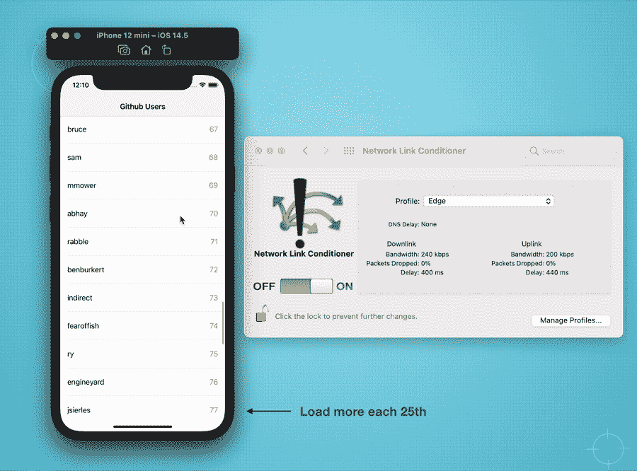
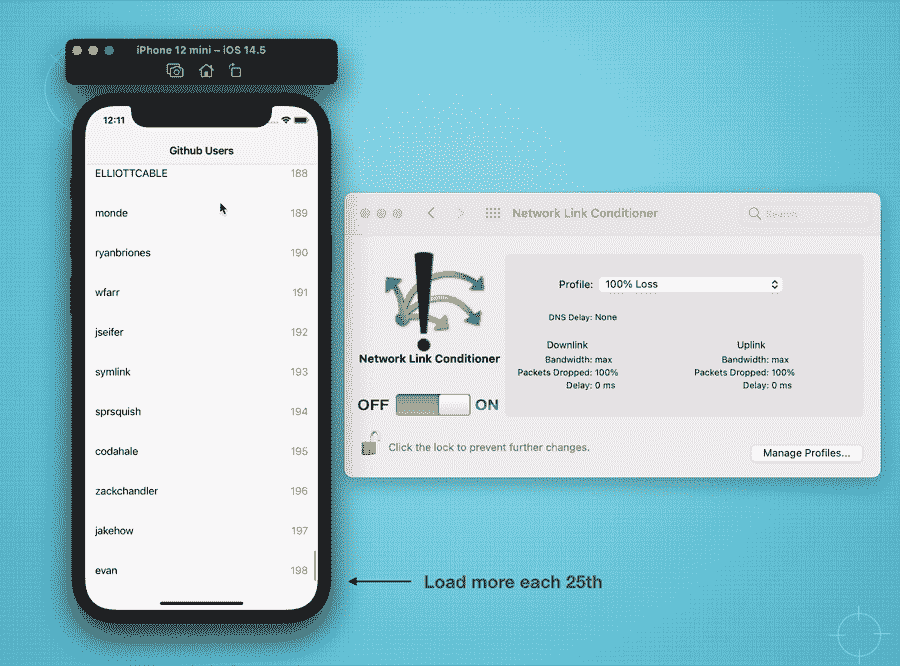
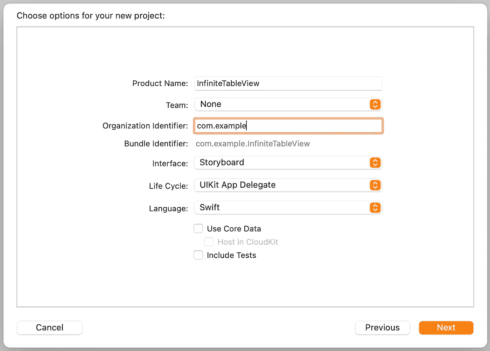
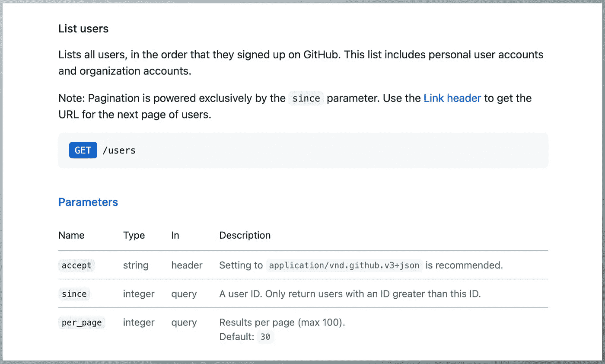
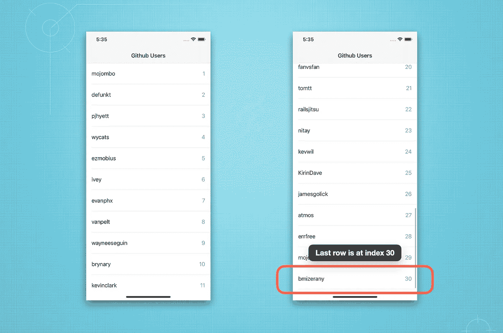

# 如何在 UITableView 中创建无限滚动

> 原文：<https://levelup.gitconnected.com/how-to-create-infinite-scroll-in-uitableview-b021732922df>

## 基于 API 数据对 TableView 进行分页的简单方法

作者图片

# 概观

脸书和推特等社交媒体平台的崛起对当今世界产生了重大影响。人们似乎有一种习惯，整天滚动他们的提要，查看各种信息和故事。

订阅页面是每个社交应用的常见功能，允许用户无限滚动。在本文中，我们将学习如何通过分页获取大量数据。我们将使用 [GitHub API](https://docs.github.com/en/rest) 来模拟无止境的数据请求。

GitHub 提供了一个 API，其中一些端点是公共的，无需认证就可以访问数据，例如获取用户和公共存储库的列表。

# 我们将建造什么？

我们将创建一个简单的应用程序，它具有以下功能。

## 1.能够调用 API 和滚动 UITableView 与分页。

我们将使用 Github API 来获得一个[用户列表](https://docs.github.com/en/rest/reference/users#list-users)。它包含了 GitHub 自成立以来的所有用户。

用分页加载 API 数据

在上面的结果中，我使用网络调节器工具创建了一个“边缘”连接，这样我们就可以看到加载过程(一个高速网络将非常快速和无缝加载)。

## 2.处理请求**错误**

然后我更改为“100%丢失”,以显示对失败的数据获取的错误处理。参见我之前的[文章](https://medium.com/codex/simulate-poor-network-conditions-in-ios-development-1c1912a33a51)关于如何模拟多种网络条件。

网络故障的用户界面处理

# 编码开始

## **1。创建新的 UIKit 项目**

在这个项目中，我们将使用 UIKit 和故事板。

## **2。插入导航控制器(可选)**

创建项目后，用导航视图控制器嵌入默认的 ViewController。选择 Main.storyboard，然后选择顶部菜单编辑器>嵌入>导航控制器。

## **3。将 UITableView 插入故事板**

打开情节提要并插入 UITableView。然后将约束固定到超级视图的边缘。不要忘记在 ViewController 类中将 UITableView 链接为 IBOutlet。

## **4。创建用户模型**

创建一个名为 User.swift 的新模型文件，并添加以下代码。我们只从 JSON 对象中获得 id、名称和 avatarUrl。在这个项目中，我们将只显示名称作为一个快速的例子。

## 5.创建 API 服务管理器

/来自 [GitHub API 文档](https://docs.github.com/en/rest/reference/users#list-users)的用户端点详细信息

创建一个名为“GithubAPIManager.swift”的新文件来处理 API 请求。它只是一个使用 URLSession 和`dataTask()`方法的普通 API 请求。在该文件中，插入以下代码。

1.  创建要在完成处理程序中使用的错误类型
2.  用参数构造正确的 API URL
3.  创建`URLRequest`，超时 10 秒。

## **5。设置表格视图和 API 集成**

打开 ViewController 文件并添加以下代码。同样在代码的底部，我们添加了一些 TableView 数据源方法(委托方法将在下一步中使用)。

1.  添加`users`变量来存储来自 API 的数据，无论何时设置，TableView 都会立即重新加载它的内容。
2.  `setupView()`，TableView 上的一个简单设置。稍后我们需要添加`.delegate`。
3.  调用我们的 API 服务并处理接收到的数据的函数。
4.  添加默认的 TableView 单元格以显示名称和行号。

添加代码后，运行您的项目，您应该会得到简单的 TableView 列表，如下图所示。您将在 TableView 中获得正好 30 行作为默认的`perPage`参数，并且还不能分页。

包含 30 个用户静态数据的简单表格视图列表

## 6.设置分页

太好了。我们已经完成了项目的基础设置。现在，我们需要做一些更新，以确保我们的用户列表可以无休止地滚动。如下更新我们的 ViewController 类，并查看每个代码更改的解释。

以下是对修正案的解释。

1.  我们添加了新的`TableSection`枚举。我们的 TableView 将有两个部分。第一个是保持相同的用户列表，而第二个是保持加载器单元。
2.  又增加了两个变量。`pageLimit`用于保持所请求的限制对象的常量，`currentLastId`用于存储`users`数组中最后一个`User`对象的 id。通过向`since`参数提供我们已经获取的最后一个 id，将在获取下一个页面 API 时使用`currentLastId`。
3.  将 TableView 委托分配给当前 ViewController，以便能够使用`willDisplay`方法调用。
4.  用完成回调更新 fetchData 以接收成功或失败状态。
5.  将`=`改为`.append`的方法，保持`users`数组扩展而不是替换。
6.  用成功状态更新`completion()`。
7.  添加了`numberOfSections`，因为我们将保留两个部分，如第 1 点所述。
8.  `numberOfRowsInSection`现在是视小节而定。此外，只有当用户的数据大小更多的`pageLimit`，然后我们将显示加载单元。
9.  只需将单元格文本更新为用户列表的名称并“加载..”对于第二部分。
10.  这是加载器单元将出现的重要部分，API 服务将开始获取新数据(下一页)。
11.  在前面一点中，在`willDisplay`方法中，当错误发生时会调用`hideBottomLoader()`。是的，我们完了！试着运行代码，一直滚动到底部，直到你的名字😆。

# 潜在缺陷

当网络连接缓慢时，可能会发生一个潜在的错误。当用户到达底部加载器单元时，他们可以继续上下滚动，以便发送多个具有相同`currentLastId`的 API 请求。因此，成功数据将是多余的。

解决这个问题是你的家庭作业🤭

不要慌！最简单的解决方案是在每次发送请求时比较`currentLastId`。确保检查`currentLastId`与之前的请求不同。对，就是这样。

# 项目已完成

恭喜你！我们已经完成了所有的步骤，项目现在已经准备好了，可以完美地工作了。完整的源代码可以从我的 GitHub [库](https://github.com/xmhafiz/PaginateTableView)下载。您可以尝试将它实现到您的项目中，并通过开发一个子类或 UITableView 扩展来改进代码，以便它可以在其他视图控制器中重用。

感谢阅读。编码快乐！

# 参考

[https://docs.github.com/en/rest](https://docs.github.com/en/rest)

[https://docs.github.com/en/rest/reference/users#list-users](https://docs.github.com/en/rest/reference/users#list-users)

[https://medium . com/codex/simulate-poor-network-conditions-in-IOs-development-1c 1912 a 33 a 51](https://medium.com/codex/simulate-poor-network-conditions-in-ios-development-1c1912a33a51)

[https://github.com/xmhafiz/PaginateTableView](https://github.com/xmhafiz/PaginateTableView)