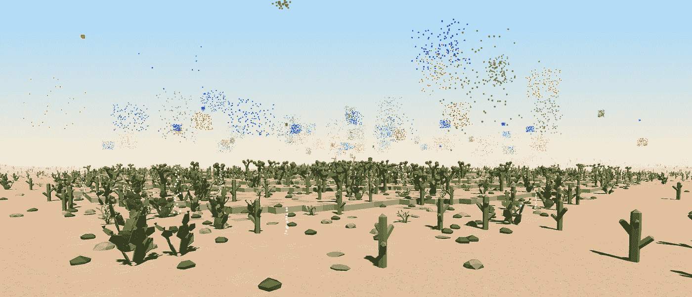
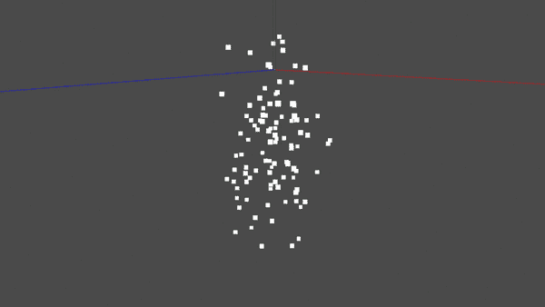

# 如何在 OpenGL 中创建实例粒子

> 原文：<https://levelup.gitconnected.com/how-to-create-instanced-particles-in-opengl-24cb089911e2>

## 使用 C++和 OpenGL 实现粒子的简单有效的方法

粒子是游戏开发中非常重要的一个方面。每一个游戏都使用粒子系统来制作各种不同的效果:火、烟、落叶，甚至草都可以用粒子来制作。它们是让静态场景感觉更加动态和生动的好方法，这将增加玩家的沉浸感。

有许多不同的方法来实现粒子，从容易实现但不是很快，到非常有效但相当复杂。实例粒子位于中间的某个位置:足够快，同时仍然易于理解和实现。如果你了解 OpenGL 的基本原理，如顶点缓冲对象和着色器，你应该能够创建自己的实例粒子。

简单的粒子烟花，由作者图像。

# 发射器

一个发射器基本上就是一个母体。它负责所有的粒子和繁殖，重新繁殖，并更新它们。在你的场景中可以有很多发射器，例如，《我的世界》的每个火炬顶部都有粒子发射器，产生一些烟雾粒子。

在本教程中，我们将创建一个非常简单的发射器类，只包含最重要的方面。它有三个功能和四个属性。它有一个存储粒子位置和年龄的结构。在大多数真实世界的应用程序中，它还会存储速度、加速度和一些其他属性，但是为了本教程，我删除了所有不重要的方面。除此之外，发射器还有一个位置数组，每帧都会发送到 GPU，还有两个 OpenGL 顶点缓冲对象。

## 初始化

在构造函数中，我们创建了 100 个具有随机位置和年龄的粒子，并生成了两个顶点缓冲对象。顶点缓冲区被填充并存储单个粒子实例的顶点。我们使用四边形，它是由两个三角形组成的三角形带，所以每个四边形有四个顶点。与对每个粒子使用四边形的更简单的实现相比，这要高效得多。100 个四边形，每个由 4 个顶点组成，每帧有 400 个顶点需要发送到 GPU，这还不包括可能的颜色或 uv 值。相比之下，我们将只发送粒子位置到 GPU，只有 100 个顶点。

## 更新

更新功能每帧更新发射器中的每个粒子。粒子年龄决定了粒子何时需要重新着色。为了简单起见，这里所有的粒子都以恒定的速率向下运动，但是你可以很容易地添加一个更复杂的基于物理的速度和加速力的模拟。这种实现的伟大之处在于，粒子运动的复杂性不会影响必须发送到 GPU 的数据量。模拟会产生每个粒子的位置，并且只有该位置会通过位置缓冲区发送到 GPU。你甚至可以将更新函数放在另一个线程中，但是根据具体情况，你可能需要将位置缓冲区与主渲染线程同步。

## 画

绘制粒子非常简单。位置缓冲区被发送到 GPU，然后顶点和位置缓冲区对象被绑定。请记住，位置缓冲区是一个实例化的缓冲区，这意味着我们需要告诉 OpenGL 如何用`glVertexAttribDivisor`访问它，我们需要使用`glDrawArraysInstanced`而不是`glDrawArrays`。

# 着色程序

将粒子位置发送到 GPU 后，着色器会完成大部分工作。一般来说，你总是希望你的粒子面向镜头。这在计算机图形学中也叫做广告牌。幸运的是，通过我们设置粒子系统的方式，这可以在顶点着色器中轻松完成。粒子的位置乘以视图矩阵，将其转换到相机空间，也称为视图空间。如你所知，在相机空间中，相机在(0，0，0)处，并且看向负 z 方向。我们的原始顶点位置只有 x 和 y 值，这意味着四边形在创建时会自动面向相机。粒子的大小可以用统一的值来控制。最后，通过与投影矩阵相乘，一切都被投影到屏幕上。

片段着色器仅将四边形着色为白色，以使其在本教程中保持简单。但是，您可以很容易地将其更改为其他颜色或对粒子应用纹理。您甚至可以根据粒子的年龄循环播放动画纹理，或者在粒子变老时淡出。如果您的粒子需要受光线影响，可以将光照计算添加到片段着色器中。

教程粒子效果，有意留下简单，由作者图像。

# 完全码

下面是教程的完整代码([头文件](https://gist.github.com/pingpoli/55c3d93d4662e59455f5cefbc60e8d0c)、[源文件](https://gist.github.com/pingpoli/bb5fd587a2c0721ecc397c91d17c12d2))。如果你想直接编译和运行代码，你需要根据你的着色器加载解决方案改变着色器的加载方式，除了它是普通的 OpenGL。

# 附件

出于本教程的考虑，我从代码中删除了所有不重要的方面，这意味着这只是一些落下的白色粒子。实际上，您可能希望给粒子添加速度和加速度来模拟更有趣的运动，并添加颜色或纹理来使粒子看起来更好。创作自由是你的，这只是基本概念。

粒子是一个非常大的话题。有许多不同的方法来实现它们，虽然有些方法比其他方法更好，但它总是取决于哪种技术最有效的情况。实例化的粒子在 CPU 上更新，但也有方法创建完全基于 GPU 的粒子系统，实现起来稍微复杂一点。另一件不得不提的事情是粒子的透明度问题。如果你有半透明的粒子，它们必须从后向前绘制，所以你需要根据它们的深度对它们进行分类，或者使用不同的混合模式。

粒子是让场景充满活力的好方法。树叶从树上落下，烟雾，火焰和其他各种各样的效果都可以用粒子来完成。现代 GPU 可以处理大量的粒子，而不会对性能产生重大影响。实例化粒子是一种既容易实现又高效的方法。只有粒子位置被发送到 GPU，其余的在着色器中完成。这允许更高级的模拟，而没有 CPU/GPU 通信的瓶颈。有很多不同的方法来实现粒子，在设计有趣的粒子效果时有无尽的创作自由，所以开始吧！