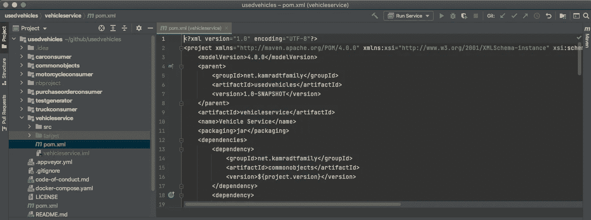
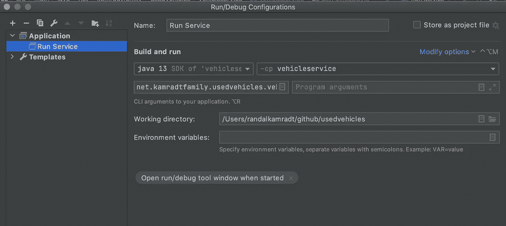

# 如何创建没有 Spring 膨胀的 Java 服务

> 原文：<https://levelup.gitconnected.com/how-to-create-java-services-without-spring-bloat-bd9aba653a55>

## 当你无法透过铃声和哨声看到森林


由[安德鲁·科埃略](https://unsplash.com/@andrewcoelho?utm_source=unsplash&utm_medium=referral&utm_content=creditCopyText)在 [Unsplash](https://unsplash.com/s/photos/forest?utm_source=unsplash&utm_medium=referral&utm_content=creditCopyText) 拍摄的照片

我一直在做一系列模拟二手车进气平台的微服务，截至目前，我已经成功避免了春天。当你需要所有的东西时，Spring 是一个很好的框架，但是有时候你只需要一个简单的服务，不想要 20-30 秒的启动时间。

我喜欢用 JavaScript 做简单的小服务的原因之一是它没有开销和样板文件。在微服务的世界里，越小越好，我认为如此多的人在微服务上取得成功失败的原因是他们仍然像建造一个整体一样建造它们。Spring 很好地完成了将你的整体连接在一起的工作，但是如果你的服务真的是微服务，就不需要那么多的组装，Spring 是多余的。

由于我习惯于用 JavaScript 制作简单的类似 REST 的服务，我惊喜地发现有一个名为 [Java Express](https://github.com/Simonwep/java-express) 的 Java 库试图模仿 JavaScript library Express。我的二手车进气平台的一个问题是它还没有输入或输出服务，所以你必须用测试生成器创建输入数据，你只能通过查看日志和直接在数据库中确认事情是否正常。本文将使用 Java Express 库制作一个简单的类似 REST 的输入和输出服务。

要做的第一件事是添加依赖项。在[这个库](https://github.com/rkamradt/usedvehicles/tree/v0.9)中工作，我编辑主`pom.xml`并将包括`<version>`在内的全部依赖项添加到`<dependencyManagement>`部分:

```
<dependency>
  <groupId>com.github.Simonwep</groupId>
  <artifactId>java-express</artifactId>
  <version>0.0.10</version>
</dependency>
```

我还将模块添加到了`<modules>`部分:

```
<module>vehicleservice</module>
```

这里需要注意的是，多模块 pom.xml 文件中的模块引用子模块所在的目录，而不是工件 ID，即使它们经常是相同的。接下来，我设置新的模块，我手动完成，因为当您添加新的模块时，IDE 有时会感到困惑。我做了一个名为`vehicleservice`的目录，复制了`carconsumer/pom.xml`并修改了`<artifactId>`和`<name>`。我还添加了上面提到的依赖项，但是没有版本(版本继承自`<dependencyManagement>`部分)。然后我为 Maven、`src/main/java`和`src/main/resource`创建标准的目录集。由于我在过去处理微服务时解释过的原因，我没有创建单元测试。

在这个项目中，我使用了 IntelliJ 思想，它在使用 Java 时做得很好。



习惯所有不同的想法是有好处的。您可能不得不使用的一些代码库只有特定的项目文件。我总是让我的项目基于 Maven，然后我将 IDE 项目文件添加到`.gitignore`文件中，以允许人们使用他们想要的任何 IDE。Maven pom 文件还允许您在没有任何 IDE 的情况下在构建服务器上进行构建，并且大多数 IDE 都能够从 Maven pom 引导项目。

对于这个服务，我需要一些东西，输入和输出有效载荷和主类。主类中的所有东西都应该很好地适应，所以我不打算创建很多不同的类。当我说微服务时，我真正的意思是微服务。此外，从其他项目中复制`application.properties`文件，这样您的测试配置缺省值将会就位。

我打算从小处着手，逐步积累，然后在每一步进行测试。首先，我将用一个 GET 端点创建主类，我可以用 Postman 测试它。

```
public class VehicleService {
    public static void main(String [] args) {
        Express app = new Express();
        app.get("/", (req, res) -> res.send("Hello index!"));
        app.listen();    
    }
}
```

再简单不过了！运行它，它会返回“Hello Index！”忠实地。

让我们通过在 Couchbase 的`po`桶中创建一个采购订单来尝试一下。我将创建一个名为`/po`的 POST 端点，它将返回一个 202 状态码，表示它已被接受。我们说接受是因为它只进入消息队列，而不是直接进入数据库。PurchaseOrderConsumer 从消息队列中取出它，并将其添加到数据库中。这可以防止服务和数据库在高峰输入期间过载。

首先，我们需要导入配置。我将从另一个服务中剪切并粘贴所有这些内容(我们都知道，当您剪切并粘贴时，一只小狗会死去，但就这样吧)。

然后我将添加后处理程序:

```
app.post("/po", (req, res) -> {
  PurchaseOrderPayload purchaseOrderPayload;
  try {
    purchaseOrderPayload = objectMapper.readValue(req.getBody(),
                        PurchaseOrderPayload.class);
  } catch (IOException e) {
    ContextLogging.log("could not parse payload " + e.getMessage());
    res.setStatus(Status._400);
    res.send("Unable to parse payload");
    return;
  }
  try {
    if(!List.of("Car", "Truck", "Motorcycle")
            .contains(purchaseOrderPayload.type)) {
      ContextLogging.log("invalid type " +
            purchaseOrderPayload.type);
      res.setStatus(Status._400);
      res.send("type must be one of Car, Truck, or Motorcycle");
      return;
    }
    String purchaseOrderId = addPayloadToQueue(
             purchaseOrderPayload, sender)
        .block(Duration.ofSeconds(10));
    res.setStatus(Status._201);
    res.send(purchaseOrderId);
  } catch (Exception ex) {
    ContextLogging.log("uncaught exception " + ex.getMessage());
    res.sendStatus(Status._500);
  }
});
```

在 POST 处理程序中，我解析有效负载并验证它。如果它无效，我将发送一个状态 400，并附上最简单的解释。对错误的过多解释可能是一种利用。当然，您不希望向调用者显示堆栈跟踪。如果它通过了验证，我就调用`addPayloadToQueue`,稍后我们将讨论它。它返回一个`Mono<String>`,其中的字符串是我们应该保存起来以备后用的采购订单 ID(我将只实现按 ID 搜索；一般搜索是另一篇文章)。因为我们希望能够发送回采购订单 ID，所以我们必须阻塞，并且我们应该设置一个超时。我选择 10 秒钟作为一段有限的时间。任何不是由我们应该在验证中发现的错误输入引起的异常都将被视为 500 错误。

下面是`addPayloadToQueue`的方法:

```
private static Mono<String> addPayloadToQueue(
            final PurchaseOrderPayload purchaseOrderPayload,
            final Sender sender) {
  String eventId = UUID.randomUUID().toString();
  String purchaseOrderId = UUID.randomUUID().toString();
  return sender.sendWithPublishConfirms(
     Mono.just(purchaseOrderPayload)
         .doOnNext(po -> ContextLogging.log(
                        "received: " + po))
         .map(p -> new Payload(eventId, PurchaseOrder
                   .builder()
                   .id(purchaseOrderId)
                   .price(p.getPrice())
                   .time(Instant.now().toString())
                   .type(p.getType())
                   .build()))
         .map(i -> Tuples.of(ContextLogging.builder()
                   .serviceName("VehicleService")
                   .eventId(eventId)
                   .build(), i))
         .doOnNext((o) -> ContextLogging.log(o.getT1(),
                   "adding to queue: " + o.getT2()))
         .map(t -> t.mapT2(PossiblyFunction.of(po ->
                   payloadWriter.writeValueAsString(t.getT2()))))
         .map(i -> new OutboundMessage("",
                   QUEUE_TOPIC_PO,
                   i.getT2()
                     .doOnException(e ->
                          ContextLogging.log(i.getT1(),
                          e.getMessage()))
                     .getValue()
                     .orElseThrow(() ->
                          new RuntimeException(
                              "error sending purchase order"))
                     .getBytes())) ) // we could check the return here
     .map(r -> purchaseOrderId) // replace with purchaseOrderId
     .singleOrEmpty();
}
```

您会从 TestGenerator 服务中发现很多这种情况，因为我们正在做同样的事情，只是从 POST 中获取我们的输入，而不是为测试创建随机的购买订单。

通过运行我们在上一篇文章中创建的 docker-compose 文件中的 Couchbase、RabbitMQ 和 PurchaseOrderConsumer 服务来测试它。如果它们还在运行，那你很幸运。否则，您必须根据前面提供的说明，使用 Couchbase 和 RabbitMQ 管理控制台来创建各种队列和存储桶。一旦在 Docker Compose 中运行了这三个组件，就可以使用 run/debug 配置从 IntelliJ 运行新服务了



在设置配置之后，这只是告诉它哪个模块和哪个启动类，您可以单击绿色箭头来运行。您应该可以在 IntelliJ 的底部看到日志，并且可以在 Docker Compose 中看到其他日志。如果您有任何问题，可以单击绿色箭头旁边的绿色 bug 图标来调试您的程序。我喜欢 IntelliJ 的一点是，可以在 lambdas 中设置断点，因此调试函数式程序要容易得多。

我应该在这里指出，如果您查看日志，我的服务在半秒钟内就准备好了，相比之下，我的 Spring 服务加载需要几十秒钟。

接下来，我们将制作 GET `/po/<poId>`端点。希望您在试用时保存了帖子中的采购订单 ID(您确实试用了，对吗？).下面是 GET 处理程序:

```
app.get("/po/:poId", (req, res) -> {
  try {
    String id = req.getParam("poId");
    Tuple2<Status, String> payload = getPayloadById(id)
         .map(PossiblyFunction.of(po ->
                objectMapper.writeValueAsString(po)))
         .map(p -> {
            if(p.exceptional()) {
              return Tuples.of(
                   Status._500, 
                   "Uncaught exception " + p.getException().get());
            }
            return Tuples.of(Status._200, p.getValue().get());
         })
         .defaultIfEmpty(Tuples.of(Status._404, id + " not found"))
         .block(Duration.ofSeconds(10));
    res.setStatus(payload.getT1());
    res.send(payload.getT2());
  } catch (Exception ex) {
    ContextLogging.log("uncaught exception " + ex.getMessage());
    res.sendStatus(Status._500);
  }
});
```

可以从`req.getParam`方法中检索到`id`参数，这就是调用返回`Mono<PurchaseOrderPayload>`的`getPayloadById`方法所需的全部内容。我们把`PurchaseOrderPayload`翻译成一个字符串返回。如果序列化出现异常(除非数据库中有坏数据，否则不应该出现异常)，我们希望用一条短消息返回一个状态 500。我通过创建一个`Tuple<Status,String>`来包含状态和返回消息。如果`Mono`为空，我将返回一个 404 状态。如果有任何未捕获的异常，我将再次返回 500 错误。就像在 POST 处理程序中一样，我们不想对伴随 500 的消息提供太多帮助，但是我们可能希望记录原因。

`getPayloadById`方法相对简单，只是我无法让 Couchbase 将返回的字符串解析为它所代表的类型。实际上，我对 Couchbase 感到非常恼火，我可能不会在未来的项目中使用它。但是下面是检索数据的代码:

```
public static Mono<PurchaseOrderPayload>
                getPayloadById(final String id) {
  final ContextLogging context = ContextLogging.builder()
         .serviceName("VehicleService")
         .eventId(UUID.randomUUID().toString())
         .build();
  return poReactiveCollection
         .get(id)
         .doOnNext(c -> ContextLogging.log(context,
                        "po " + id + " found " + c.toString()))
         .doOnError(e -> ContextLogging.log(context,
                        "error finding po " + id + " " + e))
         .map(r -> r.contentAs(String.class))
         .map(PossiblyFunction.of(ps -> 
               objectMapper.readValue(ps, Payload.class)))
         .map(p -> p.map(po -> PurchaseOrderPayload.builder()
                        .price(po.po.getPrice())
                        .type(po.po.getType())
                        .build()))
         .map(p -> p.getValue())
         .onErrorReturn(DocumentNotFoundException.class,
                 Optional.empty())
         .flatMap(p -> p.isEmpty() 
                ? Mono.empty() 
                : Mono.just(p.get()));
    }
```

如你所见，我使用了`GetResult.contentAs(String.class)`而不是实际的类`Payload`，然后我必须使用 Jackson 的`ObjectMapper`来获得`Payload`类。还要注意的是，一旦我将它映射到一个`Mono<Optional<PurchaseOrderPayload>>`流，我就捕获`DocumentNotFoundException`以返回一个 Optional.empty，这样处理程序代码将返回一个 404。

再运行一次，用 Postman 看看能否创建一个采购订单，然后再检索一次。在我们继续之前，您还应该测试错误条件，尝试创建一个有效负载错误的采购订单，并确保您获得 400 状态。还要搜索一个不存在的 ID，以确保获得 404 状态。一旦这些都工作正常，您就可以停止 IntelliJ 中的服务并关闭测试实例:

```
docker-compose down
```

## 在 Kubernetes 经营一切

最后，因为我们的其他服务运行在 Kubernetes，所以让这个服务也运行在那里。我们要做的第一件事是制作一个图像，因为我们的父 pom 包含 jib 插件，这很简单:

```
mvn clean package jib:build
```

这将为所有服务创建新的图像。

希望您阅读了我的上一篇文章，在这篇文章中，我为所有的 Kubernetes 描述符建立了一个目录，还建立了 Couchbase 和 RabbitMQ 的 Kubernetes 实例。如果没有，你真的应该现在就做，否则什么都不会起作用。本文将指导您如何部署所有需要的服务，以便我们可以测试我们的新服务。一旦您完成了所有的设置，将`cd`放入部署目录`usedvehicles-deploy`。

我们的新服务将与我们的其他描述符略有不同，但我们可以从将`purchaseorderconsumer.yaml`复制到`vehicleservice.yaml`开始，然后编辑它，将 purchaseorderconsumer 的所有事件更改为 vehicleservice。最大的区别是，这是第一个真正的“服务”，也就是说，它监听 HTTP 端口。要启用此功能，请将以下内容添加到 vehicleservice.yaml:

```
---
apiVersion: v1
kind: Service
metadata:
  name: vehicleservice-service
spec:
  type: ClusterIP
  selector:
    app: vehicleservice
  ports:
  - port: 8080
    targetPort: 80
```

现在，您应该能够使用以下命令启动它:

```
kubectl create -f vehicleservice.yaml
```

运行`kubectl get pods`直到你看到你的车辆服务舱处于运行状态。为了能够在不设置入口的情况下访问您的新服务，您可以进行端口转发。pod 名称应该是`vehicleservice-deployment-xxxxxxxx-xxxx`，其中的“x”是随机字符，用于区分该 pod 和其他 pod。由于您只有一个 pod 用于运行服务，请在该 pod 上运行 port-forward 命令:

```
kubectl port-forward vehicleservice-deployment-xxxxxxxx-xxxx 8080:80
```

现在，您可以返回到 Postman，创建一个采购订单并再次检索它。注意，数据库会有所不同，因为我们在 Kubernetes 中运行的 Couchbase 实例与我们在 Docker Compose 中运行的不同。

现在，除了所有其他服务之外，我们还有一个可以创建和检索采购订单并完成所有所需处理的服务。我们没有因为 Spring 的花里胡哨而陷入困境，只用了不到 200 行代码，这遵循了 YAGNI 原则。我们创建了小而简单的服务，它们能够很好地沟通，并遵循可靠的原则。就干旱而言，很多小狗死在那座山上，这是我最不喜欢的各种开发商的缩写。最后，我们让一切都在 Kubernetes 中运行，现在我们可以根据需要自由扩展。如果我们添加一些健康检查，我们还可以通过确保 pod 在遇到问题时重新启动来实现高可用性。

本文中使用的 GitHub 存储库:

[](https://github.com/rkamradt/usedvehicles/tree/v0.9) [## rkamradt/二手车辆

### Permalink 无法加载最新的提交信息。整个第一阶段使用电抗组件的微服务系统示例…

github.com](https://github.com/rkamradt/usedvehicles/tree/v0.9) [](https://github.com/rkamradt/usedvehicles-deploy/tree/v0.2) [## rkamradt/used vehicles-部署

### 二手车服务的部署脚本。为 rkamradt/used vehicles-部署开发做出贡献，方法是创建…

github.com](https://github.com/rkamradt/usedvehicles-deploy/tree/v0.2) 

提到的其他文章:

[](/running-java-microservices-in-kubernetes-57a7a05e85ac) [## 在 Kubernetes 中运行 Java 微服务

### 微服务与 RabbitMQ 和 Couchbase 捆绑在一起

levelup.gitconnected.com](/running-java-microservices-in-kubernetes-57a7a05e85ac)