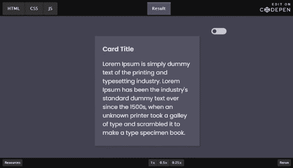

# 如何用 CSS 和 Javascript 创建亮/暗模式切换

> 原文：<https://levelup.gitconnected.com/how-to-create-light-dark-mode-toggle-with-css-and-javascript-8c297e7ab806>


# 介绍

随着黑暗模式成为 2021 年的主要趋势之一，越来越多的人开始将黑暗模式融入他们的新项目，因为它的高可达性和它给观众眼睛带来的低到零的压力。在本教程中，我将带领你完成仅使用普通 Javascript 和 CSS 创建亮/暗模式切换的完整过程。我们将看一个小卡片示例，但概念是相同的，可以很容易地调整以适合您自己的业务案例。

# 准备好 HTML

对于 HTML，除了 from container div 元素，我们只需要关心 toggler 元素和 card 元素。

```
<!-- Container -->
<div class="container">
  <div class="inner-wrapper">
    <!-- Controller Row -->
    <div class="controller-row">
      <label class="switch">
        <input id="toggler" type="checkbox">
        <span class="slider round"></span>
      </label>
    </div><!-- End of controller row -->
    <!-- Card -->
    <div class="card">
      <div class="card__header">
        <h2 class="__title">Card Title</h2>
      </div>
      <div class="card__body">
        <p class="__detail">
          Lorem Ipsum is simply dummy text of the printing and typesetting industry. Lorem Ipsum has been the industry's standard dummy text ever since the 1500s, when an unknown printer took a galley of type and scrambled it to make a type specimen book.
        </p>
      </div>
    </div><!-- End of card -->
  </div>
</div><!-- End of container-->
```

在我们继续之前，需要注意一些 CSS 类:

*   容器:环绕所有元素的 Div 元素。将是我们的主要背景。
*   card:我们整个卡的父 div 元素。这也是盒影将要生活的地方。
*   _ _ 标题:卡片标题
*   __detail:卡片的正文

HTML 上的主要元素:

**容器**
在本教程中，我们使用一个带有 CSS 类*容器*的 div 元素作为页面背景，但在实际项目中，这可能是 body 元素或父元素。

Toggler 元素直接取自 W3School，因为它不是本教程的主要焦点，但是您可以用自己的开关替换它。

**卡片**
卡片包含三个元素:标题、正文和阴影。我们将改变这些元素在亮模式和暗模式下的外观。

# 准备 CSS 变量

为了轻松地在亮模式和暗模式之间切换外观，我们需要创建一些 CSS 变量。稍后我们将在 HTML 元素中直接使用这些变量定义的颜色。通过这样做，我们可以在黑暗模式下覆盖这些变量，而不是为黑暗模式重写整个 CSS 集。

```
/*** Light Mode Theme ***/
:root, [data-theme="default"] {
  --body-bg-color: #fff;
  --card-bg-color: #fff;
  --box-shadow-color: rgba(0,0,0,0.2);
  --text-color: #333;
  --switch-on-color: #444352;
  --switch-off-color: #ccc;
  --toggler-color: #fff;
}
/* Dark Mode Theme */
[data-theme="dark"] {
  --body-bg-color: #444352;
  --card-bg-color: #545363;
  --box-shadow-color: rgb(18, 18, 19, 0.2);
  --text-color: #efefef;
  --toggler-color: #444352;
  --switch-on-color: #fff;
  --switch-off-color: #ccc;
}
```

在上面的 CSS 代码中，我们首先创建了针对根元素和默认主题的 CSS 变量。(亮模式)然后我们覆盖这些变量，并在暗模式选择器中给它们不同的值。亮模式和暗模式是通过使用 HTML 属性来定义的: **data-theme** 当然你可以将这个属性命名为任何你想要的值。

注意。
在 SCSS 中，建议在＄符号上使用原生 CSS var()函数，因为对于 CSS 变量，当您覆盖变量的属性时，它们将直接应用于引用它们的 HTML 元素。另一方面，使用 SCSS $符号，您需要将变量重新分配给所需的元素。

# 将 CSS 变量绑定到 HTML

```
* {
  font-family: 'Poppins', sans-serif;
  // Bind text color to the '--text-color' variable
  color: var(--text-color);
  transition: color .45s ease-in;
}
.container {
  height: 100vh;
  width: 100vw;
  display: flex;
  // Bind page background color to the '--body-bg-color' variable
  background-color: var(--body-bg-color); 
  transition: background-color .45s ease-in;
}
.card {
  margin: auto;
  width: 300px;
  padding: 10px 15px;
  box-shadow: 2px 3px 4px 1px var(--box-shadow-color);
  // Bind box shadow color to the '--box-shadow-color' variable
  box-shadow-color: var(--box-shadow-color);
  background-color: var(--card-bg-color);
  transition: background-color .45s ease-in,
              box-shadow-color .45s ease-in;
}
.slider {
  position: absolute;
  cursor: pointer;
  top: 0;
  left: 0;
  right: 0;
  bottom: 0;
  // Bind the toggle background color (unchecked) to the '--switch-off-color' variable
  background-color: var(--switch-off-color);
  -webkit-transition: .4s;
  transition: .4s;
}
.slider:before {
  position: absolute;
  content: "";
  height: 12px;
  width: 12px;
  left: 4px;
  bottom: 4px;
  // Bind the toggle inner circle color to the '--toggler-color' variable
  background-color: var(--toggler-color);
  -webkit-transition: .4s;
  transition: .4s;
}
input:checked + .slider {
  // Bind the toggle background color (checked) to the '--switch-on-color' variable
  background-color: var(--switch-on-color);
}
input:focus + .slider {
  // Bind the toggle box shadow color to the '--switch-on-color' variable
  box-shadow: 0 0 1px var(--switch-on-color);
}
```

在变量绑定过程中需要指出的重要一点是，如果你想给你的元素添加平滑过渡或动画，确保你使用的是**背景色**而不是**背景色**。

# Javascript 逻辑

Javascript 部分相对简单。当用户切换开关时，我们希望设置或移除**容器** div 元素的**数据主题**属性。我们可以通过向 switch toggle 添加一个事件监听器来实现这一点。

```
// On toggler clicked
var container = document.getElementsByClassName('container')[0];
document.getElementById('toggler').addEventListener('change', (event) => {
  console.log(toggler)
  event.target.checked ? container.removeAttribute('data-theme') : container.setAttribute('data-theme', 'dark');
});
```

# 点睛之笔—添加过渡

作为最后的润色，您可以将过渡添加到我们与变量绑定的 CSS 属性中，例如颜色、框阴影颜色和背景颜色。它将使颜色过渡平滑，并改善整体用户体验。

最终结果:



你可以在 https://codepen.io/chen1223/pen/PobxwMj 的
的 CodePen 上找到完整的代码

这就是本教程，欢迎在下面留下评论或分享你对黑暗模式和 css 变量的想法。

原帖:
[https://simple web learning . com/how-to-create-light-dark-mode-toggle-with-CSS-and-JavaScript](https://simpleweblearning.com/how-to-create-light-dark-mode-toggle-with-css-and-javascript)