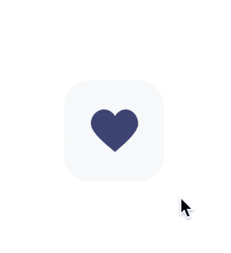
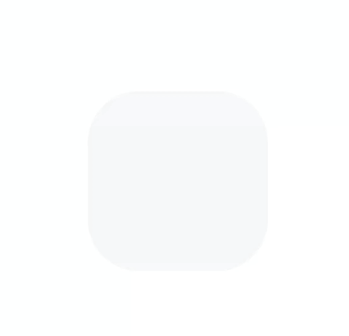
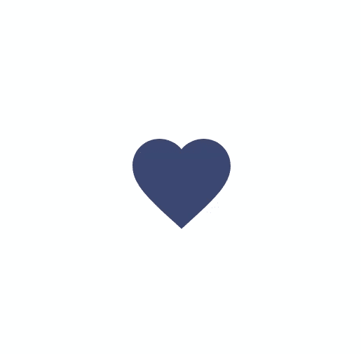

# 如何在 Android 中创建 like 按钮动画——第 1 部分

> 原文：<https://levelup.gitconnected.com/how-to-create-like-button-animation-in-android-part-1-f99e2792143d>

## 从 Dribbble 设计到真正的代码



[https://dribbble.com/shots/12234916 式的纽扣很酷](https://dribbble.com/shots/12234916--Like-Button-for-Figma-Cool)

# 介绍

当你被告知在家工作而别无选择时，很容易感到孤独。我也是！🥱

越来越无聊后，我开始在 Dribbble 上浏览以获得一些灵感。我发现自己盯着这个设计，突然意识到自己有多喜欢它。

相信我，这比你想象的容易。我将拍摄一张我最近拍摄的照片，带你走过这些步骤，并给你一些如何实现它的想法。

# 必需的知识

自定义视图的一些基本概念。有关自定义视图组件的更多信息，请参考:

[https://developer . Android . com/guide/topics/ui/custom-components](https://developer.android.com/guide/topics/ui/custom-components)

# 分析动画

在第 1 部分中，我们将实现心形图标和背景的动画。所以请继续关注第 2 部分。🥰

动画是以下步骤的组合:

*   背景从 1 缩放到 0.9，然后回到 1。
*   心形图标的刻度从 1 到 0.6，然后回到 1。
*   背景会更新起始值和结束值之间的颜色。
*   心形图标更新开始值和结束值之间的颜色。

# 编码部分

我将编码部分分为 3 个步骤，如下所示。

*   [创建自定义视图。](#2aed)
*   [处理 OnDraw()方法。](#6a35)
*   [处理动画。](#a340)

# 步骤 1:创建自定义视图

## a.创建视图类

您可以通过扩展`View`类来创建您的自定义视图。虽然`View`有许多方法来处理度量，但是我们的视图不需要对它的大小进行特殊控制，为了简单起见，它们不需要被覆盖。

自定义视图最重要的部分是它的外观。第一步是覆盖`onDraw()`方法。`onDraw()`的参数是一个`Canvas`对象，视图可以用它来绘制自己。以下是展示框架结构的一个片段:

```
class LikeAnimButton @JvmOverloads constructor(
    context: Context,
    attrs: AttributeSet? = null,
    defStyle: Int = 0
) : View(context, attrs, defStyle) {

    override fun onDraw(canvas: Canvas) {
        super.onDraw(canvas)
    }
}
```

在 Kotlin 中，记得使用`@JvmOverloads`注释来定义一个构造函数，而不是像 Java 中那样定义多个构造函数。

## b.定义用户界面状态

首先，我们定义状态。我们还使用密封类来确保状态都在一个地方。

```
sealed class UIState {
    object UnLike : UIState()
    class Like(val number: Int) : UIState()
    object Animating : UIState()
}
```

此视图中有 3 种状态:

*   `Like`:显示带有粉色心形的 like 按钮，并有一个指示 like 编号的有效载荷。
*   `Unlike`:用灰色心形显示喜欢按钮。
*   `Animating`:表示动画正在运行。这是用来防止快速点击。

## c.将其添加到 XML 文件中

接下来，用 XML 实例化我们的自定义`LikeAnimButton`:

```
<?xml version="1.0" encoding="utf-8"?>
<FrameLayout xmlns:android="http://schemas.android.com/apk/res/android"
    android:layout_width="match_parent"
    android:layout_height="match_parent">

    <com.umbrella.likeanimbutton.widget.LikeAnimButton
        android:id="@+id/btn"
        android:layout_width="112dp"
        android:layout_height="112dp"
        android:layout_gravity="center" />
</FrameLayout>
```

# 步骤 2:处理 OnDraw()方法

## a.在 OnDraw()方法中创建骨架结构

这就是`onDraw()`方法的工作原理。它一个接一个地绘制所有的视图层。这里有一个片段显示了框架结构:

```
override fun onDraw(canvas: Canvas) {
    super.onDraw(canvas) // draw background
    getRoundRectPaint().also {
    } // draw heart icon
    getBitmapPaint().also { paint ->
    }
}
```

所以，在我们画任何东西之前，我们需要创建一个或多个`Paint`对象。在这个例子中，我们只创建一个画图，并使用`getRoundRectPaint()`方法和`getBitmapPaint()`方法来更新颜色。

```
private val paint = Paint(Paint.ANTI_ALIAS_FLAG)private fun getRoundRectPaint() = paint.apply {
}private fun getBitmapPaint() = paint.apply {
}
```

接下来，定义一个`fraction`，它表示动画步骤中使用的 0 到 1 之间的当前数量，我们将在后面讨论。

```
private var fraction: Float = 0f
```

## b.绘制背景

首先，我们创建一个`ArgbEvaluator`对象来在两种颜色之间制作动画:

```
private val argbEvaluator = ArgbEvaluator()
```

根据`fraction`，我们计算出相应的背景颜色。在这里，我希望更新速度比平时快两倍:

```
private fun getRoundRectPaint() = paint.apply {
    val bgFraction = (fraction * 2).coerceAtMost(1f)
    color = argbEvaluator.evaluate(bgFraction, fromBgColor, toBgColor) as Int
}
```

我们需要用从 1 到 0.9 的缩放比例来画它，然后回到 1。下面是在`leap()`函数帮助下的代码片段:

```
val scaleX = lerp(1f, 0.9f, 1f, fraction)private fun lerp(a: Float, b: Float, c: Float, fraction: Float): Float {
    return if (fraction <= 0.5f) {
        lerp(a, b, fraction * 2)
    } else {
        val tempFraction = fraction - 0.5f
        lerp(b, c, tempFraction * 2)
    }
}
```

在上面的代码中，我创建了一个自定义的`lerp()`，它返回`a`、`b`和`c`之间的`fraction`的线性插值。

这就是我们绘制背景所需的全部内容。让我们直接进入主题:

```
getRoundRectPaint().also {
    // bound
    val left = 0f
    val top = 0f
    val right = width.toFloat()
    val bottom = height.toFloat()
    // scale
    val scaleX = lerp(1f, 0.9f, 1f, fraction)
    val scaleY = scaleX
    val pivotX = width / 2f
    val pivotY = height / 2f
    canvas.withScale(scaleX, scaleY, pivotX, pivotY) {
        canvas.drawRoundRect(left, top, right, bottom, radius, radius, it)
    }
}
```

构建项目并检查结果。酷！🥰



## c.绘制心形图标

首先，让我们从 vector 中获取心形位图:

```
private val iconBitmap = getBitmap(R.drawable.ic_baseline_favorite)
```

根据`fraction`，我们计算相应的位图颜色。在这里，我希望更新速度比平时快两倍:

```
private fun getBitmapPaint() = paint.apply {
    val bgFraction = (fraction * 2).coerceAtMost(1f)
    color = argbEvaluator.evaluate(bgFraction, fromBmColor, toBmColor) as Int
}
```

接下来，我们在`PorterDuffXfermode`的帮助下给位图着色:

```
private val srcInMode = PorterDuffXfermode(PorterDuff.Mode.SRC_IN)
private val drawableCanvas = Canvas(this.iconBitmap)private fun tintBitmap() {
    // change to src in
    paint.xfermode = srcInMode
    drawableCanvas.drawRect(0f, 0f, this.iconBitmap.width.toFloat(), this.iconBitmap.height.toFloat(), getBitmapPaint())
    paint.xfermode = null
}
```

然后，我们需要用从 1 到 0.6 的缩放比例来画它，然后回到 1:

```
getBitmapPaint().also { paint ->
    val scaleX = lerp(1f, 0.6f, 1f, fraction)
    val scaleY = scaleX
    val pivotX = width / 2f
    val pivotY = height / 2f
    canvas.withScale(scaleX, scaleY, pivotX, pivotY) {
        val left = width / 2f - iconBitmap.width / 2f
        val top = height / 2f - iconBitmap.height / 2f
        tintBitmap()
        canvas.drawBitmap(iconBitmap, left, top, paint)
    }
}
```

构建项目并再次检查结果。😉



# 步骤 3:处理动画

下面是名为`setUIState()`的方法()，我们用它来改变 like 按钮的外观:

```
fun setUIState(uiState: UIState, isAnim: Boolean) {
    updateBgColor(uiState)
    if (this.uiState == UIState.Animating) {
        return
    }
    if (isAnim) {
        runAnimation().apply {
            doOnEnd {
                this@LikeAnimButton.uiState = uiState
            }
        }
    } else {
        this.uiState = uiState
        fraction = 0f
        invalidate()
    }
}
```

最后，`runAnimation()`方法用于更新`fraction`并调用`invalidate()`，后者通过`onDraw()`方法重绘 UI:

```
private fun runAnimation(): ValueAnimator {
    return ValueAnimator.ofFloat(0f, 1f).apply {
        addUpdateListener {
            fraction = it.animatedValue as Float
            invalidate()
        }
        interpolator = FastOutSlowInInterpolator()
        doOnStart {
            this@LikeAnimButton.uiState = UIState.Animating
        }
        duration = 500L
        start()
    }
}
```

让我们重建一下，看看最后的结果！🥰


# 这是一个总结！

下面是`LikeAnimButton`类的完整代码:

如果您在执行代码片段时发现问题，请查看 GitHub repo 获取帮助:

[](https://github.com/PhongHuynh93/LikeButtonAnimation) [## phonghuynh 93/like button animation

### 在 GitHub 上创建一个帐户，为 phonghuynh 93/LikeButtonAnimation 开发做贡献。

github.com](https://github.com/PhongHuynh93/LikeButtonAnimation) 

现在你已经学会了如何绘制喜欢的图标，并制作一个很酷的动画。在下一部分，我们将学习如何绘制涟漪效应和类似的数字。

非常感谢你阅读我的文章。*如果你喜欢这个故事，请* ***点击*** 👏 ***按钮，分享*** *它来帮助别人！*关注我的 [Medium](https://mr-umbrella.medium.com/) *获取更多牛逼安卓小技巧*。也可以在 [LinkedIn](https://www.linkedin.com/in/huynh-phong-3649a7131/) 上找到我。祝您愉快！😄

# 继续读 Android 的东西

[Android 中使用 MaterialContainerTransform 的共享元素](/shared-element-using-materialcontainertransform-in-android-6d420e74b122)

[安卓按钮变形动画](/android-button-morphing-animation-bc3bed740501)

[运动布局——折叠工具栏](/motionlayout-collapsing-toolbar-d0ce8dd874b6)

# Jetpack 撰写

[在 Jetpack Compose 中实现 snack bar](/implement-android-snackbar-in-jetpack-compose-d83df5ff5b47)

[在 Jetpack Compose 中实现 tab layout](/implement-android-tablayout-in-jetpack-compose-e61c113add79)

[在 Jetpack Compose 中用 ViewPager 实现 talayout](/implement-tablayout-with-viewpager-in-android-jetpack-compose-d509fc6e2d8e)

[在 Jetpack Compose 中创建一个带有变形和 ken burns 效果的自动滚动浏览器](/create-an-auto-scroll-viewpager-with-transformation-and-ken-burns-effect-in-android-jetpack-compose-efdf46f2e8ed)