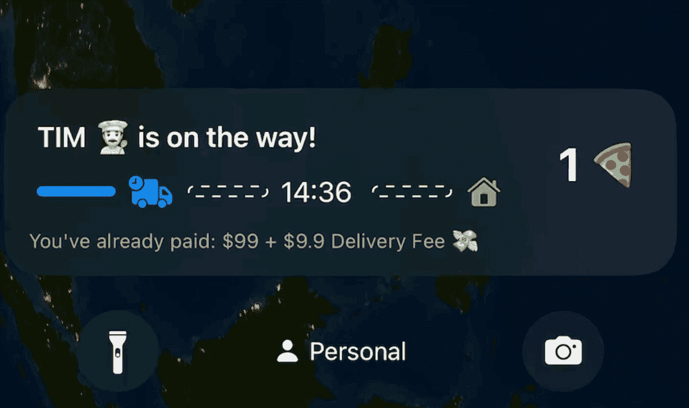

# 如何:为 iOS 16 创建实时活动 Widget

> 原文：<https://levelup.gitconnected.com/how-to-create-live-activities-widget-for-ios-16-2c07889f1235>

## 面向苹果开发者的第一个教程和 SwiftUI 示例代码

苹果公司的 ActivityKit

正如苹果[宣布的那样，Live Activities 现已推出测试版](https://developer.apple.com/news/?id=hi37aek8)，许多像你一样的开发者正在寻求将这个小工具集成到 iPhone 应用中。因此，我基于 Apple 文档创建了一个示例 SwiftUI 项目来帮助您开始。我们走吧！👨‍💻

# 什么是现场活动？

> 实时活动将帮助您直接从锁定屏幕跟踪正在进行的活动，因此您可以跟踪您的食品交付进度或使用正在播放的控件，而无需解锁您的设备。—苹果公司

# 主题:披萨外卖

本教程将使用 SwiftUI、WidgetKit 和 ActivityKit 创建一个披萨外卖应用程序。

试映

重要事项:请确保您已升级到 iOS 16 beta 4 和 Xcode 14 beta 4 或更高版本。

# 环境

*   Xcode 14 beta 4
*   iOS 14 beta 4

更新:最新版本(包括动态岛)请参考[最新教程](https://1998design.medium.com/how-to-create-dynamic-island-widgets-on-ios-16-1-or-above-dca0a7dd1483)和[回购](https://github.com/1998code/iOS16-Live-Activities)。

# 使用

首先，在`Info.plist`中添加`NSSupportsLiveActivities`键，并设置为`YES`。

其次，您需要为应用程序和小部件导入 **ActivityKit** 。

`import ActivityKit`

然后，为这个比萨饼外卖应用程序和小部件设置活动属性。

添加启动、更新、停止和显示活动的功能。您可以使用按钮或远程通知来触发这些事件。

要配置微件，将`StaticConfiguration`更改为`ActivityConfiguration`。提供的示例如下:

你可以得到回应，例如:

开始一个事件:`Requested a pizza delivery Live Activity DA288E1B-F6F5–4BF1-AA73-E43E0CC13150`

全部显示:`Pizza delivery details: DA288E1B-F6F5–4BF1-AA73-E43E0CC13150 -> PizzaDeliveryAttributes(numberOfPizzas: 1, totalAmount: “$99”)`

# 有问题吗？

别担心！找到下面的源代码。您可以随时打开新的问题并提问。

 [## GitHub-1998 code/IOs 16-Live-Activities:Apple activity kit & widget kit 的 SwiftPizza 应用程序

### 这是第一个引用最新 Apple ActivityKit 测试版的项目示例。现场活动将帮助您…

github.com](https://github.com/1998code/iOS16-Live-Activities) 

# 感谢阅读:)

## 跟踪并关注最新技术。

 [## 明@ 1998 设计

### 跟随

twitter.com](https://twitter.com/1998design) 

# 分级编码

感谢您成为我们社区的一员！在你离开之前:

*   👏为故事鼓掌，跟着作者走👉
*   📰查看[级编码出版物](https://levelup.gitconnected.com/?utm_source=pub&utm_medium=post)中的更多内容
*   🔔关注我们:[推特](https://twitter.com/gitconnected) | [LinkedIn](https://www.linkedin.com/company/gitconnected) | [时事通讯](https://newsletter.levelup.dev)

🚀👉 [**加入升级人才集体，找到一份惊艳的工作**](https://jobs.levelup.dev/talent/welcome?referral=true)