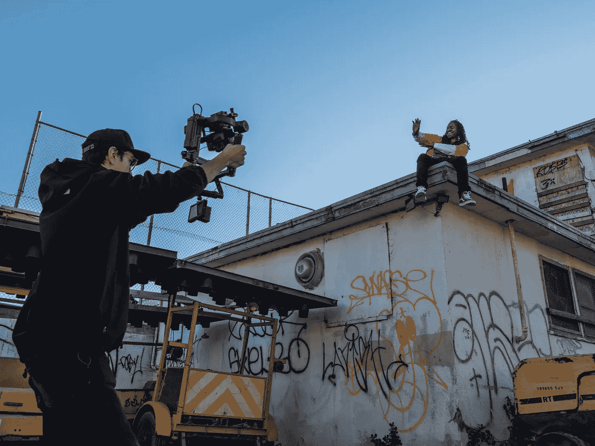
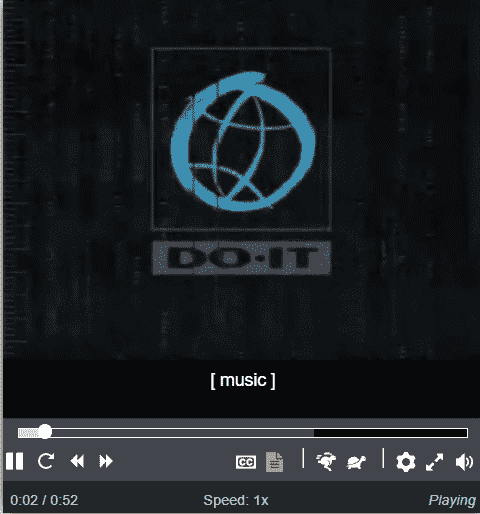
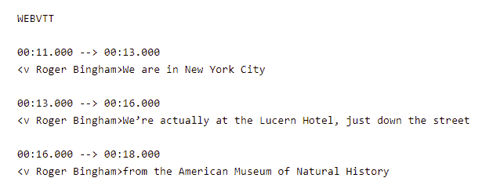
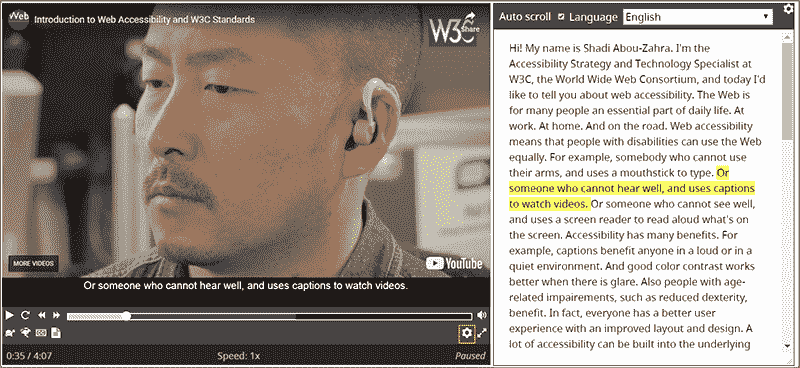

# 如何使用这些技巧创建更易访问的媒体

> 原文：<https://levelup.gitconnected.com/how-to-create-more-accessible-media-with-these-tips-300669a2eb1a>



泰勒·凯西在 [Unsplash](https://unsplash.com/s/photos/multimedia?utm_source=unsplash&utm_medium=referral&utm_content=creditCopyText) 上的照片

# 介绍

作为我正在进行的系列文章的一部分，我将介绍一些制作更易访问的媒体的最佳实践。文字是网络的一等公民，但越来越多的视频和图像正成为在线内容消费的常见形式。在此之前，如果你想看看我这个系列的其他部分，它们是:

正如之前在其他文章中提到的，HTML 给了我们大量的选项作为起点，但是我们需要做一些额外的工作来使一切变得更容易访问。

# 辅助媒体:图像

我们必须在一开始就做出一些重要的区分:图像是服务于**目的**还是纯粹出于**审美**原因。一个有用途的图像应该有一个有意义的 **ALT** 文本，因为屏幕阅读器将依赖于此！

相比之下，对于不需要使用以下属性的屏幕，纯粹出于美观原因的图像可能应该忽略。

```

```

# 将 srcset 用于响应性可访问媒体

一个不广为人知的小技巧是，您可以使用 **srcset** 和 responsive attributes 快速地为图像添加响应属性。

[https://codepen.io/pixelstrolch/pen/yVbdea](https://codepen.io/pixelstrolch/pen/yVbdea)

参见 [CodePen](https://codepen.io) 上 Stefan brechbüHL([@ pixelstrolch](https://codepen.io/pixelstrolch))的 Pen [Srcset Demo](https://codepen.io/pixelstrolch/pen/yVbdea) 。

这不是唯一的解决方案你也可以使用原生 CSS 属性和媒体查询来创建响应图像！为您的用例确定最佳选项。

# 附加免责声明

当使用图像作为功能按钮或链接时，应该有一些 CSS 魔法来将图像替换为文本，反之亦然，这取决于屏幕的类型。

以下是一些实现这一目标的 CSS 技巧:

[https://css-tricks.com/css-image-replacement/](https://css-tricks.com/css-image-replacement/)

CSS-图像替换的技巧

# 无障碍多媒体:音频和视频

# 辅助媒体控件

你知道 HTML5 有处理音频和视频的内置控件吗？

```
<audio controls> 
    <source /> 
    <p>Help text if it doesn't load</p> 
</audio> <video controls> 
   <source /> 
   <p>Help text if it doesn't load </p> 
</video>
```

这些太棒了！不幸的是，他们不是很容易接近。通常我会用一个简短的代码例子来说明如何创建它，但是这是非常不必要的。知道它在幕后是如何工作的会很好，但是有非常有才华的开发人员已经创建了考虑到可访问性的库。

除非是为了学习，否则我强烈主张不要重新发明轮子。以下是具有支持的辅助功能的视频播放器列表(上次更新于 2016 年)。

[https://kensgists.github.io/apt/](https://kensgists.github.io/apt/)

下面是一个小的可视化示例，展示了 AblePlayer 的外观:



https://ableplayer.github.io/ableplayer/demos/video1.html

# 辅助媒体:标题

上一节提到的几个视频播放器提供了给视频添加字幕的功能。只是简单总结一下以 [WebVTT](https://w3c.github.io/webvtt/) 格式提供字幕的 web 标准。

以下是一个 WebVTT 文件的示例:



这些可以直接链接到音轨，在某些情况下也可以链接到播放器:

```
<video controls src="myvideo.mp4">    
    <track default src="track.vtt"> 
</video>
```

# 可访问媒体:抄本

每一个视频或音频**都应该**在页面的其他地方有一个副本。就这样，就这样。



如果视频对网页内容足够重要，那么拥有一份文字记录也同样重要！现在你可能会想，为每个视频提供一份文字记录是一件非常耗时的任务。

是的，通常是这样的。但是！有很多技术可以帮助我们。

例如，目前在 dev.to 和 Deepgram 中有一个黑客马拉松。您可能会自动创建这些抄本！

看看这篇[帖子](https://dev.to/devteam/join-us-for-a-new-kind-of-hackathon-on-dev-brought-to-you-by-deepgram-2bjd)。(注意，我没有任何附属关系)

# 结论

希望这些提示能帮助你进一步使网站对每个人都更容易访问！

多媒体选项正变得越来越普遍，因为每天消费的大量内容都是通过视频或纯音频选项来完成的。

更多内容在[相关代码](https://relatablecode.com)

如果你喜欢这个，请在 LinkedIn 或 Twitter 上与我联系

*原载于 2022 年 3 月 20 日*[*【https://relatablecode.com】*](https://relatablecode.com/how-to-create-more-accessible-media-with-these-tips/)*。*